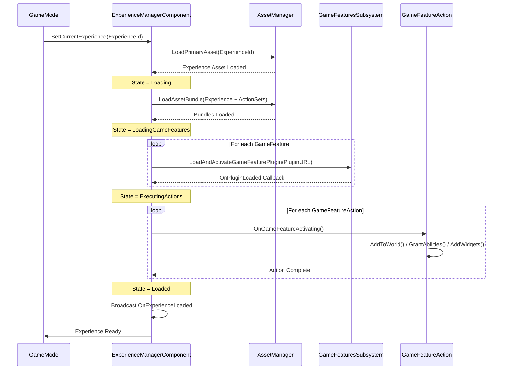

# Experience 系统：Lyra 的游戏模式核心

> 深入理解 Lyra 的 Experience 系统，掌握游戏模式动态切换的核心机制

---

## 📋 本文概览

在传统的 Unreal Engine 项目中，我们通常使用 `GameMode`、`GameState` 等类来定义游戏规则。但当你需要在同一个项目中支持多种玩法（比如团队死斗、大逃杀、塔防等）时，传统方式会让代码变得臃肿不堪。

Lyra 引入的 **Experience 系统**彻底改变了这一局面。它是 Lyra 架构的核心创新之一，提供了一种**数据驱动、插件化、可热切换**的游戏模式管理方案。

本文将深入剖析 Experience 系统的设计哲学、实现细节和实战应用。

**阅读收获：**
- 理解 Experience 系统的架构设计
- 掌握 Experience 的加载和执行流程
- 学会创建自定义 Experience Definition
- 理解 GameFeatureAction 的作用和实现
- 实战：构建一个完整的游戏模式

**前置知识：**
- 了解 Unreal Engine 的 GameMode 和 GameState
- 熟悉 UE 的 Asset Manager 和主资产系统
- 阅读过前两篇文章（项目概述、模块化组件）

---

## 🎯 什么是 Experience？

### Experience 的核心概念

**Experience** 可以理解为"游戏体验定义"，它封装了一个完整游戏模式所需的一切：

- **游戏规则**：回合制还是实时？有无复活？胜利条件？
- **游戏内容**：地图、角色、武器、UI
- **游戏系统**：输入绑定、技能系统、队伍系统
- **Game Features**：需要加载哪些插件

在 Lyra 中，切换 Experience 就像切换"游戏盒子"：
- 加载 `ShooterCore` Experience → 进入 FPS 射击模式
- 加载 `TopDownArena` Experience → 进入俯视角竞技场模式

### Experience vs 传统 GameMode

| 特性 | 传统 GameMode | Lyra Experience |
|------|--------------|-----------------|
| **定义方式** | C++ 或蓝图类 | Data Asset 配置 |
| **内容绑定** | 硬编码引用 | 动态加载 |
| **切换成本** | 需要重启关卡 | 运行时热切换 |
| **模块化** | 难以拆分 | 插件化组合 |
| **多模式支持** | 需要多个 GameMode 子类 | 共用一个 GameMode，切换 Experience |

**关键优势：**
1. **数据驱动**：策划无需编程即可配置新模式
2. **插件化**：功能模块可独立开发、测试、复用
3. **动态加载**：按需加载内容，减少内存占用
4. **团队协作**：不同模式的开发互不干扰

---

## 🏗️ Experience 系统架构

### 核心类图

```
┌────────────────────────────────────────────────────────────┐
│                   ULyraExperienceDefinition                │
│  ┌──────────────────────────────────────────────────────┐  │
│  │ + GameFeaturesToEnable: TArray<FString>              │  │
│  │ + DefaultPawnData: ULyraPawnData*                    │  │
│  │ + Actions: TArray<UGameFeatureAction*>               │  │
│  │ + ActionSets: TArray<ULyraExperienceActionSet*>     │  │
│  └──────────────────────────────────────────────────────┘  │
└────────────────────────────────────────────────────────────┘
                              ▲
                              │ 管理加载
                              │
┌────────────────────────────────────────────────────────────┐
│            ULyraExperienceManagerComponent                 │
│  (Attached to AGameStateBase)                              │
│  ┌──────────────────────────────────────────────────────┐  │
│  │ - CurrentExperience: ULyraExperienceDefinition*      │  │
│  │ - LoadState: ELyraExperienceLoadState                │  │
│  │ - NumGameFeaturePluginsLoading: int32                │  │
│  │ + SetCurrentExperience(FPrimaryAssetId)              │  │
│  │ + CallOrRegister_OnExperienceLoaded()                │  │
│  └──────────────────────────────────────────────────────┘  │
└────────────────────────────────────────────────────────────┘
                              │
                              ├─────────────┐
                              ▼             ▼
               ┌──────────────────┐  ┌─────────────────────┐
               │ Game Feature 1   │  │ GameFeatureAction   │
               │ (Plugin)         │  │ (Instanced Objects) │
               └──────────────────┘  └─────────────────────┘
```

### 主要类职责

#### 1. ULyraExperienceDefinition

**位置**：`LyraGame/GameModes/LyraExperienceDefinition.h`

这是 Experience 的核心数据资产，继承自 `UPrimaryDataAsset`。它定义了：

```cpp
UCLASS(BlueprintType, Const)
class ULyraExperienceDefinition : public UPrimaryDataAsset
{
    GENERATED_BODY()

public:
    // 需要激活的 Game Feature 插件列表
    UPROPERTY(EditDefaultsOnly, Category = Gameplay)
    TArray<FString> GameFeaturesToEnable;

    // 默认的 Pawn 数据（角色类、输入配置等）
    UPROPERTY(EditDefaultsOnly, Category=Gameplay)
    TObjectPtr<const ULyraPawnData> DefaultPawnData;

    // 需要执行的 Action 列表（直接配置）
    UPROPERTY(EditDefaultsOnly, Instanced, Category="Actions")
    TArray<TObjectPtr<UGameFeatureAction>> Actions;

    // 额外的 Action Set（组合多个 Action）
    UPROPERTY(EditDefaultsOnly, Category=Gameplay)
    TArray<TObjectPtr<ULyraExperienceActionSet>> ActionSets;
};
```

**设计亮点：**
- `GameFeaturesToEnable`：声明式依赖管理，自动加载所需插件
- `Actions` 和 `ActionSets`：灵活的组合机制，支持 Action 复用
- `Const` 限定符：运行时不可修改，确保数据安全

#### 2. ULyraExperienceManagerComponent

**位置**：`LyraGame/GameModes/LyraExperienceManagerComponent.h`

这是挂载在 `GameState` 上的组件，负责 Experience 的生命周期管理：

```cpp
UCLASS()
class ULyraExperienceManagerComponent : public UGameStateComponent
{
    GENERATED_BODY()

public:
    // 设置并加载 Experience
    void SetCurrentExperience(FPrimaryAssetId ExperienceId);

    // 注册回调，Experience 加载完成后执行
    void CallOrRegister_OnExperienceLoaded(FOnLyraExperienceLoaded::FDelegate&& Delegate);
    
    // 获取当前已加载的 Experience（必须已完成加载）
    const ULyraExperienceDefinition* GetCurrentExperienceChecked() const;
    
    // 检查 Experience 是否已加载完成
    bool IsExperienceLoaded() const;

private:
    // 当前的 Experience（网络同步）
    UPROPERTY(ReplicatedUsing=OnRep_CurrentExperience)
    TObjectPtr<const ULyraExperienceDefinition> CurrentExperience;

    // 加载状态机
    ELyraExperienceLoadState LoadState = ELyraExperienceLoadState::Unloaded;

    // 加载完成回调（支持三个优先级）
    FOnLyraExperienceLoaded OnExperienceLoaded_HighPriority;
    FOnLyraExperienceLoaded OnExperienceLoaded;
    FOnLyraExperienceLoaded OnExperienceLoaded_LowPriority;
};
```

**设计亮点：**
- **网络同步**：`CurrentExperience` 会自动从服务器同步到客户端
- **优先级回调**：三级回调系统，确保初始化顺序可控
- **状态机管理**：清晰的加载阶段划分（后文详解）

#### 3. ULyraExperienceActionSet

**位置**：`LyraGame/GameModes/LyraExperienceActionSet.h`

Action Set 是多个 GameFeatureAction 的集合，用于组织和复用：

```cpp
UCLASS(BlueprintType, NotBlueprintable)
class ULyraExperienceActionSet : public UPrimaryDataAsset
{
    GENERATED_BODY()

public:
    // Action 列表
    UPROPERTY(EditAnywhere, Instanced, Category="Actions to Perform")
    TArray<TObjectPtr<UGameFeatureAction>> Actions;

    // 依赖的 Game Feature 插件
    UPROPERTY(EditAnywhere, Category="Feature Dependencies")
    TArray<FString> GameFeaturesToEnable;
};
```

**使用场景：**
- 复用通用 Action 组合（如"基础输入+UI"）
- 分层组织 Experience（核心 + 变体）
- 简化 Experience Definition 的配置

---

## 🔄 Experience 加载流程详解

### 加载状态机

Experience 的加载是一个复杂的异步过程，Lyra 使用状态机来管理：

```cpp
enum class ELyraExperienceLoadState
{
    Unloaded,                    // 未加载
    Loading,                     // 加载 Experience 本身的资产
    LoadingGameFeatures,         // 加载 Game Feature 插件
    LoadingChaosTestingDelay,    // （可选）延迟加载，用于混沌测试
    ExecutingActions,            // 执行 GameFeatureAction
    Loaded,                      // 加载完成
    Deactivating                 // 正在卸载
};
```

### 完整加载时序图



### 关键代码解析

#### 1. 启动加载

```cpp
void ULyraExperienceManagerComponent::SetCurrentExperience(FPrimaryAssetId ExperienceId)
{
    // 1. 加载 Experience 资产本身
    ULyraAssetManager& AssetManager = ULyraAssetManager::Get();
    FSoftObjectPath AssetPath = AssetManager.GetPrimaryAssetPath(ExperienceId);
    TSubclassOf<ULyraExperienceDefinition> AssetClass = Cast<UClass>(AssetPath.TryLoad());
    
    check(AssetClass);
    const ULyraExperienceDefinition* Experience = GetDefault<ULyraExperienceDefinition>(AssetClass);
    
    check(Experience != nullptr);
    check(CurrentExperience == nullptr); // 确保不会重复加载
    
    CurrentExperience = Experience;
    StartExperienceLoad();
}
```

#### 2. 加载依赖资产

```cpp
void ULyraExperienceManagerComponent::StartExperienceLoad()
{
    check(CurrentExperience != nullptr);
    check(LoadState == ELyraExperienceLoadState::Unloaded);

    LoadState = ELyraExperienceLoadState::Loading;

    ULyraAssetManager& AssetManager = ULyraAssetManager::Get();

    // 收集所有需要加载的资产
    TSet<FPrimaryAssetId> BundleAssetList;
    BundleAssetList.Add(CurrentExperience->GetPrimaryAssetId());
    
    // 添加 ActionSet 的资产
    for (const TObjectPtr<ULyraExperienceActionSet>& ActionSet : CurrentExperience->ActionSets)
    {
        if (ActionSet != nullptr)
        {
            BundleAssetList.Add(ActionSet->GetPrimaryAssetId());
        }
    }

    // 异步加载资产包
    TArray<FName> BundlesToLoad;
    BundlesToLoad.Add(UGameFeaturesSubsystemSettings::LoadStateClient);
    BundlesToLoad.Add(UGameFeaturesSubsystemSettings::LoadStateServer);

    AssetManager.LoadPrimaryAssets(
        BundleAssetList.Array(),
        BundlesToLoad,
        FStreamableDelegate::CreateUObject(this, &ThisClass::OnExperienceLoadComplete)
    );
}
```

**关键点：**
- 使用 `AssetManager` 的 Bundle 系统，按需加载资产
- 区分 Client 和 Server Bundle，优化内存占用
- 异步加载，不阻塞主线程

#### 3. 加载 Game Feature 插件

```cpp
void ULyraExperienceManagerComponent::OnExperienceLoadComplete()
{
    check(LoadState == ELyraExperienceLoadState::Loading);
    LoadState = ELyraExperienceLoadState::LoadingGameFeatures;

    // 收集所有需要加载的插件 URL
    GameFeaturePluginURLs.Reset();
    
    auto CollectGameFeaturePluginURLs = [this](const UPrimaryDataAsset* Context, const TArray<FString>& FeaturePluginList)
    {
        for (const FString& PluginName : FeaturePluginList)
        {
            FString PluginURL;
            if (UGameFeaturesSubsystem::Get().GetPluginURLByName(PluginName, PluginURL))
            {
                GameFeaturePluginURLs.AddUnique(PluginURL);
            }
        }
    };

    // 从 Experience 和 ActionSet 收集插件列表
    CollectGameFeaturePluginURLs(CurrentExperience, CurrentExperience->GameFeaturesToEnable);
    for (const ULyraExperienceActionSet* ActionSet : CurrentExperience->ActionSets)
    {
        if (ActionSet != nullptr)
        {
            CollectGameFeaturePluginURLs(ActionSet, ActionSet->GameFeaturesToEnable);
        }
    }

    // 开始加载插件
    NumGameFeaturePluginsLoading = GameFeaturePluginURLs.Num();
    if (NumGameFeaturePluginsLoading > 0)
    {
        for (const FString& PluginURL : GameFeaturePluginURLs)
        {
            UGameFeaturesSubsystem::Get().LoadAndActivateGameFeaturePlugin(
                PluginURL, 
                FGameFeaturePluginLoadComplete::CreateUObject(this, &ThisClass::OnGameFeaturePluginLoadComplete)
            );
        }
    }
    else
    {
        OnExperienceFullLoadCompleted();
    }
}
```

**设计亮点：**
- 自动去重插件 URL
- 支持并行加载多个插件
- 使用计数器追踪加载进度

#### 4. 执行 GameFeatureAction

```cpp
void ULyraExperienceManagerComponent::OnExperienceFullLoadCompleted()
{
    check(LoadState != ELyraExperienceLoadState::Loaded);

    LoadState = ELyraExperienceLoadState::ExecutingActions;

    // 收集所有 Action（包括 ActionSet 中的）
    FGameFeatureActivatingContext Context;
    const FWorldContext* ExistingWorldContext = GEngine->GetWorldContextFromWorld(GetWorld());
    if (ExistingWorldContext)
    {
        Context.SetRequiredWorldContextHandle(ExistingWorldContext->ContextHandle);
    }

    auto ActivateListOfActions = [&Context](const TArray<UGameFeatureAction*>& ActionList)
    {
        for (UGameFeatureAction* Action : ActionList)
        {
            if (Action != nullptr)
            {
                Action->OnGameFeatureActivating(Context);
            }
        }
    };

    // 激活 Experience 的 Action
    ActivateListOfActions(CurrentExperience->Actions);

    // 激活 ActionSet 的 Action
    for (const ULyraExperienceActionSet* ActionSet : CurrentExperience->ActionSets)
    {
        if (ActionSet != nullptr)
        {
            ActivateListOfActions(ActionSet->Actions);
        }
    }

    LoadState = ELyraExperienceLoadState::Loaded;

    // 触发加载完成回调（按优先级顺序）
    OnExperienceLoaded_HighPriority.Broadcast(CurrentExperience);
    OnExperienceLoaded_HighPriority.Clear();

    OnExperienceLoaded.Broadcast(CurrentExperience);
    OnExperienceLoaded.Clear();

    OnExperienceLoaded_LowPriority.Broadcast(CurrentExperience);
    OnExperienceLoaded_LowPriority.Clear();
}
```

**三级回调的应用场景：**
- **HighPriority**：初始化底层系统（如 AbilitySystemComponent）
- **Normal**：注册游戏逻辑（如 GamePhase、TeamSubsystem）
- **LowPriority**：初始化 UI 和表现层

---

## ⚙️ GameFeatureAction 深度解析

### 什么是 GameFeatureAction？

`GameFeatureAction` 是 UE5 Game Features 插件系统的核心机制，它定义了**插件激活时要执行的操作**。

Lyra 扩展了多种 Action 类型：

| Action 类 | 功能说明 |
|-----------|----------|
| `GameFeatureAction_AddAbilities` | 为指定 Actor 添加 Gameplay Ability |
| `GameFeatureAction_AddInputBinding` | 绑定输入动作到 Ability |
| `GameFeatureAction_AddWidget` | 动态添加 UI Widget 到 HUD |
| `GameFeatureAction_AddInputContextMapping` | 添加 Enhanced Input 映射 |
| `GameFeatureAction_SplitscreenConfig` | 配置分屏设置 |

### 案例：AddAbilities Action

这是最常用的 Action，用于为 Character 添加技能。

#### 配置结构

```cpp
UCLASS(MinimalAPI, meta = (DisplayName = "Add Abilities"))
class UGameFeatureAction_AddAbilities final : public UGameFeatureAction_WorldActionBase
{
    GENERATED_BODY()

public:
    // 配置列表：为哪些 Actor 添加哪些能力
    UPROPERTY(EditAnywhere, Category="Abilities")
    TArray<FGameFeatureAbilitiesEntry> AbilitiesList;
};

USTRUCT()
struct FGameFeatureAbilitiesEntry
{
    GENERATED_BODY()

    // 目标 Actor 类（如 ALyraCharacter）
    UPROPERTY(EditAnywhere, Category="Abilities")
    TSoftClassPtr<AActor> ActorClass;

    // 要授予的 Ability 列表
    UPROPERTY(EditAnywhere, Category="Abilities")
    TArray<FLyraAbilityGrant> GrantedAbilities;

    // 要添加的 Attribute Set
    UPROPERTY(EditAnywhere, Category="Attributes")
    TArray<FLyraAttributeSetGrant> GrantedAttributes;

    // 要授予的 Ability Set（批量添加）
    UPROPERTY(EditAnywhere, Category="Attributes")
    TArray<TSoftObjectPtr<const ULyraAbilitySet>> GrantedAbilitySets;
};
```

#### 执行流程

```cpp
void UGameFeatureAction_AddAbilities::AddToWorld(const FWorldContext& WorldContext, const FGameFeatureStateChangeContext& ChangeContext)
{
    UWorld* World = WorldContext.World();
    UGameInstance* GameInstance = WorldContext.OwningGameInstance;
    FPerContextData& ActiveData = ContextData.FindOrAdd(ChangeContext);

    // 为每个配置项注册 Actor 扩展
    for (int32 EntryIdx = 0; EntryIdx < AbilitiesList.Num(); ++EntryIdx)
    {
        const FGameFeatureAbilitiesEntry& Entry = AbilitiesList[EntryIdx];

        if (!Entry.ActorClass.IsNull())
        {
            // 使用 ModularGameplayActors 插件的扩展系统
            // 当目标 Actor 生成时，自动执行回调
            UGameFrameworkComponentManager* ComponentMan = UGameInstance->GetSubsystem<UGameFrameworkComponentManager>();
            
            TSharedPtr<FComponentRequestHandle> ExtensionRequestHandle = ComponentMan->AddExtensionHandler(
                Entry.ActorClass,
                UGameFrameworkComponentManager::FExtensionHandlerDelegate::CreateUObject(
                    this, 
                    &ThisClass::HandleActorExtension, 
                    EntryIdx, 
                    ChangeContext
                )
            );

            ActiveData.ComponentRequests.Add(ExtensionRequestHandle);
        }
    }
}

void UGameFeatureAction_AddAbilities::HandleActorExtension(AActor* Actor, FName EventName, int32 EntryIndex, FGameFeatureStateChangeContext ChangeContext)
{
    FPerContextData& ActiveData = ContextData.FindChecked(ChangeContext);
    const FGameFeatureAbilitiesEntry& Entry = AbilitiesList[EntryIndex];

    if (EventName == UGameFrameworkComponentManager::NAME_ExtensionAdded || 
        EventName == UGameFrameworkComponentManager::NAME_GameActorReady)
    {
        AddActorAbilities(Actor, Entry, ActiveData);
    }
    else if (EventName == UGameFrameworkComponentManager::NAME_ExtensionRemoved || 
             EventName == UGameFrameworkComponentManager::NAME_ReceiverRemoved)
    {
        RemoveActorAbilities(Actor, ActiveData);
    }
}

void UGameFeatureAction_AddAbilities::AddActorAbilities(AActor* Actor, const FGameFeatureAbilitiesEntry& Entry, FPerContextData& ActiveData)
{
    // 确保 Actor 有 AbilitySystemComponent
    UAbilitySystemComponent* ASC = FindOrAddComponentForActor<UAbilitySystemComponent>(Actor, Entry, ActiveData);
    if (!ASC)
    {
        return;
    }

    FActorExtensions& ActorExtensions = ActiveData.ActiveExtensions.FindOrAdd(Actor);

    // 添加 Abilities
    for (const FLyraAbilityGrant& AbilityGrant : Entry.GrantedAbilities)
    {
        if (!AbilityGrant.AbilityType.IsNull())
        {
            TSubclassOf<UGameplayAbility> AbilityClass = AbilityGrant.AbilityType.LoadSynchronous();
            if (AbilityClass)
            {
                FGameplayAbilitySpec AbilitySpec(AbilityClass);
                FGameplayAbilitySpecHandle AbilityHandle = ASC->GiveAbility(AbilitySpec);
                ActorExtensions.Abilities.Add(AbilityHandle);
            }
        }
    }

    // 添加 Attribute Sets
    for (const FLyraAttributeSetGrant& AttributeGrant : Entry.GrantedAttributes)
    {
        if (!AttributeGrant.AttributeSetType.IsNull())
        {
            TSubclassOf<UAttributeSet> SetClass = AttributeGrant.AttributeSetType.LoadSynchronous();
            if (SetClass)
            {
                UAttributeSet* NewSet = NewObject<UAttributeSet>(ASC->GetOwner(), SetClass);
                ASC->AddAttributeSetSubobject(NewSet);
                ActorExtensions.Attributes.Add(NewSet);

                // 如果有初始化数据表，应用初始值
                if (!AttributeGrant.InitializationData.IsNull())
                {
                    UDataTable* InitTable = AttributeGrant.InitializationData.LoadSynchronous();
                    if (InitTable)
                    {
                        NewSet->InitFromMetaDataTable(InitTable);
                    }
                }
            }
        }
    }

    // 添加 Ability Sets（批量授予）
    for (const TSoftObjectPtr<const ULyraAbilitySet>& SetPtr : Entry.GrantedAbilitySets)
    {
        if (!SetPtr.IsNull())
        {
            const ULyraAbilitySet* AbilitySet = SetPtr.LoadSynchronous();
            if (AbilitySet)
            {
                FLyraAbilitySet_GrantedHandles GrantedHandles;
                AbilitySet->GiveToAbilitySystem(ASC, &GrantedHandles);
                ActorExtensions.AbilitySetHandles.Add(GrantedHandles);
            }
        }
    }
}
```

**设计亮点：**
1. **延迟绑定**：不是在 Action 激活时立即添加 Ability，而是监听 Actor 的生成事件
2. **自动清理**：Actor 销毁时自动移除添加的 Ability 和 Attribute
3. **批量操作**：支持 AbilitySet，一次性授予多个能力
4. **数据表初始化**：支持从 DataTable 初始化 Attribute 的默认值

---

## 🛠️ 实战：创建自定义 Experience

### 需求分析

我们要创建一个 **"夺旗模式"（Capture The Flag）** 的 Experience，包含：

1. **基础玩法**：两队各有一个基地和旗帜
2. **游戏规则**：夺取对方旗帜并带回己方基地得分
3. **角色能力**：移动、跳跃、射击、携带旗帜
4. **UI 显示**：队伍得分、旗帜状态

### 步骤 1：创建 Experience Definition

**文件**：`Content/Experiences/CTF/B_CTFExperience.uasset`

在编辑器中：
1. 右键 → `Game` → `Lyra Experience Definition`
2. 命名为 `B_CTFExperience`
3. 配置属性：

```
Experience Definition: B_CTFExperience
├─ Game Features To Enable:
│   └─ "CTFGameMode"               // 我们的自定义插件
├─ Default Pawn Data:
│   └─ DA_CTFPlayerPawn            // CTF 角色数据
├─ Actions:
│   ├─ Add Abilities
│   │   └─ Actor Class: LyraCharacter
│   │       ├─ Granted Abilities:
│   │       │   ├─ GA_Move        // 移动能力
│   │       │   ├─ GA_Jump        // 跳跃能力
│   │       │   └─ GA_PickupFlag  // 拾取旗帜能力
│   │       └─ Granted Ability Sets:
│   │           └─ AbilitySet_ShooterHero  // 射击能力集
│   └─ Add Input Context Mapping
│       └─ Input Mapping: IMC_CTF  // CTF 输入配置
└─ Action Sets:
    └─ AS_SharedUI                 // 共享 UI 配置
```

### 步骤 2：创建 Game Feature 插件

使用 UE 编辑器创建插件：

**文件结构：**
```
Plugins/GameFeatures/CTFGameMode/
├─ CTFGameMode.uplugin
├─ Content/
│   ├─ GameMode/
│   │   └─ B_CTFGameMode.uasset
│   ├─ Actors/
│   │   ├─ BP_FlagBase.uasset
│   │   └─ BP_Flag.uasset
│   └─ UI/
│       └─ W_CTFScoreboard.uasset
└─ Source/
    └─ CTFGameModeRuntime/
        ├─ Private/
        │   ├─ CTFGameState.cpp
        │   ├─ CTFFlagComponent.cpp
        │   └─ CTFScoringSubsystem.cpp
        └─ Public/
            ├─ CTFGameState.h
            ├─ CTFFlagComponent.h
            └─ CTFScoringSubsystem.h
```

**插件描述文件**：`CTFGameMode.uplugin`

```json
{
    "FileVersion": 3,
    "Version": 1,
    "VersionName": "1.0",
    "FriendlyName": "CTF Game Mode",
    "Description": "Capture The Flag game mode for Lyra",
    "Category": "Game Features",
    "CreatedBy": "Your Team",
    "BuiltInInitialFeatureState": "Active",
    "Plugins": [
        {
            "Name": "GameFeatures",
            "Enabled": true
        },
        {
            "Name": "ModularGameplayActors",
            "Enabled": true
        }
    ]
}
```

### 步骤 3：实现 CTF Game State

**文件**：`CTFGameState.h`

```cpp
#pragma once

#include "ModularGameState.h"
#include "CTFGameState.generated.h"

// 队伍得分结构
USTRUCT(BlueprintType)
struct FTeamScore
{
    GENERATED_BODY()

    UPROPERTY(BlueprintReadOnly)
    int32 TeamId = 0;

    UPROPERTY(BlueprintReadOnly)
    int32 Score = 0;

    UPROPERTY(BlueprintReadOnly)
    int32 FlagCaptures = 0;
};

/**
 * CTF 模式的 GameState，管理队伍得分和旗帜状态
 */
UCLASS()
class ACTFGameState : public AModularGameStateBase
{
    GENERATED_BODY()

public:
    ACTFGameState();

    //~ Begin AActor Interface
    virtual void GetLifetimeReplicatedProps(TArray<FLifetimeProperty>& OutLifetimeProps) const override;
    //~ End AActor Interface

    // 增加队伍得分
    UFUNCTION(BlueprintCallable, Category="CTF")
    void AddTeamScore(int32 TeamId, int32 Points);

    // 获取队伍得分
    UFUNCTION(BlueprintPure, Category="CTF")
    int32 GetTeamScore(int32 TeamId) const;

    // 检查是否达到胜利条件
    UFUNCTION(BlueprintPure, Category="CTF")
    bool HasTeamWon(int32& OutWinningTeam) const;

protected:
    // 队伍得分数组（网络同步）
    UPROPERTY(ReplicatedUsing=OnRep_TeamScores, BlueprintReadOnly)
    TArray<FTeamScore> TeamScores;

    // 获胜所需分数
    UPROPERTY(EditDefaultsOnly, BlueprintReadOnly, Category="CTF")
    int32 ScoreToWin = 3;

private:
    UFUNCTION()
    void OnRep_TeamScores();

    // 初始化队伍得分
    void InitializeTeamScores();
};
```

**文件**：`CTFGameState.cpp`

```cpp
#include "CTFGameState.h"
#include "Net/UnrealNetwork.h"
#include "Teams/LyraTeamSubsystem.h"

ACTFGameState::ACTFGameState()
{
    // 确保得分在网络上同步
    bReplicates = true;
    bAlwaysRelevant = true;
}

void ACTFGameState::GetLifetimeReplicatedProps(TArray<FLifetimeProperty>& OutLifetimeProps) const
{
    Super::GetLifetimeReplicatedProps(OutLifetimeProps);

    DOREPLIFETIME(ACTFGameState, TeamScores);
}

void ACTFGameState::InitializeTeamScores()
{
    // 从 Team Subsystem 获取队伍数量
    ULyraTeamSubsystem* TeamSubsystem = GetWorld()->GetSubsystem<ULyraTeamSubsystem>();
    if (TeamSubsystem)
    {
        TArray<int32> TeamIds = TeamSubsystem->GetAllTeamIds();
        for (int32 TeamId : TeamIds)
        {
            FTeamScore NewScore;
            NewScore.TeamId = TeamId;
            NewScore.Score = 0;
            NewScore.FlagCaptures = 0;
            TeamScores.Add(NewScore);
        }
    }
}

void ACTFGameState::AddTeamScore(int32 TeamId, int32 Points)
{
    if (!HasAuthority())
    {
        return; // 只能在服务器上修改得分
    }

    for (FTeamScore& Score : TeamScores)
    {
        if (Score.TeamId == TeamId)
        {
            Score.Score += Points;
            Score.FlagCaptures++;
            
            // 检查是否获胜
            if (Score.Score >= ScoreToWin)
            {
                // 触发游戏结束逻辑（在实际项目中应通过 GamePhase 处理）
                UE_LOG(LogTemp, Log, TEXT("Team %d wins with %d points!"), TeamId, Score.Score);
            }
            break;
        }
    }
}

int32 ACTFGameState::GetTeamScore(int32 TeamId) const
{
    for (const FTeamScore& Score : TeamScores)
    {
        if (Score.TeamId == TeamId)
        {
            return Score.Score;
        }
    }
    return 0;
}

bool ACTFGameState::HasTeamWon(int32& OutWinningTeam) const
{
    for (const FTeamScore& Score : TeamScores)
    {
        if (Score.Score >= ScoreToWin)
        {
            OutWinningTeam = Score.TeamId;
            return true;
        }
    }
    return false;
}

void ACTFGameState::OnRep_TeamScores()
{
    // 当得分变化时，通知 UI 更新
    // 可以在这里触发 UI 刷新事件
}
```

### 步骤 4：实现旗帜组件

**文件**：`CTFFlagComponent.h`

```cpp
#pragma once

#include "Components/ActorComponent.h"
#include "GameplayTagContainer.h"
#include "CTFFlagComponent.generated.h"

// 旗帜状态枚举
UENUM(BlueprintType)
enum class EFlagState : uint8
{
    AtBase,         // 在基地
    Carried,        // 被携带
    Dropped         // 掉落在地
};

/**
 * 旗帜组件，管理旗帜的状态和逻辑
 */
UCLASS(BlueprintType, meta=(BlueprintSpawnableComponent))
class UCTFFlagComponent : public UActorComponent
{
    GENERATED_BODY()

public:
    UCTFFlagComponent();

    //~ Begin UActorComponent Interface
    virtual void GetLifetimeReplicatedProps(TArray<FLifetimeProperty>& OutLifetimeProps) const override;
    //~ End UActorComponent Interface

    // 拾取旗帜
    UFUNCTION(BlueprintCallable, Category="CTF")
    bool PickupFlag(AActor* NewCarrier);

    // 放下旗帜
    UFUNCTION(BlueprintCallable, Category="CTF")
    void DropFlag();

    // 归还旗帜到基地
    UFUNCTION(BlueprintCallable, Category="CTF")
    void ReturnToBase();

    // 尝试得分（携带旗帜到己方基地）
    UFUNCTION(BlueprintCallable, Category="CTF")
    bool AttemptScore(AActor* ScoringActor);

    // 获取当前状态
    UFUNCTION(BlueprintPure, Category="CTF")
    EFlagState GetFlagState() const { return FlagState; }

    // 获取所属队伍
    UFUNCTION(BlueprintPure, Category="CTF")
    int32 GetTeamId() const { return TeamId; }

protected:
    // 旗帜状态（网络同步）
    UPROPERTY(ReplicatedUsing=OnRep_FlagState, BlueprintReadOnly)
    EFlagState FlagState = EFlagState::AtBase;

    // 当前携带者
    UPROPERTY(ReplicatedUsing=OnRep_Carrier, BlueprintReadOnly)
    TObjectPtr<AActor> Carrier;

    // 基地位置
    UPROPERTY(EditDefaultsOnly, BlueprintReadOnly, Category="CTF")
    FVector BaseLocation;

    // 所属队伍 ID
    UPROPERTY(EditDefaultsOnly, BlueprintReadOnly, Category="CTF")
    int32 TeamId = 0;

    // 掉落后自动归还时间（秒）
    UPROPERTY(EditDefaultsOnly, BlueprintReadOnly, Category="CTF")
    float AutoReturnTime = 30.0f;

private:
    UFUNCTION()
    void OnRep_FlagState();

    UFUNCTION()
    void OnRep_Carrier();

    // 掉落计时器
    FTimerHandle DropTimerHandle;

    // 处理掉落超时
    void OnDropTimeout();
};
```

**关键实现**：

```cpp
bool UCTFFlagComponent::PickupFlag(AActor* NewCarrier)
{
    if (!GetOwner()->HasAuthority())
    {
        return false; // 只能在服务器上拾取
    }

    if (FlagState == EFlagState::Carried)
    {
        return false; // 已被携带
    }

    // 检查拾取者是否是敌方队伍
    // （实际项目中应通过 TeamSubsystem 判断）
    
    Carrier = NewCarrier;
    FlagState = EFlagState::Carried;

    // 附加旗帜到角色
    if (AActor* FlagActor = GetOwner())
    {
        FlagActor->AttachToActor(NewCarrier, FAttachmentTransformRules::SnapToTargetIncludingScale);
    }

    // 清除掉落计时器
    GetWorld()->GetTimerManager().ClearTimer(DropTimerHandle);

    return true;
}

void UCTFFlagComponent::DropFlag()
{
    if (!GetOwner()->HasAuthority())
    {
        return;
    }

    if (FlagState != EFlagState::Carried)
    {
        return;
    }

    // 分离旗帜
    if (AActor* FlagActor = GetOwner())
    {
        FlagActor->DetachFromActor(FDetachmentTransformRules::KeepWorldTransform);
    }

    Carrier = nullptr;
    FlagState = EFlagState::Dropped;

    // 启动自动归还计时器
    GetWorld()->GetTimerManager().SetTimer(
        DropTimerHandle,
        this,
        &UCTFFlagComponent::OnDropTimeout,
        AutoReturnTime,
        false
    );
}

bool UCTFFlagComponent::AttemptScore(AActor* ScoringActor)
{
    if (!GetOwner()->HasAuthority())
    {
        return false;
    }

    if (Carrier != ScoringActor || FlagState != EFlagState::Carried)
    {
        return false; // 必须是携带者且旗帜在携带状态
    }

    // 检查是否在己方基地范围内
    // （简化实现，实际应检查与基地的距离）
    
    // 获取 GameState 并增加得分
    if (ACTFGameState* CTFGameState = GetWorld()->GetGameState<ACTFGameState>())
    {
        // 获取得分队伍 ID（携带者的队伍）
        int32 ScoringTeamId = 0; // 应从 TeamSubsystem 获取
        CTFGameState->AddTeamScore(ScoringTeamId, 1);
    }

    // 归还旗帜
    ReturnToBase();

    return true;
}

void UCTFFlagComponent::ReturnToBase()
{
    if (!GetOwner()->HasAuthority())
    {
        return;
    }

    // 分离旗帜
    if (AActor* FlagActor = GetOwner())
    {
        FlagActor->DetachFromActor(FDetachmentTransformRules::KeepWorldTransform);
        FlagActor->SetActorLocation(BaseLocation);
    }

    Carrier = nullptr;
    FlagState = EFlagState::AtBase;

    // 清除计时器
    GetWorld()->GetTimerManager().ClearTimer(DropTimerHandle);
}
```

### 步骤 5：配置 Experience 使用插件

回到 `B_CTFExperience`，确保配置了：

```
Game Features To Enable:
  - CTFGameMode
  - ShooterCore  // 提供射击能力
  
Actions:
  - Add Abilities (配置 GA_PickupFlag 等能力)
  - Add Widget (添加 W_CTFScoreboard 到 HUD)
  
Action Sets:
  - AS_SharedUI  // 共享的基础 UI
```

### 步骤 6：测试运行

1. 创建一个测试地图 `L_CTFTest`
2. 设置 World Settings 的 Default GameMode 为 `LyraGameMode`
3. 在地图中放置 `LyraPlayerStart`（分配不同队伍）
4. 放置旗帜基地 Actor（BP_FlagBase）
5. 设置 Experience 为 `B_CTFExperience`
6. PIE 测试

**设置 Experience 的方式：**

方式 1：通过 World Settings
```
World Settings → Lyra → Default Experience: B_CTFExperience
```

方式 2：通过命令行
```
UnrealEditor.exe YourProject.uproject /Game/Maps/L_CTFTest?Experience=B_CTFExperience
```

方式 3：代码设置（在 GameMode 中）
```cpp
void ALyraGameMode::InitGame(const FString& MapName, const FString& Options, FString& ErrorMessage)
{
    Super::InitGame(MapName, Options, ErrorMessage);

    // 解析 URL 参数
    FString ExperienceName = UGameplayStatics::ParseOption(Options, TEXT("Experience"));
    if (ExperienceName.IsEmpty())
    {
        ExperienceName = TEXT("B_CTFExperience"); // 默认 Experience
    }

    // 设置 Experience
    ULyraExperienceManagerComponent* ExperienceComponent = GameState->FindComponentByClass<ULyraExperienceManagerComponent>();
    if (ExperienceComponent)
    {
        FPrimaryAssetId ExperienceId = FPrimaryAssetId(FPrimaryAssetType("LyraExperienceDefinition"), FName(*ExperienceName));
        ExperienceComponent->SetCurrentExperience(ExperienceId);
    }
}
```

---

## 🌟 Experience 系统的高级应用

### 1. 动态切换 Experience

虽然 Lyra 官方示例没有直接支持，但理论上可以实现运行时切换：

```cpp
void ASomeGameMode::SwitchExperience(FPrimaryAssetId NewExperienceId)
{
    ULyraExperienceManagerComponent* ExperienceComponent = GameState->FindComponentByClass<ULyraExperienceManagerComponent>();
    if (!ExperienceComponent)
    {
        return;
    }

    // 1. 卸载当前 Experience
    ExperienceComponent->DeactivateCurrentExperience();

    // 2. 清理旧的 Actor 和组件
    // （需要遍历并清理由旧 Experience 添加的内容）

    // 3. 加载新 Experience
    ExperienceComponent->SetCurrentExperience(NewExperienceId);

    // 4. 重新生成 Player Pawns
    for (FConstPlayerControllerIterator It = GetWorld()->GetPlayerControllerIterator(); It; ++It)
    {
        if (APlayerController* PC = It->Get())
        {
            RestartPlayer(PC);
        }
    }
}
```

**挑战：**
- 需要清理旧 Experience 添加的所有资源
- 网络同步的复杂性
- 状态保持（玩家得分、背包等）

### 2. Experience 继承和组合

通过 ActionSet 可以实现类似"继承"的效果：

```
BaseShooterExperience (基础射击玩法)
  ├─ Actions: 移动、跳跃、射击
  ├─ ActionSets: AS_BasicUI, AS_TeamSystem
  └─ GameFeatures: ShooterCore

TeamDeathmatchExperience (继承基础 + TDM 规则)
  ├─ Actions: 重生计时器、击杀统计
  ├─ ActionSets: AS_BaseShooterExperience  ← 复用！
  └─ GameFeatures: TDMGameMode

FreeForAllExperience (继承基础 + FFA 规则)
  ├─ Actions: 个人积分榜
  ├─ ActionSets: AS_BaseShooterExperience  ← 复用！
  └─ GameFeatures: FFAGameMode
```

**优势：**
- 减少重复配置
- 统一维护基础功能
- 快速迭代新模式

### 3. Experience 与 Game Phase 联动

在复杂游戏中，Experience 通常与 Game Phase 系统配合：

```cpp
// 在 Experience 的 Action 中注册 Phase Ability
UCLASS()
class UGameFeatureAction_AddPhases : public UGameFeatureAction_WorldActionBase
{
    GENERATED_BODY()

public:
    UPROPERTY(EditAnywhere)
    TArray<TSoftClassPtr<ULyraGamePhaseAbility>> PhaseAbilities;

    virtual void AddToWorld(const FWorldContext& WorldContext, const FGameFeatureStateChangeContext& ChangeContext) override
    {
        ULyraGamePhaseSubsystem* PhaseSubsystem = WorldContext.World()->GetSubsystem<ULyraGamePhaseSubsystem>();
        if (PhaseSubsystem)
        {
            for (const TSoftClassPtr<ULyraGamePhaseAbility>& PhaseAbilityClass : PhaseAbilities)
            {
                if (!PhaseAbilityClass.IsNull())
                {
                    TSubclassOf<ULyraGamePhaseAbility> LoadedClass = PhaseAbilityClass.LoadSynchronous();
                    PhaseSubsystem->RegisterPhaseAbility(LoadedClass);
                }
            }
        }
    }
};
```

**应用场景：**
- 战斗准备阶段 → 战斗阶段 → 结算阶段
- 白天 → 黑夜循环（PvE 模式）
- 波次生成（塔防模式）

### 4. 多人游戏的 Experience 同步

在多人游戏中，Experience 必须在所有客户端和服务器保持一致：

```cpp
// GameState 中
UPROPERTY(ReplicatedUsing=OnRep_CurrentExperience)
TObjectPtr<const ULyraExperienceDefinition> CurrentExperience;

void ULyraExperienceManagerComponent::OnRep_CurrentExperience()
{
    // 客户端收到 Experience 变化
    if (CurrentExperience)
    {
        StartExperienceLoad(); // 客户端也执行加载流程
    }
}
```

**注意事项：**
- Experience 必须在所有客户端都可用（打包时包含）
- 客户端加载速度可能不一致，需要等待机制
- 使用 `ILoadingProcessInterface` 显示加载画面

---

## 📊 Experience 系统的性能考量

### 1. 异步加载优化

Lyra 使用 Asset Manager 的 Bundle 系统实现分级加载：

```cpp
// 在 Experience Definition 中定义资产包
void ULyraExperienceDefinition::UpdateAssetBundleData()
{
    Super::UpdateAssetBundleData();

    // 定义 Client 和 Server 包
    FAssetBundleData BundleData;
    
    // Client 包：包含模型、材质、音效、UI 等
    BundleData.AddBundleAsset(UGameFeaturesSubsystemSettings::LoadStateClient, ...);
    
    // Server 包：只包含逻辑和数据
    BundleData.AddBundleAsset(UGameFeaturesSubsystemSettings::LoadStateServer, ...);

    SetAssetBundleData(BundleData);
}
```

**建议：**
- 服务器不要加载客户端资产（模型、材质）
- 使用软引用（TSoftObjectPtr）而不是硬引用
- 分阶段加载：核心玩法 → 表现层 → 可选内容

### 2. Game Feature 插件的卸载

虽然 Lyra 目前没有完整实现插件卸载，但设计上支持：

```cpp
void UGameFeatureAction_AddAbilities::OnGameFeatureDeactivating(FGameFeatureDeactivatingContext& Context)
{
    FPerContextData* ActiveData = ContextData.Find(Context);
    if (ActiveData)
    {
        Reset(*ActiveData); // 清理所有扩展
    }
}

void UGameFeatureAction_AddAbilities::Reset(FPerContextData& ActiveData)
{
    // 遍历所有 Actor，移除添加的 Ability
    for (auto& Pair : ActiveData.ActiveExtensions)
    {
        RemoveActorAbilities(Pair.Key, ActiveData);
    }
    ActiveData.ActiveExtensions.Reset();
}
```

**未来改进方向：**
- 引用计数：当插件被多个 Experience 共享时，只有最后一个卸载时才真正清理
- 资产缓存：频繁使用的插件保持加载状态
- 优雅降级：插件卸载失败时的回退机制

### 3. 内存占用监控

使用 Unreal Insights 监控 Experience 的内存使用：

```bash
# 启用内存追踪
-trace=memory,loadtime

# 在游戏中执行命令
obj list class=LyraExperienceDefinition
obj list class=GameFeatureAction

# 查看插件状态
GameFeatures.ShowPluginsState
```

---

## 🚀 总结与最佳实践

### Experience 系统的核心价值

1. **解耦游戏模式和内容**
   - 不同模式可以共享底层系统（GAS、输入、UI）
   - 内容以插件形式独立开发、测试、发布

2. **数据驱动的设计**
   - 策划可以通过配置创建新模式
   - 减少程序员的迭代负担

3. **运行时灵活性**
   - 动态加载/卸载内容
   - 支持热更新和 DLC

### 开发建议

#### ✅ DO

1. **合理划分插件边界**
   - 一个 Game Feature 对应一个独立玩法或功能模块
   - 避免插件间的硬依赖

2. **复用 ActionSet**
   - 把通用配置（如 UI、输入）抽取为 ActionSet
   - 减少重复配置

3. **使用软引用**
   - 所有跨插件的引用都用 `TSoftObjectPtr`
   - 避免循环依赖

4. **测试 Experience 切换**
   - 确保资源正确加载和卸载
   - 检查内存泄漏

#### ❌ DON'T

1. **不要在 Experience 中写业务逻辑**
   - Experience 只是配置，逻辑应在 GameState/GameMode/Subsystem 中

2. **不要硬编码 Experience ID**
   - 使用配置表或枚举管理
   - 支持外部传入（URL 参数）

3. **不要忽视网络同步**
   - Experience 的加载必须在所有客户端同步完成
   - 使用加载界面遮盖异步过程

4. **不要过度拆分插件**
   - 太多小插件会增加管理成本
   - 找到合适的粒度

### 调试技巧

#### 1. 日志追踪

```cpp
// 在项目的 LogChannels 中定义
LYRAGAME_API DECLARE_LOG_CATEGORY_EXTERN(LogLyraExperience, Log, All);

// 查看 Experience 加载日志
UE_LOG(LogLyraExperience, Log, TEXT("Loading Experience: %s"), *ExperienceId.ToString());
```

#### 2. 控制台命令

```bash
# 显示当前 Experience
Lyra.Experience.Current

# 强制重新加载 Experience
Lyra.Experience.Reload

# 显示所有 Game Feature 状态
GameFeatures.ShowPluginsState
```

#### 3. 断点位置

关键断点位置：
- `ULyraExperienceManagerComponent::SetCurrentExperience` - 开始加载
- `ULyraExperienceManagerComponent::OnExperienceLoadComplete` - 资产加载完成
- `ULyraExperienceManagerComponent::OnExperienceFullLoadCompleted` - 插件加载完成
- `UGameFeatureAction::OnGameFeatureActivating` - Action 执行

---

## 🔗 相关阅读

- **上一篇**：[模块化 Actor 组件系统详解](02-modular-actor-components.md)
- **下一篇**：[Game Features：插件化游戏内容](04-game-features.md)
- **进阶**：[自定义 Game Feature Action](../05-advanced-topics/27-custom-game-feature-action.md)

---

## 📚 参考资源

### 官方文档
- [UE5 Game Features 插件文档](https://docs.unrealengine.com/5.0/game-features-and-modular-gameplay-in-unreal-engine/)
- [Asset Manager 指南](https://docs.unrealengine.com/5.0/asset-management-in-unreal-engine/)
- [Lyra Sample Game 文档](https://docs.unrealengine.com/5.0/lyra-sample-game-in-unreal-engine/)

### 社区资源
- [Epic Games Lyra GitHub](https://github.com/EpicGames/UnrealEngine/tree/5.0/Samples/Games/Lyra)
- [Lyra 中文社区论坛](https://forums.unrealengine.com/c/chinese-chinese/chinese-documentation)

### 视频教程
- [Lyra Overview - Unreal Sensei](https://www.youtube.com/watch?v=...)
- [Game Features Deep Dive - Epic Developer](https://www.youtube.com/watch?v=...)

---

## 🤝 贡献与反馈

发现问题或有改进建议？欢迎：
- 提交 Issue：[GitHub Issues](https://github.com/your-repo/issues)
- 参与讨论：[Discord 社区](https://discord.gg/your-community)
- 分享案例：将你的 Experience 实现分享到社区！

---

**下一篇预告**：在下一篇文章中，我们将深入探讨 **Game Features 插件系统**，学习如何创建、配置和管理插件，以及如何实现插件间的依赖管理。敬请期待！

---

*最后更新：2026-02-12*  
*作者：Lyra 教程团队*  
*版权所有 © 2026 保留所有权利*
