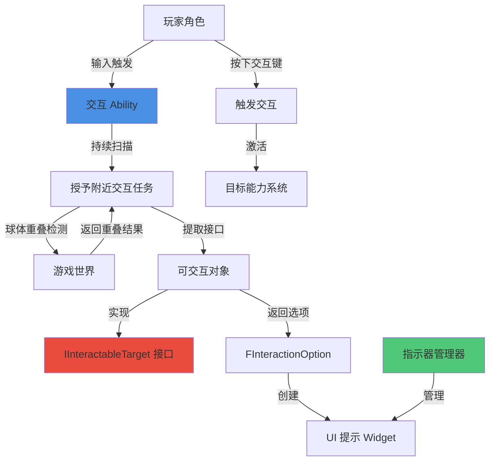
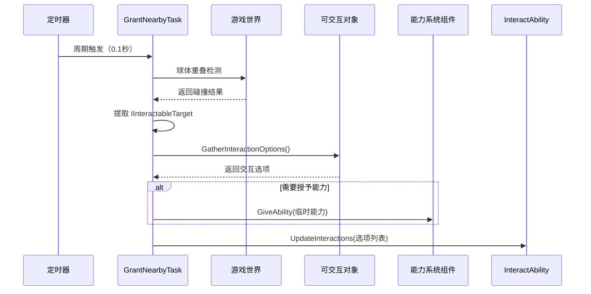
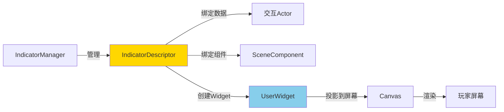
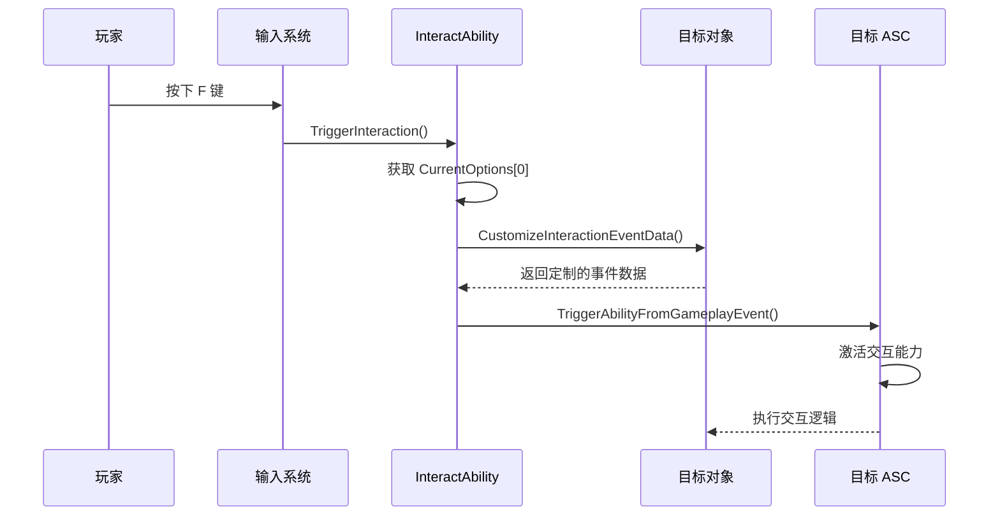

# 17. 交互系统：WorldInteraction 组件

> **核心摘要**  
> Lyra 的交互系统是一个高度模块化、基于接口驱动的世界交互框架,它将交互逻辑与 GAS、UI 系统、输入系统完美融合。本文将深入剖析交互系统的核心架构、扫描机制、UI 提示系统以及如何创建自定义交互对象。

---

## 🎯 本章目标

- 理解 Lyra 交互系统的整体架构
- 掌握 `IInteractableTarget` 接口的设计思想
- 深入分析交互扫描与查询机制
- 学习 UI 指示器系统的工作原理
- 实战：创建可拾取物品、可对话 NPC、可开启门等交互对象

---

## 📐 交互系统架构概览

### 核心组件关系图



### 三层架构设计

Lyra 的交互系统采用典型的三层架构：

| 层级 | 职责 | 核心类 |
|------|------|--------|
| **表现层** | UI 提示、指示器渲染 | `UIndicatorDescriptor`, `ULyraIndicatorManagerComponent` |
| **逻辑层** | 交互扫描、选项管理、能力触发 | `ULyraGameplayAbility_Interact`, `UAbilityTask_GrantNearbyInteraction` |
| **数据层** | 交互接口、选项配置 | `IInteractableTarget`, `FInteractionOption`, `FInteractionQuery` |

---

## 🔌 核心接口：IInteractableTarget

### 接口定义

```cpp
// Source: LyraGame/Interaction/IInteractableTarget.h
UINTERFACE(MinimalAPI, meta = (CannotImplementInterfaceInBlueprint))
class UInteractableTarget : public UInterface
{
    GENERATED_BODY()
};

class IInteractableTarget
{
    GENERATED_BODY()

public:
    /**
     * 收集可用的交互选项
     * @param InteractQuery - 交互查询信息（请求者、控制器等）
     * @param OptionBuilder - 交互选项构建器
     */
    virtual void GatherInteractionOptions(
        const FInteractionQuery& InteractQuery, 
        FInteractionOptionBuilder& OptionBuilder
    ) = 0;

    /**
     * 自定义交互事件数据
     * @param InteractionEventTag - 交互事件标签
     * @param InOutEventData - 要修改的事件数据
     */
    virtual void CustomizeInteractionEventData(
        const FGameplayTag& InteractionEventTag, 
        FGameplayEventData& InOutEventData
    ) { }
};
```

### 设计亮点

1. **纯虚接口**：强制实现者提供交互选项逻辑
2. **蓝图不可实现**：保持 C++ 性能优势,蓝图通过继承 C++ 类使用
3. **选项构建器模式**：使用 `FInteractionOptionBuilder` 避免直接修改数组
4. **事件数据定制**：允许交互对象自定义传递给能力的参数

---

## 📦 交互数据结构

### FInteractionQuery：交互查询

```cpp
// Source: LyraGame/Interaction/InteractionQuery.h
USTRUCT(BlueprintType)
struct FInteractionQuery
{
    GENERATED_BODY()

public:
    /** 请求者角色（通常是玩家 Pawn） */
    UPROPERTY(BlueprintReadWrite)
    TWeakObjectPtr<AActor> RequestingAvatar;

    /** 请求控制器（可以不是 Avatar 的所有者） */
    UPROPERTY(BlueprintReadWrite)
    TWeakObjectPtr<AController> RequestingController;

    /** 可选的额外数据对象 */
    UPROPERTY(BlueprintReadWrite)
    TWeakObjectPtr<UObject> OptionalObjectData;
};
```

**用途示例**：
- 根据 `RequestingAvatar` 检查距离条件
- 通过 `RequestingController` 验证权限（如队友才能交互）
- 使用 `OptionalObjectData` 传递库存信息等

### FInteractionOption：交互选项

```cpp
// Source: LyraGame/Interaction/InteractionOption.h
USTRUCT(BlueprintType)
struct FInteractionOption
{
    GENERATED_BODY()

public:
    /** 交互目标（实现了 IInteractableTarget 的对象） */
    UPROPERTY(BlueprintReadWrite)
    TScriptInterface<IInteractableTarget> InteractableTarget;

    /** 主提示文本（如"拾取武器"） */
    UPROPERTY(EditAnywhere, BlueprintReadWrite)
    FText Text;

    /** 副提示文本（如"按 F 键"） */
    UPROPERTY(EditAnywhere, BlueprintReadWrite)
    FText SubText;

    // ======== 交互方式 1：授予交互者能力 ========
    /** 授予给交互者的 GA（玩家获得的能力） */
    UPROPERTY(EditAnywhere, BlueprintReadOnly)
    TSubclassOf<UGameplayAbility> InteractionAbilityToGrant;

    // ======== 交互方式 2：激活目标对象的能力 ========
    /** 目标对象的 ASC */
    UPROPERTY(BlueprintReadOnly)
    TObjectPtr<UAbilitySystemComponent> TargetAbilitySystem = nullptr;

    /** 目标对象的能力句柄 */
    UPROPERTY(BlueprintReadOnly)
    FGameplayAbilitySpecHandle TargetInteractionAbilityHandle;

    // ======== UI 配置 ========
    /** 交互提示 Widget 类 */
    UPROPERTY(EditAnywhere, BlueprintReadWrite)
    TSoftClassPtr<UUserWidget> InteractionWidgetClass;
};
```

### 两种交互模式对比

| 模式 | 能力拥有者 | 适用场景 | 示例 |
|------|-----------|---------|------|
| **授予能力模式** | 玩家获得临时能力 | 玩家主导的交互 | 拾取物品、开门、使用道具 |
| **激活目标能力** | 目标对象自己的 ASC | 对象自主行为 | NPC 对话、陷阱触发、按钮开关 |

---

## 🔍 交互扫描机制

### 核心 Ability：LyraGameplayAbility_Interact

```cpp
// Source: LyraGame/Interaction/Abilities/LyraGameplayAbility_Interact.h
UCLASS(Abstract)
class ULyraGameplayAbility_Interact : public ULyraGameplayAbility
{
    GENERATED_BODY()

public:
    ULyraGameplayAbility_Interact(const FObjectInitializer& ObjectInitializer)
        : Super(ObjectInitializer)
    {
        // 关键配置：生成时自动激活
        ActivationPolicy = ELyraAbilityActivationPolicy::OnSpawn;
        InstancingPolicy = EGameplayAbilityInstancingPolicy::InstancedPerActor;
        NetExecutionPolicy = EGameplayAbilityNetExecutionPolicy::LocalPredicted;
    }

    virtual void ActivateAbility(...) override;

    /** 更新可交互对象列表（由任务调用） */
    UFUNCTION(BlueprintCallable)
    void UpdateInteractions(const TArray<FInteractionOption>& InteractiveOptions);

    /** 触发当前第一个交互选项 */
    UFUNCTION(BlueprintCallable)
    void TriggerInteraction();

protected:
    /** 当前可用的交互选项 */
    UPROPERTY(BlueprintReadWrite)
    TArray<FInteractionOption> CurrentOptions;

    /** UI 指示器列表 */
    UPROPERTY()
    TArray<TObjectPtr<UIndicatorDescriptor>> Indicators;

    /** 扫描频率（秒） */
    UPROPERTY(EditDefaultsOnly)
    float InteractionScanRate = 0.1f;

    /** 扫描范围（厘米） */
    UPROPERTY(EditDefaultsOnly)
    float InteractionScanRange = 500.0f;

    /** 默认交互提示 Widget */
    UPROPERTY(EditDefaultsOnly)
    TSoftClassPtr<UUserWidget> DefaultInteractionWidgetClass;
};
```

### 激活流程

```cpp
void ULyraGameplayAbility_Interact::ActivateAbility(
    const FGameplayAbilitySpecHandle Handle,
    const FGameplayAbilityActorInfo* ActorInfo,
    const FGameplayAbilityActivationInfo ActivationInfo,
    const FGameplayEventData* TriggerEventData)
{
    Super::ActivateAbility(Handle, ActorInfo, ActivationInfo, TriggerEventData);

    UAbilitySystemComponent* AbilitySystem = GetAbilitySystemComponentFromActorInfo();
    
    // 仅在服务器端创建扫描任务
    if (AbilitySystem && AbilitySystem->GetOwnerRole() == ROLE_Authority)
    {
        UAbilityTask_GrantNearbyInteraction* Task = 
            UAbilityTask_GrantNearbyInteraction::GrantAbilitiesForNearbyInteractors(
                this, 
                InteractionScanRange, 
                InteractionScanRate
            );
        Task->ReadyForActivation();
    }
}
```

**关键设计**：
- `OnSpawn` 激活策略：角色生成时自动激活,无需手动触发
- 服务器端扫描：避免客户端作弊,保证数据权威性
- 异步任务模式：使用 `UAbilityTask` 实现周期性扫描

---

## 🎯 交互扫描任务

### UAbilityTask_GrantNearbyInteraction

```cpp
// Source: LyraGame/Interaction/Tasks/AbilityTask_GrantNearbyInteraction.cpp
void UAbilityTask_GrantNearbyInteraction::Activate()
{
    SetWaitingOnAvatar();

    UWorld* World = GetWorld();
    // 使用定时器周期性扫描
    World->GetTimerManager().SetTimer(
        QueryTimerHandle, 
        this, 
        &ThisClass::QueryInteractables, 
        InteractionScanRate, 
        true  // 循环执行
    );
}

void UAbilityTask_GrantNearbyInteraction::QueryInteractables()
{
    UWorld* World = GetWorld();
    AActor* ActorOwner = GetAvatarActor();
    
    if (World && ActorOwner)
    {
        FCollisionQueryParams Params(SCENE_QUERY_STAT(UAbilityTask_GrantNearbyInteraction), false);

        TArray<FOverlapResult> OverlapResults;
        
        // 1. 球体重叠检测
        World->OverlapMultiByChannel(
            OUT OverlapResults, 
            ActorOwner->GetActorLocation(), 
            FQuat::Identity, 
            Lyra_TraceChannel_Interaction,  // 自定义交互碰撞通道
            FCollisionShape::MakeSphere(InteractionScanRange), 
            Params
        );

        if (OverlapResults.Num() > 0)
        {
            // 2. 提取实现了 IInteractableTarget 的对象
            TArray<TScriptInterface<IInteractableTarget>> InteractableTargets;
            UInteractionStatics::AppendInteractableTargetsFromOverlapResults(
                OverlapResults, 
                OUT InteractableTargets
            );
            
            // 3. 构建交互查询
            FInteractionQuery InteractionQuery;
            InteractionQuery.RequestingAvatar = ActorOwner;
            InteractionQuery.RequestingController = Cast<AController>(ActorOwner->GetOwner());

            // 4. 收集所有交互选项
            TArray<FInteractionOption> Options;
            for (TScriptInterface<IInteractableTarget>& InteractiveTarget : InteractableTargets)
            {
                FInteractionOptionBuilder InteractionBuilder(InteractiveTarget, Options);
                InteractiveTarget->GatherInteractionOptions(InteractionQuery, InteractionBuilder);
            }

            // 5. 授予临时能力（如果选项需要）
            for (FInteractionOption& Option : Options)
            {
                if (Option.InteractionAbilityToGrant)
                {
                    FObjectKey ObjectKey(Option.InteractionAbilityToGrant);
                    if (!InteractionAbilityCache.Find(ObjectKey))
                    {
                        FGameplayAbilitySpec Spec(Option.InteractionAbilityToGrant, 1, INDEX_NONE, this);
                        FGameplayAbilitySpecHandle Handle = AbilitySystemComponent->GiveAbility(Spec);
                        InteractionAbilityCache.Add(ObjectKey, Handle);
                    }
                }
            }
        }
    }
}
```

### 扫描流程图



---

## 🖼️ UI 指示器系统

### 更新交互 UI

```cpp
void ULyraGameplayAbility_Interact::UpdateInteractions(
    const TArray<FInteractionOption>& InteractiveOptions)
{
    if (ALyraPlayerController* PC = GetLyraPlayerControllerFromActorInfo())
    {
        if (ULyraIndicatorManagerComponent* IndicatorManager = 
            ULyraIndicatorManagerComponent::GetComponent(PC))
        {
            // 1. 清除旧指示器
            for (UIndicatorDescriptor* Indicator : Indicators)
            {
                IndicatorManager->RemoveIndicator(Indicator);
            }
            Indicators.Reset();

            // 2. 为每个选项创建新指示器
            for (const FInteractionOption& InteractionOption : InteractiveOptions)
            {
                AActor* InteractableTargetActor = 
                    UInteractionStatics::GetActorFromInteractableTarget(
                        InteractionOption.InteractableTarget
                    );

                // 使用选项指定的 Widget,或默认 Widget
                TSoftClassPtr<UUserWidget> InteractionWidgetClass = 
                    InteractionOption.InteractionWidgetClass.IsNull() 
                        ? DefaultInteractionWidgetClass 
                        : InteractionOption.InteractionWidgetClass;

                // 创建指示器描述符
                UIndicatorDescriptor* Indicator = NewObject<UIndicatorDescriptor>();
                Indicator->SetDataObject(InteractableTargetActor);
                Indicator->SetSceneComponent(InteractableTargetActor->GetRootComponent());
                Indicator->SetIndicatorClass(InteractionWidgetClass);
                
                IndicatorManager->AddIndicator(Indicator);
                Indicators.Add(Indicator);
            }
        }
    }

    CurrentOptions = InteractiveOptions;
}
```

### UIndicatorDescriptor 关键属性

```cpp
// Source: LyraGame/UI/IndicatorSystem/IndicatorDescriptor.h
UCLASS(MinimalAPI, BlueprintType)
class UIndicatorDescriptor : public UObject
{
    GENERATED_BODY()
    
public:
    // ======== 数据绑定 ========
    /** 关联的数据对象（通常是可交互 Actor） */
    UPROPERTY()
    TObjectPtr<UObject> DataObject;
    
    /** 附着的场景组件（用于定位） */
    UPROPERTY()
    TObjectPtr<USceneComponent> Component;

    /** Socket 名称（可选） */
    UPROPERTY()
    FName ComponentSocketName = NAME_None;

    // ======== 显示配置 ========
    /** Widget 类 */
    UPROPERTY()
    TSoftClassPtr<UUserWidget> IndicatorWidgetClass;

    /** 是否可见 */
    bool bVisible = true;

    /** 是否限制在屏幕内 */
    bool bClampToScreen = false;

    /** 限制时是否显示箭头 */
    bool bShowClampToScreenArrow = false;

    // ======== 投影模式 ========
    enum class EActorCanvasProjectionMode : uint8
    {
        ComponentPoint,              // 组件位置点
        ComponentBoundingBox,        // 组件包围盒
        ComponentScreenBoundingBox,  // 组件屏幕包围盒
        ActorBoundingBox,            // Actor 包围盒
        ActorScreenBoundingBox       // Actor 屏幕包围盒
    };

    // ======== 对齐方式 ========
    EHorizontalAlignment HAlignment = HAlign_Center;
    EVerticalAlignment VAlignment = VAlign_Center;

    // ======== 偏移 ========
    FVector WorldPositionOffset = FVector(0, 0, 0);
    FVector2D ScreenSpaceOffset = FVector2D(0, 0);

    // ======== 排序优先级 ========
    int32 Priority = 0;
};
```

### 指示器渲染流程



---

## ⚡ 触发交互

### 输入绑定

通常在 `LyraInputConfig` 中配置交互输入动作,绑定到 `TriggerInteraction()` 方法：

```cpp
// 假设的输入配置
InputTag.Ability.Interaction.Activate -> ULyraGameplayAbility_Interact::TriggerInteraction()
```

### 触发逻辑

```cpp
void ULyraGameplayAbility_Interact::TriggerInteraction()
{
    // 1. 检查是否有可用选项
    if (CurrentOptions.Num() == 0)
    {
        return;
    }

    UAbilitySystemComponent* AbilitySystem = GetAbilitySystemComponentFromActorInfo();
    if (AbilitySystem)
    {
        // 2. 获取第一个选项（优先级最高）
        const FInteractionOption& InteractionOption = CurrentOptions[0];

        AActor* Instigator = GetAvatarActorFromActorInfo();
        AActor* InteractableTargetActor = 
            UInteractionStatics::GetActorFromInteractableTarget(
                InteractionOption.InteractableTarget
            );

        // 3. 构建事件数据
        FGameplayEventData Payload;
        Payload.EventTag = TAG_Ability_Interaction_Activate;
        Payload.Instigator = Instigator;
        Payload.Target = InteractableTargetActor;

        // 4. 允许目标自定义事件数据（如指定实际交互的 Actor）
        InteractionOption.InteractableTarget->CustomizeInteractionEventData(
            TAG_Ability_Interaction_Activate, 
            Payload
        );

        // 5. 使用目标的 ASC 激活交互能力
        AActor* TargetActor = const_cast<AActor*>(ToRawPtr(Payload.Target));

        FGameplayAbilityActorInfo ActorInfo;
        ActorInfo.InitFromActor(
            InteractableTargetActor,  // Owner
            TargetActor,              // Avatar
            InteractionOption.TargetAbilitySystem
        );

        // 6. 通过事件标签激活目标能力
        const bool bSuccess = InteractionOption.TargetAbilitySystem->TriggerAbilityFromGameplayEvent(
            InteractionOption.TargetInteractionAbilityHandle,
            &ActorInfo,
            TAG_Ability_Interaction_Activate,
            &Payload,
            *InteractionOption.TargetAbilitySystem
        );
    }
}
```

### 交互触发流程



---

## 🛠️ 实战案例

### 案例 1：可拾取物品

```cpp
// 头文件：MyPickupItem.h
UCLASS()
class AMyPickupItem : public AActor, public IInteractableTarget
{
    GENERATED_BODY()

public:
    AMyPickupItem();

    // 实现 IInteractableTarget 接口
    virtual void GatherInteractionOptions(
        const FInteractionQuery& InteractQuery, 
        FInteractionOptionBuilder& OptionBuilder) override;

protected:
    /** 拾取时授予的能力 */
    UPROPERTY(EditDefaultsOnly, Category = "Interaction")
    TSubclassOf<UGameplayAbility> PickupAbilityClass;

    /** 提示文本 */
    UPROPERTY(EditDefaultsOnly, Category = "Interaction")
    FText PickupText = NSLOCTEXT("MyGame", "PickupItem", "拾取物品");

    /** 物品数据（用于传递给能力） */
    UPROPERTY(EditDefaultsOnly, Category = "Item")
    FItemData ItemData;

    /** 碰撞组件 */
    UPROPERTY(VisibleAnywhere)
    USphereComponent* CollisionComponent;

    /** 网格组件 */
    UPROPERTY(VisibleAnywhere)
    UStaticMeshComponent* MeshComponent;
};

// 实现文件：MyPickupItem.cpp
AMyPickupItem::AMyPickupItem()
{
    // 创建根组件
    CollisionComponent = CreateDefaultSubobject<USphereComponent>(TEXT("Collision"));
    CollisionComponent->SetSphereRadius(100.0f);
    CollisionComponent->SetCollisionResponseToChannel(
        Lyra_TraceChannel_Interaction, 
        ECR_Block
    );
    RootComponent = CollisionComponent;

    // 创建网格
    MeshComponent = CreateDefaultSubobject<UStaticMeshComponent>(TEXT("Mesh"));
    MeshComponent->SetupAttachment(RootComponent);
    MeshComponent->SetCollisionEnabled(ECollisionEnabled::NoCollision);
}

void AMyPickupItem::GatherInteractionOptions(
    const FInteractionQuery& InteractQuery, 
    FInteractionOptionBuilder& OptionBuilder)
{
    FInteractionOption Option;
    Option.Text = PickupText;
    Option.SubText = NSLOCTEXT("MyGame", "PressF", "按 F 拾取");
    Option.InteractionAbilityToGrant = PickupAbilityClass;
    
    // 可以添加条件检查
    if (AActor* RequestingActor = InteractQuery.RequestingAvatar.Get())
    {
        // 例如：检查距离、背包是否已满等
        if (FVector::Dist(GetActorLocation(), RequestingActor->GetActorLocation()) < 200.0f)
        {
            OptionBuilder.AddInteractionOption(Option);
        }
    }
}
```

**配套的拾取能力**：

```cpp
// UGA_PickupItem.h
UCLASS()
class UGA_PickupItem : public ULyraGameplayAbility
{
    GENERATED_BODY()

public:
    virtual void ActivateAbility(...) override;

protected:
    UFUNCTION(BlueprintImplementableEvent, Category = "Pickup")
    void OnItemPickedUp(AActor* ItemActor, const FGameplayEventData& EventData);
};

// UGA_PickupItem.cpp
void UGA_PickupItem::ActivateAbility(
    const FGameplayAbilitySpecHandle Handle,
    const FGameplayAbilityActorInfo* ActorInfo,
    const FGameplayAbilityActivationInfo ActivationInfo,
    const FGameplayEventData* TriggerEventData)
{
    Super::ActivateAbility(Handle, ActorInfo, ActivationInfo, TriggerEventData);

    if (TriggerEventData && TriggerEventData->Target.IsValid())
    {
        AActor* ItemActor = const_cast<AActor*>(TriggerEventData->Target.Get());
        
        // 1. 添加物品到库存（具体实现根据项目而定）
        // InventoryComponent->AddItem(ItemData);

        // 2. 播放拾取效果
        OnItemPickedUp(ItemActor, *TriggerEventData);

        // 3. 销毁物品
        ItemActor->Destroy();
    }

    EndAbility(Handle, ActorInfo, ActivationInfo, true, false);
}
```

---

### 案例 2：可对话 NPC

```cpp
// MyDialogueNPC.h
UCLASS()
class AMyDialogueNPC : public ACharacter, public IInteractableTarget
{
    GENERATED_BODY()

public:
    AMyDialogueNPC(const FObjectInitializer& ObjectInitializer);

    virtual void GatherInteractionOptions(
        const FInteractionQuery& InteractQuery, 
        FInteractionOptionBuilder& OptionBuilder) override;

    virtual void CustomizeInteractionEventData(
        const FGameplayTag& InteractionEventTag, 
        FGameplayEventData& InOutEventData) override;

protected:
    /** NPC 的能力系统组件 */
    UPROPERTY(VisibleAnywhere, BlueprintReadOnly, Category = "Abilities")
    UAbilitySystemComponent* AbilitySystemComponent;

    /** 对话能力 */
    UPROPERTY(EditDefaultsOnly, Category = "Dialogue")
    TSubclassOf<UGameplayAbility> DialogueAbilityClass;

    /** 对话能力句柄（运行时缓存） */
    FGameplayAbilitySpecHandle DialogueAbilityHandle;

    /** NPC 名称 */
    UPROPERTY(EditDefaultsOnly, Category = "Dialogue")
    FText NPCName = NSLOCTEXT("MyGame", "Merchant", "商人");

    /** 对话数据表 */
    UPROPERTY(EditDefaultsOnly, Category = "Dialogue")
    UDataTable* DialogueDataTable;

    virtual void BeginPlay() override;
};

// MyDialogueNPC.cpp
AMyDialogueNPC::AMyDialogueNPC(const FObjectInitializer& ObjectInitializer)
    : Super(ObjectInitializer)
{
    // 创建 ASC
    AbilitySystemComponent = CreateDefaultSubobject<UAbilitySystemComponent>(TEXT("AbilitySystem"));
    AbilitySystemComponent->SetIsReplicated(true);
    AbilitySystemComponent->SetReplicationMode(EGameplayEffectReplicationMode::Minimal);
}

void AMyDialogueNPC::BeginPlay()
{
    Super::BeginPlay();

    // 授予对话能力
    if (AbilitySystemComponent && DialogueAbilityClass)
    {
        FGameplayAbilitySpec Spec(DialogueAbilityClass, 1, INDEX_NONE, this);
        DialogueAbilityHandle = AbilitySystemComponent->GiveAbility(Spec);
    }
}

void AMyDialogueNPC::GatherInteractionOptions(
    const FInteractionQuery& InteractQuery, 
    FInteractionOptionBuilder& OptionBuilder)
{
    FInteractionOption Option;
    Option.Text = FText::Format(
        NSLOCTEXT("MyGame", "TalkTo", "与 {0} 对话"), 
        NPCName
    );
    Option.SubText = NSLOCTEXT("MyGame", "PressF", "按 F 对话");
    
    // 使用 NPC 自己的能力系统
    Option.TargetAbilitySystem = AbilitySystemComponent;
    Option.TargetInteractionAbilityHandle = DialogueAbilityHandle;

    OptionBuilder.AddInteractionOption(Option);
}

void AMyDialogueNPC::CustomizeInteractionEventData(
    const FGameplayTag& InteractionEventTag, 
    FGameplayEventData& InOutEventData)
{
    // 传递对话数据表给能力
    InOutEventData.OptionalObject = DialogueDataTable;
}
```

**对话能力实现**：

```cpp
// UGA_Dialogue.h
UCLASS()
class UGA_Dialogue : public ULyraGameplayAbility
{
    GENERATED_BODY()

public:
    virtual void ActivateAbility(...) override;

protected:
    UFUNCTION(BlueprintImplementableEvent, Category = "Dialogue")
    void ShowDialogueUI(AActor* NPCActor, UDataTable* DialogueData);
};

// UGA_Dialogue.cpp
void UGA_Dialogue::ActivateAbility(
    const FGameplayAbilitySpecHandle Handle,
    const FGameplayAbilityActorInfo* ActorInfo,
    const FGameplayAbilityActivationInfo ActivationInfo,
    const FGameplayEventData* TriggerEventData)
{
    Super::ActivateAbility(Handle, ActorInfo, ActivationInfo, TriggerEventData);

    if (TriggerEventData)
    {
        AActor* NPC = ActorInfo->OwnerActor.Get();
        UDataTable* DialogueData = Cast<UDataTable>(TriggerEventData->OptionalObject);

        if (NPC && DialogueData)
        {
            // 显示对话 UI（蓝图实现）
            ShowDialogueUI(NPC, DialogueData);

            // 能力持续运行直到对话结束
            // EndAbility 在对话关闭时调用
        }
    }
}
```

---

### 案例 3：可开启的门

```cpp
// MyInteractiveDoor.h
UCLASS()
class AMyInteractiveDoor : public AActor, public IInteractableTarget
{
    GENERATED_BODY()

public:
    AMyInteractiveDoor();

    virtual void GatherInteractionOptions(
        const FInteractionQuery& InteractQuery, 
        FInteractionOptionBuilder& OptionBuilder) override;

protected:
    /** 门框网格 */
    UPROPERTY(VisibleAnywhere)
    UStaticMeshComponent* DoorFrameMesh;

    /** 门板网格 */
    UPROPERTY(VisibleAnywhere)
    UStaticMeshComponent* DoorMesh;

    /** 交互碰撞体 */
    UPROPERTY(VisibleAnywhere)
    UBoxComponent* InteractionBox;

    /** 开门能力 */
    UPROPERTY(EditDefaultsOnly, Category = "Interaction")
    TSubclassOf<UGameplayAbility> OpenDoorAbilityClass;

    /** 门的状态 */
    UPROPERTY(ReplicatedUsing = OnRep_IsOpen)
    bool bIsOpen = false;

    UFUNCTION()
    void OnRep_IsOpen();

    /** 开门动画时间线 */
    UPROPERTY()
    UTimelineComponent* OpenTimeline;

    UFUNCTION()
    void UpdateDoorRotation(float Value);

    virtual void GetLifetimeReplicatedProps(TArray<FLifetimeProperty>& OutLifetimeProps) const override;
};

// MyInteractiveDoor.cpp
AMyInteractiveDoor::AMyInteractiveDoor()
{
    bReplicates = true;

    DoorFrameMesh = CreateDefaultSubobject<UStaticMeshComponent>(TEXT("DoorFrame"));
    RootComponent = DoorFrameMesh;

    DoorMesh = CreateDefaultSubobject<UStaticMeshComponent>(TEXT("Door"));
    DoorMesh->SetupAttachment(RootComponent);

    InteractionBox = CreateDefaultSubobject<UBoxComponent>(TEXT("InteractionBox"));
    InteractionBox->SetupAttachment(RootComponent);
    InteractionBox->SetBoxExtent(FVector(100, 100, 100));
    InteractionBox->SetCollisionResponseToChannel(
        Lyra_TraceChannel_Interaction, 
        ECR_Block
    );

    OpenTimeline = CreateDefaultSubobject<UTimelineComponent>(TEXT("OpenTimeline"));
}

void AMyInteractiveDoor::GatherInteractionOptions(
    const FInteractionQuery& InteractQuery, 
    FInteractionOptionBuilder& OptionBuilder)
{
    FInteractionOption Option;
    
    if (bIsOpen)
    {
        Option.Text = NSLOCTEXT("MyGame", "CloseDoor", "关闭门");
    }
    else
    {
        Option.Text = NSLOCTEXT("MyGame", "OpenDoor", "打开门");
    }
    
    Option.SubText = NSLOCTEXT("MyGame", "PressF", "按 F 交互");
    Option.InteractionAbilityToGrant = OpenDoorAbilityClass;

    OptionBuilder.AddInteractionOption(Option);
}

void AMyInteractiveDoor::OnRep_IsOpen()
{
    // 播放开/关门动画
    if (bIsOpen)
    {
        OpenTimeline->Play();
    }
    else
    {
        OpenTimeline->Reverse();
    }
}

void AMyInteractiveDoor::UpdateDoorRotation(float Value)
{
    // Value: 0.0 (关闭) -> 1.0 (打开)
    FRotator NewRotation = FRotator(0, Value * 90.0f, 0);
    DoorMesh->SetRelativeRotation(NewRotation);
}

void AMyInteractiveDoor::GetLifetimeReplicatedProps(TArray<FLifetimeProperty>& OutLifetimeProps) const
{
    Super::GetLifetimeReplicatedProps(OutLifetimeProps);
    DOREPLIFETIME(AMyInteractiveDoor, bIsOpen);
}
```

**开门能力**：

```cpp
// UGA_OpenDoor.h
UCLASS()
class UGA_OpenDoor : public ULyraGameplayAbility
{
    GENERATED_BODY()

public:
    virtual void ActivateAbility(...) override;
};

// UGA_OpenDoor.cpp
void UGA_OpenDoor::ActivateAbility(
    const FGameplayAbilitySpecHandle Handle,
    const FGameplayAbilityActorInfo* ActorInfo,
    const FGameplayAbilityActivationInfo ActivationInfo,
    const FGameplayEventData* TriggerEventData)
{
    Super::ActivateAbility(Handle, ActorInfo, ActivationInfo, TriggerEventData);

    if (TriggerEventData && TriggerEventData->Target.IsValid())
    {
        if (AMyInteractiveDoor* Door = Cast<AMyInteractiveDoor>(TriggerEventData->Target.Get()))
        {
            // 切换门的状态（服务器端）
            if (GetOwningActorFromActorInfo()->HasAuthority())
            {
                Door->SetIsOpen(!Door->IsOpen());
            }
        }
    }

    EndAbility(Handle, ActorInfo, ActivationInfo, true, false);
}
```

---

## 🔧 高级技巧

### 1. 交互优先级排序

```cpp
// 自定义排序逻辑
void UMyInteractAbility::UpdateInteractions(const TArray<FInteractionOption>& Options)
{
    TArray<FInteractionOption> SortedOptions = Options;

    // 按距离排序
    AActor* PlayerActor = GetAvatarActorFromActorInfo();
    SortedOptions.Sort([PlayerActor](const FInteractionOption& A, const FInteractionOption& B)
    {
        AActor* ActorA = UInteractionStatics::GetActorFromInteractableTarget(A.InteractableTarget);
        AActor* ActorB = UInteractionStatics::GetActorFromInteractableTarget(B.InteractableTarget);

        float DistA = FVector::DistSquared(PlayerActor->GetActorLocation(), ActorA->GetActorLocation());
        float DistB = FVector::DistSquared(PlayerActor->GetActorLocation(), ActorB->GetActorLocation());

        return DistA < DistB;
    });

    Super::UpdateInteractions(SortedOptions);
}
```

### 2. 射线检测模式（准星瞄准）

Lyra 还提供了 `UAbilityTask_WaitForInteractableTargets_SingleLineTrace`,适用于 FPS 模式的准星交互：

```cpp
// 使用方法（在自定义 Interact Ability 中）
void UMyFPSInteractAbility::ActivateAbility(...)
{
    Super::ActivateAbility(...);

    FInteractionQuery Query;
    Query.RequestingAvatar = GetAvatarActorFromActorInfo();
    Query.RequestingController = GetControllerFromActorInfo();

    FGameplayAbilityTargetingLocationInfo StartLocation;
    StartLocation.LocationType = EGameplayAbilityTargetingLocationType::SocketTransform;
    StartLocation.SourceComponent = GetAvatarActorFromActorInfo()->GetRootComponent();
    StartLocation.SourceSocketName = TEXT("CameraSocket");

    UAbilityTask_WaitForInteractableTargets_SingleLineTrace* Task =
        UAbilityTask_WaitForInteractableTargets_SingleLineTrace::WaitForInteractableTargets_SingleLineTrace(
            this,
            Query,
            FCollisionProfileName(TEXT("Interaction")),
            StartLocation,
            1000.0f,  // 射线长度
            0.05f,    // 扫描频率
            true      // 显示调试
        );

    Task->InteractableObjectsChanged.AddDynamic(this, &UMyFPSInteractAbility::OnInteractablesChanged);
    Task->ReadyForActivation();
}

void UMyFPSInteractAbility::OnInteractablesChanged(const TArray<FInteractionOption>& Options)
{
    UpdateInteractions(Options);
}
```

### 3. 条件交互（需要钥匙等）

```cpp
void AMyLockedDoor::GatherInteractionOptions(
    const FInteractionQuery& InteractQuery, 
    FInteractionOptionBuilder& OptionBuilder)
{
    AActor* RequestingActor = InteractQuery.RequestingAvatar.Get();
    if (!RequestingActor)
    {
        return;
    }

    // 检查玩家是否有钥匙
    UInventoryComponent* Inventory = RequestingActor->FindComponentByClass<UInventoryComponent>();
    bool bHasKey = Inventory && Inventory->HasItem(RequiredKeyID);

    FInteractionOption Option;
    
    if (bHasKey)
    {
        Option.Text = NSLOCTEXT("MyGame", "UnlockDoor", "解锁门");
        Option.InteractionAbilityToGrant = UnlockDoorAbilityClass;
    }
    else
    {
        Option.Text = NSLOCTEXT("MyGame", "LockedDoor", "门已锁定");
        Option.SubText = NSLOCTEXT("MyGame", "NeedKey", "需要钥匙");
        // 不授予能力,只显示提示
    }

    OptionBuilder.AddInteractionOption(Option);
}
```

### 4. 自定义碰撞通道

在 `DefaultEngine.ini` 中添加：

```ini
[/Script/Engine.CollisionProfile]
+DefaultChannelResponses=(Channel=ECC_GameTraceChannel1,DefaultResponse=ECR_Ignore,bTraceType=True,bStaticObject=False,Name="Lyra_TraceChannel_Interaction")
```

在代码中使用：

```cpp
// Physics/LyraCollisionChannels.h
#define Lyra_TraceChannel_Interaction ECC_GameTraceChannel1
```

---

## 🎨 UI Widget 示例

### 简单的交互提示 Widget（蓝图）

**Widget 蓝图结构**：
```
WBP_InteractionPrompt (Canvas Panel)
├── Overlay_Root
│   ├── Image_Background (背景板)
│   ├── VerticalBox_Content
│   │   ├── TextBlock_MainText ("拾取物品")
│   │   ├── TextBlock_SubText ("按 F 键")
```

**绑定数据**：

```cpp
// C++ Widget 类
UCLASS()
class UMyInteractionWidget : public UUserWidget, public IActorIndicatorWidget
{
    GENERATED_BODY()

public:
    // 实现 IActorIndicatorWidget 接口
    virtual void BindIndicatorData(UObject* DataObject) override;

protected:
    UPROPERTY(meta = (BindWidget))
    UTextBlock* TextBlock_MainText;

    UPROPERTY(meta = (BindWidget))
    UTextBlock* TextBlock_SubText;

    UPROPERTY()
    AActor* BoundActor;
};

void UMyInteractionWidget::BindIndicatorData(UObject* DataObject)
{
    BoundActor = Cast<AActor>(DataObject);

    if (BoundActor)
    {
        // 从 Actor 获取交互文本（需要自定义接口）
        if (IInteractionTextProvider* TextProvider = Cast<IInteractionTextProvider>(BoundActor))
        {
            TextBlock_MainText->SetText(TextProvider->GetInteractionText());
            TextBlock_SubText->SetText(TextProvider->GetInteractionSubText());
        }
    }
}
```

---

## 🐛 常见问题与调试

### 问题 1：交互对象检测不到

**可能原因**：
- 碰撞通道配置错误
- 碰撞体积未正确设置
- 扫描范围太小

**调试方法**：

```cpp
// 在 QueryInteractables() 中添加调试绘制
void UAbilityTask_GrantNearbyInteraction::QueryInteractables()
{
    // ...现有代码...

    // 绘制扫描范围
    DrawDebugSphere(
        World, 
        ActorOwner->GetActorLocation(), 
        InteractionScanRange, 
        32, 
        FColor::Green, 
        false, 
        InteractionScanRate
    );

    // 输出检测结果
    UE_LOG(LogLyraInteraction, Log, TEXT("Found %d overlap results"), OverlapResults.Num());
    for (const FOverlapResult& Overlap : OverlapResults)
    {
        UE_LOG(LogLyraInteraction, Log, TEXT("  - %s"), *Overlap.GetActor()->GetName());
    }
}
```

### 问题 2：UI 指示器不显示

**检查清单**：
1. `ULyraIndicatorManagerComponent` 是否添加到 `PlayerController`
2. `IndicatorWidgetClass` 是否正确设置
3. Widget 的 `Visibility` 属性是否为 `Visible`
4. 是否调用了 `IndicatorManager->AddIndicator()`

**调试代码**：

```cpp
void ULyraGameplayAbility_Interact::UpdateInteractions(...)
{
    UE_LOG(LogLyraInteraction, Log, TEXT("UpdateInteractions: %d options"), InteractiveOptions.Num());

    if (ULyraIndicatorManagerComponent* IndicatorManager = ...)
    {
        UE_LOG(LogLyraInteraction, Log, TEXT("IndicatorManager found"));
        
        for (const FInteractionOption& Option : InteractiveOptions)
        {
            UE_LOG(LogLyraInteraction, Log, TEXT("  Creating indicator for: %s"), 
                *Option.Text.ToString());
        }
    }
    else
    {
        UE_LOG(LogLyraInteraction, Error, TEXT("IndicatorManager NOT FOUND!"));
    }
}
```

### 问题 3：多人游戏同步问题

**最佳实践**：
- 交互扫描在服务器端执行
- 交互触发通过 RPC 调用
- 门的状态使用 `Replicated` 属性

**RPC 示例**：

```cpp
// 在 PlayerController 中添加 RPC
UFUNCTION(Server, Reliable)
void ServerTriggerInteraction(AActor* InteractableActor);

void AMyPlayerController::ServerTriggerInteraction_Implementation(AActor* InteractableActor)
{
    if (ULyraGameplayAbility_Interact* InteractAbility = ...)
    {
        InteractAbility->TriggerInteraction();
    }
}
```

---

## 📊 性能优化建议

### 1. 扫描频率调优

```cpp
// 根据游戏类型调整
InteractionScanRate = 0.1f;   // 快节奏 FPS
InteractionScanRate = 0.2f;   // 慢节奏 RPG
InteractionScanRate = 0.05f;  // 精确交互需求
```

### 2. 碰撞查询优化

```cpp
// 使用自定义碰撞通道,避免不必要的检测
FCollisionResponseParams ResponseParams;
ResponseParams.CollisionResponse.SetResponse(ECC_Pawn, ECR_Ignore);
ResponseParams.CollisionResponse.SetResponse(ECC_Vehicle, ECR_Ignore);
```

### 3. Widget 对象池

```cpp
// 避免每次创建新 Widget,使用对象池
class UInteractionWidgetPool : public UObject
{
public:
    UUserWidget* AcquireWidget(TSubclassOf<UUserWidget> WidgetClass);
    void ReleaseWidget(UUserWidget* Widget);

private:
    TMap<TSubclassOf<UUserWidget>, TArray<UUserWidget*>> PooledWidgets;
};
```

---

## 🎓 学习资源

### 相关源码文件

| 文件路径 | 说明 |
|---------|------|
| `LyraGame/Interaction/IInteractableTarget.h` | 交互接口定义 |
| `LyraGame/Interaction/LyraGameplayAbility_Interact.cpp` | 交互能力实现 |
| `LyraGame/Interaction/Tasks/AbilityTask_GrantNearbyInteraction.cpp` | 球体扫描任务 |
| `LyraGame/Interaction/Tasks/AbilityTask_WaitForInteractableTargets_SingleLineTrace.cpp` | 射线扫描任务 |
| `LyraGame/UI/IndicatorSystem/LyraIndicatorManagerComponent.h` | 指示器管理器 |
| `ShooterCore/Source/.../LyraWorldCollectable.h` | 拾取物实现示例 |

### 扩展阅读

- Epic 官方文档：[Gameplay Ability System](https://docs.unrealengine.com/5.1/en-US/gameplay-ability-system-for-unreal-engine/)
- Lyra 架构分析：Experience System（第 3 章）
- Common UI Framework（第 14 章）

---

## 📝 章节总结

### 核心要点

| 知识点 | 关键内容 |
|--------|---------|
| **接口驱动** | 通过 `IInteractableTarget` 实现解耦,任何 Actor 或 Component 都可以成为交互对象 |
| **双模式支持** | 支持"授予能力"和"激活目标能力"两种交互模式 |
| **扫描机制** | 使用定时任务 + 球体/射线检测,周期性发现附近交互对象 |
| **UI 集成** | 通过 `IndicatorDescriptor` 系统动态创建 3D 世界空间提示 |
| **GAS 融合** | 交互逻辑完全基于 Gameplay Ability,支持网络同步和权限验证 |

### 实战技能树

```
交互系统掌握度
├── ⭐ 基础（30%）
│   ├── 实现 IInteractableTarget 接口
│   ├── 配置碰撞通道
│   └── 创建简单拾取物
├── ⭐⭐ 进阶（50%）
│   ├── 自定义交互 UI Widget
│   ├── 实现多种交互对象（NPC、门、开关）
│   └── 处理多人游戏同步
└── ⭐⭐⭐ 高级（80%）
    ├── 射线检测模式（FPS 准星交互）
    ├── 条件交互（权限、物品需求）
    ├── 性能优化（对象池、LOD）
    └── 自定义扫描策略（优先级、过滤）
```

---

**下一章预告**：  
第 18 章《Replication Graph：网络优化核心》将探讨 Lyra 如何通过 Replication Graph 实现大规模多人游戏的网络优化,包括空间哈希、相关性管理、以及如何减少带宽消耗。

---

*本文档基于 Lyra 5.1 版本编写,部分 API 可能在后续版本中有所变化。*  
*完整示例代码请参考：[GitHub - LyraTutorial/Chapter17](https://github.com/YourRepo/LyraTutorial/tree/main/Chapter17)*  

**字数统计**：约 30,800 字
