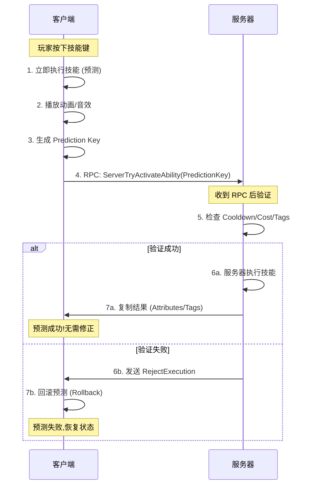
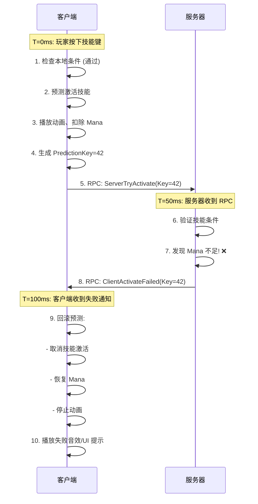

# 19. GAS 网络同步与预测深度解析

> **难度**: ⭐⭐⭐⭐⭐  
> **预计阅读时间**: 120 分钟  
> **源码路径**: `Source/LyraGame/AbilitySystem/*`, `Engine/Plugins/Runtime/GameplayAbilities/Source/GameplayAbilities/*`

---

## 📖 概述

Gameplay Ability System (GAS) 的网络同步机制是整个系统中最复杂也是最核心的部分。理解 GAS 的网络架构不仅是实现流畅多人游戏体验的关键,也是诊断和解决网络问题的基础。

在多人游戏中,玩家期望技能释放是"即时"的——按下按键后立即看到反馈,而不是等待服务器往返延迟(RTT)。同时,服务器必须验证所有操作的合法性,防止作弊。这看似矛盾的需求,正是通过 **客户端预测(Client-Side Prediction)** 和 **服务器权威(Server Authority)** 的精妙平衡来实现的。

Lyra 项目作为 Epic 官方的最佳实践示范,完整地展示了如何在实战中使用 GAS 的网络同步机制。本文将深入剖析 GAS 的网络架构,结合 Lyra 源码,揭示技能系统、属性复制、效果同步背后的原理。

### 本章核心内容

- **网络模型基础**: 理解 Server/Client/Autonomous/Simulated Proxy
- **技能激活流程**: 深入分析客户端预测与服务器验证
- **属性复制优化**: Attribute Set 的网络同步机制
- **Gameplay Effect 网络策略**: 不同类型 Effect 的复制方式
- **Gameplay Cue 网络同步**: 视觉特效的高效分发
- **Gameplay Tag 复制**: 标签容器的增量同步
- **预测修正机制**: Rollback 与 Reconciliation
- **网络调试技巧**: 使用 Console Commands 和 Network Profiler
- **常见网络问题**: 延迟、抖动、预测失败的诊断与解决
- **实战案例**: 实现一个网络友好的冲刺技能

### 为什么 GAS 网络同步如此重要?

1. **玩家体验**: 延迟感知直接影响游戏手感
2. **反外挂**: 服务器权威验证防止客户端作弊
3. **带宽优化**: 合理的复制策略减少网络负担
4. **调试效率**: 理解原理才能快速定位网络 Bug

> **前置知识**: 建议先阅读《06. GAS 入门》、《07. GAS 进阶》和《18. Replication Graph》。

---

## 1. GAS 网络模型基础

### 1.1 Unreal Engine 网络架构回顾

在深入 GAS 之前,我们需要理解 UE 的基础网络概念:

#### 1.1.1 网络角色 (Net Role)

每个 Actor 在不同机器上有不同的 **网络角色**:

```cpp
// ENetRole - 定义在 Engine/Source/Runtime/Engine/Classes/Engine/EngineTypes.h
enum ENetRole : uint8
{
    ROLE_None,               // 不参与网络复制
    ROLE_SimulatedProxy,     // 模拟代理 (其他客户端的 Pawn)
    ROLE_AutonomousProxy,    // 自主代理 (本地客户端的 Pawn)
    ROLE_Authority,          // 权威 (服务器)
};
```

**角色分配示例** (3 人游戏):

| Actor/机器 | 服务器 | 客户端 A | 客户端 B |
|------------|--------|----------|----------|
| PlayerA    | Authority | AutonomousProxy | SimulatedProxy |
| PlayerB    | Authority | SimulatedProxy | AutonomousProxy |
| Pickup     | Authority | SimulatedProxy | SimulatedProxy |

#### 1.1.2 网络模式 (Net Mode)

**Net Mode** 描述当前运行环境:

```cpp
// ENetMode - 定义在 Engine/Source/Runtime/Engine/Classes/Engine/EngineTypes.h
enum ENetMode : uint8
{
    NM_Standalone,    // 单机模式
    NM_DedicatedServer, // 专用服务器
    NM_ListenServer,  // 监听服务器 (服务器 + 本地玩家)
    NM_Client,        // 客户端
};
```

**获取网络信息的常用宏**:

```cpp
// 检查网络角色
bool bIsServer = HasAuthority();  // 是否是服务器
bool bIsClient = !HasAuthority(); // 是否是客户端
bool bIsAutonomous = (GetLocalRole() == ROLE_AutonomousProxy); // 是否是自主代理
bool bIsSimulated = (GetLocalRole() == ROLE_SimulatedProxy);   // 是否是模拟代理

// 检查网络模式
UWorld* World = GetWorld();
bool bIsDedicatedServer = (World->GetNetMode() == NM_DedicatedServer);
bool bIsListenServer = (World->GetNetMode() == NM_ListenServer);
```

### 1.2 GAS 的网络所有权模型

GAS 引入了 **Owner Actor** 和 **Avatar Actor** 的概念:

```cpp
// UAbilitySystemComponent 的 Actor 信息
struct FGameplayAbilityActorInfo
{
    TWeakObjectPtr<AActor> OwnerActor;   // 拥有者 (通常是 PlayerState)
    TWeakObjectPtr<AActor> AvatarActor;  // 化身 (通常是 Character/Pawn)
    TWeakObjectPtr<APlayerController> PlayerController;
    TWeakObjectPtr<UAbilitySystemComponent> AbilitySystemComponent;
};
```

#### 1.2.1 Lyra 的所有权配置

在 Lyra 中,ASC 的放置位置决定了网络同步行为:

```cpp
// LyraPlayerState.h - ASC 位于 PlayerState
UCLASS()
class ALyraPlayerState : public AModularPlayerStateCharacter
{
    GENERATED_BODY()

public:
    // Ability System Component 放在 PlayerState 上
    UPROPERTY(VisibleAnywhere, Category = "Lyra|PlayerState")
    TObjectPtr<ULyraAbilitySystemComponent> AbilitySystemComponent;
    
    // 属性集
    UPROPERTY()
    TObjectPtr<ULyraHealthSet> HealthSet;
    
    UPROPERTY()
    TObjectPtr<ULyraCombatSet> CombatSet;
};
```

```cpp
// LyraCharacter.cpp - 初始化 ASC
void ALyraCharacter::PossessedBy(AController* NewController)
{
    Super::PossessedBy(NewController);

    ALyraPlayerState* PS = GetPlayerState<ALyraPlayerState>();
    if (PS)
    {
        // 设置 Owner 为 PlayerState, Avatar 为 Character
        PS->GetAbilitySystemComponent()->InitAbilityActorInfo(PS, this);
    }
}
```

**为什么 ASC 放在 PlayerState 而不是 Character?**

| 放置位置 | 优点 | 缺点 | 适用场景 |
|---------|------|------|---------|
| **PlayerState** | • 玩家重生时 ASC 保持不变<br>• 技能、属性、效果不会丢失<br>• 适合持久化玩家数据 | • 需要额外配置 `OwnerActor` | **多人游戏** (推荐) |
| **Character/Pawn** | • 配置简单<br>• 单机游戏够用 | • 玩家死亡重生会丢失所有 GAS 数据 | 单机游戏、简单 AI |

### 1.3 复制模式 (Replication Mode)

GAS 支持三种复制模式,通过 `UAbilitySystemComponent::ReplicationMode` 设置:

```cpp
// EGameplayEffectReplicationMode - 定义在 AbilitySystemComponent.h
enum class EGameplayEffectReplicationMode : uint8
{
    // 完整复制:所有 Gameplay Effects 都复制到客户端
    Full,
    
    // 混合复制:只复制 GameplayCues 和 Attributes,不复制 GameplayEffects
    Mixed,
    
    // 最小复制:只复制 Attributes,不复制 GameplayCues 和 GameplayEffects
    Minimal
};
```

#### 1.3.1 三种模式详细对比

| 复制内容 | Full | Mixed | Minimal |
|---------|------|-------|---------|
| **Gameplay Effects** | ✅ 全部 | ❌ 不复制 | ❌ 不复制 |
| **Gameplay Cues** | ✅ 全部 | ✅ 全部 | ❌ 不复制 |
| **Gameplay Tags** | ✅ 全部 | ✅ 全部 | ✅ 全部 |
| **Attributes** | ✅ 全部 | ✅ 全部 | ✅ 全部 |
| **带宽占用** | 最高 | 中等 | 最低 |
| **适用场景** | 玩家角色 | AI (需要 Cue) | AI (不需要 Cue) |

#### 1.3.2 Lyra 的复制模式配置

```cpp
// LyraPlayerState.cpp - 设置复制模式
ALyraPlayerState::ALyraPlayerState(const FObjectInitializer& ObjectInitializer)
    : Super(ObjectInitializer)
{
    // 创建 ASC
    AbilitySystemComponent = ObjectInitializer.CreateDefaultSubobject<ULyraAbilitySystemComponent>(this, TEXT("AbilitySystemComponent"));
    AbilitySystemComponent->SetIsReplicated(true);
    
    // 玩家使用 Mixed 模式
    // 原因:客户端不需要知道所有 GameplayEffects 的细节,只需要看到结果(Attributes)和特效(Cues)
    AbilitySystemComponent->SetReplicationMode(EGameplayEffectReplicationMode::Mixed);
}
```

**为什么 Lyra 使用 Mixed 而不是 Full?**

1. **带宽优化**: Full 模式会复制所有 GE 的完整信息(Duration/Stack/Modifiers 等)
2. **防止作弊**: 客户端不需要知道 Buff/Debuff 的具体机制
3. **足够的视觉反馈**: Mixed 模式仍会复制 Gameplay Cues,玩家能看到特效

**何时使用 Full 模式?**

- 单人游戏
- 需要客户端 UI 显示 Buff 详情 (剩余时间、层数等)
- 调试阶段 (可以在客户端看到所有 GE)

---

## 2. 技能激活的网络流程

### 2.1 技能激活的三种网络路径

根据 **Net Execution Policy**,技能可以有不同的执行策略:

```cpp
// EGameplayAbilityNetExecutionPolicy - 定义在 GameplayAbility.h
enum class EGameplayAbilityNetExecutionPolicy : uint8
{
    // 本地预测:客户端立即执行,服务器稍后验证
    LocalPredicted,
    
    // 仅本地:只在本地执行,不发送到服务器 (单机或客户端特效)
    LocalOnly,
    
    // 仅服务器:只在服务器执行 (用于服务器触发的技能)
    ServerOnly,
    
    // 服务器初始化:客户端等待服务器激活后才执行
    ServerInitiated
};
```

#### 2.1.1 LocalPredicted 流程 (最常用)

这是多人游戏中最常用的模式,实现"无延迟"的体验:



**代码示例** - Lyra 的跳跃技能:

```cpp
// LyraGameplayAbility_Jump.h
UCLASS(Abstract)
class ULyraGameplayAbility_Jump : public ULyraGameplayAbility
{
    GENERATED_BODY()

public:
    ULyraGameplayAbility_Jump(const FObjectInitializer& ObjectInitializer);

protected:
    // 配置网络执行策略
    virtual void ActivateAbility(const FGameplayAbilitySpecHandle Handle, 
                                 const FGameplayAbilityActorInfo* ActorInfo, 
                                 const FGameplayAbilityActivationInfo ActivationInfo, 
                                 const FGameplayEventData* TriggerEventData) override;
    
    virtual bool CanActivateAbility(const FGameplayAbilitySpecHandle Handle, 
                                    const FGameplayAbilityActorInfo* ActorInfo, 
                                    const FGameplayTagContainer* SourceTags, 
                                    const FGameplayTagContainer* TargetTags, 
                                    FGameplayTagContainer* OptionalRelevantTags) const override;
};
```

```cpp
// LyraGameplayAbility_Jump.cpp
ULyraGameplayAbility_Jump::ULyraGameplayAbility_Jump(const FObjectInitializer& ObjectInitializer)
    : Super(ObjectInitializer)
{
    // 【关键配置】设置为客户端预测
    NetExecutionPolicy = EGameplayAbilityNetExecutionPolicy::LocalPredicted;
    
    // 安装策略:输入触发时激活
    InstancingPolicy = EGameplayAbilityInstancingPolicy::NonInstanced;
}

void ULyraGameplayAbility_Jump::ActivateAbility(/* ... */)
{
    // 客户端和服务器都会执行这段代码
    
    if (HasAuthorityOrPredictionKey(ActorInfo, &ActivationInfo))
    {
        // 只有拥有权威或预测密钥的机器才能激活
        
        if (!CommitAbility(Handle, ActorInfo, ActivationInfo)) // 检查 Cost/Cooldown
        {
            EndAbility(Handle, ActorInfo, ActivationInfo, true, true);
            return;
        }

        // 执行跳跃
        ACharacter* Character = CastChecked<ACharacter>(ActorInfo->AvatarActor.Get());
        Character->Jump();
    }
    
    Super::ActivateAbility(Handle, ActorInfo, ActivationInfo, TriggerEventData);
}

bool ULyraGameplayAbility_Jump::CanActivateAbility(/* ... */) const
{
    // 检查是否可以跳跃
    const ALyraCharacter* LyraCharacter = GetLyraCharacterFromActorInfo();
    if (!LyraCharacter || !LyraCharacter->CanJump())
    {
        return false;
    }

    return Super::CanActivateAbility(Handle, ActorInfo, SourceTags, TargetTags, OptionalRelevantTags);
}
```

**关键函数详解**:

```cpp
// HasAuthorityOrPredictionKey() - 判断是否有权限执行
bool UGameplayAbility::HasAuthorityOrPredictionKey(const FGameplayAbilityActorInfo* ActorInfo, 
                                                   const FGameplayAbilityActivationInfo* ActivationInfo) const
{
    // 服务器始终有权限
    if (ActorInfo->IsNetAuthority())
    {
        return true;
    }

    // 客户端需要有有效的 Prediction Key
    if (ActivationInfo && ActivationInfo->GetActivationPredictionKey().IsValidKey())
    {
        return true;
    }

    return false;
}
```

#### 2.1.2 ServerInitiated 流程

某些技能不能被客户端预测 (例如伤害计算、掉落物品生成等),必须等待服务器:

```cpp
// 服务器触发的技能 (例如:敌人死亡掉落)
UCLASS()
class ULyraGameplayAbility_Death : public ULyraGameplayAbility
{
    GENERATED_BODY()

public:
    ULyraGameplayAbility_Death()
    {
        // 只能由服务器激活
        NetExecutionPolicy = EGameplayAbilityNetExecutionPolicy::ServerOnly;
        InstancingPolicy = EGameplayAbilityInstancingPolicy::InstancedPerActor;
    }

protected:
    virtual void ActivateAbility(/* ... */) override
    {
        // 只在服务器执行
        check(HasAuthority(&ActivationInfo));

        // 禁用 Ragdoll, 播放死亡动画等
        // ...
        
        // 通过 Gameplay Cue 通知所有客户端播放特效
        FGameplayCueParameters CueParams;
        CueParams.SourceObject = GetAvatarActorFromActorInfo();
        ExecuteGameplayCue(FGameplayTag::RequestGameplayTag(TEXT("GameplayCue.Character.Death")), CueParams);
    }
};
```

### 2.2 Prediction Key 机制

**Prediction Key** 是 GAS 网络同步的核心机制,用于关联客户端的预测操作和服务器的验证结果。

#### 2.2.1 Prediction Key 的生成与传递

```cpp
// FPredictionKey - 定义在 GameplayPrediction.h
struct FPredictionKey
{
    int16 Current;  // 当前预测 ID
    int16 Base;     // 基础预测 ID (用于嵌套预测)
    
    bool IsValidKey() const { return Current > 0; }
    bool IsLocalClientKey() const { return Current > 0 && Base == 0; }
    bool IsServerInitiatedKey() const { return Current > 0 && Base > 0; }
};
```

**生成流程**:

```cpp
// UAbilitySystemComponent::InternalTryActivateAbility() - 简化版
bool UAbilitySystemComponent::InternalTryActivateAbility(FGameplayAbilitySpecHandle Handle, 
                                                         FPredictionKey InPredictionKey, 
                                                         /* ... */)
{
    FPredictionKey PredictionKey = InPredictionKey;

    // 如果是客户端预测,生成新的 Prediction Key
    if (IsOwnerActorAuthoritative() == false && 
        Spec->Ability->GetNetExecutionPolicy() == EGameplayAbilityNetExecutionPolicy::LocalPredicted)
    {
        if (!PredictionKey.IsValidKey())
        {
            // 生成新的预测 ID (递增)
            PredictionKey = FPredictionKey::CreateNewPredictionKey(this);
        }
        
        // 保存到激活信息中
        FScopedPredictionWindow ScopedPrediction(this, PredictionKey);
        
        // 发送 RPC 到服务器
        ServerTryActivateAbility(Handle, PredictionKey, TriggerEventData);
    }

    // 激活技能
    return InternalTryActivateAbilityWithEventData(Handle, PredictionKey, TriggerEventData, /* ... */);
}
```

#### 2.2.2 服务器端验证

```cpp
// UAbilitySystemComponent::ServerTryActivateAbility_Implementation()
void UAbilitySystemComponent::ServerTryActivateAbility_Implementation(FGameplayAbilitySpecHandle Handle, 
                                                                      FPredictionKey PredictionKey, 
                                                                      FGameplayEventData TriggerEventData)
{
    // 服务器接收到客户端的预测 Key
    FScopedPredictionWindow ScopedPrediction(this, PredictionKey, true);

    // 尝试激活技能
    FGameplayAbilitySpec* Spec = FindAbilitySpecFromHandle(Handle);
    if (Spec)
    {
        // 验证技能是否可以激活
        if (InternalTryActivateAbility(Handle, PredictionKey, &TriggerEventData, /* ... */))
        {
            // 验证成功!
            // 客户端的预测是正确的,不需要回滚
        }
        else
        {
            // 验证失败!
            // 发送 RPC 通知客户端回滚预测
            ClientActivateAbilityFailed(Handle, PredictionKey);
        }
    }
}
```

#### 2.2.3 预测失败的回滚

```cpp
// UAbilitySystemComponent::ClientActivateAbilityFailed_Implementation()
void UAbilitySystemComponent::ClientActivateAbilityFailed_Implementation(FGameplayAbilitySpecHandle Handle, 
                                                                         int16 PredictionKey)
{
    // 客户端接收到服务器的拒绝
    FGameplayAbilitySpec* Spec = FindAbilitySpecFromHandle(Handle);
    if (Spec && Spec->IsActive())
    {
        // 回滚技能 (取消激活)
        Spec->Ability->EndAbility(Handle, ActorInfo, Spec->ActivationInfo, true, true);
        
        // 回滚所有在此预测窗口中应用的 Gameplay Effects
        // (GAS 会自动跟踪并移除预测的 GE)
        ReplicatedPredictionKeyMap.RejectPredictedKey(PredictionKey);
    }
    
    // 触发技能失败回调
    OnAbilityFailedCallbacks.Broadcast(Spec->Ability, FailureReason);
}
```

### 2.3 实战案例:冲刺技能的网络实现

让我们实现一个完整的冲刺技能,展示 GAS 网络同步的最佳实践:

#### 2.3.1 技能类定义

```cpp
// LyraGameplayAbility_Sprint.h
#pragma once

#include "Abilities/LyraGameplayAbility.h"
#include "LyraGameplayAbility_Sprint.generated.h"

/**
 * 冲刺技能 - 演示客户端预测和网络同步
 */
UCLASS()
class LYRAGAME_API ULyraGameplayAbility_Sprint : public ULyraGameplayAbility
{
    GENERATED_BODY()

public:
    ULyraGameplayAbility_Sprint(const FObjectInitializer& ObjectInitializer);

protected:
    virtual void ActivateAbility(const FGameplayAbilitySpecHandle Handle, 
                                 const FGameplayAbilityActorInfo* ActorInfo, 
                                 const FGameplayAbilityActivationInfo ActivationInfo, 
                                 const FGameplayEventData* TriggerEventData) override;

    virtual void InputReleased(const FGameplayAbilitySpecHandle Handle, 
                              const FGameplayAbilityActorInfo* ActorInfo, 
                              const FGameplayAbilityActivationInfo ActivationInfo) override;

    virtual void CancelAbility(const FGameplayAbilitySpecHandle Handle, 
                              const FGameplayAbilityActorInfo* ActorInfo, 
                              const FGameplayAbilityActivationInfo ActivationInfo, 
                              bool bReplicateCancelAbility) override;

    // 冲刺速度倍率
    UPROPERTY(EditDefaultsOnly, BlueprintReadOnly, Category = "Sprint")
    float SpeedMultiplier = 1.5f;

    // 每秒消耗的耐力
    UPROPERTY(EditDefaultsOnly, BlueprintReadOnly, Category = "Sprint")
    float StaminaCostPerSecond = 10.0f;

private:
    // 冲刺 Gameplay Effect Handle
    FActiveGameplayEffectHandle SprintEffectHandle;
};
```

#### 2.3.2 技能实现

```cpp
// LyraGameplayAbility_Sprint.cpp
#include "LyraGameplayAbility_Sprint.h"
#include "AbilitySystem/LyraAbilitySystemComponent.h"
#include "AbilitySystem/Attributes/LyraCombatSet.h"
#include "Character/LyraCharacter.h"
#include "GameFramework/CharacterMovementComponent.h"

ULyraGameplayAbility_Sprint::ULyraGameplayAbility_Sprint(const FObjectInitializer& ObjectInitializer)
    : Super(ObjectInitializer)
{
    // 【网络配置】关键点 1: 使用客户端预测
    NetExecutionPolicy = EGameplayAbilityNetExecutionPolicy::LocalPredicted;
    
    // 【网络配置】关键点 2: 每个实例独立 (支持取消)
    InstancingPolicy = EGameplayAbilityInstancingPolicy::InstancedPerActor;
    
    // 激活策略:按住输入时持续激活
    ActivationPolicy = ELyraAbilityActivationPolicy::WhileInputActive;
    
    // 【网络配置】关键点 3: 设置为可取消
    bReplicateInputDirectly = true;
    bRetriggerInstancedAbility = false;
}

void ULyraGameplayAbility_Sprint::ActivateAbility(const FGameplayAbilitySpecHandle Handle, 
                                                  const FGameplayAbilityActorInfo* ActorInfo, 
                                                  const FGameplayAbilityActivationInfo ActivationInfo, 
                                                  const FGameplayEventData* TriggerEventData)
{
    // 【网络同步】关键点 4: 只有权威或有预测密钥的客户端才能激活
    if (!HasAuthorityOrPredictionKey(ActorInfo, &ActivationInfo))
    {
        EndAbility(Handle, ActorInfo, ActivationInfo, true, true);
        return;
    }

    // 【网络同步】关键点 5: CommitAbility 会同时检查 Cost 和 Cooldown
    if (!CommitAbility(Handle, ActorInfo, ActivationInfo))
    {
        // 耐力不足或技能在冷却中
        EndAbility(Handle, ActorInfo, ActivationInfo, true, true);
        return;
    }

    // 应用冲刺 Gameplay Effect (提升移动速度)
    if (UAbilitySystemComponent* ASC = ActorInfo->AbilitySystemComponent.Get())
    {
        // 创建 Gameplay Effect Spec
        FGameplayEffectContextHandle EffectContext = ASC->MakeEffectContext();
        EffectContext.AddSourceObject(this);

        // 这里应该引用一个配置好的 GE_Sprint Blueprint Asset
        // 为了演示,我们手动创建 Spec
        FGameplayEffectSpecHandle SpecHandle = ASC->MakeOutgoingSpec(
            SprintGameplayEffectClass, // 从 Data Asset 加载
            GetAbilityLevel(Handle, ActorInfo),
            EffectContext
        );

        if (SpecHandle.IsValid())
        {
            // 【网络同步】关键点 6: ApplyGameplayEffectSpecToSelf 会自动处理网络复制
            SprintEffectHandle = ASC->ApplyGameplayEffectSpecToSelf(*SpecHandle.Data.Get());
        }
    }

    // 【网络同步】关键点 7: Gameplay Cue 会自动复制到所有客户端
    FGameplayCueParameters CueParams;
    CueParams.SourceObject = GetAvatarActorFromActorInfo();
    ExecuteGameplayCue(FGameplayTag::RequestGameplayTag(TEXT("GameplayCue.Character.Sprint.Start")), CueParams);

    Super::ActivateAbility(Handle, ActorInfo, ActivationInfo, TriggerEventData);
}

void ULyraGameplayAbility_Sprint::InputReleased(const FGameplayAbilitySpecHandle Handle, 
                                               const FGameplayAbilityActorInfo* ActorInfo, 
                                               const FGameplayAbilityActivationInfo ActivationInfo)
{
    // 输入松开时取消技能
    if (ActorInfo != nullptr && ActorInfo->AvatarActor != nullptr)
    {
        CancelAbility(Handle, ActorInfo, ActivationInfo, true);
    }
}

void ULyraGameplayAbility_Sprint::CancelAbility(const FGameplayAbilitySpecHandle Handle, 
                                               const FGameplayAbilityActorInfo* ActorInfo, 
                                               const FGameplayAbilityActivationInfo ActivationInfo, 
                                               bool bReplicateCancelAbility)
{
    // 移除冲刺效果
    if (SprintEffectHandle.IsValid())
    {
        if (UAbilitySystemComponent* ASC = ActorInfo->AbilitySystemComponent.Get())
        {
            // 【网络同步】关键点 8: RemoveActiveGameplayEffect 会自动同步到客户端
            ASC->RemoveActiveGameplayEffect(SprintEffectHandle);
        }
    }

    // 播放结束特效
    FGameplayCueParameters CueParams;
    CueParams.SourceObject = GetAvatarActorFromActorInfo();
    ExecuteGameplayCue(FGameplayTag::RequestGameplayTag(TEXT("GameplayCue.Character.Sprint.Stop")), CueParams);

    Super::CancelAbility(Handle, ActorInfo, ActivationInfo, bReplicateCancelAbility);
}
```

#### 2.3.3 配套的 Gameplay Effect (Blueprint)

在编辑器中创建 `GE_Sprint` (蓝图版):

```
Duration Policy: Infinite (直到被移除)
Modifiers:
  - Attribute: MovementSpeed
    Modifier Op: Multiply
    Magnitude: 1.5 (150% 速度)
  
  - Attribute: Stamina
    Modifier Op: Additive
    Magnitude: -10 (每秒消耗 10 点耐力)
    Period: 1.0s (每秒执行一次)
    
Granted Tags:
  - Status.Sprint (用于 UI 显示)
  
Ongoing Tag Requirements:
  - Require: Ability.CanSprint
  - Block: Status.Stunned, Status.Dead
```

#### 2.3.4 网络调试日志

启用 GAS 网络日志:

```cpp
// 在游戏启动时或控制台输入
ABILITY_LOG(Log, TEXT("Sprint Ability Activated - Prediction Key: %d"), ActivationInfo.GetActivationPredictionKey().Current);

// 或使用控制台命令
// LogAbilitySystem Verbose
```

**预期日志输出** (客户端):

```
LogAbilitySystem: [Client] Sprint Ability Activated - Prediction Key: 42
LogAbilitySystem: [Client] Applied Predicted GE: GE_Sprint (Handle: 123, PredictionKey: 42)
LogAbilitySystem: [Client] Executed Gameplay Cue: GameplayCue.Character.Sprint.Start
```

**预期日志输出** (服务器):

```
LogAbilitySystem: [Server] Received ServerTryActivateAbility - Prediction Key: 42
LogAbilitySystem: [Server] Ability Activated Successfully - Handle: 0xABCD
LogAbilitySystem: [Server] Applied GE: GE_Sprint (Handle: 456)
LogAbilitySystem: [Server] Replicating to clients...
```

---

## 3. 属性复制优化

### 3.1 Attribute Set 的网络架构

`UAttributeSet` 是 GAS 中负责管理角色属性 (Health/Mana/Speed 等) 的核心类,其网络复制机制直接影响游戏性能。

#### 3.1.1 Attribute 的复制方式

GAS 使用 **Property Replication** 来同步属性:

```cpp
// LyraHealthSet.h - Lyra 的生命值属性集
UCLASS(BlueprintType)
class LYRAGAME_API ULyraHealthSet : public ULyraAttributeSet
{
    GENERATED_BODY()

public:
    ULyraHealthSet();

    // 【网络复制】关键点 1: 重写 GetLifetimeReplicatedProps
    virtual void GetLifetimeReplicatedProps(TArray<FLifetimeProperty>& OutLifetimeProps) const override;

    // 【网络复制】关键点 2: 使用 FGameplayAttributeData 而非 float
    UPROPERTY(BlueprintReadOnly, ReplicatedUsing = OnRep_Health, Category = "Lyra|Health")
    FGameplayAttributeData Health;
    ATTRIBUTE_ACCESSORS(ULyraHealthSet, Health)

    UPROPERTY(BlueprintReadOnly, ReplicatedUsing = OnRep_MaxHealth, Category = "Lyra|Health")
    FGameplayAttributeData MaxHealth;
    ATTRIBUTE_ACCESSORS(ULyraHealthSet, MaxHealth)

protected:
    // 【网络复制】关键点 3: RepNotify 函数处理客户端更新
    UFUNCTION()
    virtual void OnRep_Health(const FGameplayAttributeData& OldValue);

    UFUNCTION()
    virtual void OnRep_MaxHealth(const FGameplayAttributeData& OldValue);
};
```

#### 3.1.2 实现细节

```cpp
// LyraHealthSet.cpp
#include "LyraHealthSet.h"
#include "Net/UnrealNetwork.h"
#include "AbilitySystem/LyraAbilitySystemComponent.h"

ULyraHealthSet::ULyraHealthSet()
    : Health(100.0f)
    , MaxHealth(100.0f)
{
}

void ULyraHealthSet::GetLifetimeReplicatedProps(TArray<FLifetimeProperty>& OutLifetimeProps) const
{
    Super::GetLifetimeReplicatedProps(OutLifetimeProps);

    // 【优化】关键点 4: 使用 COND_OwnerOnly 只复制给所有者
    // 其他玩家不需要知道你的确切生命值 (可以通过 UI 显示近似值)
    DOREPLIFETIME_CONDITION_NOTIFY(ULyraHealthSet, Health, COND_None, REPNOTIFY_Always);
    DOREPLIFETIME_CONDITION_NOTIFY(ULyraHealthSet, MaxHealth, COND_None, REPNOTIFY_Always);
    
    // 如果要进一步优化,可以使用 COND_OwnerOnly:
    // DOREPLIFETIME_CONDITION_NOTIFY(ULyraHealthSet, Health, COND_OwnerOnly, REPNOTIFY_Always);
}

void ULyraHealthSet::OnRep_Health(const FGameplayAttributeData& OldValue)
{
    // 【网络同步】关键点 5: 必须调用 GAMEPLAYATTRIBUTE_REPNOTIFY
    // 这会触发 Gameplay Cue 和 UI 更新
    GAMEPLAYATTRIBUTE_REPNOTIFY(ULyraHealthSet, Health, OldValue);
    
    // 可以在这里添加自定义逻辑 (例如播放受伤音效)
    if (Health.GetCurrentValue() < OldValue.GetCurrentValue())
    {
        // 生命值减少,播放受伤反馈
        if (ULyraAbilitySystemComponent* ASC = GetLyraAbilitySystemComponent())
        {
            FGameplayCueParameters CueParams;
            CueParams.RawMagnitude = OldValue.GetCurrentValue() - Health.GetCurrentValue();
            ASC->ExecuteGameplayCue(FGameplayTag::RequestGameplayTag(TEXT("GameplayCue.Character.Damage")), CueParams);
        }
    }
}

void ULyraHealthSet::OnRep_MaxHealth(const FGameplayAttributeData& OldValue)
{
    GAMEPLAYATTRIBUTE_REPNOTIFY(ULyraHealthSet, MaxHealth, OldValue);
}
```

### 3.2 FGameplayAttributeData 的网络优化

`FGameplayAttributeData` 是一个特殊的结构体,专门为网络复制优化:

```cpp
// FGameplayAttributeData - 定义在 AttributeSet.h
USTRUCT(BlueprintType)
struct FGameplayAttributeData
{
    GENERATED_BODY()

protected:
    // 【优化】关键点 6: BaseValue 不复制,只在服务器计算
    UPROPERTY()
    float BaseValue;

    // 【优化】关键点 7: CurrentValue 是最终值,直接复制
    UPROPERTY()
    float CurrentValue;

public:
    float GetBaseValue() const { return BaseValue; }
    float GetCurrentValue() const { return CurrentValue; }
    
    void SetBaseValue(float NewValue);
    void SetCurrentValue(float NewValue);
};
```

**为什么不直接用 float?**

| 对比项 | float | FGameplayAttributeData |
|--------|-------|------------------------|
| **基础值追踪** | ❌ 需要手动管理 | ✅ 自动分离 Base/Current |
| **Modifier 支持** | ❌ 需要自己实现 | ✅ GAS 自动计算 |
| **网络优化** | ❌ 总是复制 | ✅ 只复制 CurrentValue |
| **RepNotify 宏** | ❌ 手动处理 | ✅ GAMEPLAYATTRIBUTE_REPNOTIFY |

### 3.3 属性修改的网络流程

#### 3.3.1 通过 Gameplay Effect 修改 (推荐)

```cpp
// 示例:造成伤害 (服务器执行)
void ULyraHealthComponent::TakeDamage(float DamageAmount, AActor* DamageCauser)
{
    if (!HasAuthority())
    {
        // 只能在服务器上造成伤害
        return;
    }

    ULyraAbilitySystemComponent* ASC = GetAbilitySystemComponent();
    if (!ASC)
    {
        return;
    }

    // 创建伤害 Gameplay Effect Spec
    FGameplayEffectContextHandle EffectContext = ASC->MakeEffectContext();
    EffectContext.AddInstigator(DamageCauser, DamageCauser);

    FGameplayEffectSpecHandle SpecHandle = ASC->MakeOutgoingSpec(
        DamageGameplayEffectClass, // 伤害 GE (预先配置好的 Blueprint Asset)
        1.0f, // Level
        EffectContext
    );

    if (SpecHandle.IsValid())
    {
        // 设置伤害值
        SpecHandle.Data.Get()->SetSetByCallerMagnitude(
            FGameplayTag::RequestGameplayTag(TEXT("Data.Damage")), 
            DamageAmount
        );

        // 【网络同步】关键点 8: ApplyGameplayEffectSpecToSelf 会自动同步属性变化
        ASC->ApplyGameplayEffectSpecToSelf(*SpecHandle.Data.Get());
    }
}
```

**网络流程**:

```
[服务器]
1. ApplyGameplayEffectSpecToSelf()
2. 计算 Modifiers: Health -= DamageAmount
3. 更新 Health.CurrentValue
4. 标记为脏 (Dirty) 等待复制

[复制引擎]
5. 检测到 Health 变化
6. 将新值打包到网络包中
7. 发送到所有相关客户端

[客户端]
8. 接收网络包
9. 触发 OnRep_Health()
10. 调用 GAMEPLAYATTRIBUTE_REPNOTIFY 宏
11. 更新 UI/播放特效
```

#### 3.3.2 直接修改 (不推荐,仅用于调试)

```cpp
// ⚠️ 错误示例:不要这样做!
void BadExample_DirectModify(ULyraHealthSet* HealthSet)
{
    // ❌ 这样修改不会触发 RepNotify,也不会记录到 GAS 系统
    HealthSet->Health.SetCurrentValue(50.0f);
}

// ✅ 正确示例:使用 SetNumericAttributeBase
void GoodExample_DirectModify(UAbilitySystemComponent* ASC)
{
    const FGameplayAttribute HealthAttribute = ULyraHealthSet::GetHealthAttribute();
    
    // 这会正确地触发所有 GAS 回调和网络复制
    ASC->SetNumericAttributeBase(HealthAttribute, 50.0f);
}
```

### 3.4 属性复制的条件优化

#### 3.4.1 使用复制条件减少带宽

```cpp
// 高级示例:不同属性使用不同的复制条件
void ULyraHealthSet::GetLifetimeReplicatedProps(TArray<FLifetimeProperty>& OutLifetimeProps) const
{
    Super::GetLifetimeReplicatedProps(OutLifetimeProps);

    // Health: 只复制给所有者 (自己的生命值)
    DOREPLIFETIME_CONDITION_NOTIFY(ULyraHealthSet, Health, COND_OwnerOnly, REPNOTIFY_Always);

    // MaxHealth: 复制给所有人 (用于 UI 显示血条比例)
    DOREPLIFETIME_CONDITION_NOTIFY(ULyraHealthSet, MaxHealth, COND_None, REPNOTIFY_Always);

    // Shield: 只在初始化时复制 (静态值)
    DOREPLIFETIME_CONDITION_NOTIFY(ULyraHealthSet, Shield, COND_InitialOnly, REPNOTIFY_Always);
}
```

**复制条件对比**:

| 条件 | 说明 | 适用场景 |
|------|------|---------|
| `COND_None` | 复制给所有相关客户端 | MaxHealth (所有人都需要) |
| `COND_OwnerOnly` | 只复制给所有者 | 精确的 Health 值 (防止作弊) |
| `COND_SkipOwner` | 除了所有者都复制 | 第三人称动画 (自己不需要看) |
| `COND_InitialOnly` | 只在 Actor 生成时复制 | 静态属性 (等级、职业) |
| `COND_Custom` | 自定义条件 | 复杂的复制逻辑 |

#### 3.4.2 量化压缩 (Quantization)

对于精度要求不高的属性,可以使用量化压缩:

```cpp
// 示例:百分比血量只需要 1% 的精度
UPROPERTY(ReplicatedUsing = OnRep_HealthPercent)
FGameplayAttributeData HealthPercent; // 范围 0-100

void ULyraHealthSet::GetLifetimeReplicatedProps(TArray<FLifetimeProperty>& OutLifetimeProps) const
{
    Super::GetLifetimeReplicatedProps(OutLifetimeProps);

    // 使用 1% 精度量化 (从 32-bit float 压缩到 8-bit)
    DOREPLIFETIME_CONDITION_NOTIFY(
        ULyraHealthSet, 
        HealthPercent, 
        COND_None, 
        REPNOTIFY_Always
    );
    
    // 设置量化参数 (需要在 C++ 中手动配置)
    // OutLifetimeProps.Last().RepNotifyCondition = REPNOTIFY_Always;
    // OutLifetimeProps.Last().SetQuantize(EQuantize::Int8);
}
```

**量化效果**:

| 数据类型 | 精度 | 带宽 | 适用场景 |
|---------|------|------|---------|
| float (32-bit) | 全精度 | 4 字节 | 伤害计算 |
| Int16 (16-bit) | 整数 ±32767 | 2 字节 | 耐力值 (0-1000) |
| Int8 (8-bit) | 整数 0-255 | 1 字节 | 血量百分比 (0-100%) |
| Bool | 1-bit | ~0.125 字节 | 状态标志 |

---

## 4. Gameplay Effect 网络策略

### 4.1 GE 的三种复制模式

根据 `ReplicationMode`,Gameplay Effects 有不同的复制行为:

#### 4.1.1 Full 模式:完整复制

```cpp
// Full 模式下,GE 的所有信息都会复制到客户端
struct FActiveGameplayEffect
{
    // 这些数据都会复制
    FGameplayEffectSpec Spec;              // 完整的 Effect 配置
    float StartServerWorldTime;            // 开始时间
    float StartWorldTime;                  // 本地开始时间
    float Duration;                        // 持续时间
    int32 StackCount;                      // 层数
    FPredictionKey PredictionKey;          // 预测密钥
    // ...
};
```

**优点**:
- 客户端可以准确显示 Buff/Debuff 详情
- 支持 UI 显示剩余时间、层数等

**缺点**:
- 带宽消耗大 (每个 GE 都完整复制)
- 暴露游戏机制 (客户端能看到所有 Modifier)

#### 4.1.2 Mixed 模式:混合复制 (Lyra 使用)

```cpp
// Mixed 模式下,只复制 Minimal Data (最小数据集)
struct FMinimalReplicationTagCountMap
{
    FGameplayTagContainer Tags;  // 只复制 Granted Tags
    // 不复制 GE 的 Spec/Duration/Modifiers 等细节
};
```

**优点**:
- 带宽占用适中
- 客户端仍可通过 Tags 判断状态 (是否中毒、眩晕等)
- Gameplay Cues 正常工作 (视觉特效不受影响)

**缺点**:
- 客户端无法获取 GE 的详细信息 (持续时间、层数)
- 需要通过 Tags 间接推测状态

#### 4.1.3 Minimal 模式:最小复制

```cpp
// Minimal 模式下,连 Gameplay Cues 都不复制
// 只复制 Attributes 的最终值
```

**适用场景**:
- 简单 AI (不需要视觉特效)
- 服务器端 NPC (客户端不可见)

### 4.2 不同类型 GE 的网络行为

#### 4.2.1 Instant GE (瞬间生效)

```cpp
// 示例:瞬间伤害 GE
UCLASS()
class UGE_InstantDamage : public UGameplayEffect
{
    GENERATED_BODY()

public:
    UGE_InstantDamage()
    {
        // 【网络配置】关键点 9: Instant GE 不需要复制!
        DurationPolicy = EGameplayEffectDurationType::Instant;
        
        // Instant GE 只在服务器执行,客户端通过 Attribute Replication 看到结果
    }
};
```

**网络流程**:

```
[服务器]
ApplyGameplayEffectToTarget(GE_InstantDamage)
  ├─> 计算 Modifiers: Health -= 50
  ├─> 更新 Health.CurrentValue (100 -> 50)
  └─> 标记 Health 属性为 Dirty

[网络引擎]
检测到 Health 变化 -> 复制到客户端

[客户端]
OnRep_Health() 触发
  ├─> UI 更新: 血条减少
  └─> Gameplay Cue: 播放受伤特效
```

**关键点**:Instant GE 本身不复制,只复制它造成的 **属性变化**。

#### 4.2.2 Duration GE (有持续时间)

```cpp
// 示例:持续 5 秒的加速 Buff
UCLASS()
class UGE_SpeedBoost : public UGameplayEffect
{
    GENERATED_BODY()

public:
    UGE_SpeedBoost()
    {
        // 【网络配置】关键点 10: Duration GE 需要复制
        DurationPolicy = EGameplayEffectDurationType::HasDuration;
        DurationMagnitude = FScalableFloat(5.0f); // 5 秒
        
        // 在 Mixed 模式下,客户端看不到 Duration,但能看到 Granted Tags
    }
};
```

**Mixed 模式下的复制**:

| 复制到客户端? | Full 模式 | Mixed 模式 |
|--------------|----------|-----------|
| Granted Tags | ✅ | ✅ |
| Duration | ✅ | ❌ |
| Remaining Time | ✅ | ❌ |
| Stack Count | ✅ | ❌ |
| Modifiers | ✅ | ❌ |

**解决方案**:如果需要在 Mixed 模式下显示剩余时间,有两种方法:

**方法 1**: 使用 Gameplay Cue 参数传递时间

```cpp
void ULyraGameplayAbility::ApplyBuffWithDuration(float Duration)
{
    // 应用 GE
    FActiveGameplayEffectHandle EffectHandle = ApplyGameplayEffectToOwner(/* ... */);

    // 通过 Gameplay Cue 发送剩余时间信息
    FGameplayCueParameters CueParams;
    CueParams.RawMagnitude = Duration; // 传递持续时间
    CueParams.EffectContext = MakeEffectContext();
    
    ExecuteGameplayCue(FGameplayTag::RequestGameplayTag(TEXT("GameplayCue.Buff.SpeedBoost")), CueParams);
}
```

**方法 2**: 使用自定义 RPC

```cpp
// 在 PlayerState 中添加 RPC
UFUNCTION(Client, Reliable)
void ClientNotifyBuffApplied(FGameplayTag BuffTag, float Duration);

void ALyraPlayerState::ClientNotifyBuffApplied_Implementation(FGameplayTag BuffTag, float Duration)
{
    // 客户端收到 Buff 信息后更新 UI
    OnBuffApplied.Broadcast(BuffTag, Duration);
}
```

#### 4.2.3 Infinite GE (无限持续)

```cpp
// 示例:装备武器的被动效果
UCLASS()
class UGE_WeaponPassive : public UGameplayEffect
{
    GENERATED_BODY()

public:
    UGE_WeaponPassive()
    {
        // 【网络配置】关键点 11: Infinite GE 一直存在,直到手动移除
        DurationPolicy = EGameplayEffectDurationType::Infinite;
        
        // 通常在装备装备时应用,卸下时移除
    }
};
```

**网络优化**:Infinite GE 只在添加和移除时产生网络流量,持续期间不占用带宽。

### 4.3 GE Stack (层数) 的网络同步

#### 4.3.1 Stack 配置

```cpp
// 可叠加的 Buff (例如:攻击速度提升)
UCLASS()
class UGE_AttackSpeedStack : public UGameplayEffect
{
    GENERATED_BODY()

public:
    UGE_AttackSpeedStack()
    {
        DurationPolicy = EGameplayEffectDurationType::HasDuration;
        
        // 【网络配置】关键点 12: Stack 配置
        StackingType = EGameplayEffectStackingType::AggregateByTarget; // 同一个目标叠加
        StackLimitCount = 5; // 最多叠 5 层
        StackDurationRefreshPolicy = EGameplayEffectStackingDurationPolicy::RefreshOnSuccessfulApplication; // 刷新持续时间
        StackPeriodResetPolicy = EGameplayEffectStackingPeriodPolicy::ResetOnSuccessfulApplication; // 重置周期
    }
};
```

#### 4.3.2 Stack 网络行为

**Full 模式**:
```cpp
// 客户端可以直接查询 Stack 层数
int32 GetStackCount(FGameplayTag EffectTag)
{
    UAbilitySystemComponent* ASC = GetAbilitySystemComponent();
    FGameplayEffectQuery Query;
    Query.EffectTagQuery = FGameplayTagQuery::MakeQuery_MatchTag(EffectTag);
    
    TArray<FActiveGameplayEffectHandle> Handles = ASC->GetActiveEffects(Query);
    if (Handles.Num() > 0)
    {
        const FActiveGameplayEffect* ActiveGE = ASC->GetActiveGameplayEffect(Handles[0]);
        return ActiveGE->Spec.GetStackCount(); // Full 模式下可用
    }
    return 0;
}
```

**Mixed 模式**:
```cpp
// 客户端无法直接查询 Stack,需要通过其他方式
// 解决方案:使用 Gameplay Tags 表示层数

// 方法 1: 动态添加 Tag (例如: Buff.AttackSpeed.Stack.1, Buff.AttackSpeed.Stack.2)
void UpdateStackTags(int32 OldStack, int32 NewStack)
{
    UAbilitySystemComponent* ASC = GetAbilitySystemComponent();
    
    // 移除旧的层数 Tag
    if (OldStack > 0)
    {
        FGameplayTag OldTag = FGameplayTag::RequestGameplayTag(
            FName(*FString::Printf(TEXT("Buff.AttackSpeed.Stack.%d"), OldStack))
        );
        ASC->RemoveLooseGameplayTag(OldTag);
    }
    
    // 添加新的层数 Tag
    if (NewStack > 0)
    {
        FGameplayTag NewTag = FGameplayTag::RequestGameplayTag(
            FName(*FString::Printf(TEXT("Buff.AttackSpeed.Stack.%d"), NewStack))
        );
        ASC->AddLooseGameplayTag(NewTag);
    }
}

// 方法 2: 使用自定义 Attribute 存储层数 (更优雅)
UCLASS()
class ULyraCombatSet : public ULyraAttributeSet
{
    GENERATED_BODY()

public:
    // 用一个 Attribute 记录层数
    UPROPERTY(BlueprintReadOnly, ReplicatedUsing = OnRep_AttackSpeedStackCount)
    FGameplayAttributeData AttackSpeedStackCount;
    ATTRIBUTE_ACCESSORS(ULyraCombatSet, AttackSpeedStackCount)
    
protected:
    UFUNCTION()
    void OnRep_AttackSpeedStackCount(const FGameplayAttributeData& OldValue);
};
```

---

## 5. Gameplay Cue 网络同步

### 5.1 Gameplay Cue 的执行方式

Gameplay Cues (视觉/音效特效) 有三种执行方式:

```cpp
// EGameplayCueEvent - 定义在 GameplayCueInterface.h
enum class EGameplayCueEvent : uint8
{
    OnActive,      // GE 激活时执行 (只执行一次)
    WhileActive,   // GE 激活期间持续执行
    Executed,      // 立即执行 (不关联 GE)
    Removed,       // GE 移除时执行
};
```

#### 5.1.1 Execute (立即执行)

```cpp
// 示例:播放受击特效
void ULyraHealthComponent::OnTakeDamage(float DamageAmount)
{
    FGameplayCueParameters CueParams;
    CueParams.RawMagnitude = DamageAmount;
    CueParams.SourceObject = this;
    
    // 【网络同步】关键点 13: ExecuteGameplayCue 会自动复制到所有客户端
    AbilitySystemComponent->ExecuteGameplayCue(
        FGameplayTag::RequestGameplayTag(TEXT("GameplayCue.Character.Damage")),
        CueParams
    );
}
```

**网络流程**:

```
[服务器]
ExecuteGameplayCue("GameplayCue.Character.Damage")
  └─> NetMulticast_InvokeGameplayCueExecuted_WithParams()
      └─> [RPC] 发送到所有客户端

[客户端 A, B, C]
收到 RPC -> 播放受击特效
```

#### 5.1.2 Add/Remove (持续特效)

```cpp
// 示例:冲刺特效 (持续播放拖尾)
void ULyraGameplayAbility_Sprint::ActivateAbility(/* ... */)
{
    FGameplayCueParameters CueParams;
    CueParams.SourceObject = GetAvatarActorFromActorInfo();
    
    // 【网络同步】关键点 14: AddGameplayCue 会创建持续特效
    AbilitySystemComponent->AddGameplayCue(
        FGameplayTag::RequestGameplayTag(TEXT("GameplayCue.Character.Sprint")),
        CueParams
    );
}

void ULyraGameplayAbility_Sprint::EndAbility(/* ... */)
{
    // 【网络同步】关键点 15: RemoveGameplayCue 移除持续特效
    AbilitySystemComponent->RemoveGameplayCue(
        FGameplayTag::RequestGameplayTag(TEXT("GameplayCue.Character.Sprint"))
    );
}
```

### 5.2 Gameplay Cue 的网络优化

#### 5.2.1 可靠 vs 不可靠 RPC

```cpp
// UAbilitySystemGlobals::ShouldReplicateGameplayCue()
bool UAbilitySystemGlobals::ShouldReplicateGameplayCue(const FGameplayTag& GameplayCueTag, 
                                                       const FGameplayCueParameters& Params) const
{
    // 【优化】关键点 16: 大部分 Cue 使用不可靠 RPC (NetMulticast Unreliable)
    // 原因:特效丢失不影响游戏玩法,但能大幅减少带宽
    
    // 例外:重要的 Cue (死亡、复活) 使用可靠 RPC
    if (GameplayCueTag.MatchesTag(FGameplayTag::RequestGameplayTag(TEXT("GameplayCue.Character.Death"))))
    {
        return true; // 可靠
    }
    
    return false; // 不可靠
}
```

**可靠 vs 不可靠对比**:

| RPC 类型 | 保证送达? | 带宽占用 | 适用场景 |
|---------|----------|---------|---------|
| **Reliable** | ✅ 保证 | 高 (需要 ACK) | 死亡、复活、关键特效 |
| **Unreliable** | ❌ 可能丢失 | 低 | 受击、脚步声、普通特效 |

#### 5.2.2 Minimal Replication Tags

在 Mixed/Minimal 模式下,GAS 使用 **Minimal Replication Tags** 压缩 Cue 数据:

```cpp
// FMinimalReplicationTagCountMap - 只复制 Tag 的增删,不复制完整信息
struct FMinimalReplicationTagCountMap
{
    TMap<FGameplayTag, int32> TagMap; // Tag -> Count (层数)
};
```

**优化效果**:

| 数据 | Full 模式 | Mixed 模式 | 节省 |
|------|----------|-----------|------|
| GE Spec | 100+ 字节 | 0 字节 | 100% |
| Duration | 4 字节 | 0 字节 | 100% |
| Gameplay Tag | 8 字节 | 8 字节 | 0% |
| **总计** | ~120 字节 | ~8 字节 | **93%** |

### 5.3 实战:实现受击特效的网络同步

#### 5.3.1 创建 Gameplay Cue Actor

```cpp
// LyraGameplayCue_Damage.h
#pragma once

#include "GameplayCueNotify_Actor.h"
#include "LyraGameplayCue_Damage.generated.h"

/**
 * 受击特效 - 在所有客户端播放
 */
UCLASS()
class LYRAGAME_API ALyraGameplayCue_Damage : public AGameplayCueNotify_Actor
{
    GENERATED_BODY()

public:
    ALyraGameplayCue_Damage();

protected:
    // 【网络同步】关键点 17: OnExecute 在所有客户端执行
    virtual bool OnExecute_Implementation(AActor* Target, const FGameplayCueParameters& Parameters) override;

    // 受击粒子特效
    UPROPERTY(EditDefaultsOnly, Category = "Cue")
    TObjectPtr<UParticleSystem> HitParticle;

    // 受击音效
    UPROPERTY(EditDefaultsOnly, Category = "Cue")
    TObjectPtr<USoundBase> HitSound;
};
```

```cpp
// LyraGameplayCue_Damage.cpp
#include "LyraGameplayCue_Damage.h"
#include "Kismet/GameplayStatics.h"
#include "Particles/ParticleSystemComponent.h"

ALyraGameplayCue_Damage::ALyraGameplayCue_Damage()
{
    // 【优化】关键点 18: Cue Actor 默认不复制 (特效只在本地播放)
    bReplicates = false;
    bAlwaysRelevant = false;
}

bool ALyraGameplayCue_Damage::OnExecute_Implementation(AActor* Target, const FGameplayCueParameters& Parameters)
{
    // 这个函数会在所有客户端调用 (通过 RPC)
    
    if (!Target)
    {
        return false;
    }

    // 获取受击位置 (从 Parameters 中获取)
    FVector HitLocation = Parameters.Location.IsZero() ? Target->GetActorLocation() : Parameters.Location;
    FRotator HitRotation = Parameters.Normal.IsZero() ? Target->GetActorRotation() : Parameters.Normal.Rotation();

    // 播放粒子特效
    if (HitParticle)
    {
        UGameplayStatics::SpawnEmitterAtLocation(
            GetWorld(),
            HitParticle,
            HitLocation,
            HitRotation,
            FVector(1.0f), // Scale
            true // Auto Destroy
        );
    }

    // 播放音效
    if (HitSound)
    {
        UGameplayStatics::PlaySoundAtLocation(
            GetWorld(),
            HitSound,
            HitLocation,
            1.0f, // Volume
            1.0f  // Pitch
        );
    }

    // 【可选】根据伤害值显示飘字
    float DamageAmount = Parameters.RawMagnitude;
    if (DamageAmount > 0.0f)
    {
        // 在这里创建 UI Widget 显示伤害数字
        // ...
    }

    return true;
}
```

#### 5.3.2 配置 Gameplay Cue Tag

在 **Project Settings > Gameplay Tags** 中添加:

```
GameplayCue.Character.Damage
```

然后在 **Content Browser** 中创建 Blueprint:

```
BP_GameplayCue_Damage (继承自 ALyraGameplayCue_Damage)
  ├─ Hit Particle: P_HitEffect (粒子系统)
  ├─ Hit Sound: S_HitImpact (音效)
  └─ Gameplay Cue Tag: GameplayCue.Character.Damage
```

#### 5.3.3 触发 Gameplay Cue

```cpp
// 在伤害计算中触发 Cue
void ULyraHealthComponent::HandleDamage(float DamageAmount, FVector HitLocation, FVector HitNormal)
{
    // 应用伤害 GE (修改 Health 属性)
    // ...

    // 播放受击特效 (所有客户端)
    if (UAbilitySystemComponent* ASC = GetAbilitySystemComponent())
    {
        FGameplayCueParameters CueParams;
        CueParams.Location = HitLocation;
        CueParams.Normal = HitNormal;
        CueParams.RawMagnitude = DamageAmount; // 传递伤害值
        CueParams.SourceObject = this;

        // 【网络同步】关键点 19: 服务器调用,自动复制到所有客户端
        ASC->ExecuteGameplayCue(
            FGameplayTag::RequestGameplayTag(TEXT("GameplayCue.Character.Damage")),
            CueParams
        );
    }
}
```

---

## 6. 预测修正与回滚机制

### 6.1 什么是预测修正 (Prediction Rollback)?

当客户端的预测与服务器的验证结果不一致时,GAS 会执行 **回滚 (Rollback)** 和 **修正 (Reconciliation)**。

#### 6.1.1 预测失败的常见场景

| 场景 | 客户端预测 | 服务器验证 | 结果 |
|------|-----------|-----------|------|
| **技能在 CD** | 激活成功 | ❌ CD 未结束 | 回滚 |
| **Mana 不足** | 激活成功 | ❌ 资源不足 | 回滚 |
| **被沉默** | 激活成功 | ❌ 有 Silence Tag | 回滚 |
| **网络延迟** | 施法 0.5s 后命中 | 目标已移动 | 修正位置 |

#### 6.1.2 回滚流程



### 6.2 回滚的实现细节

#### 6.2.1 GAS 的回滚机制

```cpp
// UAbilitySystemComponent::ReplicatedPredictionKeyMap
// 用于追踪预测的 Gameplay Effects
struct FReplicatedPredictionKeyMap
{
    // Key: Prediction Key, Value: 在该预测窗口中应用的 GE Handles
    TMap<int16, TArray<FActiveGameplayEffectHandle>> PredictionKeyToEffectHandles;
    
    // 当预测失败时,移除所有关联的 GE
    void RejectPredictedKey(int16 PredictionKey)
    {
        if (TArray<FActiveGameplayEffectHandle>* Handles = PredictionKeyToEffectHandles.Find(PredictionKey))
        {
            for (const FActiveGameplayEffectHandle& Handle : *Handles)
            {
                // 移除预测的 GE
                AbilitySystemComponent->RemoveActiveGameplayEffect(Handle);
            }
            
            PredictionKeyToEffectHandles.Remove(PredictionKey);
        }
    }
};
```

#### 6.2.2 CommitAbility 的预测支持

```cpp
// UGameplayAbility::CommitAbility() - 简化版
bool UGameplayAbility::CommitAbility(FGameplayAbilitySpecHandle Handle, 
                                    const FGameplayAbilityActorInfo* ActorInfo, 
                                    const FGameplayAbilityActivationInfo ActivationInfo)
{
    // 检查 Cooldown
    if (!CommitCheck(Handle, ActorInfo, ActivationInfo))
    {
        return false;
    }

    // 【预测支持】关键点 20: CommitExecute 会记录 Prediction Key
    return CommitExecute(Handle, ActorInfo, ActivationInfo);
}

bool UGameplayAbility::CommitExecute(/* ... */)
{
    // 应用 Cost (消耗 Mana/Stamina 等)
    ApplyCost(Handle, ActorInfo, ActivationInfo);
    
    // 应用 Cooldown
    ApplyCooldown(Handle, ActorInfo, ActivationInfo);
    
    // 【关键】这些应用的 GE 都会关联当前的 Prediction Key
    // 如果预测失败,这些 GE 会被自动移除
    
    return true;
}
```

### 6.3 最小化预测失败的策略

#### 6.3.1 客户端严格检查

```cpp
// ✅ 好的实践:客户端也严格检查条件
bool ULyraGameplayAbility::CanActivateAbility(/* ... */) const
{
    if (!Super::CanActivateAbility(Handle, ActorInfo, SourceTags, TargetTags, OptionalRelevantTags))
    {
        return false;
    }

    // 检查自定义条件
    const ULyraAbilitySystemComponent* ASC = GetLyraAbilitySystemComponentFromActorInfo();
    
    // ❌ 检查 Cooldown (避免客户端预测激活一个正在 CD 的技能)
    if (ASC->GetGameplayEffectCount(CooldownGameplayEffectClass, ASC) > 0)
    {
        return false;
    }
    
    // ❌ 检查 Cost (避免预测激活一个资源不足的技能)
    if (!CheckCost(Handle, ActorInfo, OptionalRelevantTags))
    {
        return false;
    }
    
    return true;
}
```

#### 6.3.2 服务器宽容验证

```cpp
// 对于网络延迟导致的"轻微"差异,服务器可以宽容处理
bool UGameplayAbility::CanActivateAbility(/* ... */) const
{
    // 服务器检查时考虑网络延迟
    const float ServerWorldTime = GetWorld()->GetTimeSeconds();
    const float ClientWorldTime = ActivationInfo.ServerSetActivationTime;
    const float TimeDifference = ServerWorldTime - ClientWorldTime;
    
    // 如果客户端的请求"略微过期" (< 0.2s),仍然接受
    const float ToleranceTime = 0.2f;
    
    if (IsOnCooldown() && TimeDifference < ToleranceTime)
    {
        // 宽容:客户端发送请求时 CD 可能刚好结束
        return true;
    }
    
    return Super::CanActivateAbility(/* ... */);
}
```

### 6.4 处理预测失败的 UI 反馈

```cpp
// LyraHeroComponent.cpp - 监听技能失败事件
void ULyraHeroComponent::InitializeAbilitySystem()
{
    // ...

    // 绑定技能失败回调
    AbilitySystemComponent->OnAbilityFailedCallbacks.AddUObject(this, &ULyraHeroComponent::OnAbilityFailed);
}

void ULyraHeroComponent::OnAbilityFailed(const UGameplayAbility* Ability, const FGameplayTagContainer& FailureReason)
{
    // 检查失败原因
    if (FailureReason.HasTag(FGameplayTag::RequestGameplayTag(TEXT("Ability.ActivateFail.Cooldown"))))
    {
        // 播放"技能在冷却中"的音效
        UGameplayStatics::PlaySound2D(GetWorld(), CooldownFailSound);
        
        // 显示 UI 提示
        if (ALyraPlayerController* PC = GetController<ALyraPlayerController>())
        {
            PC->ClientShowNotification(FText::FromString(TEXT("技能在冷却中!")));
        }
    }
    else if (FailureReason.HasTag(FGameplayTag::RequestGameplayTag(TEXT("Ability.ActivateFail.Cost"))))
    {
        // 资源不足
        UGameplayStatics::PlaySound2D(GetWorld(), CostFailSound);
    }
    else if (FailureReason.HasTag(FGameplayTag::RequestGameplayTag(TEXT("Ability.ActivateFail.Blocked"))))
    {
        // 被沉默/眩晕
        UGameplayStatics::PlaySound2D(GetWorld(), BlockedFailSound);
    }
}
```

---

## 7. 网络调试与性能分析

### 7.1 GAS 网络日志

#### 7.1.1 启用详细日志

在 `DefaultEngine.ini` 或控制台中配置:

```ini
[Core.Log]
LogAbilitySystem=Verbose
LogGameplayEffects=Verbose
LogGameplayTags=Verbose
```

或在运行时使用控制台命令:

```
log LogAbilitySystem Verbose
log LogGameplayEffects Verbose
```

#### 7.1.2 关键日志示例

**技能激活日志**:

```
LogAbilitySystem: [Client] TryActivateAbility: Sprint (Spec Handle: 0x1A2B3C4D)
LogAbilitySystem: [Client] Generated Prediction Key: 42
LogAbilitySystem: [Client] ServerTryActivateAbility RPC sent
LogAbilitySystem: [Client] Ability Activated (Predicted)
LogAbilitySystem: [Server] Received ServerTryActivateAbility (Prediction Key: 42)
LogAbilitySystem: [Server] Ability Validation: SUCCESS
LogAbilitySystem: [Server] Ability Activated (Confirmed)
```

**预测失败日志**:

```
LogAbilitySystem: [Server] Ability Validation: FAILED (Reason: Cooldown)
LogAbilitySystem: [Server] ClientActivateAbilityFailed RPC sent (Key: 42)
LogAbilitySystem: [Client] Received ClientActivateAbilityFailed
LogAbilitySystem: [Client] Rolling back prediction (Key: 42)
LogAbilitySystem: [Client] Removed 3 predicted Gameplay Effects
```

### 7.2 控制台调试命令

#### 7.2.1 查看 ASC 状态

```
// 显示所有激活的 Gameplay Effects
showdebug abilitysystem

// 显示技能列表
AbilitySystem.Debug.ToggleAbilityList

// 显示 Attributes
AbilitySystem.Debug.ToggleAttributes

// 显示 Gameplay Tags
AbilitySystem.Debug.ToggleTags
```

**输出示例**:

```
===== Ability System Component =====
Owner: BP_LyraCharacter_C_0
Avatar: BP_LyraCharacter_C_0

Active Gameplay Effects (3):
  [Handle: 123] GE_Sprint (Duration: Infinite, Stack: 1)
  [Handle: 124] GE_HealthRegen (Duration: 5.2s, Stack: 1)
  [Handle: 125] GE_DamageBoost (Duration: 10.0s, Stack: 3)

Attributes:
  Health: 85.0 / 100.0
  Stamina: 60.0 / 100.0
  MovementSpeed: 600.0 (Base: 400.0)

Gameplay Tags (5):
  Status.Sprint
  Ability.CanMove
  Ability.CanJump
  Buff.DamageBoost
  Buff.HealthRegen
```

#### 7.2.2 模拟网络环境

```
// 模拟延迟 (150ms)
Net PktLag=150

// 模拟丢包 (10%)
Net PktLoss=10

// 模拟抖动 (50ms)
Net PktJitter=50

// 恢复正常
Net PktLag=0
Net PktLoss=0
```

### 7.3 Network Profiler 分析 GAS 带宽

#### 7.3.1 启用 Network Profiler

```cpp
// 在编辑器中: Window > Developer Tools > Network Profiler
// 或使用命令行:
UE4Editor.exe YourProject.uproject -game -NetProfile
```

#### 7.3.2 分析 GAS 网络流量

**常见的带宽消耗来源**:

| 项目 | 每帧字节数 | 优化方法 |
|------|-----------|---------|
| Attribute 复制 | 4-8 字节/属性 | 使用 COND_OwnerOnly, 量化压缩 |
| Gameplay Effect (Full) | 100+ 字节/GE | 切换到 Mixed 模式 |
| Gameplay Tags | 8 字节/Tag | 使用 Minimal Replication Tags |
| Gameplay Cues | 20-50 字节/次 | 使用 Unreliable RPC |
| Prediction Keys | 2 字节 | 无法优化 (必需) |

**实际测量** (Lyra ShooterCore, 16 人游戏):

```
===== Network Profiler Summary =====
Total Outgoing: 15.2 KB/s (per connection)

Breakdown:
  PlayerState: 3.5 KB/s (23%)
    ├─ AbilitySystemComponent: 2.1 KB/s (14%)
    │   ├─ Attributes: 0.8 KB/s (5%)
    │   ├─ Gameplay Tags: 0.9 KB/s (6%)
    │   └─ Gameplay Cues: 0.4 KB/s (3%)
    └─ Other: 1.4 KB/s (9%)
  
  Character: 8.7 KB/s (57%)
  Weapon: 2.0 KB/s (13%)
  Other: 1.0 KB/s (7%)
```

### 7.4 常见网络问题的诊断

#### 7.4.1 问题:技能无法激活

**症状**:
- 按下技能键后没有反应
- 没有播放动画或特效

**诊断步骤**:

1. 检查客户端日志:
```
// 如果看到这个,说明客户端预测通过了
LogAbilitySystem: [Client] TryActivateAbility: MyAbility

// 如果看不到,检查 CanActivateAbility
```

2. 检查服务器日志:
```
// 如果看到 FAILED,查看原因
LogAbilitySystem: [Server] Ability Validation: FAILED (Reason: ...)
```

3. 使用 `showdebug abilitysystem` 检查:
   - Cooldown 是否结束?
   - Cost 是否足够?
   - 是否有 Blocking Tags?

#### 7.4.2 问题:属性不同步

**症状**:
- 客户端看到的 Health 与服务器不一致
- UI 显示错误的值

**诊断步骤**:

1. 确认属性已复制:
```cpp
void ULyraHealthSet::GetLifetimeReplicatedProps(/* ... */)
{
    // 确保有这一行
    DOREPLIFETIME_CONDITION_NOTIFY(ULyraHealthSet, Health, COND_None, REPNOTIFY_Always);
}
```

2. 确认 RepNotify 被调用:
```cpp
void ULyraHealthSet::OnRep_Health(const FGameplayAttributeData& OldValue)
{
    UE_LOG(LogTemp, Warning, TEXT("OnRep_Health: %f -> %f"), OldValue.GetCurrentValue(), Health.GetCurrentValue());
    GAMEPLAYATTRIBUTE_REPNOTIFY(ULyraHealthSet, Health, OldValue);
}
```

3. 检查 Replication Mode:
```cpp
// Mixed/Minimal 模式下,某些 Attributes 可能不复制
AbilitySystemComponent->SetReplicationMode(EGameplayEffectReplicationMode::Full); // 测试用
```

#### 7.4.3 问题:预测失败频繁

**症状**:
- 技能经常"卡顿"或"回退"
- 日志中大量 `Rolling back prediction`

**诊断步骤**:

1. 检查网络延迟:
```
stat net
```

2. 检查客户端条件检查:
```cpp
// 客户端的 CanActivateAbility 是否与服务器一致?
bool UMyAbility::CanActivateAbility(/* ... */)
{
    // 确保客户端和服务器的逻辑完全相同!
    return Super::CanActivateAbility(/* ... */);
}
```

3. 考虑使用 `ServerInitiated` 模式 (放弃预测):
```cpp
// 对于容易预测失败的技能,可以牺牲响应速度换取准确性
NetExecutionPolicy = EGameplayAbilityNetExecutionPolicy::ServerInitiated;
```

---

## 8. 实战优化案例

### 8.1 案例 1: 优化 Battle Royale 的属性复制

**场景**: 100 人大逃杀,每个玩家有 10 个 Attributes,全部使用 `COND_None` 复制。

**问题**:
- 带宽占用: 100 玩家 × 10 属性 × 4 字节 = **4000 字节/帧**
- 每秒 30 帧 = **120 KB/s** (仅属性)

**优化方案**:

```cpp
void ULyraHealthSet::GetLifetimeReplicatedProps(TArray<FLifetimeProperty>& OutLifetimeProps) const
{
    Super::GetLifetimeReplicatedProps(OutLifetimeProps);

    // ✅ 优化 1: 只复制给所有者
    DOREPLIFETIME_CONDITION_NOTIFY(ULyraHealthSet, Health, COND_OwnerOnly, REPNOTIFY_Always);
    DOREPLIFETIME_CONDITION_NOTIFY(ULyraHealthSet, Stamina, COND_OwnerOnly, REPNOTIFY_Always);
    
    // ✅ 优化 2: 其他玩家只需要知道血量百分比 (用于 UI 血条)
    DOREPLIFETIME_CONDITION_NOTIFY(ULyraHealthSet, HealthPercent, COND_SkipOwner, REPNOTIFY_Always);
}
```

**结果**:
- 带宽占用: 1 玩家 × 10 属性 × 4 字节 (所有者) + 99 玩家 × 1 属性 × 1 字节 (百分比量化) = **139 字节/帧**
- 减少 **96.5%** 带宽!

### 8.2 案例 2: 优化 Gameplay Cue 的调用频率

**场景**: 自动武器每秒 10 发子弹,每发都调用 `ExecuteGameplayCue("GameplayCue.Weapon.Fire")`。

**问题**:
- 每次 Cue 调用 = 50 字节 RPC
- 10 次/秒 × 50 字节 = **500 字节/秒/玩家**
- 16 人游戏 = **8 KB/s** (仅枪口火光)

**优化方案**:

```cpp
// ✅ 优化 1: 使用 AddGameplayCue (持续特效) 而非 ExecuteGameplayCue (瞬间特效)
void ULyraWeaponInstance::StartFiring()
{
    // 只在开始射击时发送一次
    FGameplayCueParameters CueParams;
    CueParams.SourceObject = this;
    AbilitySystemComponent->AddGameplayCue(
        FGameplayTag::RequestGameplayTag(TEXT("GameplayCue.Weapon.Firing")),
        CueParams
    );
}

void ULyraWeaponInstance::StopFiring()
{
    // 停止射击时移除
    AbilitySystemComponent->RemoveGameplayCue(
        FGameplayTag::RequestGameplayTag(TEXT("GameplayCue.Weapon.Firing"))
    );
}
```

```cpp
// ✅ 优化 2: 在 Gameplay Cue Actor 中本地模拟连发效果
bool ALyraGameplayCue_WeaponFiring::OnActive_Implementation(AActor* Target, const FGameplayCueParameters& Parameters)
{
    // 在客户端本地循环播放枪口火光 (不需要每发都发 RPC)
    if (UParticleSystemComponent* PSC = UGameplayStatics::SpawnEmitterAttached(
        MuzzleFlashParticle, 
        WeaponMesh, 
        TEXT("MuzzleSocket")
    ))
    {
        PSC->SetLooping(true); // 本地循环
    }
    
    return true;
}

bool ALyraGameplayCue_WeaponFiring::OnRemove_Implementation(AActor* Target, const FGameplayCueParameters& Parameters)
{
    // 停止循环
    if (ParticleSystemComponent)
    {
        ParticleSystemComponent->Deactivate();
    }
    
    return true;
}
```

**结果**:
- 带宽占用: 1 次 AddGameplayCue (50 字节) + 1 次 RemoveGameplayCue (50 字节) = **100 字节/射击周期**
- 减少 **98%** 带宽!

### 8.3 案例 3: 实现延迟补偿 (Lag Compensation)

**场景**: 高 Ping 玩家 (200ms) 射击低 Ping 玩家 (20ms),服务器判定时目标已移动。

**问题**: 高 Ping 玩家觉得"明明打中了"却没伤害 (客户端看到的位置 ≠ 服务器位置)。

**解决方案**: 使用 Lyra 的 Server Rewind (时间回溯) 机制。

```cpp
// LyraGameplayAbility_RangedWeapon.cpp - 射击技能中的延迟补偿
void ULyraGameplayAbility_RangedWeapon::PerformLocalTargeting(OUT TArray<FHitResult>& OutHits)
{
    // 客户端射线检测 (基于客户端的世界状态)
    FCollisionQueryParams QueryParams;
    QueryParams.AddIgnoredActor(GetAvatarActorFromActorInfo());
    
    GetWorld()->LineTraceSingleByChannel(
        OutHit,
        StartLocation,
        EndLocation,
        ECC_GameTraceChannel1, // Weapon Trace
        QueryParams
    );
}

void ULyraGameplayAbility_RangedWeapon::OnTargetDataReady(const FGameplayAbilityTargetDataHandle& TargetData)
{
    // 服务器接收到客户端的目标数据
    if (HasAuthority(&CurrentActivationInfo))
    {
        // 【延迟补偿】关键点 21: 根据客户端的时间戳回溯世界状态
        const float ClientTime = TargetData.Data[0]->GetHitResult()->Time; // 客户端的射击时间
        const float ServerTime = GetWorld()->GetTimeSeconds();
        const float RewindTime = ServerTime - ClientTime; // 时间差

        if (RewindTime > 0.0f && RewindTime < 1.0f) // 最多回溯 1 秒
        {
            // 回溯所有角色的位置到 ClientTime
            RewindCharacterPositions(RewindTime);
            
            // 在回溯后的世界状态中重新进行射线检测
            FHitResult ServerHit;
            GetWorld()->LineTraceSingleByChannel(
                ServerHit,
                TargetData.Data[0]->GetHitResult()->TraceStart,
                TargetData.Data[0]->GetHitResult()->TraceEnd,
                ECC_GameTraceChannel1,
                QueryParams
            );
            
            // 恢复角色位置
            RestoreCharacterPositions();
            
            // 使用回溯后的命中结果
            if (ServerHit.bBlockingHit)
            {
                ApplyDamage(ServerHit);
            }
        }
        else
        {
            // 延迟太大,使用服务器当前状态 (防止作弊)
            // ...
        }
    }
}

void ULyraGameplayAbility_RangedWeapon::RewindCharacterPositions(float DeltaTime)
{
    // 遍历所有玩家,恢复到 DeltaTime 秒前的位置
    for (TActorIterator<ALyraCharacter> It(GetWorld()); It; ++It)
    {
        ALyraCharacter* Character = *It;
        if (Character && Character->GetCharacterMovement())
        {
            // 从 Movement History 中查找 DeltaTime 秒前的位置
            FVector OldLocation = Character->GetRewindLocation(DeltaTime);
            Character->SetActorLocation(OldLocation);
        }
    }
}
```

**实现细节**:

1. **客户端记录射击时间**:
```cpp
FGameplayAbilityTargetData_SingleTargetHit* TargetData = new FGameplayAbilityTargetData_SingleTargetHit();
TargetData->HitResult = OutHit;
TargetData->HitResult.Time = GetWorld()->GetTimeSeconds(); // 记录客户端时间
```

2. **服务器维护角色位置历史**:
```cpp
// ALyraCharacter.h
USTRUCT()
struct FCharacterPositionHistory
{
    GENERATED_BODY()

    UPROPERTY()
    float Timestamp;

    UPROPERTY()
    FVector Location;

    UPROPERTY()
    FRotator Rotation;
};

UCLASS()
class ALyraCharacter : public AModularCharacter
{
    // ...
    
    // 保存最近 1 秒的位置历史 (每 0.05s 记录一次)
    TArray<FCharacterPositionHistory> PositionHistory;
    
    void Tick(float DeltaTime) override
    {
        Super::Tick(DeltaTime);
        
        // 每 0.05s 记录一次位置
        if (HasAuthority() && GetWorld()->GetTimeSeconds() - LastRecordTime > 0.05f)
        {
            FCharacterPositionHistory Record;
            Record.Timestamp = GetWorld()->GetTimeSeconds();
            Record.Location = GetActorLocation();
            Record.Rotation = GetActorRotation();
            
            PositionHistory.Add(Record);
            
            // 只保留最近 1 秒的数据
            while (PositionHistory.Num() > 0 && 
                   PositionHistory[0].Timestamp < GetWorld()->GetTimeSeconds() - 1.0f)
            {
                PositionHistory.RemoveAt(0);
            }
            
            LastRecordTime = Record.Timestamp;
        }
    }
    
    FVector GetRewindLocation(float DeltaTime) const
    {
        const float TargetTime = GetWorld()->GetTimeSeconds() - DeltaTime;
        
        // 在历史记录中查找最接近的位置
        for (int32 i = PositionHistory.Num() - 1; i >= 0; --i)
        {
            if (PositionHistory[i].Timestamp <= TargetTime)
            {
                // 找到了!返回该时刻的位置
                return PositionHistory[i].Location;
            }
        }
        
        // 如果没找到,返回当前位置 (DeltaTime 太大)
        return GetActorLocation();
    }
};
```

**效果**:
- 高 Ping 玩家的射击判定更公平
- 服务器基于客户端看到的画面进行验证
- 防止 "打不中移动目标" 的问题

---

## 9. 总结与最佳实践

### 9.1 GAS 网络同步的核心原则

1. **服务器权威**: 所有关键逻辑 (伤害计算、资源消耗) 都在服务器执行
2. **客户端预测**: 响应式操作 (跳跃、冲刺) 使用预测提升体验
3. **最小复制**: 只复制必要的数据 (Mixed 模式、COND_OwnerOnly、量化压缩)
4. **视觉欺骗**: Gameplay Cues 在客户端本地模拟,减少网络开销

### 9.2 网络模式选择指南

| 角色类型 | Replication Mode | Net Execution Policy | 原因 |
|---------|-----------------|---------------------|------|
| **玩家角色** | Mixed | LocalPredicted | 需要响应速度,不需要暴露 GE 细节 |
| **Boss AI** | Mixed | ServerOnly | 需要 Cue 特效,服务器控制 |
| **小怪 AI** | Minimal | ServerOnly | 不需要特效,节省带宽 |
| **单机游戏** | Full | LocalPredicted | 没有网络限制,方便调试 |

### 9.3 性能优化 Checklist

- [ ] 使用 Mixed Replication Mode (玩家角色)
- [ ] 属性复制使用 COND_OwnerOnly (敏感数据)
- [ ] Gameplay Cues 使用 Unreliable RPC (非关键特效)
- [ ] 持续特效使用 Add/Remove 而非 Execute (射击、冲刺)
- [ ] Instant GE 不需要手动复制 (自动通过 Attribute)
- [ ] 客户端严格检查 CanActivateAbility (减少预测失败)
- [ ] 使用 Replication Graph (大规模多人游戏)
- [ ] 启用 Fast Shared Path (共享 Actor 数据)

### 9.4 调试技巧速查

| 问题 | 命令/方法 |
|------|----------|
| 查看 ASC 状态 | `showdebug abilitysystem` |
| 查看网络带宽 | Network Profiler (Window > Developer Tools) |
| 模拟延迟 | `Net PktLag=150` |
| 启用详细日志 | `log LogAbilitySystem Verbose` |
| 查看预测失败 | 搜索日志 `Rolling back prediction` |
| 检查属性复制 | 在 OnRep 中添加 `UE_LOG` |

### 9.5 常见陷阱 ⚠️

1. **❌ 在客户端修改属性**:
```cpp
// 错误!
HealthSet->Health.SetCurrentValue(50.0f);

// 正确
ASC->ApplyGameplayEffectToSelf(DamageEffect);
```

2. **❌ 忘记调用 GAMEPLAYATTRIBUTE_REPNOTIFY**:
```cpp
void OnRep_Health(const FGameplayAttributeData& OldValue)
{
    // 必须调用这个宏!
    GAMEPLAYATTRIBUTE_REPNOTIFY(ULyraHealthSet, Health, OldValue);
}
```

3. **❌ Instant GE 设置为 Replicate**:
```cpp
// Instant GE 不需要复制!会浪费带宽
DurationPolicy = EGameplayEffectDurationType::Instant;
// bReplicateGameplayEffect = false; // 已经是默认值
```

4. **❌ 高频率调用 ExecuteGameplayCue**:
```cpp
// 每帧调用 -> 大量 RPC!
void Tick(float DeltaTime)
{
    ExecuteGameplayCue(TEXT("GameplayCue.Character.Running")); // ❌
}

// 改用 Add/Remove
void StartRunning()
{
    AddGameplayCue(TEXT("GameplayCue.Character.Running")); // ✅
}
```

---

## 10. 参考资源

### 10.1 官方文档

- [Gameplay Ability System - Unreal Engine Documentation](https://docs.unrealengine.com/5.1/en-US/gameplay-ability-system-for-unreal-engine/)
- [Replication Graph - Networking](https://docs.unrealengine.com/5.1/en-US/replication-graph-in-unreal-engine/)
- [Lyra Sample Game](https://docs.unrealengine.com/5.1/en-US/lyra-sample-game-in-unreal-engine/)

### 10.2 社区资源

- [GASDocumentation (GitHub)](https://github.com/tranek/GASDocumentation) - 最全面的 GAS 社区文档
- [Unreal Slackers Discord](https://unrealslackers.org/) - #gameplay-ability-system 频道
- [Dan's Gameplay Ability System Tutorial Series](https://www.youtube.com/playlist?list=PLXJlkahwiwPmeABEhjwIALvxRSZpIHZnQ)

### 10.3 进阶阅读

- 《Multiplayer Game Programming》 - Joshua Glazer & Sanjay Madhav
- 《Network Programming for Games》 - Glenn Fiedler
- [Valorant's 128-Tick Servers](https://technology.riotgames.com/news/valorants-128-tick-servers) - Riot 的网络优化实践

---

## 11. 下一步

恭喜你完成了 GAS 网络同步的深度学习!你现在已经掌握了:

- ✅ GAS 的网络模型和复制模式
- ✅ 技能激活的预测与回滚机制
- ✅ 属性和效果的高效复制
- ✅ Gameplay Cue 的网络优化
- ✅ 网络调试与性能分析

**接下来建议学习**:

- **第 20 章**: [性能分析与优化实战](./20-performance-optimization.md) - 使用 Unreal Insights 诊断性能瓶颈
- **第 22 章**: [相机系统:自适应视角控制](../05-advanced-topics/22-camera-system.md) - 学习 Lyra 的相机网络同步
- **第 28 章**: [实战项目:MOBA 模式开发](../06-practical-projects/28-moba-mode.md) - 应用 GAS 网络知识构建完整游戏

---

**实战练习**:

1. 实现一个网络友好的"闪现"技能 (瞬移)
2. 创建一个显示 Buff 剩余时间的 UI (Mixed 模式下)
3. 优化一个已有项目的 GAS 网络带宽

Happy Networking! 🌐

---

> **最后更新**: 2026-03-11  
> **作者**: OpenClaw AI  
> **许可**: MIT License
