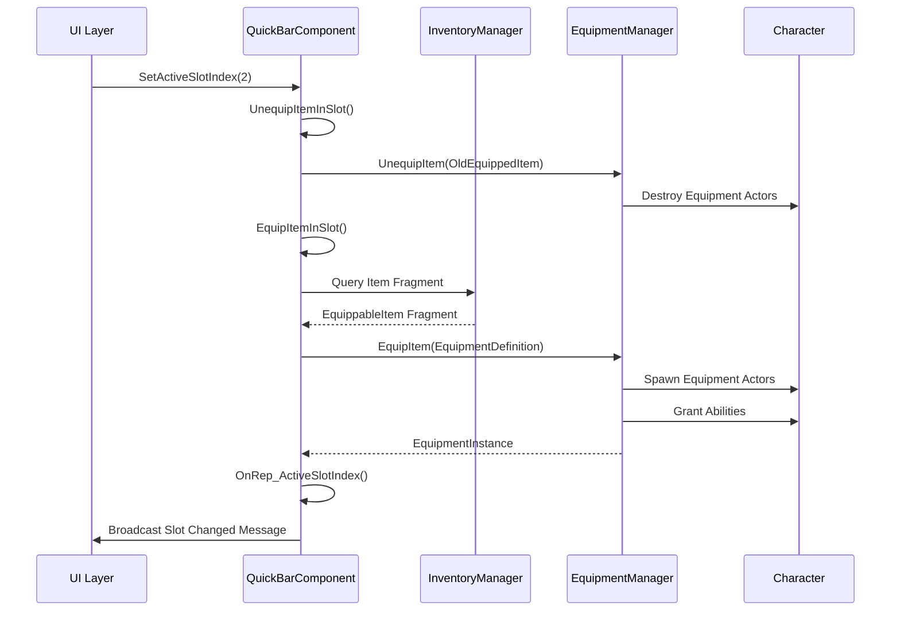

# UE5 Lyra 库存与物品系统详解

## 概述

库存系统是游戏开发中最基础也最重要的系统之一。Lyra 提供了一套灵活、可扩展的库存解决方案，支持物品定义与实例分离、网络同步、物品栈叠、装备集成等核心功能。本文将深入剖析 Lyra 库存系统的设计理念和实现细节，并提供完整的实战案例。

## 一、Lyra 库存系统架构

### 1.1 核心组件

Lyra 库存系统由三个核心部分组成：

```
┌─────────────────────────────────────────┐
│   ULyraInventoryManagerComponent       │  库存管理器
│   ├── FLyraInventoryList               │  库存列表（网络同步）
│   │   └── FLyraInventoryEntry[]        │  库存条目
│   │       ├── ItemInstance              │  物品实例
│   │       └── StackCount                │  堆叠数量
└─────────────────────────────────────────┘
            │
            ├── 管理
            ▼
┌─────────────────────────────────────────┐
│   ULyraInventoryItemInstance           │  物品实例（运行时）
│   ├── ItemDef (Class Reference)        │  物品定义引用
│   ├── StatTags (Runtime State)         │  运行时状态标签
│   └── Fragment Query API               │  片段查询接口
└─────────────────────────────────────────┘
            │
            ├── 引用
            ▼
┌─────────────────────────────────────────┐
│   ULyraInventoryItemDefinition         │  物品定义（静态配置）
│   ├── DisplayName                      │  显示名称
│   └── Fragments[]                      │  功能片段集合
│       ├── EquippableItem               │  可装备
│       ├── SetStats                     │  初始属性
│       ├── QuickBarIcon                 │  快捷栏图标
│       └── PickupIcon                   │  拾取图标
└─────────────────────────────────────────┘
```

### 1.2 设计理念：定义与实例分离

Lyra 采用了经典的 **Definition-Instance 模式**：

- **Definition（定义）**：存储静态配置数据，所有相同类型的物品共享同一个定义
- **Instance（实例）**：存储运行时状态，每个物品实例独立维护自己的数据

这种设计的优势：
- **内存效率**：静态数据只存储一份
- **易于修改**：修改定义会影响所有实例
- **灵活扩展**：Instance 可以存储个性化状态（耐久度、附魔等）
- **网络优化**：只同步类引用而非完整数据

## 二、ULyraInventoryManagerComponent 核心实现

### 2.1 组件结构

```cpp
// LyraInventoryManagerComponent.h
UCLASS(MinimalAPI, BlueprintType)
class ULyraInventoryManagerComponent : public UActorComponent
{
    GENERATED_BODY()

public:
    // 核心 API
    UFUNCTION(BlueprintCallable, BlueprintAuthorityOnly, Category=Inventory)
    ULyraInventoryItemInstance* AddItemDefinition(
        TSubclassOf<ULyraInventoryItemDefinition> ItemDef, 
        int32 StackCount = 1
    );

    UFUNCTION(BlueprintCallable, BlueprintAuthorityOnly, Category=Inventory)
    void AddItemInstance(ULyraInventoryItemInstance* ItemInstance);

    UFUNCTION(BlueprintCallable, BlueprintAuthorityOnly, Category=Inventory)
    void RemoveItemInstance(ULyraInventoryItemInstance* ItemInstance);

    UFUNCTION(BlueprintCallable, Category=Inventory, BlueprintPure=false)
    TArray<ULyraInventoryItemInstance*> GetAllItems() const;

    UFUNCTION(BlueprintCallable, Category=Inventory, BlueprintPure)
    ULyraInventoryItemInstance* FindFirstItemStackByDefinition(
        TSubclassOf<ULyraInventoryItemDefinition> ItemDef
    ) const;

    int32 GetTotalItemCountByDefinition(
        TSubclassOf<ULyraInventoryItemDefinition> ItemDef
    ) const;

    bool ConsumeItemsByDefinition(
        TSubclassOf<ULyraInventoryItemDefinition> ItemDef, 
        int32 NumToConsume
    );

private:
    UPROPERTY(Replicated)
    FLyraInventoryList InventoryList;
};
```

### 2.2 库存列表的网络同步

Lyra 使用 **Fast Array Serialization** 实现高效的网络同步：

```cpp
// FLyraInventoryList 的同步机制
USTRUCT(BlueprintType)
struct FLyraInventoryEntry : public FFastArraySerializerItem
{
    GENERATED_BODY()

    UPROPERTY()
    TObjectPtr<ULyraInventoryItemInstance> Instance = nullptr;

    UPROPERTY()
    int32 StackCount = 0;

    UPROPERTY(NotReplicated)
    int32 LastObservedCount = INDEX_NONE;  // 用于检测变化
};

USTRUCT(BlueprintType)
struct FLyraInventoryList : public FFastArraySerializer
{
    GENERATED_BODY()

    // Fast Array 同步回调
    void PreReplicatedRemove(const TArrayView<int32> RemovedIndices, int32 FinalSize);
    void PostReplicatedAdd(const TArrayView<int32> AddedIndices, int32 FinalSize);
    void PostReplicatedChange(const TArrayView<int32> ChangedIndices, int32 FinalSize);

    bool NetDeltaSerialize(FNetDeltaSerializeInfo& DeltaParms)
    {
        return FFastArraySerializer::FastArrayDeltaSerialize<
            FLyraInventoryEntry, FLyraInventoryList
        >(Entries, DeltaParms, *this);
    }

private:
    UPROPERTY()
    TArray<FLyraInventoryEntry> Entries;
};

template<>
struct TStructOpsTypeTraits<FLyraInventoryList> : 
    public TStructOpsTypeTraitsBase2<FLyraInventoryList>
{
    enum { WithNetDeltaSerializer = true };
};
```

**Fast Array Serialization 的优势**：
- 只同步发生变化的条目（Delta Compression）
- 自动触发客户端回调（Add/Remove/Change）
- 支持可靠的顺序保证
- 比传统 `UPROPERTY(Replicated)` 数组高效得多

### 2.3 添加物品的完整流程

```cpp
// LyraInventoryManagerComponent.cpp
ULyraInventoryItemInstance* ULyraInventoryManagerComponent::AddItemDefinition(
    TSubclassOf<ULyraInventoryItemDefinition> ItemDef, 
    int32 StackCount
)
{
    ULyraInventoryItemInstance* Result = nullptr;
    if (ItemDef != nullptr)
    {
        // 委托给 InventoryList 创建条目
        Result = InventoryList.AddEntry(ItemDef, StackCount);
        
        // 注册子对象用于网络同步
        if (IsUsingRegisteredSubObjectList() && IsReadyForReplication() && Result)
        {
            AddReplicatedSubObject(Result);
        }
    }
    return Result;
}

// FLyraInventoryList::AddEntry 的实现
ULyraInventoryItemInstance* FLyraInventoryList::AddEntry(
    TSubclassOf<ULyraInventoryItemDefinition> ItemDef, 
    int32 StackCount
)
{
    check(ItemDef != nullptr);
    check(OwnerComponent);

    AActor* OwningActor = OwnerComponent->GetOwner();
    check(OwningActor->HasAuthority());

    // 创建新条目
    FLyraInventoryEntry& NewEntry = Entries.AddDefaulted_GetRef();
    
    // 创建物品实例（Outer 设为 Actor）
    NewEntry.Instance = NewObject<ULyraInventoryItemInstance>(
        OwnerComponent->GetOwner()
    );
    NewEntry.Instance->SetItemDef(ItemDef);
    
    // 调用所有 Fragment 的初始化回调
    for (ULyraInventoryItemFragment* Fragment : 
         GetDefault<ULyraInventoryItemDefinition>(ItemDef)->Fragments)
    {
        if (Fragment != nullptr)
        {
            Fragment->OnInstanceCreated(NewEntry.Instance);
        }
    }
    
    NewEntry.StackCount = StackCount;
    
    // 标记 Fast Array 已修改
    MarkItemDirty(NewEntry);
    
    return NewEntry.Instance;
}
```

**关键点解析**：
1. **Authority Check**：只允许服务器添加物品
2. **Outer 设置**：ItemInstance 的 Outer 设为 Actor 而非 Component（避免 UE-127172 bug）
3. **Fragment 初始化**：遍历所有 Fragment 并调用 `OnInstanceCreated`
4. **网络同步**：通过 `MarkItemDirty` 触发网络更新

### 2.4 物品消耗系统

```cpp
bool ULyraInventoryManagerComponent::ConsumeItemsByDefinition(
    TSubclassOf<ULyraInventoryItemDefinition> ItemDef, 
    int32 NumToConsume
)
{
    AActor* OwningActor = GetOwner();
    if (!OwningActor || !OwningActor->HasAuthority())
    {
        return false;
    }

    // 逐个查找并消耗物品
    int32 TotalConsumed = 0;
    while (TotalConsumed < NumToConsume)
    {
        if (ULyraInventoryItemInstance* Instance = 
            FindFirstItemStackByDefinition(ItemDef))
        {
            InventoryList.RemoveEntry(Instance);
            ++TotalConsumed;
        }
        else
        {
            return false;  // 物品不足
        }
    }

    return TotalConsumed == NumToConsume;
}
```

**注意**：当前实现是 O(N²) 复杂度，Lyra 注释中提到未来会添加加速结构。

## 三、物品实例与定义的深度解析

### 3.1 ULyraInventoryItemDefinition：静态配置

```cpp
// LyraInventoryItemDefinition.h
UCLASS(Blueprintable, Const, Abstract)
class ULyraInventoryItemDefinition : public UObject
{
    GENERATED_BODY()

public:
    // 显示名称
    UPROPERTY(EditDefaultsOnly, BlueprintReadOnly, Category=Display)
    FText DisplayName;

    // 功能片段列表
    UPROPERTY(EditDefaultsOnly, BlueprintReadOnly, Category=Display, Instanced)
    TArray<TObjectPtr<ULyraInventoryItemFragment>> Fragments;

    // 查询特定类型的 Fragment
    const ULyraInventoryItemFragment* FindFragmentByClass(
        TSubclassOf<ULyraInventoryItemFragment> FragmentClass
    ) const;
};
```

**蓝图配置示例**：
```
BP_Item_HealthPotion (ULyraInventoryItemDefinition)
├── DisplayName: "生命药水"
└── Fragments:
    ├── UInventoryFragment_SetStats
    │   └── InitialItemStats:
    │       └── "Item.HealAmount" -> 50
    ├── UInventoryFragment_QuickBarIcon
    │   └── Icon: T_Potion_Icon
    └── UInventoryFragment_PickupIcon
        └── PickupIcon: T_Potion_Pickup
```

### 3.2 ULyraInventoryItemInstance：运行时状态

```cpp
// LyraInventoryItemInstance.h
UCLASS(BlueprintType)
class ULyraInventoryItemInstance : public UObject
{
    GENERATED_BODY()

public:
    // 支持网络同步
    virtual bool IsSupportedForNetworking() const override { return true; }

    // 运行时状态标签（可用于耐久度、附魔等）
    UFUNCTION(BlueprintCallable, BlueprintAuthorityOnly, Category=Inventory)
    void AddStatTagStack(FGameplayTag Tag, int32 StackCount);

    UFUNCTION(BlueprintCallable, BlueprintAuthorityOnly, Category=Inventory)
    void RemoveStatTagStack(FGameplayTag Tag, int32 StackCount);

    UFUNCTION(BlueprintCallable, Category=Inventory)
    int32 GetStatTagStackCount(FGameplayTag Tag) const;

    UFUNCTION(BlueprintCallable, Category=Inventory)
    bool HasStatTag(FGameplayTag Tag) const;

    // 获取物品定义
    TSubclassOf<ULyraInventoryItemDefinition> GetItemDef() const
    {
        return ItemDef;
    }

    // 查询 Fragment
    UFUNCTION(BlueprintCallable, BlueprintPure=false, 
              meta=(DeterminesOutputType=FragmentClass))
    const ULyraInventoryItemFragment* FindFragmentByClass(
        TSubclassOf<ULyraInventoryItemFragment> FragmentClass
    ) const;

private:
    // 运行时标签栈（复制）
    UPROPERTY(Replicated)
    FGameplayTagStackContainer StatTags;

    // 物品定义引用（复制）
    UPROPERTY(Replicated)
    TSubclassOf<ULyraInventoryItemDefinition> ItemDef;
};
```

**StatTags 的典型应用**：
```cpp
// 武器耐久度
ItemInstance->AddStatTagStack(
    FGameplayTag::RequestGameplayTag("Item.Durability"), 
    100
);

// 附魔属性
ItemInstance->AddStatTagStack(
    FGameplayTag::RequestGameplayTag("Item.Enchant.FireDamage"), 
    15
);

// 强化等级
ItemInstance->AddStatTagStack(
    FGameplayTag::RequestGameplayTag("Item.EnhanceLevel"), 
    5
);
```

### 3.3 Fragment 系统：模块化功能扩展

Fragment 是 Lyra 库存系统最强大的设计之一，允许通过组合不同的 Fragment 来定义物品的行为。

#### 基础 Fragment 类

```cpp
// 所有 Fragment 的基类
UCLASS(MinimalAPI, DefaultToInstanced, EditInlineNew, Abstract)
class ULyraInventoryItemFragment : public UObject
{
    GENERATED_BODY()

public:
    // 当物品实例被创建时调用
    virtual void OnInstanceCreated(ULyraInventoryItemInstance* Instance) const {}
};
```

#### 内置 Fragment 类型

**1. UInventoryFragment_SetStats：初始化属性**

```cpp
// InventoryFragment_SetStats.h
UCLASS()
class UInventoryFragment_SetStats : public ULyraInventoryItemFragment
{
    GENERATED_BODY()

protected:
    UPROPERTY(EditDefaultsOnly, Category=Equipment)
    TMap<FGameplayTag, int32> InitialItemStats;

public:
    virtual void OnInstanceCreated(ULyraInventoryItemInstance* Instance) const override;

    int32 GetItemStatByTag(FGameplayTag Tag) const;
};

// InventoryFragment_SetStats.cpp
void UInventoryFragment_SetStats::OnInstanceCreated(
    ULyraInventoryItemInstance* Instance
) const
{
    // 将配置的初始属性添加到实例
    for (const auto& KVP : InitialItemStats)
    {
        Instance->AddStatTagStack(KVP.Key, KVP.Value);
    }
}
```

**2. UInventoryFragment_EquippableItem：装备集成**

```cpp
// InventoryFragment_EquippableItem.h
UCLASS()
class UInventoryFragment_EquippableItem : public ULyraInventoryItemFragment
{
    GENERATED_BODY()

public:
    // 装备定义引用
    UPROPERTY(EditAnywhere, Category=Lyra)
    TSubclassOf<ULyraEquipmentDefinition> EquipmentDefinition;
};
```

使用示例：
```cpp
// 在 QuickBar 中装备物品
void ULyraQuickBarComponent::EquipItemInSlot()
{
    if (ULyraInventoryItemInstance* SlotItem = Slots[ActiveSlotIndex])
    {
        // 查询装备 Fragment
        if (const UInventoryFragment_EquippableItem* EquipInfo = 
            SlotItem->FindFragmentByClass<UInventoryFragment_EquippableItem>())
        {
            TSubclassOf<ULyraEquipmentDefinition> EquipDef = 
                EquipInfo->EquipmentDefinition;
            
            if (EquipDef != nullptr)
            {
                if (ULyraEquipmentManagerComponent* EquipmentManager = 
                    FindEquipmentManager())
                {
                    EquippedItem = EquipmentManager->EquipItem(EquipDef);
                    if (EquippedItem != nullptr)
                    {
                        EquippedItem->SetInstigator(SlotItem);
                    }
                }
            }
        }
    }
}
```

**3. 自定义 Fragment 示例**

```cpp
// 武器附魔 Fragment
UCLASS()
class UInventoryFragment_WeaponEnchantment : public ULyraInventoryItemFragment
{
    GENERATED_BODY()

public:
    UPROPERTY(EditDefaultsOnly, Category=Enchantment)
    FGameplayTag EnchantmentType;

    UPROPERTY(EditDefaultsOnly, Category=Enchantment)
    int32 EnchantmentPower;

    UPROPERTY(EditDefaultsOnly, Category=Enchantment)
    TSubclassOf<UGameplayEffect> EnchantmentEffect;

    virtual void OnInstanceCreated(ULyraInventoryItemInstance* Instance) const override
    {
        Super::OnInstanceCreated(Instance);
        
        // 添加附魔标签
        Instance->AddStatTagStack(EnchantmentType, EnchantmentPower);
    }
};
```

## 四、物品栈叠与数量管理

### 4.1 栈叠机制

Lyra 的当前实现中，每个 `FLyraInventoryEntry` 都包含：
- **Instance**：物品实例
- **StackCount**：堆叠数量

```cpp
USTRUCT(BlueprintType)
struct FLyraInventoryEntry : public FFastArraySerializerItem
{
    GENERATED_BODY()

    UPROPERTY()
    TObjectPtr<ULyraInventoryItemInstance> Instance = nullptr;

    UPROPERTY()
    int32 StackCount = 0;

    UPROPERTY(NotReplicated)
    int32 LastObservedCount = INDEX_NONE;
};
```

**注意**：当前 Lyra 实现中，`StackCount` 存储但未完全利用。每个物品都是独立的 Instance，没有真正的合并栈叠逻辑。

### 4.2 扩展：实现真正的栈叠系统

```cpp
// 自定义库存管理器，支持真正的栈叠
UCLASS()
class UMyInventoryManagerComponent : public ULyraInventoryManagerComponent
{
    GENERATED_BODY()

public:
    // 添加物品时自动合并堆叠
    virtual ULyraInventoryItemInstance* AddItemDefinition(
        TSubclassOf<ULyraInventoryItemDefinition> ItemDef, 
        int32 StackCount = 1
    ) override
    {
        if (ItemDef == nullptr)
        {
            return nullptr;
        }

        // 检查物品是否可堆叠
        int32 MaxStackSize = GetMaxStackSize(ItemDef);
        if (MaxStackSize <= 1)
        {
            // 不可堆叠，创建新实例
            return Super::AddItemDefinition(ItemDef, StackCount);
        }

        // 查找已存在的堆叠
        for (FLyraInventoryEntry& Entry : InventoryList.Entries)
        {
            if (Entry.Instance && Entry.Instance->GetItemDef() == ItemDef)
            {
                int32 SpaceLeft = MaxStackSize - Entry.StackCount;
                if (SpaceLeft > 0)
                {
                    int32 ToAdd = FMath::Min(StackCount, SpaceLeft);
                    Entry.StackCount += ToAdd;
                    StackCount -= ToAdd;
                    
                    MarkItemDirty(Entry);
                    
                    if (StackCount <= 0)
                    {
                        return Entry.Instance;
                    }
                }
            }
        }

        // 需要创建新堆叠
        while (StackCount > 0)
        {
            int32 ThisStackSize = FMath::Min(StackCount, MaxStackSize);
            Super::AddItemDefinition(ItemDef, ThisStackSize);
            StackCount -= ThisStackSize;
        }

        return FindFirstItemStackByDefinition(ItemDef);
    }

private:
    int32 GetMaxStackSize(TSubclassOf<ULyraInventoryItemDefinition> ItemDef) const
    {
        // 从 Fragment 中查询最大堆叠数
        const UMyInventoryFragment_Stackable* StackFragment = 
            GetDefault<ULyraInventoryItemDefinition>(ItemDef)->
                FindFragmentByClass<UMyInventoryFragment_Stackable>();
        
        return StackFragment ? StackFragment->MaxStackSize : 1;
    }
};

// 堆叠配置 Fragment
UCLASS()
class UMyInventoryFragment_Stackable : public ULyraInventoryItemFragment
{
    GENERATED_BODY()

public:
    UPROPERTY(EditDefaultsOnly, Category=Stacking)
    int32 MaxStackSize = 99;
};
```

### 4.3 消耗栈叠物品

```cpp
// 消耗指定数量的物品（支持跨堆叠）
bool UMyInventoryManagerComponent::ConsumeItemsByCount(
    TSubclassOf<ULyraInventoryItemDefinition> ItemDef,
    int32 Count
)
{
    // 先检查总数是否足够
    int32 TotalCount = GetTotalItemCountByDefinition(ItemDef);
    if (TotalCount < Count)
    {
        return false;
    }

    // 逐个堆叠消耗
    int32 RemainingToConsume = Count;
    for (int32 i = InventoryList.Entries.Num() - 1; i >= 0 && RemainingToConsume > 0; --i)
    {
        FLyraInventoryEntry& Entry = InventoryList.Entries[i];
        if (Entry.Instance && Entry.Instance->GetItemDef() == ItemDef)
        {
            if (Entry.StackCount <= RemainingToConsume)
            {
                // 消耗整个堆叠
                RemainingToConsume -= Entry.StackCount;
                InventoryList.RemoveEntry(Entry.Instance);
            }
            else
            {
                // 部分消耗
                Entry.StackCount -= RemainingToConsume;
                RemainingToConsume = 0;
                MarkItemDirty(Entry);
            }
        }
    }

    return RemainingToConsume == 0;
}

// 获取物品总数（所有堆叠）
int32 UMyInventoryManagerComponent::GetTotalItemCountByDefinition(
    TSubclassOf<ULyraInventoryItemDefinition> ItemDef
) const
{
    int32 TotalCount = 0;
    for (const FLyraInventoryEntry& Entry : InventoryList.Entries)
    {
        if (Entry.Instance && Entry.Instance->GetItemDef() == ItemDef)
        {
            TotalCount += Entry.StackCount;
        }
    }
    return TotalCount;
}
```

## 五、库存槽位系统：QuickBar 实现

Lyra 使用 `ULyraQuickBarComponent` 实现快捷栏槽位系统，这是一个优秀的槽位管理范例。

### 5.1 QuickBar 组件结构

```cpp
// LyraQuickBarComponent.h
UCLASS(Blueprintable, meta=(BlueprintSpawnableComponent))
class ULyraQuickBarComponent : public UControllerComponent
{
    GENERATED_BODY()

public:
    // 槽位导航
    UFUNCTION(BlueprintCallable, Category="Lyra")
    void CycleActiveSlotForward();

    UFUNCTION(BlueprintCallable, Category="Lyra")
    void CycleActiveSlotBackward();

    // 激活槽位
    UFUNCTION(Server, Reliable, BlueprintCallable, Category="Lyra")
    void SetActiveSlotIndex(int32 NewIndex);

    // 查询接口
    UFUNCTION(BlueprintCallable, BlueprintPure=false)
    TArray<ULyraInventoryItemInstance*> GetSlots() const { return Slots; }

    UFUNCTION(BlueprintCallable, BlueprintPure=false)
    int32 GetActiveSlotIndex() const { return ActiveSlotIndex; }

    UFUNCTION(BlueprintCallable, BlueprintPure=false)
    ULyraInventoryItemInstance* GetActiveSlotItem() const;

    UFUNCTION(BlueprintCallable, BlueprintPure=false)
    int32 GetNextFreeItemSlot() const;

    // 槽位操作
    UFUNCTION(BlueprintCallable, BlueprintAuthorityOnly)
    void AddItemToSlot(int32 SlotIndex, ULyraInventoryItemInstance* Item);

    UFUNCTION(BlueprintCallable, BlueprintAuthorityOnly)
    ULyraInventoryItemInstance* RemoveItemFromSlot(int32 SlotIndex);

protected:
    UPROPERTY()
    int32 NumSlots = 3;

private:
    UPROPERTY(ReplicatedUsing=OnRep_Slots)
    TArray<TObjectPtr<ULyraInventoryItemInstance>> Slots;

    UPROPERTY(ReplicatedUsing=OnRep_ActiveSlotIndex)
    int32 ActiveSlotIndex = -1;

    UPROPERTY()
    TObjectPtr<ULyraEquipmentInstance> EquippedItem;
};
```

### 5.2 槽位切换与装备联动

```cpp
// 设置激活槽位（服务器 RPC）
void ULyraQuickBarComponent::SetActiveSlotIndex_Implementation(int32 NewIndex)
{
    if (Slots.IsValidIndex(NewIndex) && (ActiveSlotIndex != NewIndex))
    {
        // 1. 卸下当前槽位的装备
        UnequipItemInSlot();

        // 2. 更新激活索引
        ActiveSlotIndex = NewIndex;

        // 3. 装备新槽位的物品
        EquipItemInSlot();

        // 4. 触发客户端回调
        OnRep_ActiveSlotIndex();
    }
}

// 装备槽位中的物品
void ULyraQuickBarComponent::EquipItemInSlot()
{
    check(Slots.IsValidIndex(ActiveSlotIndex));
    check(EquippedItem == nullptr);

    if (ULyraInventoryItemInstance* SlotItem = Slots[ActiveSlotIndex])
    {
        // 查询装备信息 Fragment
        if (const UInventoryFragment_EquippableItem* EquipInfo = 
            SlotItem->FindFragmentByClass<UInventoryFragment_EquippableItem>())
        {
            TSubclassOf<ULyraEquipmentDefinition> EquipDef = 
                EquipInfo->EquipmentDefinition;
            
            if (EquipDef != nullptr)
            {
                if (ULyraEquipmentManagerComponent* EquipmentManager = 
                    FindEquipmentManager())
                {
                    // 通过装备管理器装备
                    EquippedItem = EquipmentManager->EquipItem(EquipDef);
                    if (EquippedItem != nullptr)
                    {
                        // 将物品实例设为装备的 Instigator
                        EquippedItem->SetInstigator(SlotItem);
                    }
                }
            }
        }
    }
}

// 卸下槽位中的装备
void ULyraQuickBarComponent::UnequipItemInSlot()
{
    if (ULyraEquipmentManagerComponent* EquipmentManager = FindEquipmentManager())
    {
        if (EquippedItem != nullptr)
        {
            EquipmentManager->UnequipItem(EquippedItem);
            EquippedItem = nullptr;
        }
    }
}
```

### 5.3 网络同步与 UI 更新

```cpp
// 槽位变化时的客户端回调
void ULyraQuickBarComponent::OnRep_Slots()
{
    // 广播消息通知 UI 更新
    FLyraQuickBarSlotsChangedMessage Message;
    Message.Owner = GetOwner();
    Message.Slots = Slots;

    UGameplayMessageSubsystem& MessageSystem = 
        UGameplayMessageSubsystem::Get(this);
    MessageSystem.BroadcastMessage(
        TAG_Lyra_QuickBar_Message_SlotsChanged, 
        Message
    );
}

// 激活槽位变化时的客户端回调
void ULyraQuickBarComponent::OnRep_ActiveSlotIndex()
{
    FLyraQuickBarActiveIndexChangedMessage Message;
    Message.Owner = GetOwner();
    Message.ActiveIndex = ActiveSlotIndex;

    UGameplayMessageSubsystem& MessageSystem = 
        UGameplayMessageSubsystem::Get(this);
    MessageSystem.BroadcastMessage(
        TAG_Lyra_QuickBar_Message_ActiveIndexChanged, 
        Message
    );
}
```

### 5.4 扩展：自定义槽位系统

```cpp
// 装备槽位系统（武器/头盔/护甲等）
UCLASS()
class UMyEquipmentSlotComponent : public UActorComponent
{
    GENERATED_BODY()

public:
    // 定义槽位类型
    UENUM(BlueprintType)
    enum class EEquipmentSlotType : uint8
    {
        Weapon,
        Helmet,
        Chest,
        Legs,
        Boots,
        Accessory1,
        Accessory2
    };

    // 装备物品到指定槽位
    UFUNCTION(BlueprintCallable, BlueprintAuthorityOnly)
    bool EquipItemToSlot(
        EEquipmentSlotType SlotType, 
        ULyraInventoryItemInstance* Item
    );

    // 卸下指定槽位的物品
    UFUNCTION(BlueprintCallable, BlueprintAuthorityOnly)
    ULyraInventoryItemInstance* UnequipSlot(EEquipmentSlotType SlotType);

    // 获取槽位物品
    UFUNCTION(BlueprintCallable, BlueprintPure)
    ULyraInventoryItemInstance* GetSlotItem(EEquipmentSlotType SlotType) const;

    // 检查物品是否可以装备到槽位
    UFUNCTION(BlueprintCallable, BlueprintPure)
    bool CanEquipToSlot(
        EEquipmentSlotType SlotType, 
        ULyraInventoryItemInstance* Item
    ) const;

private:
    UPROPERTY(ReplicatedUsing=OnRep_EquipmentSlots)
    TMap<EEquipmentSlotType, TObjectPtr<ULyraInventoryItemInstance>> EquipmentSlots;

    UFUNCTION()
    void OnRep_EquipmentSlots();
};

// 实现
bool UMyEquipmentSlotComponent::EquipItemToSlot(
    EEquipmentSlotType SlotType,
    ULyraInventoryItemInstance* Item
)
{
    if (!GetOwner()->HasAuthority() || Item == nullptr)
    {
        return false;
    }

    // 检查物品是否符合槽位要求
    if (!CanEquipToSlot(SlotType, Item))
    {
        return false;
    }

    // 卸下当前装备
    if (EquipmentSlots.Contains(SlotType))
    {
        UnequipSlot(SlotType);
    }

    // 装备新物品
    EquipmentSlots.Add(SlotType, Item);
    
    // 应用装备效果
    ApplyEquipmentEffects(SlotType, Item);
    
    OnRep_EquipmentSlots();
    return true;
}

bool UMyEquipmentSlotComponent::CanEquipToSlot(
    EEquipmentSlotType SlotType,
    ULyraInventoryItemInstance* Item
) const
{
    // 查询物品的槽位限制 Fragment
    const UMyInventoryFragment_SlotRestriction* SlotFragment = 
        Item->FindFragmentByClass<UMyInventoryFragment_SlotRestriction>();
    
    if (SlotFragment == nullptr)
    {
        return false;
    }

    return SlotFragment->AllowedSlots.Contains(SlotType);
}

// 槽位限制 Fragment
UCLASS()
class UMyInventoryFragment_SlotRestriction : public ULyraInventoryItemFragment
{
    GENERATED_BODY()

public:
    UPROPERTY(EditDefaultsOnly, Category=Slot)
    TArray<UMyEquipmentSlotComponent::EEquipmentSlotType> AllowedSlots;
};
```

## 六、拾取与丢弃机制

### 6.1 IPickupable 接口

Lyra 使用接口模式实现拾取系统：

```cpp
// IPickupable.h

// 拾取模板（基于定义）
USTRUCT(BlueprintType)
struct FPickupTemplate
{
    GENERATED_BODY()

    UPROPERTY(EditAnywhere)
    int32 StackCount = 1;

    UPROPERTY(EditAnywhere)
    TSubclassOf<ULyraInventoryItemDefinition> ItemDef;
};

// 拾取实例（基于已有实例）
USTRUCT(BlueprintType)
struct FPickupInstance
{
    GENERATED_BODY()

    UPROPERTY(EditAnywhere, BlueprintReadOnly)
    TObjectPtr<ULyraInventoryItemInstance> Item = nullptr;
};

// 拾取数据
USTRUCT(BlueprintType)
struct FInventoryPickup
{
    GENERATED_BODY()

    UPROPERTY(EditAnywhere, BlueprintReadOnly)
    TArray<FPickupInstance> Instances;

    UPROPERTY(EditAnywhere, BlueprintReadOnly)
    TArray<FPickupTemplate> Templates;
};

// 可拾取接口
UINTERFACE(MinimalAPI, BlueprintType, meta=(CannotImplementInterfaceInBlueprint))
class UPickupable : public UInterface
{
    GENERATED_BODY()
};

class IPickupable
{
    GENERATED_BODY()

public:
    UFUNCTION(BlueprintCallable)
    virtual FInventoryPickup GetPickupInventory() const = 0;
};
```

### 6.2 拾取工具类

```cpp
// IPickupable.cpp
UCLASS()
class UPickupableStatics : public UBlueprintFunctionLibrary
{
    GENERATED_BODY()

public:
    // 从 Actor 获取可拾取接口
    UFUNCTION(BlueprintPure)
    static TScriptInterface<IPickupable> GetFirstPickupableFromActor(AActor* Actor)
    {
        // 检查 Actor 本身是否实现接口
        TScriptInterface<IPickupable> PickupableActor(Actor);
        if (PickupableActor)
        {
            return PickupableActor;
        }

        // 检查 Actor 的组件是否实现接口
        TArray<UActorComponent*> PickupableComponents = 
            Actor ? Actor->GetComponentsByInterface(UPickupable::StaticClass()) 
                  : TArray<UActorComponent*>();
        
        if (PickupableComponents.Num() > 0)
        {
            return TScriptInterface<IPickupable>(PickupableComponents[0]);
        }

        return TScriptInterface<IPickupable>();
    }

    // 将拾取物添加到库存
    UFUNCTION(BlueprintCallable, BlueprintAuthorityOnly)
    static void AddPickupToInventory(
        ULyraInventoryManagerComponent* InventoryComponent,
        TScriptInterface<IPickupable> Pickup
    )
    {
        if (InventoryComponent && Pickup)
        {
            const FInventoryPickup& PickupInventory = 
                Pickup->GetPickupInventory();

            // 添加模板物品
            for (const FPickupTemplate& Template : PickupInventory.Templates)
            {
                InventoryComponent->AddItemDefinition(
                    Template.ItemDef, 
                    Template.StackCount
                );
            }

            // 添加实例物品
            for (const FPickupInstance& Instance : PickupInventory.Instances)
            {
                InventoryComponent->AddItemInstance(Instance.Item);
            }
        }
    }
};
```

### 6.3 实战：可拾取世界物品 Actor

```cpp
// MyPickupActor.h
UCLASS()
class AMyPickupActor : public AActor, public IPickupable
{
    GENERATED_BODY()

public:
    AMyPickupActor();

    // 实现 IPickupable 接口
    virtual FInventoryPickup GetPickupInventory() const override;

    // 拾取交互
    UFUNCTION(BlueprintCallable)
    void OnPickedUp(AActor* PickupInstigator);

protected:
    // 物品配置
    UPROPERTY(EditAnywhere, BlueprintReadWrite, Category="Pickup")
    TSubclassOf<ULyraInventoryItemDefinition> ItemDefinition;

    UPROPERTY(EditAnywhere, BlueprintReadWrite, Category="Pickup")
    int32 ItemCount = 1;

    // 视觉组件
    UPROPERTY(VisibleAnywhere, BlueprintReadOnly, Category="Pickup")
    UStaticMeshComponent* MeshComponent;

    UPROPERTY(VisibleAnywhere, BlueprintReadOnly, Category="Pickup")
    USphereComponent* CollisionComponent;

    // 拾取音效和特效
    UPROPERTY(EditAnywhere, Category="Pickup")
    USoundBase* PickupSound;

    UPROPERTY(EditAnywhere, Category="Pickup")
    UNiagaraSystem* PickupEffect;

    // 重生配置
    UPROPERTY(EditAnywhere, Category="Pickup")
    bool bRespawn = true;

    UPROPERTY(EditAnywhere, Category="Pickup")
    float RespawnTime = 30.0f;

private:
    UFUNCTION()
    void OnOverlapBegin(
        UPrimitiveComponent* OverlappedComp,
        AActor* OtherActor,
        UPrimitiveComponent* OtherComp,
        int32 OtherBodyIndex,
        bool bFromSweep,
        const FHitResult& SweepResult
    );

    void RespawnPickup();

    FTimerHandle RespawnTimerHandle;
    bool bIsPickedUp = false;
};

// MyPickupActor.cpp
AMyPickupActor::AMyPickupActor()
{
    // 创建组件
    CollisionComponent = CreateDefaultSubobject<USphereComponent>(TEXT("CollisionSphere"));
    RootComponent = CollisionComponent;
    CollisionComponent->SetSphereRadius(100.0f);
    CollisionComponent->SetCollisionProfileName(TEXT("OverlapAllDynamic"));

    MeshComponent = CreateDefaultSubobject<UStaticMeshComponent>(TEXT("Mesh"));
    MeshComponent->SetupAttachment(CollisionComponent);
    MeshComponent->SetCollisionEnabled(ECollisionEnabled::NoCollision);

    // 绑定重叠事件
    CollisionComponent->OnComponentBeginOverlap.AddDynamic(
        this, 
        &AMyPickupActor::OnOverlapBegin
    );

    // 启用复制
    bReplicates = true;
    SetReplicateMovement(false);
}

FInventoryPickup AMyPickupActor::GetPickupInventory() const
{
    FInventoryPickup Pickup;
    
    if (ItemDefinition != nullptr)
    {
        FPickupTemplate Template;
        Template.ItemDef = ItemDefinition;
        Template.StackCount = ItemCount;
        Pickup.Templates.Add(Template);
    }
    
    return Pickup;
}

void AMyPickupActor::OnOverlapBegin(
    UPrimitiveComponent* OverlappedComp,
    AActor* OtherActor,
    UPrimitiveComponent* OtherComp,
    int32 OtherBodyIndex,
    bool bFromSweep,
    const FHitResult& SweepResult
)
{
    if (bIsPickedUp || !HasAuthority())
    {
        return;
    }

    // 查找玩家的库存组件
    ULyraInventoryManagerComponent* InventoryComp = 
        OtherActor->FindComponentByClass<ULyraInventoryManagerComponent>();
    
    if (InventoryComp == nullptr)
    {
        // 尝试从 Pawn 的 Controller 获取
        if (APawn* Pawn = Cast<APawn>(OtherActor))
        {
            if (AController* Controller = Pawn->GetController())
            {
                InventoryComp = Controller->FindComponentByClass<
                    ULyraInventoryManagerComponent
                >();
            }
        }
    }

    if (InventoryComp)
    {
        OnPickedUp(OtherActor);
    }
}

void AMyPickupActor::OnPickedUp(AActor* PickupInstigator)
{
    if (!HasAuthority() || bIsPickedUp)
    {
        return;
    }

    // 查找库存组件
    ULyraInventoryManagerComponent* InventoryComp = nullptr;
    
    if (APawn* Pawn = Cast<APawn>(PickupInstigator))
    {
        if (AController* Controller = Pawn->GetController())
        {
            InventoryComp = Controller->FindComponentByClass<
                ULyraInventoryManagerComponent
            >();
        }
    }

    if (InventoryComp == nullptr)
    {
        return;
    }

    // 添加到库存
    TScriptInterface<IPickupable> PickupInterface(this);
    UPickupableStatics::AddPickupToInventory(InventoryComp, PickupInterface);

    // 播放特效
    if (PickupSound)
    {
        UGameplayStatics::PlaySoundAtLocation(
            this, 
            PickupSound, 
            GetActorLocation()
        );
    }

    if (PickupEffect)
    {
        UNiagaraFunctionLibrary::SpawnSystemAtLocation(
            this,
            PickupEffect,
            GetActorLocation(),
            GetActorRotation()
        );
    }

    // 隐藏物品
    bIsPickedUp = true;
    SetActorHiddenInGame(true);
    SetActorEnableCollision(false);

    // 设置重生计时器
    if (bRespawn)
    {
        GetWorld()->GetTimerManager().SetTimer(
            RespawnTimerHandle,
            this,
            &AMyPickupActor::RespawnPickup,
            RespawnTime,
            false
        );
    }
    else
    {
        Destroy();
    }
}

void AMyPickupActor::RespawnPickup()
{
    bIsPickedUp = false;
    SetActorHiddenInGame(false);
    SetActorEnableCollision(true);
}
```

### 6.4 物品丢弃系统

```cpp
// 丢弃物品到世界
UCLASS()
class UMyInventoryFunctionLibrary : public UBlueprintFunctionLibrary
{
    GENERATED_BODY()

public:
    // 从库存丢弃物品到世界
    UFUNCTION(BlueprintCallable, BlueprintAuthorityOnly, 
              meta=(WorldContext="WorldContextObject"))
    static AMyPickupActor* DropItemFromInventory(
        UObject* WorldContextObject,
        ULyraInventoryManagerComponent* InventoryComponent,
        ULyraInventoryItemInstance* ItemInstance,
        const FVector& Location,
        const FRotator& Rotation,
        const FVector& ImpulseDirection = FVector::ZeroVector
    );
};

AMyPickupActor* UMyInventoryFunctionLibrary::DropItemFromInventory(
    UObject* WorldContextObject,
    ULyraInventoryManagerComponent* InventoryComponent,
    ULyraInventoryItemInstance* ItemInstance,
    const FVector& Location,
    const FRotator& Rotation,
    const FVector& ImpulseDirection
)
{
    UWorld* World = GEngine->GetWorldFromContextObject(
        WorldContextObject, 
        EGetWorldErrorMode::LogAndReturnNull
    );
    
    if (!World || !InventoryComponent || !ItemInstance)
    {
        return nullptr;
    }

    // 从库存移除物品
    InventoryComponent->RemoveItemInstance(ItemInstance);

    // 在世界中生成拾取物
    FActorSpawnParameters SpawnParams;
    SpawnParams.SpawnCollisionHandlingOverride = 
        ESpawnActorCollisionHandlingMethod::AdjustIfPossibleButAlwaysSpawn;

    AMyPickupActor* PickupActor = World->SpawnActor<AMyPickupActor>(
        AMyPickupActor::StaticClass(),
        Location,
        Rotation,
        SpawnParams
    );

    if (PickupActor)
    {
        // 配置拾取物
        PickupActor->ItemDefinition = ItemInstance->GetItemDef();
        PickupActor->ItemCount = 1;
        PickupActor->bRespawn = false;

        // 应用抛出冲量
        if (UStaticMeshComponent* Mesh = PickupActor->MeshComponent)
        {
            Mesh->SetSimulatePhysics(true);
            Mesh->AddImpulse(ImpulseDirection * 500.0f, NAME_None, true);
        }
    }

    return PickupActor;
}
```

## 七、物品分类与过滤

### 7.1 基于 Gameplay Tag 的分类系统

```cpp
// 物品类别 Fragment
UCLASS()
class UInventoryFragment_ItemCategory : public ULyraInventoryItemFragment
{
    GENERATED_BODY()

public:
    UPROPERTY(EditDefaultsOnly, Category=Category)
    FGameplayTagContainer ItemCategories;

    // 典型类别：
    // Item.Category.Weapon
    // Item.Category.Weapon.Melee
    // Item.Category.Weapon.Ranged
    // Item.Category.Consumable
    // Item.Category.Consumable.Potion
    // Item.Category.Quest
    // Item.Category.Material
};

// 物品品质 Fragment
UCLASS()
class UInventoryFragment_ItemQuality : public ULyraInventoryItemFragment
{
    GENERATED_BODY()

public:
    UPROPERTY(EditDefaultsOnly, Category=Quality)
    FGameplayTag QualityTag;

    // 典型品质：
    // Item.Quality.Common
    // Item.Quality.Uncommon
    // Item.Quality.Rare
    // Item.Quality.Epic
    // Item.Quality.Legendary

    UPROPERTY(EditDefaultsOnly, Category=Quality)
    FLinearColor QualityColor;
};
```

### 7.2 高级过滤系统

```cpp
// 物品过滤器基类
UCLASS(Abstract, Blueprintable)
class UMyInventoryFilter : public UObject
{
    GENERATED_BODY()

public:
    UFUNCTION(BlueprintNativeEvent, Category=Filter)
    bool PassesFilter(ULyraInventoryItemInstance* Item) const;

    virtual bool PassesFilter_Implementation(
        ULyraInventoryItemInstance* Item
    ) const
    {
        return true;
    }
};

// 标签过滤器
UCLASS()
class UMyInventoryFilter_HasTag : public UMyInventoryFilter
{
    GENERATED_BODY()

public:
    UPROPERTY(EditAnywhere, BlueprintReadWrite, Category=Filter)
    FGameplayTag RequiredTag;

    UPROPERTY(EditAnywhere, BlueprintReadWrite, Category=Filter)
    bool bRequireExactMatch = false;

    virtual bool PassesFilter_Implementation(
        ULyraInventoryItemInstance* Item
    ) const override
    {
        if (!Item)
        {
            return false;
        }

        TSubclassOf<ULyraInventoryItemDefinition> ItemDef = Item->GetItemDef();
        if (!ItemDef)
        {
            return false;
        }

        const UInventoryFragment_ItemCategory* CategoryFragment = 
            GetDefault<ULyraInventoryItemDefinition>(ItemDef)->
                FindFragmentByClass<UInventoryFragment_ItemCategory>();

        if (!CategoryFragment)
        {
            return false;
        }

        if (bRequireExactMatch)
        {
            return CategoryFragment->ItemCategories.HasTagExact(RequiredTag);
        }
        else
        {
            return CategoryFragment->ItemCategories.HasTag(RequiredTag);
        }
    }
};

// 品质过滤器
UCLASS()
class UMyInventoryFilter_MinQuality : public UMyInventoryFilter
{
    GENERATED_BODY()

public:
    UPROPERTY(EditAnywhere, BlueprintReadWrite, Category=Filter)
    int32 MinQualityLevel = 0;

    virtual bool PassesFilter_Implementation(
        ULyraInventoryItemInstance* Item
    ) const override
    {
        if (!Item)
        {
            return false;
        }

        const UInventoryFragment_ItemQuality* QualityFragment = 
            GetDefault<ULyraInventoryItemDefinition>(Item->GetItemDef())->
                FindFragmentByClass<UInventoryFragment_ItemQuality>();

        if (!QualityFragment)
        {
            return false;
        }

        int32 QualityLevel = GetQualityLevel(QualityFragment->QualityTag);
        return QualityLevel >= MinQualityLevel;
    }

private:
    int32 GetQualityLevel(FGameplayTag QualityTag) const
    {
        static TMap<FName, int32> QualityLevels = {
            {"Item.Quality.Common", 0},
            {"Item.Quality.Uncommon", 1},
            {"Item.Quality.Rare", 2},
            {"Item.Quality.Epic", 3},
            {"Item.Quality.Legendary", 4}
        };

        int32* Level = QualityLevels.Find(QualityTag.GetTagName());
        return Level ? *Level : 0;
    }
};

// 组合过滤器
UCLASS()
class UMyInventoryFilter_And : public UMyInventoryFilter
{
    GENERATED_BODY()

public:
    UPROPERTY(EditAnywhere, BlueprintReadWrite, Instanced, Category=Filter)
    TArray<TObjectPtr<UMyInventoryFilter>> SubFilters;

    virtual bool PassesFilter_Implementation(
        ULyraInventoryItemInstance* Item
    ) const override
    {
        for (const UMyInventoryFilter* Filter : SubFilters)
        {
            if (Filter && !Filter->PassesFilter(Item))
            {
                return false;
            }
        }
        return true;
    }
};

// 使用示例
TArray<ULyraInventoryItemInstance*> UMyInventoryManagerComponent::GetFilteredItems(
    UMyInventoryFilter* Filter
) const
{
    TArray<ULyraInventoryItemInstance*> FilteredItems;
    
    for (ULyraInventoryItemInstance* Item : GetAllItems())
    {
        if (Filter->PassesFilter(Item))
        {
            FilteredItems.Add(Item);
        }
    }
    
    return FilteredItems;
}
```

### 7.3 排序系统

```cpp
// 物品排序器
UENUM(BlueprintType)
enum class EInventorySortOrder : uint8
{
    Name,
    Quality,
    Category,
    StackSize,
    RecentlyAdded
};

class UMyInventoryFunctionLibrary
{
public:
    // 对物品列表排序
    static void SortItems(
        TArray<ULyraInventoryItemInstance*>& Items,
        EInventorySortOrder SortOrder,
        bool bDescending = false
    )
    {
        switch (SortOrder)
        {
        case EInventorySortOrder::Name:
            Items.Sort([bDescending](
                const ULyraInventoryItemInstance& A,
                const ULyraInventoryItemInstance& B
            ) {
                const FText NameA = GetDefault<ULyraInventoryItemDefinition>(
                    A.GetItemDef()
                )->DisplayName;
                const FText NameB = GetDefault<ULyraInventoryItemDefinition>(
                    B.GetItemDef()
                )->DisplayName;
                
                bool Result = NameA.CompareTo(NameB) < 0;
                return bDescending ? !Result : Result;
            });
            break;

        case EInventorySortOrder::Quality:
            Items.Sort([bDescending](
                const ULyraInventoryItemInstance& A,
                const ULyraInventoryItemInstance& B
            ) {
                int32 QualityA = GetItemQualityLevel(&A);
                int32 QualityB = GetItemQualityLevel(&B);
                
                bool Result = QualityA < QualityB;
                return bDescending ? !Result : Result;
            });
            break;

        // 其他排序类型...
        }
    }

private:
    static int32 GetItemQualityLevel(const ULyraInventoryItemInstance* Item)
    {
        const UInventoryFragment_ItemQuality* QualityFragment = 
            GetDefault<ULyraInventoryItemDefinition>(Item->GetItemDef())->
                FindFragmentByClass<UInventoryFragment_ItemQuality>();
        
        if (!QualityFragment)
        {
            return 0;
        }

        // 映射品质标签到数值
        static TMap<FName, int32> QualityMap = {
            {FName("Item.Quality.Common"), 0},
            {FName("Item.Quality.Uncommon"), 1},
            {FName("Item.Quality.Rare"), 2},
            {FName("Item.Quality.Epic"), 3},
            {FName("Item.Quality.Legendary"), 4}
        };

        return QualityMap.FindRef(QualityFragment->QualityTag.GetTagName());
    }
};
```

## 八、网络同步策略

### 8.1 复制架构

Lyra 库存系统的网络同步分为三个层次：

```
┌─────────────────────────────────────────────┐
│  ULyraInventoryManagerComponent (Replicated) │
│  ├── bReplicates = true                     │
│  └── DOREPLIFETIME(InventoryList)           │
└─────────────────────────────────────────────┘
                   │
                   │ Fast Array Serialization
                   ▼
┌─────────────────────────────────────────────┐
│  FLyraInventoryList (FastArraySerializer)   │
│  ├── NetDeltaSerialize (Delta Compression)  │
│  └── Entries[] (FLyraInventoryEntry)        │
└─────────────────────────────────────────────┘
                   │
                   │ ReplicatedSubObject
                   ▼
┌─────────────────────────────────────────────┐
│  ULyraInventoryItemInstance (SubObject)     │
│  ├── IsSupportedForNetworking() = true      │
│  ├── DOREPLIFETIME(ItemDef)                 │
│  └── DOREPLIFETIME(StatTags)                │
└─────────────────────────────────────────────┘
```

### 8.2 子对象复制实现

```cpp
// 注册复制子对象
void ULyraInventoryManagerComponent::ReadyForReplication()
{
    Super::ReadyForReplication();

    // 注册所有已存在的物品实例
    if (IsUsingRegisteredSubObjectList())
    {
        for (const FLyraInventoryEntry& Entry : InventoryList.Entries)
        {
            ULyraInventoryItemInstance* Instance = Entry.Instance;
            if (IsValid(Instance))
            {
                AddReplicatedSubObject(Instance);
            }
        }
    }
}

// 手动复制子对象（兼容旧版本）
bool ULyraInventoryManagerComponent::ReplicateSubobjects(
    UActorChannel* Channel,
    FOutBunch* Bunch,
    FReplicationFlags* RepFlags
)
{
    bool WroteSomething = Super::ReplicateSubobjects(Channel, Bunch, RepFlags);

    for (FLyraInventoryEntry& Entry : InventoryList.Entries)
    {
        ULyraInventoryItemInstance* Instance = Entry.Instance;
        if (Instance && IsValid(Instance))
        {
            WroteSomething |= Channel->ReplicateSubobject(
                Instance, 
                *Bunch, 
                *RepFlags
            );
        }
    }

    return WroteSomething;
}
```

### 8.3 客户端同步回调

```cpp
// Fast Array 的客户端回调
void FLyraInventoryList::PreReplicatedRemove(
    const TArrayView<int32> RemovedIndices,
    int32 FinalSize
)
{
    // 物品被移除时触发
    for (int32 Index : RemovedIndices)
    {
        FLyraInventoryEntry& Stack = Entries[Index];
        BroadcastChangeMessage(Stack, Stack.StackCount, 0);
        Stack.LastObservedCount = 0;
    }
}

void FLyraInventoryList::PostReplicatedAdd(
    const TArrayView<int32> AddedIndices,
    int32 FinalSize
)
{
    // 物品被添加时触发
    for (int32 Index : AddedIndices)
    {
        FLyraInventoryEntry& Stack = Entries[Index];
        BroadcastChangeMessage(Stack, 0, Stack.StackCount);
        Stack.LastObservedCount = Stack.StackCount;
    }
}

void FLyraInventoryList::PostReplicatedChange(
    const TArrayView<int32> ChangedIndices,
    int32 FinalSize
)
{
    // 物品数量变化时触发
    for (int32 Index : ChangedIndices)
    {
        FLyraInventoryEntry& Stack = Entries[Index];
        check(Stack.LastObservedCount != INDEX_NONE);
        BroadcastChangeMessage(
            Stack, 
            Stack.LastObservedCount, 
            Stack.StackCount
        );
        Stack.LastObservedCount = Stack.StackCount;
    }
}

// 广播库存变化消息
void FLyraInventoryList::BroadcastChangeMessage(
    FLyraInventoryEntry& Entry,
    int32 OldCount,
    int32 NewCount
)
{
    FLyraInventoryChangeMessage Message;
    Message.InventoryOwner = OwnerComponent;
    Message.Instance = Entry.Instance;
    Message.NewCount = NewCount;
    Message.Delta = NewCount - OldCount;

    UGameplayMessageSubsystem& MessageSystem = 
        UGameplayMessageSubsystem::Get(OwnerComponent->GetWorld());
    MessageSystem.BroadcastMessage(
        TAG_Lyra_Inventory_Message_StackChanged, 
        Message
    );
}
```

### 8.4 网络性能优化

```cpp
// 批量添加物品优化
void UMyInventoryManagerComponent::AddItemsBatch(
    const TArray<FPickupTemplate>& Items
)
{
    if (!HasAuthority())
    {
        return;
    }

    // 临时禁用网络更新
    SetNetDormancy(DORM_DormantAll);

    // 批量添加
    for (const FPickupTemplate& Item : Items)
    {
        AddItemDefinition(Item.ItemDef, Item.StackCount);
    }

    // 恢复网络更新（一次性同步所有变化）
    SetNetDormancy(DORM_Awake);
    FlushNetDormancy();
}

// 延迟网络更新
void UMyInventoryManagerComponent::BeginBatchUpdate()
{
    if (HasAuthority())
    {
        bBatchUpdateInProgress = true;
    }
}

void UMyInventoryManagerComponent::EndBatchUpdate()
{
    if (HasAuthority() && bBatchUpdateInProgress)
    {
        bBatchUpdateInProgress = false;
        
        // 标记整个库存列表为脏
        MarkArrayDirty();
    }
}

// 使用示例
void AMyCharacter::LoadInventoryFromSave(const FSaveData& SaveData)
{
    UMyInventoryManagerComponent* InventoryComp = 
        GetInventoryManagerComponent();
    
    // 开始批量更新
    InventoryComp->BeginBatchUpdate();

    // 加载所有物品
    for (const FItemSaveData& ItemData : SaveData.Items)
    {
        InventoryComp->AddItemDefinition(
            ItemData.ItemDef, 
            ItemData.Count
        );
    }

    // 结束批量更新（触发一次网络同步）
    InventoryComp->EndBatchUpdate();
}
```

## 九、与装备系统集成

### 9.1 装备流程



### 9.2 装备集成代码

```cpp
// 查询物品的装备定义
TSubclassOf<ULyraEquipmentDefinition> GetEquipmentDefinitionFromItem(
    ULyraInventoryItemInstance* Item
)
{
    if (!Item)
    {
        return nullptr;
    }

    const UInventoryFragment_EquippableItem* EquipFragment = 
        Item->FindFragmentByClass<UInventoryFragment_EquippableItem>();
    
    return EquipFragment ? EquipFragment->EquipmentDefinition : nullptr;
}

// 从库存装备物品
ULyraEquipmentInstance* EquipItemFromInventory(
    ULyraInventoryItemInstance* Item,
    ULyraEquipmentManagerComponent* EquipmentManager
)
{
    TSubclassOf<ULyraEquipmentDefinition> EquipDef = 
        GetEquipmentDefinitionFromItem(Item);
    
    if (!EquipDef || !EquipmentManager)
    {
        return nullptr;
    }

    ULyraEquipmentInstance* EquipmentInstance = 
        EquipmentManager->EquipItem(EquipDef);
    
    if (EquipmentInstance)
    {
        // 将库存物品设为装备的 Instigator
        EquipmentInstance->SetInstigator(Item);
    }

    return EquipmentInstance;
}

// 获取装备关联的库存物品
ULyraInventoryItemInstance* GetInventoryItemFromEquipment(
    ULyraEquipmentInstance* EquipmentInstance
)
{
    return EquipmentInstance ? 
        Cast<ULyraInventoryItemInstance>(EquipmentInstance->GetInstigator()) : 
        nullptr;
}
```

### 9.3 双向绑定示例

```cpp
// 扩展装备系统以支持库存绑定
UCLASS()
class UMyEquipmentInstance : public ULyraEquipmentInstance
{
    GENERATED_BODY()

public:
    // 获取关联的库存物品
    UFUNCTION(BlueprintCallable, BlueprintPure)
    ULyraInventoryItemInstance* GetSourceInventoryItem() const
    {
        return Cast<ULyraInventoryItemInstance>(GetInstigator());
    }

    // 应用库存物品的属性到装备
    void ApplyInventoryStats()
    {
        ULyraInventoryItemInstance* SourceItem = GetSourceInventoryItem();
        if (!SourceItem)
        {
            return;
        }

        // 读取物品的耐久度
        int32 Durability = SourceItem->GetStatTagStackCount(
            FGameplayTag::RequestGameplayTag("Item.Durability")
        );

        // 应用到装备
        if (Durability <= 0)
        {
            // 装备损坏，禁用功能
            SetEquipmentEnabled(false);
        }

        // 应用附魔效果
        int32 FireDamage = SourceItem->GetStatTagStackCount(
            FGameplayTag::RequestGameplayTag("Item.Enchant.FireDamage")
        );
        
        if (FireDamage > 0)
        {
            ApplyFireEnchantment(FireDamage);
        }
    }

private:
    void SetEquipmentEnabled(bool bEnabled);
    void ApplyFireEnchantment(int32 Damage);
};

// 监听库存变化并更新装备
void AMyCharacter::OnInventoryItemChanged(
    const FLyraInventoryChangeMessage& Message
)
{
    // 查找使用该物品的装备
    ULyraEquipmentManagerComponent* EquipmentComp = 
        FindComponentByClass<ULyraEquipmentManagerComponent>();
    
    if (!EquipmentComp)
    {
        return;
    }

    for (ULyraEquipmentInstance* EquipInstance : 
         EquipmentComp->GetEquipmentInstances())
    {
        if (UMyEquipmentInstance* MyEquip = Cast<UMyEquipmentInstance>(EquipInstance))
        {
            if (MyEquip->GetSourceInventoryItem() == Message.Instance)
            {
                // 重新应用库存属性到装备
                MyEquip->ApplyInventoryStats();
            }
        }
    }
}
```

## 十、物品 UI 绑定

### 10.1 监听库存变化

```cpp
// UI 控制器基类
UCLASS()
class UMyInventoryUIController : public UObject
{
    GENERATED_BODY()

public:
    void Initialize(ULyraInventoryManagerComponent* InInventoryComponent)
    {
        InventoryComponent = InInventoryComponent;

        if (InventoryComponent)
        {
            // 订阅库存变化消息
            UGameplayMessageSubsystem& MessageSystem = 
                UGameplayMessageSubsystem::Get(InventoryComponent);
            
            InventoryChangeHandle = MessageSystem.RegisterListener(
                TAG_Lyra_Inventory_Message_StackChanged,
                this,
                &UMyInventoryUIController::OnInventoryChanged
            );

            // 初始化UI
            RefreshUI();
        }
    }

    void Shutdown()
    {
        if (InventoryChangeHandle.IsValid())
        {
            UGameplayMessageSubsystem& MessageSystem = 
                UGameplayMessageSubsystem::Get(InventoryComponent);
            MessageSystem.UnregisterListener(InventoryChangeHandle);
        }
    }

protected:
    UPROPERTY()
    TObjectPtr<ULyraInventoryManagerComponent> InventoryComponent;

    FGameplayMessageListenerHandle InventoryChangeHandle;

    UFUNCTION()
    virtual void OnInventoryChanged(FGameplayTag Channel, const FLyraInventoryChangeMessage& Message)
    {
        // Delta > 0: 物品增加
        // Delta < 0: 物品减少
        // NewCount == 0: 物品移除

        if (Message.Delta > 0)
        {
            OnItemAdded(Message.Instance, Message.Delta);
        }
        else if (Message.Delta < 0)
        {
            OnItemRemoved(Message.Instance, -Message.Delta);
        }

        if (Message.NewCount == 0)
        {
            OnItemFullyRemoved(Message.Instance);
        }

        RefreshUI();
    }

    virtual void OnItemAdded(ULyraInventoryItemInstance* Item, int32 Count) {}
    virtual void OnItemRemoved(ULyraInventoryItemInstance* Item, int32 Count) {}
    virtual void OnItemFullyRemoved(ULyraInventoryItemInstance* Item) {}
    virtual void RefreshUI() {}
};
```

### 10.2 库存网格 UI

```cpp
// 库存格子 Widget
UCLASS()
class UMyInventorySlotWidget : public UUserWidget
{
    GENERATED_BODY()

public:
    UFUNCTION(BlueprintCallable)
    void SetItem(ULyraInventoryItemInstance* InItem)
    {
        Item = InItem;
        RefreshDisplay();
    }

    UFUNCTION(BlueprintCallable)
    ULyraInventoryItemInstance* GetItem() const
    {
        return Item;
    }

protected:
    UPROPERTY(BlueprintReadOnly, meta=(BindWidget))
    UImage* ItemIcon;

    UPROPERTY(BlueprintReadOnly, meta=(BindWidget))
    UTextBlock* ItemName;

    UPROPERTY(BlueprintReadOnly, meta=(BindWidget))
    UTextBlock* StackCount;

    UPROPERTY(BlueprintReadOnly, meta=(BindWidget))
    UBorder* QualityBorder;

    UPROPERTY()
    TObjectPtr<ULyraInventoryItemInstance> Item;

    UFUNCTION(BlueprintNativeEvent)
    void RefreshDisplay();

    virtual void RefreshDisplay_Implementation()
    {
        if (!Item)
        {
            ItemIcon->SetVisibility(ESlateVisibility::Collapsed);
            ItemName->SetText(FText::GetEmpty());
            StackCount->SetVisibility(ESlateVisibility::Collapsed);
            return;
        }

        TSubclassOf<ULyraInventoryItemDefinition> ItemDef = Item->GetItemDef();
        if (!ItemDef)
        {
            return;
        }

        const ULyraInventoryItemDefinition* ItemDefCDO = 
            GetDefault<ULyraInventoryItemDefinition>(ItemDef);

        // 显示名称
        ItemName->SetText(ItemDefCDO->DisplayName);

        // 显示图标
        if (const UInventoryFragment_QuickBarIcon* IconFragment = 
            ItemDefCDO->FindFragmentByClass<UInventoryFragment_QuickBarIcon>())
        {
            if (IconFragment->Icon)
            {
                ItemIcon->SetBrushFromTexture(IconFragment->Icon);
                ItemIcon->SetVisibility(ESlateVisibility::Visible);
            }
        }

        // 显示堆叠数量
        int32 Count = GetItemStackCount(Item);
        if (Count > 1)
        {
            StackCount->SetText(FText::AsNumber(Count));
            StackCount->SetVisibility(ESlateVisibility::Visible);
        }
        else
        {
            StackCount->SetVisibility(ESlateVisibility::Collapsed);
        }

        // 显示品质边框
        if (const UInventoryFragment_ItemQuality* QualityFragment = 
            ItemDefCDO->FindFragmentByClass<UInventoryFragment_ItemQuality>())
        {
            QualityBorder->SetBrushColor(QualityFragment->QualityColor);
        }
    }

private:
    int32 GetItemStackCount(ULyraInventoryItemInstance* InItem) const
    {
        // 查询库存管理器获取实际堆叠数
        // （简化版本，实际需要从 InventoryList 查询）
        return 1;
    }
};

// 库存网格 Widget
UCLASS()
class UMyInventoryGridWidget : public UUserWidget
{
    GENERATED_BODY()

public:
    UFUNCTION(BlueprintCallable)
    void InitializeWithInventory(ULyraInventoryManagerComponent* InInventoryComponent)
    {
        InventoryComponent = InInventoryComponent;

        if (InventoryComponent)
        {
            // 订阅库存变化
            UGameplayMessageSubsystem& MessageSystem = 
                UGameplayMessageSubsystem::Get(InventoryComponent);
            
            InventoryChangeHandle = MessageSystem.RegisterListener(
                TAG_Lyra_Inventory_Message_StackChanged,
                this,
                &UMyInventoryGridWidget::OnInventoryChanged
            );

            RefreshGrid();
        }
    }

protected:
    UPROPERTY(BlueprintReadOnly, meta=(BindWidget))
    UUniformGridPanel* ItemGrid;

    UPROPERTY(EditAnywhere, BlueprintReadWrite)
    TSubclassOf<UMyInventorySlotWidget> SlotWidgetClass;

    UPROPERTY(EditAnywhere, BlueprintReadWrite)
    int32 GridColumns = 6;

    UPROPERTY()
    TObjectPtr<ULyraInventoryManagerComponent> InventoryComponent;

    FGameplayMessageListenerHandle InventoryChangeHandle;

    UFUNCTION()
    void OnInventoryChanged(FGameplayTag Channel, const FLyraInventoryChangeMessage& Message)
    {
        RefreshGrid();
    }

    UFUNCTION(BlueprintCallable)
    void RefreshGrid()
    {
        if (!ItemGrid || !SlotWidgetClass)
        {
            return;
        }

        // 清空现有格子
        ItemGrid->ClearChildren();

        if (!InventoryComponent)
        {
            return;
        }

        // 获取所有物品
        TArray<ULyraInventoryItemInstance*> Items = 
            InventoryComponent->GetAllItems();

        // 创建格子
        for (int32 i = 0; i < Items.Num(); ++i)
        {
            UMyInventorySlotWidget* SlotWidget = 
                CreateWidget<UMyInventorySlotWidget>(this, SlotWidgetClass);
            
            if (SlotWidget)
            {
                SlotWidget->SetItem(Items[i]);
                
                int32 Row = i / GridColumns;
                int32 Column = i % GridColumns;
                
                ItemGrid->AddChildToUniformGrid(SlotWidget, Row, Column);
            }
        }
    }
};
```

### 10.3 拖放交互

```cpp
// 拖放操作数据
UCLASS()
class UMyInventoryDragDropOperation : public UDragDropOperation
{
    GENERATED_BODY()

public:
    UPROPERTY()
    TObjectPtr<ULyraInventoryItemInstance> DraggedItem;

    UPROPERTY()
    TObjectPtr<UMyInventorySlotWidget> SourceSlot;
};

// 支持拖放的格子 Widget
UCLASS()
class UMyDraggableInventorySlot : public UMyInventorySlotWidget
{
    GENERATED_BODY()

protected:
    virtual FReply NativeOnMouseButtonDown(
        const FGeometry& InGeometry,
        const FPointerEvent& InMouseEvent
    ) override
    {
        if (InMouseEvent.GetEffectingButton() == EKeys::LeftMouseButton && Item)
        {
            return FReply::Handled().DetectDrag(TakeWidget(), EKeys::LeftMouseButton);
        }
        
        return Super::NativeOnMouseButtonDown(InGeometry, InMouseEvent);
    }

    virtual void NativeOnDragDetected(
        const FGeometry& InGeometry,
        const FPointerEvent& InMouseEvent,
        UDragDropOperation*& OutOperation
    ) override
    {
        UMyInventoryDragDropOperation* DragOp = 
            NewObject<UMyInventoryDragDropOperation>();
        
        DragOp->DraggedItem = Item;
        DragOp->SourceSlot = this;
        
        // 创建拖动视觉效果
        UMyInventorySlotWidget* DragVisual = 
            CreateWidget<UMyInventorySlotWidget>(this, GetClass());
        DragVisual->SetItem(Item);
        DragOp->DefaultDragVisual = DragVisual;
        
        OutOperation = DragOp;
    }

    virtual bool NativeOnDrop(
        const FGeometry& InGeometry,
        const FDragDropEvent& InDragDropEvent,
        UDragDropOperation* InOperation
    ) override
    {
        UMyInventoryDragDropOperation* DragOp = 
            Cast<UMyInventoryDragDropOperation>(InOperation);
        
        if (DragOp && DragOp->DraggedItem)
        {
            // 交换物品
            SwapItems(DragOp->SourceSlot, this);
            return true;
        }
        
        return false;
    }

private:
    void SwapItems(
        UMyInventorySlotWidget* SlotA,
        UMyInventorySlotWidget* SlotB
    )
    {
        if (!SlotA || !SlotB)
        {
            return;
        }

        ULyraInventoryItemInstance* ItemA = SlotA->GetItem();
        ULyraInventoryItemInstance* ItemB = SlotB->GetItem();

        SlotA->SetItem(ItemB);
        SlotB->SetItem(ItemA);

        // 在服务器上同步交换
        // （需要实现服务器 RPC）
    }
};
```

## 十一、实战案例1：RPG 库存系统

### 11.1 物品定义配置

```cpp
// RPG 物品基类定义
// Content/Items/RPG/BP_RPGItem_Base.uasset

显示名称: "基础物品"
Fragments:
├── UInventoryFragment_ItemCategory
│   └── ItemCategories: [Item.Category]
├── UInventoryFragment_ItemQuality
│   ├── QualityTag: Item.Quality.Common
│   └── QualityColor: (R=1, G=1, B=1, A=1)
└── UInventoryFragment_QuickBarIcon
    └── Icon: T_Item_Default

// 武器定义
// Content/Items/RPG/Weapons/BP_Item_Sword.uasset

继承自: BP_RPGItem_Base
显示名称: "铁剑"
Fragments:
├── UInventoryFragment_ItemCategory (Override)
│   └── ItemCategories: [Item.Category.Equipment, Item.Category.Equipment.Weapon, Item.Category.Equipment.Weapon.Melee]
├── UInventoryFragment_ItemQuality (Override)
│   ├── QualityTag: Item.Quality.Uncommon
│   └── QualityColor: (R=0.1, G=0.8, B=0.1, A=1)
├── UInventoryFragment_EquippableItem
│   └── EquipmentDefinition: BP_Equipment_Sword
├── UInventoryFragment_SetStats
│   └── InitialItemStats:
│       ├── Item.Weapon.Damage -> 25
│       ├── Item.Durability -> 100
│       └── Item.Weapon.AttackSpeed -> 120
└── UMyInventoryFragment_Stackable
    └── MaxStackSize: 1  // 武器不可堆叠

// 消耗品定义
// Content/Items/RPG/Consumables/BP_Item_HealthPotion.uasset

继承自: BP_RPGItem_Base
显示名称: "生命药水"
Fragments:
├── UInventoryFragment_ItemCategory (Override)
│   └── ItemCategories: [Item.Category.Consumable, Item.Category.Consumable.Potion]
├── UInventoryFragment_SetStats
│   └── InitialItemStats:
│       └── Item.Consumable.HealAmount -> 50
├── UMyInventoryFragment_Stackable
│   └── MaxStackSize: 99
└── UMyInventoryFragment_Consumable
    └── ConsumeAbility: GA_UseHealthPotion

// 任务物品定义
// Content/Items/RPG/Quest/BP_Item_AncientKey.uasset

继承自: BP_RPGItem_Base
显示名称: "古老的钥匙"
Fragments:
├── UInventoryFragment_ItemCategory (Override)
│   └── ItemCategories: [Item.Category.Quest, Item.Category.Quest.KeyItem]
├── UInventoryFragment_ItemQuality (Override)
│   ├── QualityTag: Item.Quality.Rare
│   └── QualityColor: (R=0.2, G=0.5, B=1.0, A=1)
├── UMyInventoryFragment_Stackable
│   └── MaxStackSize: 1  // 任务物品唯一
└── UMyInventoryFragment_QuestItem
    ├── QuestID: "MainQuest_001"
    └── bCanBeDropped: false  // 无法丢弃
```

### 11.2 消耗品使用系统

```cpp
// 消耗品 Fragment
UCLASS()
class UMyInventoryFragment_Consumable : public ULyraInventoryItemFragment
{
    GENERATED_BODY()

public:
    // 消耗时执行的 Ability
    UPROPERTY(EditDefaultsOnly, Category=Consumable)
    TSubclassOf<UGameplayAbility> ConsumeAbility;

    // 消耗后是否移除物品
    UPROPERTY(EditDefaultsOnly, Category=Consumable)
    bool bConsumeOnUse = true;

    // 冷却时间（秒）
    UPROPERTY(EditDefaultsOnly, Category=Consumable)
    float CooldownDuration = 0.0f;
};

// 消耗品使用 Ability
UCLASS()
class UMyGameplayAbility_UseConsumable : public ULyraGameplayAbility
{
    GENERATED_BODY()

public:
    virtual bool CanActivateAbility(
        const FGameplayAbilitySpecHandle Handle,
        const FGameplayAbilityActorInfo* ActorInfo,
        const FGameplayTagContainer* SourceTags,
        const FGameplayTagContainer* TargetTags,
        OUT FGameplayTagContainer* OptionalRelevantTags
    ) const override
    {
        if (!Super::CanActivateAbility(Handle, ActorInfo, SourceTags, TargetTags, OptionalRelevantTags))
        {
            return false;
        }

        // 检查物品是否存在
        ULyraInventoryItemInstance* ItemInstance = GetItemInstance();
        return ItemInstance != nullptr;
    }

    virtual void ActivateAbility(
        const FGameplayAbilitySpecHandle Handle,
        const FGameplayAbilityActorInfo* ActorInfo,
        const FGameplayAbilityActivationInfo ActivationInfo,
        const FGameplayEventData* TriggerEventData
    ) override
    {
        if (!CommitAbility(Handle, ActorInfo, ActivationInfo))
        {
            EndAbility(Handle, ActorInfo, ActivationInfo, true, true);
            return;
        }

        ULyraInventoryItemInstance* ItemInstance = GetItemInstance();
        if (!ItemInstance)
        {
            EndAbility(Handle, ActorInfo, ActivationInfo, true, false);
            return;
        }

        // 查询消耗品 Fragment
        const UMyInventoryFragment_Consumable* ConsumableFragment = 
            ItemInstance->FindFragmentByClass<UMyInventoryFragment_Consumable>();
        
        if (!ConsumableFragment)
        {
            EndAbility(Handle, ActorInfo, ActivationInfo, true, false);
            return;
        }

        // 执行消耗效果
        ExecuteConsumeEffect(ItemInstance, ConsumableFragment);

        // 消耗物品
        if (ConsumableFragment->bConsumeOnUse)
        {
            ConsumeItem(ItemInstance);
        }

        EndAbility(Handle, ActorInfo, ActivationInfo, true, false);
    }

protected:
    ULyraInventoryItemInstance* GetItemInstance() const
    {
        return Cast<ULyraInventoryItemInstance>(GetSourceObject(CurrentSpecHandle, CurrentActorInfo));
    }

    void ExecuteConsumeEffect(
        ULyraInventoryItemInstance* ItemInstance,
        const UMyInventoryFragment_Consumable* ConsumableFragment
    )
    {
        // 示例：生命药水治疗
        int32 HealAmount = ItemInstance->GetStatTagStackCount(
            FGameplayTag::RequestGameplayTag("Item.Consumable.HealAmount")
        );

        if (HealAmount > 0)
        {
            // 创建治疗 Gameplay Effect
            FGameplayEffectSpecHandle EffectSpec = MakeOutgoingGameplayEffectSpec(
                UMyGameplayEffect_InstantHeal::StaticClass()
            );
            
            EffectSpec.Data->SetSetByCallerMagnitude(
                FGameplayTag::RequestGameplayTag("Data.HealAmount"),
                HealAmount
            );

            ApplyGameplayEffectSpecToOwner(
                CurrentSpecHandle,
                CurrentActorInfo,
                CurrentActivationInfo,
                EffectSpec
            );

            // 播放治疗特效和音效
            PlayConsumeEffects();
        }
    }

    void ConsumeItem(ULyraInventoryItemInstance* ItemInstance)
    {
        if (!GetAvatarActorFromActorInfo()->HasAuthority())
        {
            return;
        }

        ULyraInventoryManagerComponent* InventoryComp = 
            GetAvatarActorFromActorInfo()->FindComponentByClass<
                ULyraInventoryManagerComponent
            >();
        
        if (InventoryComp)
        {
            InventoryComp->RemoveItemInstance(ItemInstance);
        }
    }

    void PlayConsumeEffects()
    {
        // 播放动画蒙太奇
        // 播放粒子特效
        // 播放音效
    }
};

// 在 UI 中使用消耗品
void UMyInventorySlotWidget::OnSlotClicked()
{
    if (!Item)
    {
        return;
    }

    // 检查是否是消耗品
    const UMyInventoryFragment_Consumable* ConsumableFragment = 
        GetDefault<ULyraInventoryItemDefinition>(Item->GetItemDef())->
            FindFragmentByClass<UMyInventoryFragment_Consumable>();
    
    if (!ConsumableFragment)
    {
        return;
    }

    // 尝试激活消耗 Ability
    UAbilitySystemComponent* ASC = 
        UAbilitySystemGlobals::GetAbilitySystemComponentFromActor(
            GetOwningPlayerPawn()
        );
    
    if (ASC)
    {
        FGameplayAbilitySpec Spec(
            ConsumableFragment->ConsumeAbility,
            1,
            INDEX_NONE,
            Item  // 将物品实例作为 SourceObject
        );

        ASC->GiveAbilityAndActivateOnce(Spec);
    }
}
```

### 11.3 装备属性系统

```cpp
// 装备属性 Fragment
UCLASS()
class UMyInventoryFragment_EquipmentStats : public ULyraInventoryItemFragment
{
    GENERATED_BODY()

public:
    // 基础属性
    UPROPERTY(EditDefaultsOnly, Category=Stats)
    TMap<FGameplayTag, float> BaseStats;
    // 示例：
    // - Item.Stats.Strength -> 10
    // - Item.Stats.Defense -> 5
    // - Item.Stats.Health -> 50

    // 属性加成（百分比）
    UPROPERTY(EditDefaultsOnly, Category=Stats)
    TMap<FGameplayTag, float> StatBonuses;
    // 示例：
    // - Item.Bonus.CritChance -> 0.15  (15%)
    // - Item.Bonus.AttackSpeed -> 0.20 (20%)
};

// 应用装备属性
void UMyEquipmentInstance::OnEquipped()
{
    Super::OnEquipped();

    ApplyEquipmentStats();
}

void UMyEquipmentInstance::OnUnequipped()
{
    RemoveEquipmentStats();

    Super::OnUnequipped();
}

void UMyEquipmentInstance::ApplyEquipmentStats()
{
    ULyraInventoryItemInstance* SourceItem = GetSourceInventoryItem();
    if (!SourceItem)
    {
        return;
    }

    const UMyInventoryFragment_EquipmentStats* StatsFragment = 
        GetDefault<ULyraInventoryItemDefinition>(SourceItem->GetItemDef())->
            FindFragmentByClass<UMyInventoryFragment_EquipmentStats>();
    
    if (!StatsFragment)
    {
        return;
    }

    UAbilitySystemComponent* ASC = 
        GetPawn()->FindComponentByClass<UAbilitySystemComponent>();
    
    if (!ASC)
    {
        return;
    }

    // 创建 Gameplay Effect 应用属性
    TSubclassOf<UGameplayEffect> EquipmentEffectClass = 
        UMyGameplayEffect_EquipmentStats::StaticClass();
    
    FGameplayEffectContextHandle EffectContext = ASC->MakeEffectContext();
    EffectContext.AddSourceObject(SourceItem);

    FGameplayEffectSpecHandle EffectSpec = ASC->MakeOutgoingSpec(
        EquipmentEffectClass,
        1.0f,
        EffectContext
    );

    if (EffectSpec.IsValid())
    {
        // 设置基础属性
        for (const auto& Stat : StatsFragment->BaseStats)
        {
            EffectSpec.Data->SetSetByCallerMagnitude(Stat.Key, Stat.Value);
        }

        // 应用效果
        ActiveEquipmentEffectHandle = ASC->ApplyGameplayEffectSpecToSelf(
            *EffectSpec.Data.Get()
        );
    }
}

void UMyEquipmentInstance::RemoveEquipmentStats()
{
    if (ActiveEquipmentEffectHandle.IsValid())
    {
        UAbilitySystemComponent* ASC = 
            GetPawn()->FindComponentByClass<UAbilitySystemComponent>();
        
        if (ASC)
        {
            ASC->RemoveActiveGameplayEffect(ActiveEquipmentEffectHandle);
        }
    }
}
```

### 11.4 任务物品系统

```cpp
// 任务物品 Fragment
UCLASS()
class UMyInventoryFragment_QuestItem : public ULyraInventoryItemFragment
{
    GENERATED_BODY()

public:
    UPROPERTY(EditDefaultsOnly, Category=Quest)
    FName QuestID;

    UPROPERTY(EditDefaultsOnly, Category=Quest)
    bool bCanBeDropped = false;

    UPROPERTY(EditDefaultsOnly, Category=Quest)
    bool bCanBeTraded = false;

    UPROPERTY(EditDefaultsOnly, Category=Quest)
    FText QuestDescription;
};

// 检查物品是否可以丢弃
bool UMyInventoryManagerComponent::CanDropItem(
    ULyraInventoryItemInstance* Item
) const
{
    if (!Item)
    {
        return false;
    }

    // 检查任务物品限制
    const UMyInventoryFragment_QuestItem* QuestFragment = 
        GetDefault<ULyraInventoryItemDefinition>(Item->GetItemDef())->
            FindFragmentByClass<UMyInventoryFragment_QuestItem>();
    
    if (QuestFragment && !QuestFragment->bCanBeDropped)
    {
        return false;
    }

    return true;
}

// 任务完成时移除任务物品
void UMyQuestSystem::CompleteQuest(FName QuestID)
{
    ULyraInventoryManagerComponent* InventoryComp = 
        GetPlayerInventoryComponent();
    
    if (!InventoryComp)
    {
        return;
    }

    // 查找所有相关任务物品
    TArray<ULyraInventoryItemInstance*> QuestItems;
    
    for (ULyraInventoryItemInstance* Item : InventoryComp->GetAllItems())
    {
        const UMyInventoryFragment_QuestItem* QuestFragment = 
            GetDefault<ULyraInventoryItemDefinition>(Item->GetItemDef())->
                FindFragmentByClass<UMyInventoryFragment_QuestItem>();
        
        if (QuestFragment && QuestFragment->QuestID == QuestID)
        {
            QuestItems.Add(Item);
        }
    }

    // 移除任务物品
    for (ULyraInventoryItemInstance* Item : QuestItems)
    {
        InventoryComp->RemoveItemInstance(Item);
    }
}
```

## 十二、实战案例2：拾取系统实现

### 12.1 世界物品 Actor 完整实现

```cpp
// MyWorldItemActor.h
UCLASS()
class AMyWorldItemActor : public AActor, public IPickupable, public IInteractable
{
    GENERATED_BODY()

public:
    AMyWorldItemActor();

    // IPickupable 接口
    virtual FInventoryPickup GetPickupInventory() const override;

    // IInteractable 接口
    virtual void OnInteract(AActor* Interactor) override;
    virtual FText GetInteractPrompt() const override;
    virtual bool CanInteract(AActor* Interactor) const override;

    // 生成配置
    UFUNCTION(BlueprintCallable, Category="WorldItem")
    void InitializeWithDefinition(
        TSubclassOf<ULyraInventoryItemDefinition> ItemDef,
        int32 Count = 1
    );

    UFUNCTION(BlueprintCallable, Category="WorldItem")
    void InitializeWithInstance(ULyraInventoryItemInstance* Instance);

protected:
    virtual void BeginPlay() override;
    virtual void GetLifetimeReplicatedProps(TArray<FLifetimeProperty>& OutLifetimeProps) const override;

    // 物品数据
    UPROPERTY(EditAnywhere, BlueprintReadWrite, Replicated, Category="WorldItem")
    TSubclassOf<ULyraInventoryItemDefinition> ItemDefinition;

    UPROPERTY(EditAnywhere, BlueprintReadWrite, Replicated, Category="WorldItem")
    int32 ItemCount = 1;

    UPROPERTY(Replicated)
    TObjectPtr<ULyraInventoryItemInstance> ItemInstance;

    // 组件
    UPROPERTY(VisibleAnywhere, BlueprintReadOnly, Category="WorldItem")
    UStaticMeshComponent* MeshComponent;

    UPROPERTY(VisibleAnywhere, BlueprintReadOnly, Category="WorldItem")
    USphereComponent* InteractionRange;

    UPROPERTY(VisibleAnywhere, BlueprintReadOnly, Category="WorldItem")
    UWidgetComponent* InteractionPromptWidget;

    // 拾取配置
    UPROPERTY(EditAnywhere, Category="WorldItem|Pickup")
    USoundBase* PickupSound;

    UPROPERTY(EditAnywhere, Category="WorldItem|Pickup")
    UNiagaraSystem* PickupEffect;

    UPROPERTY(EditAnywhere, Category="WorldItem|Respawn")
    bool bAutoRespawn = false;

    UPROPERTY(EditAnywhere, Category="WorldItem|Respawn", 
              meta=(EditCondition="bAutoRespawn"))
    float RespawnDelay = 30.0f;

    // 状态
    UPROPERTY(ReplicatedUsing=OnRep_IsPickedUp)
    bool bIsPickedUp = false;

    UFUNCTION()
    void OnRep_IsPickedUp();

    // 拾取逻辑
    UFUNCTION(Server, Reliable)
    void ServerPickup(AActor* Picker);

    void OnPickedUp_Internal();
    void RespawnItem();

    FTimerHandle RespawnTimerHandle;

    // 视觉更新
    void UpdateVisuals();
    void UpdateInteractionPrompt();
};

// MyWorldItemActor.cpp
AMyWorldItemActor::AMyWorldItemActor()
{
    // 设置复制
    bReplicates = true;
    bAlwaysRelevant = false;
    SetReplicateMovement(false);

    // 创建根组件
    USceneComponent* Root = CreateDefaultSubobject<USceneComponent>(TEXT("Root"));
    SetRootComponent(Root);

    // 创建网格组件
    MeshComponent = CreateDefaultSubobject<UStaticMeshComponent>(TEXT("Mesh"));
    MeshComponent->SetupAttachment(Root);
    MeshComponent->SetCollisionEnabled(ECollisionEnabled::NoCollision);
    MeshComponent->SetGenerateOverlapEvents(false);

    // 创建交互范围
    InteractionRange = CreateDefaultSubobject<USphereComponent>(TEXT("InteractionRange"));
    InteractionRange->SetupAttachment(Root);
    InteractionRange->SetSphereRadius(200.0f);
    InteractionRange->SetCollisionProfileName(TEXT("Trigger"));
    InteractionRange->SetGenerateOverlapEvents(true);

    // 创建提示 Widget
    InteractionPromptWidget = CreateDefaultSubobject<UWidgetComponent>(TEXT("InteractionPrompt"));
    InteractionPromptWidget->SetupAttachment(Root);
    InteractionPromptWidget->SetWidgetSpace(EWidgetSpace::Screen);
    InteractionPromptWidget->SetDrawSize(FVector2D(200, 50));
    InteractionPromptWidget->SetVisibility(false);
}

void AMyWorldItemActor::BeginPlay()
{
    Super::BeginPlay();

    if (ItemDefinition && !ItemInstance)
    {
        InitializeWithDefinition(ItemDefinition, ItemCount);
    }

    UpdateVisuals();
}

void AMyWorldItemActor::GetLifetimeReplicatedProps(
    TArray<FLifetimeProperty>& OutLifetimeProps
) const
{
    Super::GetLifetimeReplicatedProps(OutLifetimeProps);

    DOREPLIFETIME(AMyWorldItemActor, ItemDefinition);
    DOREPLIFETIME(AMyWorldItemActor, ItemCount);
    DOREPLIFETIME(AMyWorldItemActor, ItemInstance);
    DOREPLIFETIME(AMyWorldItemActor, bIsPickedUp);
}

void AMyWorldItemActor::InitializeWithDefinition(
    TSubclassOf<ULyraInventoryItemDefinition> ItemDef,
    int32 Count
)
{
    ItemDefinition = ItemDef;
    ItemCount = Count;
    ItemInstance = nullptr;

    UpdateVisuals();
}

void AMyWorldItemActor::InitializeWithInstance(
    ULyraInventoryItemInstance* Instance
)
{
    ItemInstance = Instance;
    if (Instance)
    {
        ItemDefinition = Instance->GetItemDef();
        ItemCount = 1;
    }

    UpdateVisuals();
}

FInventoryPickup AMyWorldItemActor::GetPickupInventory() const
{
    FInventoryPickup Pickup;

    if (ItemInstance)
    {
        // 使用物品实例
        FPickupInstance PickupInstance;
        PickupInstance.Item = ItemInstance;
        Pickup.Instances.Add(PickupInstance);
    }
    else if (ItemDefinition)
    {
        // 使用物品定义
        FPickupTemplate Template;
        Template.ItemDef = ItemDefinition;
        Template.StackCount = ItemCount;
        Pickup.Templates.Add(Template);
    }

    return Pickup;
}

bool AMyWorldItemActor::CanInteract(AActor* Interactor) const
{
    if (bIsPickedUp)
    {
        return false;
    }

    if (!ItemDefinition && !ItemInstance)
    {
        return false;
    }

    // 检查交互者是否有库存组件
    ULyraInventoryManagerComponent* InventoryComp = 
        Interactor->FindComponentByClass<ULyraInventoryManagerComponent>();
    
    if (!InventoryComp)
    {
        if (APawn* Pawn = Cast<APawn>(Interactor))
        {
            if (AController* Controller = Pawn->GetController())
            {
                InventoryComp = Controller->FindComponentByClass<
                    ULyraInventoryManagerComponent
                >();
            }
        }
    }

    return InventoryComp != nullptr;
}

FText AMyWorldItemActor::GetInteractPrompt() const
{
    if (ItemDefinition)
    {
        const ULyraInventoryItemDefinition* ItemDef = 
            GetDefault<ULyraInventoryItemDefinition>(ItemDefinition);
        
        FText ItemName = ItemDef->DisplayName;
        
        if (ItemCount > 1)
        {
            return FText::Format(
                NSLOCTEXT("WorldItem", "PickupPromptMultiple", "拾取 {0} x{1}"),
                ItemName,
                FText::AsNumber(ItemCount)
            );
        }
        else
        {
            return FText::Format(
                NSLOCTEXT("WorldItem", "PickupPromptSingle", "拾取 {0}"),
                ItemName
            );
        }
    }

    return NSLOCTEXT("WorldItem", "PickupPromptGeneric", "拾取物品");
}

void AMyWorldItemActor::OnInteract(AActor* Interactor)
{
    if (!HasAuthority())
    {
        // 客户端调用服务器 RPC
        ServerPickup(Interactor);
        return;
    }

    if (!CanInteract(Interactor))
    {
        return;
    }

    // 查找库存组件
    ULyraInventoryManagerComponent* InventoryComp = nullptr;
    
    if (APawn* Pawn = Cast<APawn>(Interactor))
    {
        if (AController* Controller = Pawn->GetController())
        {
            InventoryComp = Controller->FindComponentByClass<
                ULyraInventoryManagerComponent
            >();
        }
    }

    if (!InventoryComp)
    {
        return;
    }

    // 添加到库存
    TScriptInterface<IPickupable> PickupInterface(this);
    UPickupableStatics::AddPickupToInventory(InventoryComp, PickupInterface);

    // 触发拾取
    OnPickedUp_Internal();
}

void AMyWorldItemActor::ServerPickup_Implementation(AActor* Picker)
{
    OnInteract(Picker);
}

void AMyWorldItemActor::OnPickedUp_Internal()
{
    if (!HasAuthority())
    {
        return;
    }

    bIsPickedUp = true;

    // 播放特效
    if (PickupSound)
    {
        UGameplayStatics::PlaySoundAtLocation(
            this,
            PickupSound,
            GetActorLocation()
        );
    }

    if (PickupEffect)
    {
        UNiagaraFunctionLibrary::SpawnSystemAtLocation(
            this,
            PickupEffect,
            GetActorLocation(),
            GetActorRotation()
        );
    }

    // 隐藏 Actor
    SetActorHiddenInGame(true);
    SetActorEnableCollision(false);

    // 设置重生或销毁
    if (bAutoRespawn)
    {
        GetWorld()->GetTimerManager().SetTimer(
            RespawnTimerHandle,
            this,
            &AMyWorldItemActor::RespawnItem,
            RespawnDelay,
            false
        );
    }
    else
    {
        // 延迟销毁以确保特效播放完成
        SetLifeSpan(2.0f);
    }
}

void AMyWorldItemActor::OnRep_IsPickedUp()
{
    if (bIsPickedUp)
    {
        SetActorHiddenInGame(true);
        SetActorEnableCollision(false);
    }
    else
    {
        SetActorHiddenInGame(false);
        SetActorEnableCollision(true);
    }

    UpdateInteractionPrompt();
}

void AMyWorldItemActor::RespawnItem()
{
    bIsPickedUp = false;
    SetActorHiddenInGame(false);
    SetActorEnableCollision(true);

    UpdateInteractionPrompt();

    // 播放重生特效
    // ...
}

void AMyWorldItemActor::UpdateVisuals()
{
    if (!ItemDefinition)
    {
        return;
    }

    const ULyraInventoryItemDefinition* ItemDef = 
        GetDefault<ULyraInventoryItemDefinition>(ItemDefinition);

    // 查询拾取图标 Fragment
    const UInventoryFragment_PickupIcon* PickupFragment = 
        ItemDef->FindFragmentByClass<UInventoryFragment_PickupIcon>();
    
    if (PickupFragment && PickupFragment->DisplayMesh)
    {
        MeshComponent->SetStaticMesh(PickupFragment->DisplayMesh);
    }

    // 更新品质发光效果
    const UInventoryFragment_ItemQuality* QualityFragment = 
        ItemDef->FindFragmentByClass<UInventoryFragment_ItemQuality>();
    
    if (QualityFragment && MeshComponent)
    {
        // 创建动态材质并设置颜色
        UMaterialInstanceDynamic* DynMaterial = 
            MeshComponent->CreateDynamicMaterialInstance(0);
        
        if (DynMaterial)
        {
            DynMaterial->SetVectorParameterValue(
                "QualityColor",
                QualityFragment->QualityColor
            );
        }
    }

    UpdateInteractionPrompt();
}

void AMyWorldItemActor::UpdateInteractionPrompt()
{
    if (!InteractionPromptWidget)
    {
        return;
    }

    // 只在玩家靠近时显示提示
    bool bShouldShow = !bIsPickedUp && 
                       (ItemDefinition || ItemInstance);
    
    InteractionPromptWidget->SetVisibility(bShouldShow);

    if (bShouldShow)
    {
        // 更新提示文本
        if (UMyInteractionPromptWidget* PromptWidget = 
            Cast<UMyInteractionPromptWidget>(InteractionPromptWidget->GetWidget()))
        {
            PromptWidget->SetPromptText(GetInteractPrompt());
        }
    }
}
```

### 12.2 交互提示 UI

```cpp
// MyInteractionPromptWidget.h
UCLASS()
class UMyInteractionPromptWidget : public UUserWidget
{
    GENERATED_BODY()

public:
    UFUNCTION(BlueprintCallable)
    void SetPromptText(const FText& NewText);

    UFUNCTION(BlueprintCallable)
    void SetInteractionKey(FKey Key);

protected:
    UPROPERTY(BlueprintReadOnly, meta=(BindWidget))
    UTextBlock* PromptText;

    UPROPERTY(BlueprintReadOnly, meta=(BindWidget))
    UTextBlock* KeyHintText;

    UPROPERTY(BlueprintReadOnly, meta=(BindWidget))
    UImage* KeyIcon;

    virtual void NativeConstruct() override;
    virtual void NativeTick(const FGeometry& MyGeometry, float InDeltaTime) override;

private:
    void UpdateVisibility();
    float DistanceToPlayer() const;
};

// MyInteractionPromptWidget.cpp
void UMyInteractionPromptWidget::SetPromptText(const FText& NewText)
{
    if (PromptText)
    {
        PromptText->SetText(NewText);
    }
}

void UMyInteractionPromptWidget::SetInteractionKey(FKey Key)
{
    if (KeyHintText)
    {
        KeyHintText->SetText(FText::FromString(Key.GetDisplayName().ToString()));
    }

    // 可选：设置按键图标
    // ...
}

void UMyInteractionPromptWidget::NativeConstruct()
{
    Super::NativeConstruct();

    // 从输入设置读取交互按键
    // ...
}

void UMyInteractionPromptWidget::NativeTick(
    const FGeometry& MyGeometry,
    float InDeltaTime
)
{
    Super::NativeTick(MyGeometry, InDeltaTime);

    UpdateVisibility();
}

void UMyInteractionPromptWidget::UpdateVisibility()
{
    float Distance = DistanceToPlayer();
    
    // 根据距离淡入淡出
    float MaxDistance = 300.0f;
    float Opacity = FMath::Clamp(1.0f - (Distance / MaxDistance), 0.0f, 1.0f);
    
    SetRenderOpacity(Opacity);
}

float UMyInteractionPromptWidget::DistanceToPlayer() const
{
    APlayerController* PC = GetOwningPlayer();
    if (!PC || !PC->GetPawn())
    {
        return MAX_FLT;
    }

    AActor* OwningActor = GetOwningPlayerPawn();
    AActor* WorldActor = Cast<AActor>(GetOuter());
    
    if (!OwningActor || !WorldActor)
    {
        return MAX_FLT;
    }

    return FVector::Dist(
        OwningActor->GetActorLocation(),
        WorldActor->GetActorLocation()
    );
}
```

### 12.3 自动拾取系统

```cpp
// MyAutoPickupComponent.h
UCLASS()
class UMyAutoPickupComponent : public UActorComponent
{
    GENERATED_BODY()

public:
    UMyAutoPickupComponent();

    UPROPERTY(EditAnywhere, BlueprintReadWrite, Category="AutoPickup")
    bool bAutoPickupEnabled = true;

    UPROPERTY(EditAnywhere, BlueprintReadWrite, Category="AutoPickup")
    float PickupRadius = 300.0f;

    UPROPERTY(EditAnywhere, BlueprintReadWrite, Category="AutoPickup")
    float ScanInterval = 0.5f;

    // 拾取过滤器
    UPROPERTY(EditAnywhere, BlueprintReadWrite, Instanced, Category="AutoPickup")
    TObjectPtr<UMyInventoryFilter> PickupFilter;

protected:
    virtual void BeginPlay() override;
    virtual void EndPlay(const EEndPlayReason::Type EndPlayReason) override;

private:
    void ScanForPickups();
    void TryPickupItem(AMyWorldItemActor* WorldItem);

    FTimerHandle ScanTimerHandle;
};

// MyAutoPickupComponent.cpp
UMyAutoPickupComponent::UMyAutoPickupComponent()
{
    PrimaryComponentTick.bCanEverTick = false;
}

void UMyAutoPickupComponent::BeginPlay()
{
    Super::BeginPlay();

    if (bAutoPickupEnabled)
    {
        GetWorld()->GetTimerManager().SetTimer(
            ScanTimerHandle,
            this,
            &UMyAutoPickupComponent::ScanForPickups,
            ScanInterval,
            true
        );
    }
}

void UMyAutoPickupComponent::EndPlay(const EEndPlayReason::Type EndPlayReason)
{
    if (ScanTimerHandle.IsValid())
    {
        GetWorld()->GetTimerManager().ClearTimer(ScanTimerHandle);
    }

    Super::EndPlay(EndPlayReason);
}

void UMyAutoPickupComponent::ScanForPickups()
{
    AActor* Owner = GetOwner();
    if (!Owner)
    {
        return;
    }

    // 使用球形追踪查找附近的拾取物
    TArray<FOverlapResult> Overlaps;
    FCollisionQueryParams QueryParams;
    QueryParams.AddIgnoredActor(Owner);

    bool bHasOverlaps = GetWorld()->OverlapMultiByChannel(
        Overlaps,
        Owner->GetActorLocation(),
        FQuat::Identity,
        ECC_WorldDynamic,
        FCollisionShape::MakeSphere(PickupRadius),
        QueryParams
    );

    if (!bHasOverlaps)
    {
        return;
    }

    // 检查每个重叠的 Actor
    for (const FOverlapResult& Overlap : Overlaps)
    {
        if (AMyWorldItemActor* WorldItem = Cast<AMyWorldItemActor>(Overlap.GetActor()))
        {
            TryPickupItem(WorldItem);
        }
    }
}

void UMyAutoPickupComponent::TryPickupItem(AMyWorldItemActor* WorldItem)
{
    if (!WorldItem || !WorldItem->CanInteract(GetOwner()))
    {
        return;
    }

    // 应用过滤器
    if (PickupFilter)
    {
        FInventoryPickup Pickup = WorldItem->GetPickupInventory();
        
        // 检查模板
        for (const FPickupTemplate& Template : Pickup.Templates)
        {
            ULyraInventoryItemInstance* TempInstance = 
                NewObject<ULyraInventoryItemInstance>();
            TempInstance->SetItemDef(Template.ItemDef);
            
            if (!PickupFilter->PassesFilter(TempInstance))
            {
                return;  // 不符合过滤条件
            }
        }

        // 检查实例
        for (const FPickupInstance& Instance : Pickup.Instances)
        {
            if (!PickupFilter->PassesFilter(Instance.Item))
            {
                return;  // 不符合过滤条件
            }
        }
    }

    // 执行拾取
    WorldItem->OnInteract(GetOwner());
}
```

## 十三、数据持久化

### 13.1 库存保存数据结构

```cpp
// 物品保存数据
USTRUCT(BlueprintType)
struct FInventoryItemSaveData
{
    GENERATED_BODY()

    UPROPERTY()
    TSubclassOf<ULyraInventoryItemDefinition> ItemDefinition;

    UPROPERTY()
    int32 StackCount = 1;

    UPROPERTY()
    TMap<FGameplayTag, int32> StatTags;

    UPROPERTY()
    FString ItemGUID;  // 用于追踪唯一物品
};

// 库存保存数据
USTRUCT(BlueprintType)
struct FInventorySaveData
{
    GENERATED_BODY()

    UPROPERTY()
    TArray<FInventoryItemSaveData> Items;

    UPROPERTY()
    int32 Version = 1;

    UPROPERTY()
    FDateTime SaveTime;
};

// 保存/加载接口
UCLASS()
class UMyInventorySaveSubsystem : public UGameInstanceSubsystem
{
    GENERATED_BODY()

public:
    UFUNCTION(BlueprintCallable, Category="Inventory|Save")
    bool SaveInventory(
        ULyraInventoryManagerComponent* InventoryComponent,
        const FString& SlotName
    );

    UFUNCTION(BlueprintCallable, Category="Inventory|Save")
    bool LoadInventory(
        ULyraInventoryManagerComponent* InventoryComponent,
        const FString& SlotName
    );

    UFUNCTION(BlueprintCallable, Category="Inventory|Save")
    FInventorySaveData SerializeInventory(
        ULyraInventoryManagerComponent* InventoryComponent
    );

    UFUNCTION(BlueprintCallable, Category="Inventory|Save")
    void DeserializeInventory(
        ULyraInventoryManagerComponent* InventoryComponent,
        const FInventorySaveData& SaveData
    );
};

// 实现
FInventorySaveData UMyInventorySaveSubsystem::SerializeInventory(
    ULyraInventoryManagerComponent* InventoryComponent
)
{
    FInventorySaveData SaveData;
    SaveData.Version = 1;
    SaveData.SaveTime = FDateTime::Now();

    if (!InventoryComponent)
    {
        return SaveData;
    }

    for (ULyraInventoryItemInstance* Item : InventoryComponent->GetAllItems())
    {
        if (!Item)
        {
            continue;
        }

        FInventoryItemSaveData ItemData;
        ItemData.ItemDefinition = Item->GetItemDef();
        ItemData.StackCount = GetItemStackCount(InventoryComponent, Item);
        
        // 保存 StatTags
        SerializeStatTags(Item, ItemData.StatTags);
        
        // 生成唯一 ID
        ItemData.ItemGUID = FGuid::NewGuid().ToString();

        SaveData.Items.Add(ItemData);
    }

    return SaveData;
}

void UMyInventorySaveSubsystem::DeserializeInventory(
    ULyraInventoryManagerComponent* InventoryComponent,
    const FInventorySaveData& SaveData
)
{
    if (!InventoryComponent || !InventoryComponent->GetOwner()->HasAuthority())
    {
        return;
    }

    // 清空现有库存
    TArray<ULyraInventoryItemInstance*> ExistingItems = 
        InventoryComponent->GetAllItems();
    
    for (ULyraInventoryItemInstance* Item : ExistingItems)
    {
        InventoryComponent->RemoveItemInstance(Item);
    }

    // 批量加载
    InventoryComponent->BeginBatchUpdate();

    for (const FInventoryItemSaveData& ItemData : SaveData.Items)
    {
        if (!ItemData.ItemDefinition)
        {
            continue;
        }

        // 创建物品实例
        ULyraInventoryItemInstance* NewItem = 
            InventoryComponent->AddItemDefinition(
                ItemData.ItemDefinition,
                ItemData.StackCount
            );

        if (NewItem)
        {
            // 恢复 StatTags
            DeserializeStatTags(NewItem, ItemData.StatTags);
        }
    }

    InventoryComponent->EndBatchUpdate();
}

bool UMyInventorySaveSubsystem::SaveInventory(
    ULyraInventoryManagerComponent* InventoryComponent,
    const FString& SlotName
)
{
    FInventorySaveData SaveData = SerializeInventory(InventoryComponent);

    // 序列化为 JSON
    FString JsonString;
    FJsonObjectConverter::UStructToJsonObjectString(SaveData, JsonString);

    // 保存到文件
    FString SavePath = FPaths::ProjectSavedDir() / TEXT("Inventory") / SlotName + TEXT(".sav");
    return FFileHelper::SaveStringToFile(JsonString, *SavePath);
}

bool UMyInventorySaveSubsystem::LoadInventory(
    ULyraInventoryManagerComponent* InventoryComponent,
    const FString& SlotName
)
{
    FString SavePath = FPaths::ProjectSavedDir() / TEXT("Inventory") / SlotName + TEXT(".sav");
    
    FString JsonString;
    if (!FFileHelper::LoadFileToString(JsonString, *SavePath))
    {
        return false;
    }

    FInventorySaveData SaveData;
    if (!FJsonObjectConverter::JsonObjectStringToUStruct(JsonString, &SaveData))
    {
        return false;
    }

    DeserializeInventory(InventoryComponent, SaveData);
    return true;
}

// 辅助函数
void UMyInventorySaveSubsystem::SerializeStatTags(
    ULyraInventoryItemInstance* Item,
    TMap<FGameplayTag, int32>& OutStatTags
)
{
    // 遍历所有 Stat Tags 并保存
    // 注意：需要扩展 ULyraInventoryItemInstance 以暴露 StatTags
    // 或者使用反射访问私有成员
}

void UMyInventorySaveSubsystem::DeserializeStatTags(
    ULyraInventoryItemInstance* Item,
    const TMap<FGameplayTag, int32>& StatTags
)
{
    for (const auto& Pair : StatTags)
    {
        Item->AddStatTagStack(Pair.Key, Pair.Value);
    }
}
```

### 13.2 自动保存系统

```cpp
// 自动保存组件
UCLASS()
class UMyInventoryAutoSaveComponent : public UActorComponent
{
    GENERATED_BODY()

public:
    UMyInventoryAutoSaveComponent();

    UPROPERTY(EditAnywhere, BlueprintReadWrite, Category="AutoSave")
    bool bAutoSaveEnabled = true;

    UPROPERTY(EditAnywhere, BlueprintReadWrite, Category="AutoSave")
    float AutoSaveInterval = 300.0f;  // 5分钟

    UPROPERTY(EditAnywhere, BlueprintReadWrite, Category="AutoSave")
    FString SaveSlotName = TEXT("AutoSave");

protected:
    virtual void BeginPlay() override;
    virtual void EndPlay(const EEndPlayReason::Type EndPlayReason) override;

private:
    void AutoSave();
    void OnInventoryChanged(FGameplayTag Channel, const FLyraInventoryChangeMessage& Message);

    FTimerHandle AutoSaveTimerHandle;
    FGameplayMessageListenerHandle InventoryChangeHandle;
    bool bHasUnsavedChanges = false;
};

void UMyInventoryAutoSaveComponent::BeginPlay()
{
    Super::BeginPlay();

    if (bAutoSaveEnabled)
    {
        GetWorld()->GetTimerManager().SetTimer(
            AutoSaveTimerHandle,
            this,
            &UMyInventoryAutoSaveComponent::AutoSave,
            AutoSaveInterval,
            true
        );

        // 监听库存变化
        ULyraInventoryManagerComponent* InventoryComp = 
            GetOwner()->FindComponentByClass<ULyraInventoryManagerComponent>();
        
        if (InventoryComp)
        {
            UGameplayMessageSubsystem& MessageSystem = 
                UGameplayMessageSubsystem::Get(InventoryComp);
            
            InventoryChangeHandle = MessageSystem.RegisterListener(
                TAG_Lyra_Inventory_Message_StackChanged,
                this,
                &UMyInventoryAutoSaveComponent::OnInventoryChanged
            );
        }
    }
}

void UMyInventoryAutoSaveComponent::OnInventoryChanged(
    FGameplayTag Channel,
    const FLyraInventoryChangeMessage& Message
)
{
    bHasUnsavedChanges = true;
}

void UMyInventoryAutoSaveComponent::AutoSave()
{
    if (!bHasUnsavedChanges)
    {
        return;
    }

    ULyraInventoryManagerComponent* InventoryComp = 
        GetOwner()->FindComponentByClass<ULyraInventoryManagerComponent>();
    
    if (!InventoryComp)
    {
        return;
    }

    UMyInventorySaveSubsystem* SaveSubsystem = 
        GetWorld()->GetGameInstance()->GetSubsystem<UMyInventorySaveSubsystem>();
    
    if (SaveSubsystem)
    {
        if (SaveSubsystem->SaveInventory(InventoryComp, SaveSlotName))
        {
            bHasUnsavedChanges = false;
            UE_LOG(LogTemp, Log, TEXT("Inventory auto-saved to slot: %s"), *SaveSlotName);
        }
    }
}
```

## 十四、性能优化

### 14.1 库存查询优化

```cpp
// 使用缓存加速查询
UCLASS()
class UMyOptimizedInventoryComponent : public ULyraInventoryManagerComponent
{
    GENERATED_BODY()

public:
    // 重写查询方法，使用缓存
    virtual ULyraInventoryItemInstance* FindFirstItemStackByDefinition(
        TSubclassOf<ULyraInventoryItemDefinition> ItemDef
    ) const override
    {
        // 检查缓存
        if (const TArray<ULyraInventoryItemInstance*>* CachedItems = 
            ItemsByDefinition.Find(ItemDef))
        {
            return CachedItems->Num() > 0 ? (*CachedItems)[0] : nullptr;
        }

        return Super::FindFirstItemStackByDefinition(ItemDef);
    }

    virtual int32 GetTotalItemCountByDefinition(
        TSubclassOf<ULyraInventoryItemDefinition> ItemDef
    ) const override
    {
        if (const TArray<ULyraInventoryItemInstance*>* CachedItems = 
            ItemsByDefinition.Find(ItemDef))
        {
            return CachedItems->Num();
        }

        return Super::GetTotalItemCountByDefinition(ItemDef);
    }

protected:
    virtual void OnInventoryChanged(const FLyraInventoryChangeMessage& Message)
    {
        RebuildCache();
    }

private:
    // 按定义索引的物品缓存
    UPROPERTY(Transient)
    TMap<TSubclassOf<ULyraInventoryItemDefinition>, 
         TArray<ULyraInventoryItemInstance*>> ItemsByDefinition;

    // 按类别索引的物品缓存
    UPROPERTY(Transient)
    TMap<FGameplayTag, TArray<ULyraInventoryItemInstance*>> ItemsByCategory;

    void RebuildCache()
    {
        ItemsByDefinition.Empty();
        ItemsByCategory.Empty();

        for (ULyraInventoryItemInstance* Item : GetAllItems())
        {
            if (!Item)
            {
                continue;
            }

            TSubclassOf<ULyraInventoryItemDefinition> ItemDef = Item->GetItemDef();
            
            // 按定义缓存
            ItemsByDefinition.FindOrAdd(ItemDef).Add(Item);

            // 按类别缓存
            const UInventoryFragment_ItemCategory* CategoryFragment = 
                GetDefault<ULyraInventoryItemDefinition>(ItemDef)->
                    FindFragmentByClass<UInventoryFragment_ItemCategory>();
            
            if (CategoryFragment)
            {
                for (const FGameplayTag& Category : CategoryFragment->ItemCategories)
                {
                    ItemsByCategory.FindOrAdd(Category).Add(Item);
                }
            }
        }
    }
};
```

### 14.2 网络带宽优化

```cpp
// 条件复制
void UMyInventoryManagerComponent::GetLifetimeReplicatedProps(
    TArray<FLifetimeProperty>& OutLifetimeProps
) const
{
    Super::GetLifetimeReplicatedProps(OutLifetimeProps);

    // 只复制给拥有者
    DOREPLIFETIME_CONDITION(ThisClass, InventoryList, COND_OwnerOnly);
}

// 批量更新优化
void UMyInventoryManagerComponent::AddItemsFromLootTable(
    const TArray<FLootTableEntry>& LootEntries
)
{
    if (!HasAuthority())
    {
        return;
    }

    // 禁用单独的网络更新
    bSuppressReplication = true;

    for (const FLootTableEntry& Entry : LootEntries)
    {
        AddItemDefinition(Entry.ItemDef, Entry.Count);
    }

    // 一次性同步所有变化
    bSuppressReplication = false;
    ForceNetUpdate();
}
```

### 14.3 UI 更新优化

```cpp
// 延迟批量更新 UI
UCLASS()
class UMyInventoryUIOptimizer : public UObject
{
    GENERATED_BODY()

public:
    void QueueRefresh()
    {
        if (!RefreshTimerHandle.IsValid())
        {
            GetWorld()->GetTimerManager().SetTimer(
                RefreshTimerHandle,
                this,
                &UMyInventoryUIOptimizer::ExecuteRefresh,
                RefreshDelay,
                false
            );
        }
    }

private:
    void ExecuteRefresh()
    {
        OnRefreshRequired.Broadcast();
        RefreshTimerHandle.Invalidate();
    }

    FTimerHandle RefreshTimerHandle;
    float RefreshDelay = 0.1f;

public:
    DECLARE_MULTICAST_DELEGATE(FOnRefreshRequired);
    FOnRefreshRequired OnRefreshRequired;
};

// 使用虚拟化列表
UCLASS()
class UMyVirtualizedInventoryList : public UListView
{
    GENERATED_BODY()

    // 只渲染可见的物品
    // 使用 UListView 的虚拟化功能
    // 减少 Widget 创建和更新的开销
};
```

## 总结

Lyra 的库存系统展示了 UE5 中构建可扩展游戏系统的最佳实践：

1. **Definition-Instance 分离**：静态配置与运行时状态分离，提高内存效率
2. **Fragment 模块化**：通过组合不同的 Fragment 实现灵活的物品行为
3. **Fast Array Serialization**：高效的网络同步机制
4. **Gameplay Message 解耦**：使用消息系统解耦库存逻辑和 UI
5. **接口抽象**：IPickupable 等接口提供统一的交互模型

通过本文的完整代码示例和实战案例，你可以：
- 理解 Lyra 库存系统的核心架构
- 扩展实现自己的物品类型和功能
- 构建完整的拾取、装备、消耗系统
- 实现数据持久化和性能优化

这套系统可以直接应用到 RPG、生存、射击等多种游戏类型，是构建现代多人游戏的坚实基础。
