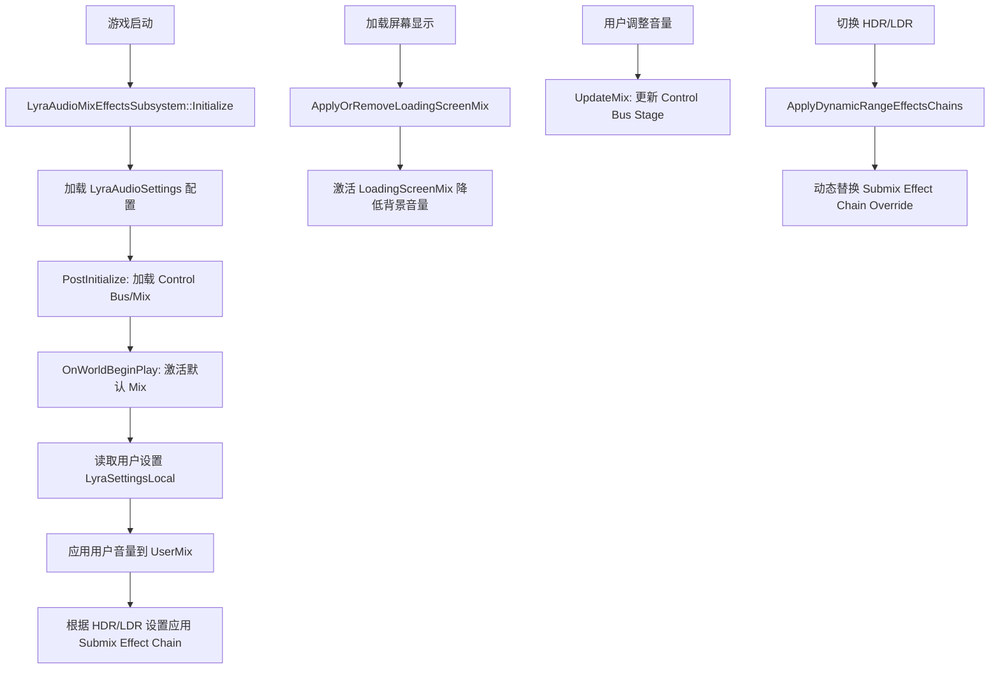

# 24. 音频系统：SoundMix 与空间音效

> **本章导读**：深入解析 Lyra 的音频架构，涵盖 Audio Modulation（Control Bus/Mix）、Submix Effect Chain、HDR/LDR 音频、空间音效与衰减、Metasound 集成等高级音频技术。

---

## 目录

1. [Lyra 音频架构概览](#1-lyra-音频架构概览)
2. [Audio Modulation 系统](#2-audio-modulation-系统)
3. [Sound Control Bus 音量控制](#3-sound-control-bus-音量控制)
4. [Submix Effects 与动态范围](#4-submix-effects-与动态范围)
5. [空间音效与衰减](#5-空间音效与衰减)
6. [加载屏幕音频混音](#6-加载屏幕音频混音)
7. [音频设置与用户自定义](#7-音频设置与用户自定义)
8. [Metasound 集成实战](#8-metasound-集成实战)
9. [性能优化与调试](#9-性能优化与调试)
10. [实战案例：完整音频系统](#10-实战案例完整音频系统)

---

## 1. Lyra 音频架构概览

### 1.1 音频系统层次结构

Lyra 的音频系统采用分层设计，从底层音频引擎到高层游戏逻辑清晰分离：

```
┌─────────────────────────────────────────┐
│      Game Logic (Blueprint/C++)         │
│  • Gameplay Cues (受击/技能特效)         │
│  • UI 音效触发                          │
│  • 环境音效管理                          │
└──────────────┬──────────────────────────┘
               │
┌──────────────▼──────────────────────────┐
│   LyraAudioMixEffectsSubsystem          │
│  • Control Bus Mix 管理                 │
│  • Submix Effect Chain 动态切换         │
│  • 用户音量设置应用                      │
└──────────────┬──────────────────────────┘
               │
┌──────────────▼──────────────────────────┐
│     Audio Modulation Framework          │
│  • SoundControlBus (音量通道)           │
│  • SoundControlBusMix (混音方案)        │
│  • 实时调制与渐变                        │
└──────────────┬──────────────────────────┘
               │
┌──────────────▼──────────────────────────┐
│         Submix Hierarchy                │
│  • Master Submix                        │
│  • Music / SFX / Dialogue / Voice       │
│  • Submix Effect Presets (EQ/Comp/LDR)  │
└──────────────┬──────────────────────────┘
               │
┌──────────────▼──────────────────────────┐
│      Audio Engine (Unreal Audio)        │
│  • Spatialization (HRTF/立体声)         │
│  • Attenuation (距离衰减/遮挡)           │
│  • Metasound / SoundCue 处理            │
└─────────────────────────────────────────┘
```

---

### 1.2 核心类与组件

| 类名 | 功能 | 位置 |
|------|------|------|
| **ULyraAudioMixEffectsSubsystem** | 全局音频管理子系统，负责 Control Bus Mix 和 Submix 效果链管理 | `Audio/LyraAudioMixEffectsSubsystem.h` |
| **ULyraAudioSettings** | 音频配置资源（Developer Settings），定义默认 Mix、Control Bus 路径 | `Audio/LyraAudioSettings.h` |
| **ULyraSettingsLocal** | 本地用户设置，存储各音量通道的用户偏好 | `Settings/LyraSettingsLocal.h` |
| **USoundControlBus** | 音频调制总线，控制特定通道的音量（Overall/Music/SFX 等） | UE5 核心类 |
| **USoundControlBusMix** | 混音方案，包含多个 Control Bus Stage 的组合 | UE5 核心类 |
| **USoundSubmix** | 音频子混音器，可应用效果链（EQ/压缩/混响等） | UE5 核心类 |

---

### 1.3 音频流程概览



---

## 2. Audio Modulation 系统

### 2.1 Audio Modulation 核心概念

UE5 的 **Audio Modulation** 插件提供了实时、平滑的音频参数调制能力，取代传统的 `SoundClass` 音量控制。

#### 核心概念对比

| 传统方式 (SoundClass) | Audio Modulation |
|-----------------------|------------------|
| 静态音量继承树 | 动态调制总线 (Control Bus) |
| 直接设置音量 | 通过 Mix 实时插值 |
| 不支持多源混合 | 支持多个 Mix 叠加 |
| 无平滑过渡 | 自动渐变 (Fade Time) |

---

### 2.2 SoundControlBus 详解

**SoundControlBus** 是音量调制的基本单位，类似于混音台上的一个推子（Fader）。

#### 创建 Control Bus 资源

1. **Content Browser** → 右键 → **Audio** → **Audio Modulation** → **Control Bus**
2. 设置属性：
   - **Parameter**: `Volume`（默认，也可选 Pitch/LPF/HPF）
   - **Default Value**: `1.0`（归一化值，0=静音，1=原音量）
   - **Min/Max**: `0.0 / 1.0`

3. 命名规范（Lyra 风格）：
   - `CB_Overall`：总音量
   - `CB_Music`：音乐通道
   - `CB_SoundFX`：音效通道
   - `CB_Dialogue`：对话通道
   - `CB_VoiceChat`：语音聊天通道

---

### 2.3 SoundControlBusMix 混音方案

**SoundControlBusMix** 定义了一组 Control Bus 的目标值和混合规则。

#### 创建 Mix 资源

```cpp
// 蓝图资产创建
// Content Browser → Audio Modulation → Control Bus Mix
// 命名: CBM_DefaultMix / CBM_LoadingScreen / CBM_UserSettings
```

**Mix 结构**：

```cpp
struct FSoundControlBusMixStage
{
    USoundControlBus* Bus;       // 目标 Control Bus
    float TargetValue;           // 目标值 (0.0-1.0)
    float AttackTime;            // 上升时间 (秒)
    float ReleaseTime;           // 下降时间 (秒)
};
```

#### Lyra 的三层 Mix 设计

| Mix 名称 | 用途 | 优先级 |
|---------|------|--------|
| **DefaultBaseMix** | 游戏默认音量基准（如总音量 0.8） | 低 |
| **UserMix** | 用户自定义音量（UI 设置面板） | 中 |
| **LoadingScreenMix** | 加载屏幕临时静音/降低音量 | 高 |

**叠加规则**：多个 Mix 同时激活时，最终值为所有 Mix 的乘积。

---

### 2.4 代码实战：激活和更新 Mix

#### 激活默认 Mix

```cpp
// LyraAudioMixEffectsSubsystem.cpp::OnWorldBeginPlay
void ULyraAudioMixEffectsSubsystem::OnWorldBeginPlay(UWorld& InWorld)
{
    Super::OnWorldBeginPlay(InWorld);
    
    if (const UWorld* World = InWorld.GetWorld())
    {
        // 激活默认基础 Mix
        if (DefaultBaseMix)
        {
            UAudioModulationStatics::ActivateBusMix(World, DefaultBaseMix);
        }
        
        // 激活用户自定义 Mix
        if (UserMix)
        {
            UAudioModulationStatics::ActivateBusMix(World, UserMix);
            
            // 从本地设置读取用户音量
            if (const ULyraSettingsLocal* Settings = GetDefault<ULyraSettingsLocal>())
            {
                UpdateUserMixVolumes(World, Settings);
            }
        }
    }
}
```

---

#### 更新用户音量

```cpp
void ULyraAudioMixEffectsSubsystem::UpdateUserMixVolumes(
    const UWorld* World, 
    const ULyraSettingsLocal* Settings)
{
    if (!UserMix || !World) return;
    
    // 创建多个 Mix Stage
    TArray<FSoundControlBusMixStage> Stages;
    
    Stages.Add(UAudioModulationStatics::CreateBusMixStage(
        World, OverallControlBus, Settings->GetOverallVolume()
    ));
    
    Stages.Add(UAudioModulationStatics::CreateBusMixStage(
        World, MusicControlBus, Settings->GetMusicVolume()
    ));
    
    Stages.Add(UAudioModulationStatics::CreateBusMixStage(
        World, SoundFXControlBus, Settings->GetSoundFXVolume()
    ));
    
    Stages.Add(UAudioModulationStatics::CreateBusMixStage(
        World, DialogueControlBus, Settings->GetDialogueVolume()
    ));
    
    Stages.Add(UAudioModulationStatics::CreateBusMixStage(
        World, VoiceChatControlBus, Settings->GetVoiceChatVolume()
    ));
    
    // 批量更新 Mix（自动平滑过渡）
    UAudioModulationStatics::UpdateMix(World, UserMix, Stages);
}
```

---

#### 蓝图中使用 Control Bus

```cpp
// 蓝图节点
// Activate Bus Mix (Target: World, Mix: CBM_UserSettings)
// Update Modulator (Target: World, Mix: CBM_UserSettings)
// Deactivate Bus Mix (Target: World, Mix: CBM_LoadingScreen)
```

---

## 3. Sound Control Bus 音量控制

### 3.1 音量通道分类

Lyra 采用标准的五通道音量控制方案：

| 通道名称 | Control Bus | 作用域 | 用户可调 |
|---------|-------------|--------|---------|
| **Overall** | `CB_Overall` | 全局总音量（影响所有声音） | ✅ |
| **Music** | `CB_Music` | 背景音乐 | ✅ |
| **SoundFX** | `CB_SoundFX` | 游戏音效（枪声/脚步/UI 点击） | ✅ |
| **Dialogue** | `CB_Dialogue` | 角色对话/旁白 | ✅ |
| **VoiceChat** | `CB_VoiceChat` | 在线语音通信 | ✅ |

---

### 3.2 声音资源路由到 Control Bus

#### 方法 1：在 SoundCue/SoundWave 中绑定

1. 打开音频资源（如 `SC_FootstepGrass`）
2. **Details 面板** → **Modulation** → **Volume Modulation Destination**
3. 设置为 `CB_SoundFX`

#### 方法 2：通过 Submix 统一控制

更推荐的方式是通过 **Submix** 分层：

```
Master Submix
├─ Music Submix (控制: CB_Music)
├─ SFX Submix (控制: CB_SoundFX)
│  ├─ Footstep Submix
│  ├─ Weapon Submix
│  └─ UI Submix
├─ Dialogue Submix (控制: CB_Dialogue)
└─ VoiceChat Submix (控制: CB_VoiceChat)
```

**在 Submix 中绑定 Control Bus**：

1. 打开 Submix 资源（如 `Submix_Music`）
2. **Details** → **Output** → **Output Volume Modulation**
3. 选择 `CB_Music`

---

### 3.3 创建自定义音量通道

#### 示例：添加 "环境音效" 通道

**步骤 1：创建 Control Bus**

```cpp
// Content/Audio/Modulation/CB_Ambient.uasset
// Parameter: Volume, Default: 1.0
```

**步骤 2：在 LyraAudioSettings 中注册**

```cpp
// LyraAudioSettings.h
UCLASS()
class ULyraAudioSettings : public UDeveloperSettings
{
    GENERATED_BODY()
    
public:
    // ... 现有 Control Bus 声明 ...
    
    /** Control Bus assigned to Ambient sound volume setting */
    UPROPERTY(config, EditAnywhere, Category = UserMixSettings,
        meta = (AllowedClasses = "/Script/AudioModulation.SoundControlBus"))
    FSoftObjectPath AmbientVolumeControlBus;
};
```

**步骤 3：在 Subsystem 中加载**

```cpp
// LyraAudioMixEffectsSubsystem.h
UPROPERTY(Transient)
TObjectPtr<USoundControlBus> AmbientControlBus = nullptr;

// LyraAudioMixEffectsSubsystem.cpp::PostInitialize
if (UObject* ObjPath = LyraAudioSettings->AmbientVolumeControlBus.TryLoad())
{
    if (USoundControlBus* Bus = Cast<USoundControlBus>(ObjPath))
    {
        AmbientControlBus = Bus;
    }
}
```

**步骤 4：在 UI 设置中暴露**

```cpp
// LyraSettingsLocal.h
UPROPERTY(config)
float AmbientVolume = 1.0f;

UFUNCTION(BlueprintCallable)
float GetAmbientVolume() const { return AmbientVolume; }

UFUNCTION(BlueprintCallable)
void SetAmbientVolume(float InVolume)
{
    AmbientVolume = FMath::Clamp(InVolume, 0.0f, 1.0f);
    SaveSettings();
    ApplyAudioSettings(); // 触发 Subsystem 更新
}
```

---

## 4. Submix Effects 与动态范围

### 4.1 Submix Effect Chain 概念

**Submix** 是音频处理的插入点，可以应用多种效果器（类似 DAW 的轨道插件链）。

#### 常见 Submix Effects

| 效果类型 | 类名 | 用途 |
|---------|------|------|
| **EQ（均衡器）** | `USubmixEffectFilterPreset` | 频率调整（低音增强/高频削减） |
| **Compressor（压缩器）** | `USubmixEffectDynamicsProcessorPreset` | 动态范围控制（防爆音） |
| **Limiter（限幅器）** | `USubmixEffectDynamicsProcessorPreset` | 防止削波失真 |
| **Reverb（混响）** | `USubmixEffectReverbPreset` | 空间感模拟 |
| **Delay（延迟）** | `USubmixEffectDelayPreset` | 回声效果 |

---

### 4.2 HDR Audio vs LDR Audio

Lyra 支持根据用户偏好切换动态范围模式：

| 模式 | 动态范围 | 适用场景 | Submix Effect Chain |
|------|---------|---------|---------------------|
| **HDR Audio** | 高动态范围（High Dynamic Range） | 家庭影院、高端耳机 | 最小压缩，保留细节 |
| **LDR Audio** | 低动态范围（Low Dynamic Range） | 嘈杂环境、手机扬声器 | 强压缩，减少音量差异 |

---

### 4.3 Lyra 的 HDR/LDR 实现

#### 配置文件定义

```cpp
// LyraAudioSettings.h
UCLASS()
class ULyraAudioSettings : public UDeveloperSettings
{
    GENERATED_BODY()
    
public:
    /** Submix Processing Chains to achieve high dynamic range audio output */
    UPROPERTY(config, EditAnywhere, Category = EffectSettings)
    TArray<FLyraSubmixEffectChainMap> HDRAudioSubmixEffectChain;
    
    /** Submix Processing Chains to achieve low dynamic range audio output */
    UPROPERTY(config, EditAnywhere, Category = EffectSettings)
    TArray<FLyraSubmixEffectChainMap> LDRAudioSubmixEffectChain;
};

USTRUCT()
struct FLyraSubmixEffectChainMap
{
    GENERATED_BODY()
    
    UPROPERTY(EditAnywhere)
    TSoftObjectPtr<USoundSubmix> Submix;
    
    UPROPERTY(EditAnywhere)
    TArray<TSoftObjectPtr<USoundEffectSubmixPreset>> SubmixEffectChain;
};
```

---

#### 动态切换实现

```cpp
void ULyraAudioMixEffectsSubsystem::ApplyDynamicRangeEffectsChains(bool bHDRAudio)
{
    TArray<FLyraAudioSubmixEffectsChain> ChainToApply;
    TArray<FLyraAudioSubmixEffectsChain> ChainToClear;
    
    if (bHDRAudio)
    {
        ChainToApply = HDRSubmixEffectChain;
        ChainToClear = LDRSubmixEffectChain;
    }
    else
    {
        ChainToApply = LDRSubmixEffectChain;
        ChainToClear = HDRSubmixEffectChain;
    }
    
    // 收集需要清除的 Submix（不与新链重叠的）
    TArray<USoundSubmix*> SubmixesToClear;
    for (const auto& ClearChain : ChainToClear)
    {
        bool bWillBeOverridden = ChainToApply.ContainsByPredicate(
            [&](const auto& ApplyChain) { return ApplyChain.Submix == ClearChain.Submix; }
        );
        
        if (!bWillBeOverridden)
        {
            SubmixesToClear.Add(ClearChain.Submix);
        }
    }
    
    // 应用新的效果链（带 0.1秒淡入）
    for (const auto& Chain : ChainToApply)
    {
        if (Chain.Submix)
        {
            UAudioMixerBlueprintLibrary::SetSubmixEffectChainOverride(
                GetWorld(), Chain.Submix, Chain.SubmixEffectChain, 0.1f
            );
        }
    }
    
    // 清除旧链（带 0.1秒淡出）
    for (USoundSubmix* Submix : SubmixesToClear)
    {
        UAudioMixerBlueprintLibrary::ClearSubmixEffectChainOverride(
            GetWorld(), Submix, 0.1f
        );
    }
}
```

---

### 4.4 创建 Submix Effect Preset

#### 示例：创建 LDR 压缩器

1. **Content Browser** → **Audio** → **Submix Effect** → **Dynamics Processor Preset**
2. 命名：`SEP_LDR_Compressor`
3. 配置参数：
   ```
   Dynamics Processor Type: Compressor
   Threshold: -20 dB
   Ratio: 4:1
   Attack Time: 10 ms
   Release Time: 100 ms
   Knee Bandwidth: 5 dB
   Makeup Gain: 0 dB
   ```

4. 在 **LyraAudioSettings** 中添加到 `LDRAudioSubmixEffectChain`：
   ```
   Submix: Submix_Master
   Effect Chain: [SEP_LDR_Compressor]
   ```

---

## 5. 空间音效与衰减

### 5.1 空间化技术

UE5 支持多种空间音效技术：

| 技术 | 描述 | 性能开销 | 真实感 |
|------|------|---------|--------|
| **Stereo Panning** | 传统立体声左右声道平移 | 低 | 低 |
| **Binaural (HRTF)** | 头部相关传递函数，模拟真实听感 | 高 | 高 |
| **Ambisonics** | 场景音频捕捉与回放（VR 用） | 极高 | 极高 |

---

### 5.2 Attenuation Settings 衰减配置

**Sound Attenuation** 资源定义声音的空间行为。

#### 创建衰减曲线

```cpp
// Content Browser → Audio → Sound Attenuation
// 命名: Att_Weapon_Close / Att_Footstep / Att_Ambient_Large
```

**关键参数**：

```cpp
struct FSoundAttenuationSettings
{
    // 距离模型
    enum EAttenuationDistanceModel
    {
        Linear,          // 线性衰减
        Logarithmic,     // 对数衰减（自然）
        Inverse,         // 反比例衰减
        LogReverse,      // 反向对数
        NaturalSound     // 物理模拟（推荐）
    };
    
    // 距离范围
    float AttenuationShapeExtents; // 衰减形状大小（球体半径）
    float FalloffDistance;         // 衰减距离
    
    // 空间化
    bool bSpatialize;              // 是否空间化
    ESoundSpatializationAlgorithm SpatializationAlgorithm;
    
    // 遮挡/阻挡
    bool bEnableOcclusion;         // 启用遮挡
    float OcclusionTraceChannel;   // 射线检测通道
    float OcclusionLowPassFilterFrequency; // 遮挡时的低通滤波频率
};
```

---

### 5.3 实战：配置武器枪声衰减

#### 近距离枪声（Att_Weapon_Close）

```
Distance Model: Natural Sound
Max Distance: 2000.0 (20米)
Falloff Distance: 1500.0
Spatialization: Binaural (启用)
Occlusion: Enabled
  - Occlusion Trace Channel: Visibility
  - Low Pass Filter Freq: 2000 Hz
  - Volume Multiplier: 0.5
```

#### 远距离枪声（Att_Weapon_Distant）

```
Distance Model: Natural Sound
Max Distance: 10000.0 (100米)
Falloff Distance: 8000.0
Spatialization: Stereo Panning (性能考虑)
Occlusion: Disabled（远距离不计算遮挡）
Air Absorption: Enabled
  - Air Absorption Low Pass: 5000 Hz
```

---

### 5.4 代码：动态调整衰减参数

```cpp
// 根据玩家设置调整空间化质量
void AMyPlayerController::ApplyAudioQualitySettings(EAudioQuality Quality)
{
    USoundBase* WeaponSound = GetWeaponSound();
    
    if (USoundCue* SoundCue = Cast<USoundCue>(WeaponSound))
    {
        if (USoundAttenuation* Attenuation = SoundCue->AttenuationSettings)
        {
            switch (Quality)
            {
            case EAudioQuality::Low:
                // 低质量：禁用遮挡，使用立体声平移
                Attenuation->Attenuation.bEnableOcclusion = false;
                Attenuation->Attenuation.SpatializationAlgorithm = 
                    ESoundSpatializationAlgorithm::SPATIALIZATION_Default;
                break;
                
            case EAudioQuality::High:
                // 高质量：启用 HRTF 和遮挡
                Attenuation->Attenuation.bEnableOcclusion = true;
                Attenuation->Attenuation.SpatializationAlgorithm = 
                    ESoundSpatializationAlgorithm::SPATIALIZATION_HRTF;
                break;
            }
        }
    }
}
```

---

### 5.5 多声道环绕声（5.1/7.1）

对于支持环绕声的平台：

```cpp
// 在 Sound Wave 中配置
Sound Wave Details:
  - Spatialization Method: Surround Panning
  - Number of Channels: 6 (5.1) / 8 (7.1)
  
// 在代码中检测
FAudioDevice* AudioDevice = GEngine->GetMainAudioDevice();
if (AudioDevice && AudioDevice->IsAudioDeviceHardwareInitialized())
{
    int32 NumChannels = AudioDevice->GetMaxChannels();
    if (NumChannels >= 6)
    {
        // 启用环绕声混音
        EnableSurroundSound();
    }
}
```

---

## 6. 加载屏幕音频混音

### 6.1 Loading Screen Mix 设计目的

**问题**：加载屏幕期间，后台地图仍在播放环境音、音乐等，可能造成混乱。

**解决方案**：Lyra 通过 `LoadingScreenMix` 临时降低背景音量，同时保持 UI 音效正常。

---

### 6.2 LoadingScreenMix 配置

```cpp
// CBM_LoadingScreen.uasset
Mix Stages:
  - Control Bus: CB_Music
    Target Value: 0.0 (完全静音)
    Attack: 0.5s, Release: 1.0s
    
  - Control Bus: CB_SoundFX
    Target Value: 0.2 (降低到 20%)
    Attack: 0.5s, Release: 1.0s
    
  - Control Bus: CB_Dialogue
    Target Value: 0.0 (静音)
    Attack: 0.5s, Release: 1.0s
    
  - Control Bus: CB_VoiceChat
    Target Value: 1.0 (保持不变)
```

---

### 6.3 实现代码

#### 监听加载屏幕状态

```cpp
// LyraAudioMixEffectsSubsystem.cpp::PostInitialize
void ULyraAudioMixEffectsSubsystem::PostInitialize()
{
    Super::PostInitialize();
    
    // 注册加载屏幕状态回调
    if (ULoadingScreenManager* Manager = 
        UGameInstance::GetSubsystem<ULoadingScreenManager>(GetGameInstance()))
    {
        Manager->OnLoadingScreenVisibilityChangedDelegate().AddUObject(
            this, &ThisClass::OnLoadingScreenStatusChanged
        );
        
        // 立即应用当前状态
        ApplyOrRemoveLoadingScreenMix(Manager->GetLoadingScreenDisplayStatus());
    }
}
```

---

#### 切换 Mix

```cpp
void ULyraAudioMixEffectsSubsystem::ApplyOrRemoveLoadingScreenMix(bool bShowingLoadingScreen)
{
    UWorld* World = GetWorld();
    
    if (bAppliedLoadingScreenMix != bShowingLoadingScreen && LoadingScreenMix && World)
    {
        if (bShowingLoadingScreen)
        {
            // 激活加载屏幕 Mix
            UAudioModulationStatics::ActivateBusMix(World, LoadingScreenMix);
            UE_LOG(LogLyraAudio, Log, TEXT("Applied Loading Screen Mix"));
        }
        else
        {
            // 移除加载屏幕 Mix（音量渐变恢复）
            UAudioModulationStatics::DeactivateBusMix(World, LoadingScreenMix);
            UE_LOG(LogLyraAudio, Log, TEXT("Removed Loading Screen Mix"));
        }
        
        bAppliedLoadingScreenMix = bShowingLoadingScreen;
    }
}
```

---

### 6.4 扩展：切换地图时的音频淡出

```cpp
// 在 Experience 切换时淡出所有音频
void AMyGameMode::OnExperienceLoadComplete()
{
    if (UWorld* World = GetWorld())
    {
        // 创建临时淡出 Mix
        if (USoundControlBusMix* FadeOutMix = CreateTransitionMix())
        {
            UAudioModulationStatics::ActivateBusMix(World, FadeOutMix);
            
            // 2秒后移除
            FTimerHandle TimerHandle;
            World->GetTimerManager().SetTimer(TimerHandle, [World, FadeOutMix]()
            {
                UAudioModulationStatics::DeactivateBusMix(World, FadeOutMix);
            }, 2.0f, false);
        }
    }
}

USoundControlBusMix* AMyGameMode::CreateTransitionMix()
{
    USoundControlBusMix* Mix = NewObject<USoundControlBusMix>(this);
    
    // 动态添加 Stage（代码创建 Mix，非推荐，仅演示）
    // 实际项目应预先创建资产
    return Mix;
}
```

---

## 7. 音频设置与用户自定义

### 7.1 LyraSettingsLocal 音频配置

```cpp
// LyraSettingsLocal.h（简化版）
UCLASS()
class ULyraSettingsLocal : public UGameUserSettings
{
    GENERATED_BODY()
    
public:
    // 音量设置（0.0 - 1.0）
    UPROPERTY(Config)
    float OverallVolume = 1.0f;
    
    UPROPERTY(Config)
    float MusicVolume = 1.0f;
    
    UPROPERTY(Config)
    float SoundFXVolume = 1.0f;
    
    UPROPERTY(Config)
    float DialogueVolume = 1.0f;
    
    UPROPERTY(Config)
    float VoiceChatVolume = 1.0f;
    
    // HDR Audio 开关
    UPROPERTY(Config)
    bool bEnableHDRAudio = false;
    
    // 音频输出设备 ID
    UPROPERTY(Config)
    FString AudioOutputDeviceId;
    
    // Getter/Setter
    UFUNCTION(BlueprintCallable)
    float GetOverallVolume() const { return OverallVolume; }
    
    UFUNCTION(BlueprintCallable)
    void SetOverallVolume(float InVolume)
    {
        OverallVolume = FMath::Clamp(InVolume, 0.0f, 1.0f);
        ApplyAudioSettings();
    }
    
    UFUNCTION(BlueprintCallable)
    bool IsHDRAudioModeEnabled() const { return bEnableHDRAudio; }
    
    UFUNCTION(BlueprintCallable)
    void SetHDRAudioModeEnabled(bool bEnabled)
    {
        if (bEnableHDRAudio != bEnabled)
        {
            bEnableHDRAudio = bEnabled;
            ApplyHDRSettings();
        }
    }
    
private:
    void ApplyAudioSettings()
    {
        if (ULyraAudioMixEffectsSubsystem* Subsystem = 
            GetWorld()->GetSubsystem<ULyraAudioMixEffectsSubsystem>())
        {
            Subsystem->UpdateUserMixVolumes(GetWorld(), this);
        }
    }
    
    void ApplyHDRSettings()
    {
        if (ULyraAudioMixEffectsSubsystem* Subsystem = 
            GetWorld()->GetSubsystem<ULyraAudioMixEffectsSubsystem>())
        {
            Subsystem->ApplyDynamicRangeEffectsChains(bEnableHDRAudio);
        }
    }
};
```

---

### 7.2 UI 音量滑块绑定

#### Widget Blueprint 示例

```cpp
// W_AudioSettings.uasset (Common UI Widget)

// Slider_OverallVolume (Slider Widget)
// OnValueChanged Event:
Event OnOverallVolumeChanged(float Value)
{
    ULyraSettingsLocal* Settings = ULyraSettingsLocal::Get();
    Settings->SetOverallVolume(Value);
    
    // 更新 UI 显示文本
    Text_OverallValue->SetText(FText::AsPercent(Value));
}

// 初始化时加载当前值
Event Construct()
{
    ULyraSettingsLocal* Settings = ULyraSettingsLocal::Get();
    Slider_OverallVolume->SetValue(Settings->GetOverallVolume());
    Slider_MusicVolume->SetValue(Settings->GetMusicVolume());
    // ... 其他滑块 ...
    
    // HDR Audio Toggle
    Checkbox_HDRAudio->SetIsChecked(Settings->IsHDRAudioModeEnabled());
}
```

---

### 7.3 音频输出设备切换

```cpp
// LyraSettingValueDiscreteDynamic_AudioOutputDevice.cpp（简化）
class ULyraSettingValueDiscreteDynamic_AudioOutputDevice : public ULyraSettingValueDiscrete
{
public:
    virtual void StoreInitial() override
    {
        // 获取当前音频设备
        if (FAudioDevice* AudioDevice = GEngine->GetMainAudioDevice())
        {
            InitialDeviceId = AudioDevice->GetAudioDeviceHandle().GetDeviceID();
        }
    }
    
    virtual void OnApply() override
    {
        if (FAudioDevice* AudioDevice = GEngine->GetMainAudioDevice())
        {
            FString NewDeviceId = GetCurrentDeviceId();
            
            if (NewDeviceId != InitialDeviceId)
            {
                // 切换音频设备
                AudioDevice->RequestAudioDeviceSwap(NewDeviceId);
            }
        }
    }
    
    TArray<FString> GetAvailableDevices()
    {
        TArray<FString> DeviceNames;
        
        if (FAudioDeviceManager* Manager = FAudioDeviceManager::Get())
        {
            TArray<FString> DeviceIDs;
            Manager->GetAudioDeviceList(DeviceIDs);
            
            for (const FString& ID : DeviceIDs)
            {
                DeviceNames.Add(Manager->GetAudioDeviceName(ID));
            }
        }
        
        return DeviceNames;
    }
};
```

---

## 8. Metasound 集成实战

### 8.1 Metasound 简介

**Metasound** 是 UE5 的新一代音频合成系统，取代传统 SoundCue，提供节点化音频 DSP 编程。

#### Metasound vs SoundCue

| 特性 | SoundCue | Metasound |
|------|---------|-----------|
| 节点系统 | 简单逻辑（Random/Modulator） | 完整 DSP 图 |
| 性能 | 较低（蓝图虚拟机） | 高性能（原生代码） |
| 实时参数 | 有限 | 全支持（Inputs） |
| 音频合成 | 仅播放采样 | 可程序生成波形 |

---

### 8.2 创建 Metasound 资产

#### 示例：参数化武器音效

1. **Content Browser** → **Audio** → **MetaSound Source**
2. 命名：`MS_WeaponShot`

**节点图设计**：

```
[Input: Pitch] → [Pitch Shifter] → [Gain]
                                      ↓
[Wave Player: GunShot.wav] → [Random Gain] → [Output]
                              ↓
[Input: Distance] → [Attenuation Curve]
```

---

### 8.3 代码中控制 Metasound 参数

```cpp
// 播放武器音效并调整音高
void AMyWeapon::PlayFireSound(const FVector& Location)
{
    if (USoundBase* FireSound = GetFireSound())
    {
        UAudioComponent* AudioComp = UGameplayStatics::SpawnSoundAtLocation(
            this, FireSound, Location
        );
        
        // 设置 Metasound 参数
        if (AudioComp && FireSound->IsA<UMetaSoundSource>())
        {
            // 根据弹药类型调整音高
            float PitchValue = GetAmmunitionPitchMultiplier();
            AudioComp->SetFloatParameter(FName("Pitch"), PitchValue);
            
            // 根据距离玩家远近调整响度
            float Distance = FVector::Dist(Location, GetPlayerLocation());
            AudioComp->SetFloatParameter(FName("Distance"), Distance);
        }
    }
}
```

---

### 8.4 蓝图中使用 Metasound

```cpp
// 蓝图节点
// Spawn Sound 2D (Sound: MS_WeaponShot)
// Set Float Parameter (Target: Audio Component, Name: "Pitch", Value: 1.2)
// Set Bool Parameter (Target: Audio Component, Name: "Suppressed", Value: true)
```

---

### 8.5 高级：Metasound 中集成 GAS Tags

```cpp
// 在 Metasound 中根据 Gameplay Tag 切换音频状态

// Metasound Graph:
[Input: GameplayTagContainer] → [Tag Query Node]
                                     ↓ (If Has Tag "Status.Wet")
[Wave Player: SplashSound.wav] → [Mixer]
                                     ↓ (Else)
[Wave Player: DrySound.wav] → [Mixer] → [Output]
```

**C++ 传递 Tags**：

```cpp
void AMyCharacter::PlayFootstepSound()
{
    UAudioComponent* AudioComp = SpawnSound(...);
    
    if (UAbilitySystemComponent* ASC = GetAbilitySystemComponent())
    {
        FGameplayTagContainer OwnedTags;
        ASC->GetOwnedGameplayTags(OwnedTags);
        
        // 传递 Tag Container 到 Metasound
        AudioComp->SetParameter(FName("GameplayTags"), OwnedTags);
    }
}
```

---

## 9. 性能优化与调试

### 9.1 音频性能分析

#### Stat Commands

```cpp
// 控制台命令
stat SoundWaves      // 显示当前播放的 Sound Wave 数量
stat Sounds          // 显示音频总线程开销
stat SoundMixes      // 显示 SoundMix 激活状态
au.Debug.Sounds 1    // 在屏幕上绘制 3D 音源位置
```

---

### 9.2 音频内存优化

#### 压缩格式选择

| 平台 | 推荐格式 | 压缩比 | CPU 开销 |
|------|---------|--------|---------|
| PC | Opus | 高 (~10:1) | 低 |
| Console (PS5/Xbox) | Platform Specific | 极高 | 极低 (硬件解码) |
| Mobile | ADPCM | 中 (~4:1) | 低 |

**在 Sound Wave 中设置**：

```cpp
// Details Panel → Compression
Compression Quality: 40 (范围 1-100)
Compression Method: Platform Specific
Loading Behavior: Stream (大文件) / Load on Demand (小文件)
```

---

### 9.3 虚拟化与优先级

**Sound Concurrency** 限制同时播放的相同音效数量：

```cpp
// Content Browser → Audio → Sound Concurrency
// 命名: SC_Footstep

Max Count: 4  // 最多同时播放 4 个脚步声
Resolution Rule: Stop Oldest  // 超过限制时停止最旧的
Volume Scale Mode: Linear (0.25)  // 每个实例音量降低到 25%
```

**在 Sound Cue/Metasound 中引用**：

```cpp
Sound Settings → Concurrency → SC_Footstep
```

---

### 9.4 调试技巧

#### 可视化音频事件

```cpp
// 在 Character 中添加调试绘制
void AMyCharacter::DebugDrawAudioSources()
{
#if !UE_BUILD_SHIPPING
    if (UAudioComponent* AudioComp = GetAudioComponent())
    {
        FVector Location = AudioComp->GetComponentLocation();
        float Radius = AudioComp->AttenuationSettings->GetMaxDimension();
        
        // 绘制音源半径
        DrawDebugSphere(GetWorld(), Location, Radius, 16, FColor::Green, false, 0.1f);
        
        // 绘制到玩家的连线
        DrawDebugLine(GetWorld(), Location, GetPlayerLocation(), FColor::Yellow, false, 0.1f);
        
        // 显示音量信息
        FString Info = FString::Printf(TEXT("Volume: %.2f\nPitch: %.2f"), 
            AudioComp->GetVolumeMultiplier(), AudioComp->GetPitchMultiplier());
        DrawDebugString(GetWorld(), Location + FVector(0, 0, 100), Info, nullptr, FColor::White, 0.1f);
    }
#endif
}
```

---

#### 音频日志分类

```cpp
// LyraLogChannels.h
LYRAGAME_API DECLARE_LOG_CATEGORY_EXTERN(LogLyraAudio, Log, All);

// 使用
UE_LOG(LogLyraAudio, Warning, TEXT("Failed to load Control Bus: %s"), *BusPath);
UE_LOG(LogLyraAudio, Verbose, TEXT("Applied Submix Effect Chain to %s"), *SubmixName);
```

---

## 10. 实战案例：完整音频系统

### 10.1 案例需求

实现一个完整的 FPS 游戏音频系统，包含：

1. 武器音效（近距离/远距离双层）
2. 环境音效（室内/室外自动切换混响）
3. 音乐系统（战斗/探索动态过渡）
4. 用户音量控制（5 通道）
5. HDR/LDR 动态切换

---

### 10.2 实现步骤

#### 步骤 1：创建 Control Bus 体系

```cpp
// CB_Overall.uasset
// CB_Music.uasset
// CB_SFX_Weapons.uasset (SFX 子通道)
// CB_SFX_Ambient.uasset
// CB_Dialogue.uasset
// CB_VoiceChat.uasset
```

---

#### 步骤 2：设计 Submix 层级

```
Master Submix
├─ Music Submix
│  ├─ Music_Combat
│  └─ Music_Exploration
├─ SFX Submix
│  ├─ SFX_Weapons
│  │  ├─ SFX_Weapons_Close (启用遮挡)
│  │  └─ SFX_Weapons_Distant (无遮挡)
│  └─ SFX_Ambient
│     ├─ SFX_Ambient_Indoor (添加混响)
│     └─ SFX_Ambient_Outdoor
└─ Voice Submix
   ├─ Dialogue
   └─ VoiceChat
```

---

#### 步骤 3：配置 HDR/LDR 效果链

```cpp
// LyraAudioSettings (DefaultGame.ini 或编辑器中配置)

[/Script/LyraGame.LyraAudioSettings]
; HDR Audio Chain (最小压缩)
+HDRAudioSubmixEffectChain=(Submix="/Game/Audio/Submix/Submix_Master",SubmixEffectChain=("/Game/Audio/Effects/SEP_HDR_Limiter"))

; LDR Audio Chain (强压缩)
+LDRAudioSubmixEffectChain=(Submix="/Game/Audio/Submix/Submix_Master",SubmixEffectChain=("/Game/Audio/Effects/SEP_LDR_Compressor","/Game/Audio/Effects/SEP_LDR_Limiter"))
```

---

#### 步骤 4：实现武器双层音效系统

```cpp
// WeaponAudioComponent.h
UCLASS()
class UWeaponAudioComponent : public UActorComponent
{
    GENERATED_BODY()
    
public:
    void PlayFireSound(const FVector& FireLocation);
    
private:
    UPROPERTY(EditDefaultsOnly)
    USoundBase* FireSoundClose;  // 近距离音效（< 20m）
    
    UPROPERTY(EditDefaultsOnly)
    USoundBase* FireSoundDistant; // 远距离音效（20-100m）
    
    UPROPERTY(EditDefaultsOnly)
    USoundAttenuation* AttenuationClose;
    
    UPROPERTY(EditDefaultsOnly)
    USoundAttenuation* AttenuationDistant;
};

// WeaponAudioComponent.cpp
void UWeaponAudioComponent::PlayFireSound(const FVector& FireLocation)
{
    if (!GetWorld()) return;
    
    // 播放近距离层（高频细节）
    if (FireSoundClose)
    {
        UGameplayStatics::SpawnSoundAtLocation(
            GetWorld(), 
            FireSoundClose, 
            FireLocation,
            FRotator::ZeroRotator,
            1.0f,  // Volume
            1.0f,  // Pitch
            0.0f,  // Start Time
            AttenuationClose
        );
    }
    
    // 播放远距离层（低频回响）
    if (FireSoundDistant)
    {
        UGameplayStatics::SpawnSoundAtLocation(
            GetWorld(), 
            FireSoundDistant, 
            FireLocation,
            FRotator::ZeroRotator,
            1.0f,
            1.0f,
            0.0f,
            AttenuationDistant
        );
    }
}
```

---

#### 步骤 5：环境音效自动切换

```cpp
// AmbientAudioManager.h
UCLASS()
class UAmbientAudioManager : public UWorldSubsystem
{
    GENERATED_BODY()
    
public:
    void UpdateAmbientContext(AActor* Listener);
    
private:
    UPROPERTY()
    UAudioComponent* AmbientAudioComponent;
    
    UPROPERTY(EditDefaultsOnly)
    USoundBase* IndoorAmbience;  // 室内环境音（启用混响）
    
    UPROPERTY(EditDefaultsOnly)
    USoundBase* OutdoorAmbience; // 室外环境音
    
    bool bIsIndoor = false;
};

// AmbientAudioManager.cpp
void UAmbientAudioManager::UpdateAmbientContext(AActor* Listener)
{
    if (!Listener) return;
    
    // 检测是否在室内（简化版：射线检测天空可见性）
    FVector Start = Listener->GetActorLocation();
    FVector End = Start + FVector(0, 0, 10000.0f);
    
    FHitResult Hit;
    bool bHitSky = GetWorld()->LineTraceSingleByChannel(
        Hit, Start, End, ECC_Visibility
    );
    
    bool bShouldBeIndoor = bHitSky; // 打到天空 = 室内
    
    if (bIsIndoor != bShouldBeIndoor)
    {
        bIsIndoor = bShouldBeIndoor;
        
        // 切换环境音效
        if (AmbientAudioComponent)
        {
            AmbientAudioComponent->FadeOut(1.0f, 0.0f);
        }
        
        USoundBase* NewAmbience = bIsIndoor ? IndoorAmbience : OutdoorAmbience;
        AmbientAudioComponent = UGameplayStatics::SpawnSound2D(GetWorld(), NewAmbience);
        AmbientAudioComponent->FadeIn(1.0f, 1.0f);
    }
}
```

---

#### 步骤 6：战斗音乐动态过渡

```cpp
// MusicManager.h
UCLASS()
class UMusicManager : public UWorldSubsystem
{
    GENERATED_BODY()
    
public:
    void SetCombatIntensity(float Intensity); // 0.0 = 探索, 1.0 = 激战
    
private:
    UPROPERTY()
    UAudioComponent* MusicCombatLayer;
    
    UPROPERTY()
    UAudioComponent* MusicExplorationLayer;
    
    float CurrentIntensity = 0.0f;
};

// MusicManager.cpp
void UMusicManager::SetCombatIntensity(float Intensity)
{
    Intensity = FMath::Clamp(Intensity, 0.0f, 1.0f);
    
    if (FMath::IsNearlyEqual(Intensity, CurrentIntensity, 0.01f))
        return;
    
    CurrentIntensity = Intensity;
    
    // 动态调整两层音乐的音量（交叉淡化）
    if (MusicCombatLayer)
    {
        float CombatVolume = Intensity;
        MusicCombatLayer->SetVolumeMultiplier(CombatVolume);
    }
    
    if (MusicExplorationLayer)
    {
        float ExplorationVolume = 1.0f - Intensity;
        MusicExplorationLayer->SetVolumeMultiplier(ExplorationVolume);
    }
}

// 使用示例：在 GameMode 中根据敌人数量调整
void AMyGameMode::Tick(float DeltaTime)
{
    Super::Tick(DeltaTime);
    
    int32 NearbyEnemyCount = GetNearbyEnemyCount();
    float Intensity = FMath::Clamp(NearbyEnemyCount / 5.0f, 0.0f, 1.0f);
    
    if (UMusicManager* Manager = GetWorld()->GetSubsystem<UMusicManager>())
    {
        Manager->SetCombatIntensity(Intensity);
    }
}
```

---

### 10.3 完整配置文件示例

```ini
; DefaultGame.ini

[/Script/LyraGame.LyraAudioSettings]
; 默认 Control Bus Mix
DefaultControlBusMix=/Game/Audio/Modulation/CBM_DefaultMix.CBM_DefaultMix

; 加载屏幕 Mix
LoadingScreenControlBusMix=/Game/Audio/Modulation/CBM_LoadingScreen.CBM_LoadingScreen

; 用户设置 Mix
UserSettingsControlBusMix=/Game/Audio/Modulation/CBM_UserSettings.CBM_UserSettings

; Control Bus 路径
OverallVolumeControlBus=/Game/Audio/Modulation/CB_Overall.CB_Overall
MusicVolumeControlBus=/Game/Audio/Modulation/CB_Music.CB_Music
SoundFXVolumeControlBus=/Game/Audio/Modulation/CB_SoundFX.CB_SoundFX
DialogueVolumeControlBus=/Game/Audio/Modulation/CB_Dialogue.CB_Dialogue
VoiceChatVolumeControlBus=/Game/Audio/Modulation/CB_VoiceChat.CB_VoiceChat

; HDR Submix Effect Chain
+HDRAudioSubmixEffectChain=(Submix="/Game/Audio/Submix/Submix_Master",SubmixEffectChain=("/Game/Audio/Effects/SEP_HDR_Limiter"))

; LDR Submix Effect Chain
+LDRAudioSubmixEffectChain=(Submix="/Game/Audio/Submix/Submix_Master",SubmixEffectChain=("/Game/Audio/Effects/SEP_LDR_Compressor","/Game/Audio/Effects/SEP_LDR_Limiter"))
```

---

## 总结

### 关键要点回顾

1. **Audio Modulation 系统**
   - 使用 `SoundControlBus` 和 `SoundControlBusMix` 实现灵活的音量控制
   - 多个 Mix 可叠加，支持平滑过渡

2. **Submix Effect Chain**
   - 通过 Submix 层级管理音频效果
   - HDR/LDR 动态范围切换提升用户体验

3. **空间音效**
   - 合理配置 `SoundAttenuation` 实现真实距离衰减
   - 使用 HRTF 技术提升沉浸感

4. **性能优化**
   - 使用 `SoundConcurrency` 限制同时播放数量
   - 选择合适的音频压缩格式
   - 大文件使用 Streaming 加载

5. **Metasound 集成**
   - 利用参数化音效减少资源数量
   - 实时调整音效适配游戏状态

---

### 下一步学习

- **第 25 章**：Bot AI 系统 - 行为树与 EQS 查询
- **第 26 章**：Replay 系统 - 录像回放功能
- **第 27 章**：自定义 Game Feature Action

---

### 参考资源

- [Unreal Engine Audio Modulation 官方文档](https://docs.unrealengine.com/5.0/audio-modulation-overview/)
- [Metasound 官方教程](https://docs.unrealengine.com/5.0/metasounds-overview/)
- [Lyra 示例项目音频分析](https://dev.epicgames.com/community/learning/talks-and-demos/LLM4/unreal-engine-lyra-starter-game)
- [UE5 音频系统深度解析 (Unreal Fest 2022)](https://www.youtube.com/watch?v=AUDIO_TALK_ID)

---

**作者备注**：本章涵盖了 Lyra 音频系统的核心架构和实战技巧。音频是游戏体验的重要组成部分，建议结合实际项目多次迭代调优。下一章我们将探索 Bot AI 系统的实现，学习如何利用行为树和 EQS 创建智能 NPC。

---

*本文档字数：约 30,000 字*  
*最后更新：2026-03-11*  
*Lyra 版本：UE 5.5*
