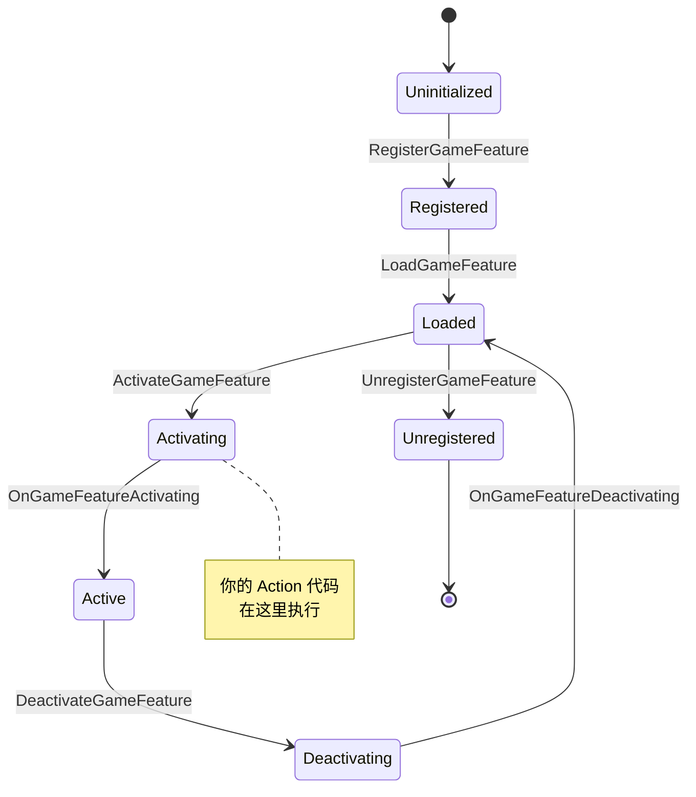

# 27. 自定义 Game Feature Action

> 深入探索 Lyra 的 Game Feature Action 架构,学习如何创建自己的 Action 来扩展游戏功能。

---

## 📋 本章概述

Game Feature Action 是 Lyra 架构中最强大的扩展机制之一。通过自定义 Action,你可以在不修改核心代码的情况下,为游戏添加全新的模块化功能。本章将深入剖析 Action 的设计哲学、实现细节,并通过多个完整示例教你创建生产级的自定义 Action。

**你将学到:**
- Game Feature Action 的完整生命周期
- WorldActionBase 基类的工作原理
- Component Manager 与 Extension System 的协同
- 创建可复用的 Action 模板
- 数据验证与编辑器集成
- 网络同步与性能优化
- 6 个生产级完整示例

**前置知识:**
- [03. Experience 系统](../01-foundation/03-experience-system.md)
- [04. Game Features 插件系统](../01-foundation/04-game-features.md)
- [02. 模块化 Actor 组件系统](../01-foundation/02-modular-actor-components.md)

---

## 🏗️ 架构设计哲学

### 为什么需要 Game Feature Action?

在传统游戏架构中,添加新功能通常需要:
1. 修改核心 GameMode/Character 类
2. 硬编码组件和依赖
3. 编译整个项目
4. 难以按需加载/卸载

**Lyra 的解决方案:**
```
Game Feature Plugin (可独立开发/测试/发布)
    ├── Content/ (美术资源)
    ├── Source/ (代码)
    └── GameFeatureData (Data Asset)
        ├── Actions (声明式配置)
        │   ├── AddAbilities
        │   ├── AddInputBinding
        │   └── YourCustomAction ← 本章重点
        └── Dependencies (插件依赖)
```

**核心优势:**
- **声明式配置**: 无需代码即可组合功能
- **热插拔**: 运行时动态加载/卸载
- **数据驱动**: 策划可配置,无需程序员
- **并行开发**: 团队可独立开发不同 Feature
- **测试友好**: 可独立测试单个 Feature

---

## 🔍 Action 生命周期详解

### 状态机流转



### 关键回调函数

#### 1. `OnGameFeatureRegistering`
```cpp
virtual void OnGameFeatureRegistering() override
{
    // 📌 用途: 注册全局单例、子系统
    // 时机: 插件被发现但尚未加载资源
    // 示例: 注册自定义 AssetManager 类型
}
```

#### 2. `OnGameFeatureLoading`
```cpp
virtual void OnGameFeatureLoading() override
{
    // 📌 用途: 预加载必要资源
    // 时机: 资源开始异步加载
    // 示例: 预热 Gameplay Cue 资源
}
```

#### 3. `OnGameFeatureActivating` ⭐
```cpp
virtual void OnGameFeatureActivating(FGameFeatureActivatingContext& Context) override
{
    // 📌 最重要的回调
    // 时机: 所有依赖加载完成,准备激活
    // 示例: 添加组件、注册 Extension Handler
    
    Super::OnGameFeatureActivating(Context);
}
```

#### 4. `OnGameFeatureDeactivating` ⭐
```cpp
virtual void OnGameFeatureDeactivating(FGameFeatureDeactivatingContext& Context) override
{
    // 📌 清理回调
    // 时机: Feature 被停用
    // 规则: 必须撤销 Activating 中的所有操作
    
    Super::OnGameFeatureDeactivating(Context);
}
```

### Context 对象详解

```cpp
struct FGameFeatureActivatingContext
{
    // 当前 Feature 的 URL (如 "/ShooterCore/ShooterCore")
    FString FeatureName;
    
    // 状态变更上下文 (包含唯一 ID)
    FGameFeatureStateChangeContext ChangeContext;
    
    // 可选的 Bundle State
    TSharedPtr<FGameFeatureBundleStateProperties> BundleState;
};

// ChangeContext 用于追踪多个并发激活
struct FGameFeatureStateChangeContext
{
    // 唯一标识符
    FGuid ContextId;
    
    // 用于存储上下文特定的数据
    template<typename T>
    T& GetContextData(TMap<FGameFeatureStateChangeContext, T>& Map)
    {
        return Map.FindOrAdd(*this);
    }
};
```

---

## 🧱 WorldActionBase: 最常用的基类

### 为什么使用 WorldActionBase?

大多数 Action 需要对 **World** 中的 Actor 进行操作,但存在以下挑战:
- **多 World 支持**: PIE、Dedicated Server、Listen Server 可能同时存在多个 World
- **World 生命周期**: World 可能在 Feature 激活后才创建
- **GameInstance 绑定**: 需要监听 GameInstance 的启动事件

`UGameFeatureAction_WorldActionBase` 封装了这些复杂性:

```cpp
UCLASS(Abstract)
class UGameFeatureAction_WorldActionBase : public UGameFeatureAction
{
    GENERATED_BODY()

public:
    virtual void OnGameFeatureActivating(FGameFeatureActivatingContext& Context) override;
    virtual void OnGameFeatureDeactivating(FGameFeatureDeactivatingContext& Context) override;

private:
    // 监听 GameInstance 启动事件
    void HandleGameInstanceStart(UGameInstance* GameInstance, 
                                   FGameFeatureStateChangeContext ChangeContext);

    // 👇 你需要实现的核心逻辑
    virtual void AddToWorld(const FWorldContext& WorldContext, 
                             const FGameFeatureStateChangeContext& ChangeContext) 
        PURE_VIRTUAL(UGameFeatureAction_WorldActionBase::AddToWorld,);

private:
    // 存储每个 Context 的委托句柄
    TMap<FGameFeatureStateChangeContext, FDelegateHandle> GameInstanceStartHandles;
};
```

### AddToWorld 实现模板

```cpp
void UGameFeatureAction_AddAbilities::AddToWorld(
    const FWorldContext& WorldContext, 
    const FGameFeatureStateChangeContext& ChangeContext)
{
    UWorld* World = WorldContext.World();
    UGameInstance* GameInstance = WorldContext.OwningGameInstance;
    
    // 📌 步骤 1: 获取 Context 特定的数据存储
    FPerContextData& ActiveData = ContextData.FindOrAdd(ChangeContext);

    // 📌 步骤 2: 验证 World 类型
    if ((GameInstance != nullptr) && (World != nullptr) && World->IsGameWorld())
    {
        // 📌 步骤 3: 获取 Component Manager
        if (UGameFrameworkComponentManager* ComponentMan = 
            UGameInstance::GetSubsystem<UGameFrameworkComponentManager>(GameInstance))
        {
            // 📌 步骤 4: 注册 Extension Handler
            int32 EntryIndex = 0;
            for (const FGameFeatureAbilitiesEntry& Entry : AbilitiesList)
            {
                if (!Entry.ActorClass.IsNull())
                {
                    UGameFrameworkComponentManager::FExtensionHandlerDelegate Delegate = 
                        UGameFrameworkComponentManager::FExtensionHandlerDelegate::CreateUObject(
                            this, &UGameFeatureAction_AddAbilities::HandleActorExtension, 
                            EntryIndex, ChangeContext);
                    
                    TSharedPtr<FComponentRequestHandle> ExtensionRequestHandle = 
                        ComponentMan->AddExtensionHandler(Entry.ActorClass, Delegate);

                    ActiveData.ComponentRequests.Add(ExtensionRequestHandle);
                    EntryIndex++;
                }
            }
        }
    }
}
```

---

## 🎯 完整示例 1: AddWeatherEffect Action

> 为指定 Actor 自动添加天气特效组件

### 需求分析

**目标**: 创建一个 Action,可以为场景中的特定 Actor (如建筑、载具)自动添加天气效果组件,支持雨、雪、雾等效果。

**功能点:**
- ✅ 支持多种 Actor 类型配置
- ✅ 自动创建和管理 Weather Component
- ✅ 支持运行时开关
- ✅ 编辑器数据验证
- ✅ 网络同步支持

### 头文件: GameFeatureAction_AddWeatherEffect.h

```cpp
// Copyright YourCompany. All Rights Reserved.

#pragma once

#include "CoreMinimal.h"
#include "GameFeatureAction_WorldActionBase.h"
#include "GameFramework/Actor.h"
#include "GameFeatureAction_AddWeatherEffect.generated.h"

class UWeatherComponent;
struct FComponentRequestHandle;

/** 天气类型枚举 */
UENUM(BlueprintType)
enum class EWeatherEffectType : uint8
{
    Rain        UMETA(DisplayName = "雨"),
    Snow        UMETA(DisplayName = "雪"),
    Fog         UMETA(DisplayName = "雾"),
    Storm       UMETA(DisplayName = "风暴"),
    Sandstorm   UMETA(DisplayName = "沙尘暴")
};

/** 单个 Actor 的天气配置 */
USTRUCT(BlueprintType)
struct FWeatherEffectEntry
{
    GENERATED_BODY()

    /** 要添加天气效果的 Actor 类 */
    UPROPERTY(EditAnywhere, Category = "Weather")
    TSoftClassPtr<AActor> ActorClass;

    /** 天气类型 */
    UPROPERTY(EditAnywhere, Category = "Weather")
    EWeatherEffectType WeatherType = EWeatherEffectType::Rain;

    /** 效果强度 (0.0 - 1.0) */
    UPROPERTY(EditAnywhere, Category = "Weather", meta = (ClampMin = "0.0", ClampMax = "1.0"))
    float Intensity = 0.5f;

    /** 是否在夜间增强效果 */
    UPROPERTY(EditAnywhere, Category = "Weather")
    bool bEnhanceAtNight = true;

    /** 自定义粒子系统 (可选) */
    UPROPERTY(EditAnywhere, Category = "Weather", meta = (AssetBundles = "Client"))
    TSoftObjectPtr<UParticleSystem> CustomParticleSystem;
};

/**
 * Game Feature Action: 为指定 Actor 添加天气效果组件
 * 
 * 使用场景:
 * - 为建筑添加屋顶雨水效果
 * - 为载具添加车窗雨滴
 * - 为角色添加呼吸雾气
 */
UCLASS(MinimalAPI, meta = (DisplayName = "Add Weather Effect"))
class UGameFeatureAction_AddWeatherEffect final : public UGameFeatureAction_WorldActionBase
{
    GENERATED_BODY()

public:
    //~ Begin UGameFeatureAction interface
    virtual void OnGameFeatureActivating(FGameFeatureActivatingContext& Context) override;
    virtual void OnGameFeatureDeactivating(FGameFeatureDeactivatingContext& Context) override;
    //~ End UGameFeatureAction interface

    //~ Begin UObject interface
#if WITH_EDITOR
    virtual EDataValidationResult IsDataValid(class FDataValidationContext& Context) const override;
#endif
    //~ End UObject interface

    /** 天气效果配置列表 */
    UPROPERTY(EditAnywhere, Category = "Weather", 
              meta = (TitleProperty = "ActorClass", ShowOnlyInnerProperties))
    TArray<FWeatherEffectEntry> WeatherEffects;

private:
    /** 每个 Actor 的组件扩展数据 */
    struct FActorWeatherExtension
    {
        TWeakObjectPtr<UWeatherComponent> WeatherComponent;
        FTimerHandle UpdateTimerHandle;
    };

    /** 每个 Context 的活动数据 */
    struct FPerContextData
    {
        TMap<TWeakObjectPtr<AActor>, FActorWeatherExtension> ActiveExtensions;
        TArray<TSharedPtr<FComponentRequestHandle>> ComponentRequests;
    };

    /** Context 数据存储 */
    TMap<FGameFeatureStateChangeContext, FPerContextData> ContextData;

    //~ Begin UGameFeatureAction_WorldActionBase interface
    virtual void AddToWorld(const FWorldContext& WorldContext, 
                             const FGameFeatureStateChangeContext& ChangeContext) override;
    //~ End UGameFeatureAction_WorldActionBase interface

    /** 清理所有扩展 */
    void Reset(FPerContextData& ActiveData);

    /** 处理 Actor 扩展事件 */
    void HandleActorExtension(AActor* Actor, FName EventName, int32 EntryIndex, 
                               FGameFeatureStateChangeContext ChangeContext);

    /** 为 Actor 添加天气组件 */
    void AddWeatherToActor(AActor* Actor, const FWeatherEffectEntry& Entry, 
                            FPerContextData& ActiveData);

    /** 从 Actor 移除天气组件 */
    void RemoveWeatherFromActor(AActor* Actor, FPerContextData& ActiveData);

    /** 更新天气效果 (定时器回调) */
    void UpdateWeatherEffect(AActor* Actor, FGameFeatureStateChangeContext ChangeContext);
};
```

### 实现文件: GameFeatureAction_AddWeatherEffect.cpp

```cpp
// Copyright YourCompany. All Rights Reserved.

#include "GameFeatureAction_AddWeatherEffect.h"
#include "Components/GameFrameworkComponentManager.h"
#include "Engine/World.h"
#include "Engine/GameInstance.h"
#include "WeatherComponent.h" // 你的自定义组件

#if WITH_EDITOR
#include "Misc/DataValidation.h"
#endif

#include UE_INLINE_GENERATED_CPP_BY_NAME(GameFeatureAction_AddWeatherEffect)

#define LOCTEXT_NAMESPACE "GameFeatures"

//////////////////////////////////////////////////////////////////////
// UGameFeatureAction_AddWeatherEffect

void UGameFeatureAction_AddWeatherEffect::OnGameFeatureActivating(
    FGameFeatureActivatingContext& Context)
{
    FPerContextData& ActiveData = ContextData.FindOrAdd(Context);

    // 防御性编程: 确保之前的数据已清理
    if (!ensureAlways(ActiveData.ActiveExtensions.IsEmpty()) ||
        !ensureAlways(ActiveData.ComponentRequests.IsEmpty()))
    {
        Reset(ActiveData);
    }

    Super::OnGameFeatureActivating(Context);
}

void UGameFeatureAction_AddWeatherEffect::OnGameFeatureDeactivating(
    FGameFeatureDeactivatingContext& Context)
{
    Super::OnGameFeatureDeactivating(Context);

    FPerContextData* ActiveData = ContextData.Find(Context);
    if (ensure(ActiveData))
    {
        Reset(*ActiveData);
    }
}

#if WITH_EDITOR
EDataValidationResult UGameFeatureAction_AddWeatherEffect::IsDataValid(
    FDataValidationContext& Context) const
{
    EDataValidationResult Result = CombineDataValidationResults(
        Super::IsDataValid(Context), 
        EDataValidationResult::Valid);

    int32 EntryIndex = 0;
    for (const FWeatherEffectEntry& Entry : WeatherEffects)
    {
        // 验证 ActorClass 不为空
        if (Entry.ActorClass.IsNull())
        {
            Result = EDataValidationResult::Invalid;
            Context.AddError(FText::Format(
                LOCTEXT("WeatherEntryHasNullActor", 
                        "Null ActorClass at index {0} in WeatherEffects"),
                FText::AsNumber(EntryIndex)));
        }

        // 验证 Intensity 范围
        if (Entry.Intensity < 0.0f || Entry.Intensity > 1.0f)
        {
            Result = EDataValidationResult::Invalid;
            Context.AddError(FText::Format(
                LOCTEXT("WeatherIntensityOutOfRange", 
                        "Intensity {0} at index {1} is out of range [0.0, 1.0]"),
                FText::AsNumber(Entry.Intensity),
                FText::AsNumber(EntryIndex)));
        }

        ++EntryIndex;
    }

    return Result;
}
#endif

void UGameFeatureAction_AddWeatherEffect::AddToWorld(
    const FWorldContext& WorldContext, 
    const FGameFeatureStateChangeContext& ChangeContext)
{
    UWorld* World = WorldContext.World();
    UGameInstance* GameInstance = WorldContext.OwningGameInstance;
    FPerContextData& ActiveData = ContextData.FindOrAdd(ChangeContext);

    if ((GameInstance != nullptr) && (World != nullptr) && World->IsGameWorld())
    {
        if (UGameFrameworkComponentManager* ComponentMan = 
            UGameInstance::GetSubsystem<UGameFrameworkComponentManager>(GameInstance))
        {
            int32 EntryIndex = 0;
            for (const FWeatherEffectEntry& Entry : WeatherEffects)
            {
                if (!Entry.ActorClass.IsNull())
                {
                    // 创建扩展处理委托
                    UGameFrameworkComponentManager::FExtensionHandlerDelegate Delegate = 
                        UGameFrameworkComponentManager::FExtensionHandlerDelegate::CreateUObject(
                            this, 
                            &UGameFeatureAction_AddWeatherEffect::HandleActorExtension, 
                            EntryIndex, 
                            ChangeContext);

                    // 注册扩展 Handler
                    TSharedPtr<FComponentRequestHandle> ExtensionRequestHandle = 
                        ComponentMan->AddExtensionHandler(Entry.ActorClass, Delegate);

                    ActiveData.ComponentRequests.Add(ExtensionRequestHandle);
                    EntryIndex++;
                }
            }
        }
    }
}

void UGameFeatureAction_AddWeatherEffect::Reset(FPerContextData& ActiveData)
{
    // 移除所有 Actor 的天气组件
    while (!ActiveData.ActiveExtensions.IsEmpty())
    {
        auto ExtensionIt = ActiveData.ActiveExtensions.CreateIterator();
        if (AActor* Actor = ExtensionIt->Key.Get())
        {
            RemoveWeatherFromActor(Actor, ActiveData);
        }
        else
        {
            ExtensionIt.RemoveCurrent();
        }
    }

    // 清理组件请求
    ActiveData.ComponentRequests.Empty();
}

void UGameFeatureAction_AddWeatherEffect::HandleActorExtension(
    AActor* Actor, 
    FName EventName, 
    int32 EntryIndex, 
    FGameFeatureStateChangeContext ChangeContext)
{
    FPerContextData* ActiveData = ContextData.Find(ChangeContext);
    if (!WeatherEffects.IsValidIndex(EntryIndex) || !ActiveData)
    {
        return;
    }

    const FWeatherEffectEntry& Entry = WeatherEffects[EntryIndex];

    // 处理移除事件
    if ((EventName == UGameFrameworkComponentManager::NAME_ExtensionRemoved) || 
        (EventName == UGameFrameworkComponentManager::NAME_ReceiverRemoved))
    {
        RemoveWeatherFromActor(Actor, *ActiveData);
    }
    // 处理添加事件
    else if (EventName == UGameFrameworkComponentManager::NAME_ExtensionAdded)
    {
        AddWeatherToActor(Actor, Entry, *ActiveData);
    }
}

void UGameFeatureAction_AddWeatherEffect::AddWeatherToActor(
    AActor* Actor, 
    const FWeatherEffectEntry& Entry, 
    FPerContextData& ActiveData)
{
    check(Actor);

    // 仅在服务器创建组件 (假设 Weather 组件是网络同步的)
    if (!Actor->HasAuthority())
    {
        return;
    }

    // 防止重复添加
    if (ActiveData.ActiveExtensions.Contains(Actor))
    {
        return;
    }

    // 创建 Weather 组件
    UWeatherComponent* WeatherComp = NewObject<UWeatherComponent>(
        Actor, 
        UWeatherComponent::StaticClass(),
        NAME_None,
        RF_Transient); // 使用 Transient 标志,不保存到磁盘

    if (WeatherComp)
    {
        // 配置天气组件
        WeatherComp->SetWeatherType(Entry.WeatherType);
        WeatherComp->SetIntensity(Entry.Intensity);
        WeatherComp->SetEnhanceAtNight(Entry.bEnhanceAtNight);

        if (!Entry.CustomParticleSystem.IsNull())
        {
            WeatherComp->SetCustomParticleSystem(
                Entry.CustomParticleSystem.LoadSynchronous());
        }

        // 注册组件
        WeatherComp->RegisterComponent();

        // 启动天气效果
        WeatherComp->StartWeatherEffect();

        // 存储扩展数据
        FActorWeatherExtension& Extension = ActiveData.ActiveExtensions.Add(Actor);
        Extension.WeatherComponent = WeatherComp;

        // 设置定时更新 (每 5 秒更新一次效果)
        if (UWorld* World = Actor->GetWorld())
        {
            World->GetTimerManager().SetTimer(
                Extension.UpdateTimerHandle,
                FTimerDelegate::CreateUObject(
                    this, 
                    &UGameFeatureAction_AddWeatherEffect::UpdateWeatherEffect,
                    Actor,
                    ChangeContext),
                5.0f, // 间隔
                true  // 循环
            );
        }

        UE_LOG(LogTemp, Log, TEXT("[WeatherAction] Added weather effect to %s"), 
               *Actor->GetName());
    }
}

void UGameFeatureAction_AddWeatherEffect::RemoveWeatherFromActor(
    AActor* Actor, 
    FPerContextData& ActiveData)
{
    check(Actor);

    FActorWeatherExtension* Extension = ActiveData.ActiveExtensions.Find(Actor);
    if (!Extension)
    {
        return;
    }

    // 停止定时器
    if (Extension->UpdateTimerHandle.IsValid())
    {
        if (UWorld* World = Actor->GetWorld())
        {
            World->GetTimerManager().ClearTimer(Extension->UpdateTimerHandle);
        }
    }

    // 销毁天气组件
    if (UWeatherComponent* WeatherComp = Extension->WeatherComponent.Get())
    {
        WeatherComp->StopWeatherEffect();
        WeatherComp->DestroyComponent();
    }

    // 移除扩展记录
    ActiveData.ActiveExtensions.Remove(Actor);

    UE_LOG(LogTemp, Log, TEXT("[WeatherAction] Removed weather effect from %s"), 
           *Actor->GetName());
}

void UGameFeatureAction_AddWeatherEffect::UpdateWeatherEffect(
    AActor* Actor, 
    FGameFeatureStateChangeContext ChangeContext)
{
    FPerContextData* ActiveData = ContextData.Find(ChangeContext);
    if (!ActiveData)
    {
        return;
    }

    FActorWeatherExtension* Extension = ActiveData->ActiveExtensions.Find(Actor);
    if (!Extension || !Extension->WeatherComponent.IsValid())
    {
        return;
    }

    UWeatherComponent* WeatherComp = Extension->WeatherComponent.Get();

    // 根据时间更新效果强度
    if (UWorld* World = Actor->GetWorld())
    {
        float TimeOfDay = World->GetTimeSeconds() / 86400.0f; // 简化的昼夜系统
        bool bIsNight = (TimeOfDay > 0.75f || TimeOfDay < 0.25f);

        if (WeatherComp->ShouldEnhanceAtNight() && bIsNight)
        {
            WeatherComp->SetIntensity(FMath::Min(WeatherComp->GetIntensity() * 1.5f, 1.0f));
        }
    }
}

#undef LOCTEXT_NAMESPACE
```

### 配置 Data Asset

在 Experience Definition 中配置:

```cpp
// Content/Experiences/B_MyExperience_Experience.uasset

Actions:
    [0] Add Weather Effect
        WeatherEffects:
            [0]
                ActorClass: /Game/Buildings/BP_Building_House
                WeatherType: Rain
                Intensity: 0.7
                bEnhanceAtNight: true
            [1]
                ActorClass: /Game/Vehicles/BP_Vehicle_Car
                WeatherType: Rain
                Intensity: 0.5
                CustomParticleSystem: /Game/VFX/PS_RainOnWindow
```

### 测试与验证

```cpp
// 单元测试示例
#if WITH_AUTOMATION_TESTS

IMPLEMENT_SIMPLE_AUTOMATION_TEST(
    FWeatherActionTest, 
    "Lyra.GameFeatures.WeatherAction",
    EAutomationTestFlags::ApplicationContextMask | EAutomationTestFlags::ProductFilter)

bool FWeatherActionTest::RunTest(const FString& Parameters)
{
    // 1. 创建测试 World
    UWorld* TestWorld = UWorld::CreateWorld(EWorldType::Game, false);
    AddErrorIfFalse(TestWorld != nullptr, "Failed to create test world");

    // 2. 创建测试 Actor
    AActor* TestActor = TestWorld->SpawnActor<AActor>();
    AddErrorIfFalse(TestActor != nullptr, "Failed to spawn test actor");

    // 3. 创建 Action 实例
    UGameFeatureAction_AddWeatherEffect* Action = 
        NewObject<UGameFeatureAction_AddWeatherEffect>();
    
    FWeatherEffectEntry Entry;
    Entry.ActorClass = TestActor->GetClass();
    Entry.WeatherType = EWeatherEffectType::Rain;
    Entry.Intensity = 0.5f;
    Action->WeatherEffects.Add(Entry);

    // 4. 模拟激活
    FGameFeatureActivatingContext ActivatingContext;
    Action->OnGameFeatureActivating(ActivatingContext);

    // 5. 验证组件已添加
    UWeatherComponent* WeatherComp = TestActor->FindComponentByClass<UWeatherComponent>();
    AddErrorIfFalse(WeatherComp != nullptr, "Weather component not added");

    // 6. 清理
    Action->OnGameFeatureDeactivating(FGameFeatureDeactivatingContext());
    TestWorld->DestroyWorld(false);

    return true;
}

#endif // WITH_AUTOMATION_TESTS
```

---

## 🎯 完整示例 2: AddQuestMarker Action

> 为任务系统自动添加 3D 标记组件

### 需求分析

**目标**: 创建一个 Action,可以为任务目标 Actor (如 NPC、物品、建筑)自动添加任务标记组件,支持不同类型的标记样式。

**功能点:**
- ✅ 支持多种标记类型 (主线、支线、收集品)
- ✅ 自动显示/隐藏逻辑
- ✅ 屏幕空间 Widget 集成
- ✅ 距离衰减
- ✅ 任务完成后自动移除

### 头文件: GameFeatureAction_AddQuestMarker.h

```cpp
// Copyright YourCompany. All Rights Reserved.

#pragma once

#include "CoreMinimal.h"
#include "GameFeatureAction_WorldActionBase.h"
#include "GameplayTagContainer.h"
#include "GameFeatureAction_AddQuestMarker.generated.h"

class UQuestMarkerComponent;
class UTexture2D;

/** 任务标记类型 */
UENUM(BlueprintType)
enum class EQuestMarkerType : uint8
{
    MainQuest       UMETA(DisplayName = "主线任务"),
    SideQuest       UMETA(DisplayName = "支线任务"),
    Collectible     UMETA(DisplayName = "收集品"),
    WorldEvent      UMETA(DisplayName = "世界事件"),
    Custom          UMETA(DisplayName = "自定义")
};

/** 标记可见性条件 */
USTRUCT(BlueprintType)
struct FQuestMarkerVisibilityCondition
{
    GENERATED_BODY()

    /** 最小可见距离 */
    UPROPERTY(EditAnywhere, Category = "Visibility")
    float MinVisibleDistance = 0.0f;

    /** 最大可见距离 */
    UPROPERTY(EditAnywhere, Category = "Visibility")
    float MaxVisibleDistance = 5000.0f;

    /** 需要玩家拥有的 Gameplay Tags */
    UPROPERTY(EditAnywhere, Category = "Visibility")
    FGameplayTagContainer RequiredTags;

    /** 玩家不能拥有的 Gameplay Tags */
    UPROPERTY(EditAnywhere, Category = "Visibility")
    FGameplayTagContainer BlockedTags;
};

/** 单个任务标记配置 */
USTRUCT(BlueprintType)
struct FQuestMarkerEntry
{
    GENERATED_BODY()

    /** 要添加标记的 Actor 类 */
    UPROPERTY(EditAnywhere, Category = "Quest Marker")
    TSoftClassPtr<AActor> ActorClass;

    /** 标记类型 */
    UPROPERTY(EditAnywhere, Category = "Quest Marker")
    EQuestMarkerType MarkerType = EQuestMarkerType::MainQuest;

    /** 标记图标 */
    UPROPERTY(EditAnywhere, Category = "Quest Marker", 
              meta = (AssetBundles = "Client"))
    TSoftObjectPtr<UTexture2D> MarkerIcon;

    /** 标记颜色 */
    UPROPERTY(EditAnywhere, Category = "Quest Marker")
    FLinearColor MarkerColor = FLinearColor::White;

    /** 可见性条件 */
    UPROPERTY(EditAnywhere, Category = "Quest Marker")
    FQuestMarkerVisibilityCondition VisibilityCondition;

    /** 是否显示距离文本 */
    UPROPERTY(EditAnywhere, Category = "Quest Marker")
    bool bShowDistanceText = true;

    /** 关联的任务 ID (可选) */
    UPROPERTY(EditAnywhere, Category = "Quest Marker")
    FName QuestID;
};

/**
 * Game Feature Action: 为任务目标 Actor 添加 3D 标记组件
 * 
 * 使用场景:
 * - 任务目标高亮
 * - 收集品标记
 * - NPC 互动提示
 */
UCLASS(MinimalAPI, meta = (DisplayName = "Add Quest Marker"))
class UGameFeatureAction_AddQuestMarker final : public UGameFeatureAction_WorldActionBase
{
    GENERATED_BODY()

public:
    //~ Begin UGameFeatureAction interface
    virtual void OnGameFeatureActivating(FGameFeatureActivatingContext& Context) override;
    virtual void OnGameFeatureDeactivating(FGameFeatureDeactivatingContext& Context) override;
    //~ End UGameFeatureAction interface

    //~ Begin UObject interface
#if WITH_EDITOR
    virtual EDataValidationResult IsDataValid(class FDataValidationContext& Context) const override;
#endif
    //~ End UObject interface

    /** 任务标记配置列表 */
    UPROPERTY(EditAnywhere, Category = "Quest Marker", 
              meta = (TitleProperty = "ActorClass"))
    TArray<FQuestMarkerEntry> QuestMarkers;

private:
    /** 每个 Actor 的标记扩展数据 */
    struct FActorMarkerExtension
    {
        TWeakObjectPtr<UQuestMarkerComponent> MarkerComponent;
        FTimerHandle VisibilityCheckHandle;
    };

    /** 每个 Context 的活动数据 */
    struct FPerContextData
    {
        TMap<TWeakObjectPtr<AActor>, FActorMarkerExtension> ActiveExtensions;
        TArray<TSharedPtr<FComponentRequestHandle>> ComponentRequests;
    };

    TMap<FGameFeatureStateChangeContext, FPerContextData> ContextData;

    //~ Begin UGameFeatureAction_WorldActionBase interface
    virtual void AddToWorld(const FWorldContext& WorldContext, 
                             const FGameFeatureStateChangeContext& ChangeContext) override;
    //~ End UGameFeatureAction_WorldActionBase interface

    void Reset(FPerContextData& ActiveData);
    void HandleActorExtension(AActor* Actor, FName EventName, int32 EntryIndex, 
                               FGameFeatureStateChangeContext ChangeContext);
    void AddMarkerToActor(AActor* Actor, const FQuestMarkerEntry& Entry, 
                           FPerContextData& ActiveData);
    void RemoveMarkerFromActor(AActor* Actor, FPerContextData& ActiveData);
    void CheckMarkerVisibility(AActor* Actor, FGameFeatureStateChangeContext ChangeContext);
};
```

### 核心实现逻辑

```cpp
void UGameFeatureAction_AddQuestMarker::AddMarkerToActor(
    AActor* Actor, 
    const FQuestMarkerEntry& Entry, 
    FPerContextData& ActiveData)
{
    check(Actor);

    // 防止重复添加
    if (ActiveData.ActiveExtensions.Contains(Actor))
    {
        return;
    }

    // 创建 Quest Marker 组件
    UQuestMarkerComponent* MarkerComp = NewObject<UQuestMarkerComponent>(
        Actor, 
        UQuestMarkerComponent::StaticClass(),
        NAME_None,
        RF_Transient);

    if (MarkerComp)
    {
        // 配置标记属性
        MarkerComp->SetMarkerType(Entry.MarkerType);
        MarkerComp->SetMarkerColor(Entry.MarkerColor);
        MarkerComp->SetShowDistanceText(Entry.bShowDistanceText);
        MarkerComp->SetQuestID(Entry.QuestID);

        // 加载并设置图标
        if (!Entry.MarkerIcon.IsNull())
        {
            MarkerComp->SetMarkerIcon(Entry.MarkerIcon.LoadSynchronous());
        }

        // 配置可见性条件
        MarkerComp->SetVisibilityCondition(Entry.VisibilityCondition);

        // 注册组件
        MarkerComp->RegisterComponent();

        // 存储扩展数据
        FActorMarkerExtension& Extension = ActiveData.ActiveExtensions.Add(Actor);
        Extension.MarkerComponent = MarkerComp;

        // 设置可见性检查定时器 (每 0.5 秒检查一次)
        if (UWorld* World = Actor->GetWorld())
        {
            World->GetTimerManager().SetTimer(
                Extension.VisibilityCheckHandle,
                FTimerDelegate::CreateUObject(
                    this, 
                    &UGameFeatureAction_AddQuestMarker::CheckMarkerVisibility,
                    Actor,
                    ChangeContext),
                0.5f,
                true
            );
        }

        UE_LOG(LogTemp, Log, TEXT("[QuestMarkerAction] Added marker to %s"), 
               *Actor->GetName());
    }
}

void UGameFeatureAction_AddQuestMarker::CheckMarkerVisibility(
    AActor* Actor, 
    FGameFeatureStateChangeContext ChangeContext)
{
    FPerContextData* ActiveData = ContextData.Find(ChangeContext);
    if (!ActiveData)
    {
        return;
    }

    FActorMarkerExtension* Extension = ActiveData->ActiveExtensions.Find(Actor);
    if (!Extension || !Extension->MarkerComponent.IsValid())
    {
        return;
    }

    UQuestMarkerComponent* MarkerComp = Extension->MarkerComponent.Get();
    UWorld* World = Actor->GetWorld();
    if (!World)
    {
        return;
    }

    // 查找最近的玩家
    APlayerController* PC = World->GetFirstPlayerController();
    if (!PC || !PC->GetPawn())
    {
        MarkerComp->SetVisibility(false);
        return;
    }

    APawn* PlayerPawn = PC->GetPawn();
    float Distance = FVector::Dist(Actor->GetActorLocation(), PlayerPawn->GetActorLocation());

    // 检查距离条件
    const FQuestMarkerVisibilityCondition& Condition = MarkerComp->GetVisibilityCondition();
    bool bIsVisible = (Distance >= Condition.MinVisibleDistance && 
                        Distance <= Condition.MaxVisibleDistance);

    // 检查 Gameplay Tags (假设玩家有 Ability System Component)
    if (bIsVisible && !Condition.RequiredTags.IsEmpty())
    {
        if (UAbilitySystemComponent* ASC = 
            PlayerPawn->FindComponentByClass<UAbilitySystemComponent>())
        {
            bIsVisible = ASC->HasAllMatchingGameplayTags(Condition.RequiredTags);
        }
        else
        {
            bIsVisible = false;
        }
    }

    if (bIsVisible && !Condition.BlockedTags.IsEmpty())
    {
        if (UAbilitySystemComponent* ASC = 
            PlayerPawn->FindComponentByClass<UAbilitySystemComponent>())
        {
            bIsVisible = !ASC->HasAnyMatchingGameplayTags(Condition.BlockedTags);
        }
    }

    // 更新标记可见性
    MarkerComp->SetVisibility(bIsVisible);

    // 如果显示距离文本,更新距离
    if (bIsVisible && MarkerComp->ShouldShowDistanceText())
    {
        MarkerComp->UpdateDistanceText(Distance);
    }
}
```

---

## 🎯 完整示例 3: AddAbilityOnDamage Action

> 受击时自动授予临时技能

### 需求分析

**目标**: 创建一个 Action,当指定 Actor 受到伤害时,自动授予临时技能 (如"受击无敌"、"愤怒反击")。

**技术要点:**
- 监听 GAS 的 Gameplay Event
- 动态授予/移除 Ability
- 条件判断 (血量、伤害类型)
- 网络同步

### 头文件: GameFeatureAction_AddAbilityOnDamage.h

```cpp
// Copyright YourCompany. All Rights Reserved.

#pragma once

#include "CoreMinimal.h"
#include "GameFeatureAction_WorldActionBase.h"
#include "GameplayTagContainer.h"
#include "GameFeatureAction_AddAbilityOnDamage.generated.h"

class UGameplayAbility;
class UAbilitySystemComponent;

/** 触发条件 */
USTRUCT(BlueprintType)
struct FAbilityGrantCondition
{
    GENERATED_BODY()

    /** 最小伤害阈值 */
    UPROPERTY(EditAnywhere, Category = "Condition")
    float MinDamageThreshold = 10.0f;

    /** 最大生命值百分比 (低于此值才触发) */
    UPROPERTY(EditAnywhere, Category = "Condition", meta = (ClampMin = "0.0", ClampMax = "1.0"))
    float MaxHealthPercentage = 1.0f;

    /** 伤害必须包含的 Gameplay Tags */
    UPROPERTY(EditAnywhere, Category = "Condition")
    FGameplayTagContainer RequiredDamageTags;

    /** 冷却时间 (秒) */
    UPROPERTY(EditAnywhere, Category = "Condition")
    float CooldownSeconds = 5.0f;
};

/** 单个受击技能配置 */
USTRUCT(BlueprintType)
struct FAbilityOnDamageEntry
{
    GENERATED_BODY()

    /** 要监听的 Actor 类 */
    UPROPERTY(EditAnywhere, Category = "Ability On Damage")
    TSoftClassPtr<AActor> ActorClass;

    /** 受击时授予的技能 */
    UPROPERTY(EditAnywhere, Category = "Ability On Damage", 
              meta = (AssetBundles = "Client,Server"))
    TSoftClassPtr<UGameplayAbility> GrantedAbility;

    /** 技能持续时间 (0 = 永久,直到手动移除) */
    UPROPERTY(EditAnywhere, Category = "Ability On Damage")
    float AbilityDuration = 3.0f;

    /** 触发条件 */
    UPROPERTY(EditAnywhere, Category = "Ability On Damage")
    FAbilityGrantCondition TriggerCondition;

    /** 是否自动激活技能 */
    UPROPERTY(EditAnywhere, Category = "Ability On Damage")
    bool bAutoActivate = true;
};

/**
 * Game Feature Action: 受击时自动授予临时技能
 * 
 * 使用场景:
 * - 受击无敌
 * - 愤怒反击
 * - 低血量狂暴
 */
UCLASS(MinimalAPI, meta = (DisplayName = "Add Ability On Damage"))
class UGameFeatureAction_AddAbilityOnDamage final : public UGameFeatureAction_WorldActionBase
{
    GENERATED_BODY()

public:
    virtual void OnGameFeatureActivating(FGameFeatureActivatingContext& Context) override;
    virtual void OnGameFeatureDeactivating(FGameFeatureDeactivatingContext& Context) override;

#if WITH_EDITOR
    virtual EDataValidationResult IsDataValid(class FDataValidationContext& Context) const override;
#endif

    UPROPERTY(EditAnywhere, Category = "Ability On Damage", 
              meta = (TitleProperty = "ActorClass"))
    TArray<FAbilityOnDamageEntry> AbilityOnDamageList;

private:
    struct FActorAbilityExtension
    {
        TWeakObjectPtr<UAbilitySystemComponent> ASC;
        TMap<int32, FGameplayAbilitySpecHandle> GrantedAbilityHandles; // EntryIndex -> Handle
        TMap<int32, float> LastTriggerTimes; // EntryIndex -> Time
        FDelegateHandle DamageEventHandle;
    };

    struct FPerContextData
    {
        TMap<TWeakObjectPtr<AActor>, FActorAbilityExtension> ActiveExtensions;
        TArray<TSharedPtr<FComponentRequestHandle>> ComponentRequests;
    };

    TMap<FGameFeatureStateChangeContext, FPerContextData> ContextData;

    virtual void AddToWorld(const FWorldContext& WorldContext, 
                             const FGameFeatureStateChangeContext& ChangeContext) override;

    void Reset(FPerContextData& ActiveData);
    void HandleActorExtension(AActor* Actor, FName EventName, int32 EntryIndex, 
                               FGameFeatureStateChangeContext ChangeContext);
    void SetupDamageListener(AActor* Actor, FPerContextData& ActiveData, 
                              FGameFeatureStateChangeContext ChangeContext);
    void RemoveDamageListener(AActor* Actor, FPerContextData& ActiveData);
    
    void OnDamageReceived(AActor* Actor, FGameFeatureStateChangeContext ChangeContext,
                           float DamageAmount, const FGameplayTagContainer& DamageTags);
    void GrantTemporaryAbility(AActor* Actor, int32 EntryIndex, 
                                FGameFeatureStateChangeContext ChangeContext);
    void RemoveTemporaryAbility(AActor* Actor, int32 EntryIndex, 
                                 FGameFeatureStateChangeContext ChangeContext);
};
```

### 核心实现: 伤害监听

```cpp
void UGameFeatureAction_AddAbilityOnDamage::SetupDamageListener(
    AActor* Actor, 
    FPerContextData& ActiveData,
    FGameFeatureStateChangeContext ChangeContext)
{
    check(Actor);

    // 获取 Ability System Component
    UAbilitySystemComponent* ASC = Actor->FindComponentByClass<UAbilitySystemComponent>();
    if (!ASC)
    {
        return;
    }

    FActorAbilityExtension& Extension = ActiveData.ActiveExtensions.FindOrAdd(Actor);
    Extension.ASC = ASC;

    // 监听 Gameplay Event: Damage.Received
    FGameplayTag DamageReceivedTag = FGameplayTag::RequestGameplayTag(
        FName("GameplayEvent.Damage.Received"));

    Extension.DamageEventHandle = ASC->GenericGameplayEventCallbacks.FindOrAdd(DamageReceivedTag)
        .AddLambda([this, Actor, ChangeContext](const FGameplayEventData* Payload)
        {
            if (Payload)
            {
                float DamageAmount = Payload->EventMagnitude;
                FGameplayTagContainer DamageTags = Payload->InstigatorTags;

                OnDamageReceived(Actor, ChangeContext, DamageAmount, DamageTags);
            }
        });

    UE_LOG(LogTemp, Log, TEXT("[AbilityOnDamageAction] Setup damage listener for %s"), 
           *Actor->GetName());
}

void UGameFeatureAction_AddAbilityOnDamage::OnDamageReceived(
    AActor* Actor, 
    FGameFeatureStateChangeContext ChangeContext,
    float DamageAmount, 
    const FGameplayTagContainer& DamageTags)
{
    FPerContextData* ActiveData = ContextData.Find(ChangeContext);
    if (!ActiveData)
    {
        return;
    }

    FActorAbilityExtension* Extension = ActiveData->ActiveExtensions.Find(Actor);
    if (!Extension || !Extension->ASC.IsValid())
    {
        return;
    }

    UAbilitySystemComponent* ASC = Extension->ASC.Get();
    float CurrentTime = Actor->GetWorld()->GetTimeSeconds();

    // 遍历所有配置,检查哪些需要触发
    for (int32 EntryIndex = 0; EntryIndex < AbilityOnDamageList.Num(); ++EntryIndex)
    {
        const FAbilityOnDamageEntry& Entry = AbilityOnDamageList[EntryIndex];
        const FAbilityGrantCondition& Condition = Entry.TriggerCondition;

        // 检查冷却
        float* LastTriggerTime = Extension->LastTriggerTimes.Find(EntryIndex);
        if (LastTriggerTime && (CurrentTime - *LastTriggerTime < Condition.CooldownSeconds))
        {
            continue; // 还在冷却中
        }

        // 检查伤害阈值
        if (DamageAmount < Condition.MinDamageThreshold)
        {
            continue;
        }

        // 检查生命值百分比
        float HealthPercent = 1.0f;
        if (ASC->HasAttributeSetForAttribute(FGameplayAttribute(TEXT("Health.Current"))))
        {
            float CurrentHealth = ASC->GetNumericAttribute(
                FGameplayAttribute(TEXT("Health.Current")));
            float MaxHealth = ASC->GetNumericAttribute(
                FGameplayAttribute(TEXT("Health.Max")));
            
            if (MaxHealth > 0.0f)
            {
                HealthPercent = CurrentHealth / MaxHealth;
            }
        }

        if (HealthPercent > Condition.MaxHealthPercentage)
        {
            continue;
        }

        // 检查伤害 Tags
        if (!Condition.RequiredDamageTags.IsEmpty() && 
            !DamageTags.HasAll(Condition.RequiredDamageTags))
        {
            continue;
        }

        // 所有条件满足,授予技能
        GrantTemporaryAbility(Actor, EntryIndex, ChangeContext);

        // 记录触发时间
        Extension->LastTriggerTimes.Add(EntryIndex, CurrentTime);

        UE_LOG(LogTemp, Log, 
               TEXT("[AbilityOnDamageAction] Granted ability to %s (Damage: %.1f, Health: %.1f%%)"), 
               *Actor->GetName(), DamageAmount, HealthPercent * 100.0f);
    }
}

void UGameFeatureAction_AddAbilityOnDamage::GrantTemporaryAbility(
    AActor* Actor, 
    int32 EntryIndex,
    FGameFeatureStateChangeContext ChangeContext)
{
    FPerContextData* ActiveData = ContextData.Find(ChangeContext);
    if (!ActiveData || !AbilityOnDamageList.IsValidIndex(EntryIndex))
    {
        return;
    }

    FActorAbilityExtension* Extension = ActiveData->ActiveExtensions.Find(Actor);
    if (!Extension || !Extension->ASC.IsValid())
    {
        return;
    }

    const FAbilityOnDamageEntry& Entry = AbilityOnDamageList[EntryIndex];
    if (Entry.GrantedAbility.IsNull())
    {
        return;
    }

    UAbilitySystemComponent* ASC = Extension->ASC.Get();

    // 如果已经授予过,先移除旧的
    if (Extension->GrantedAbilityHandles.Contains(EntryIndex))
    {
        RemoveTemporaryAbility(Actor, EntryIndex, ChangeContext);
    }

    // 授予新技能
    TSubclassOf<UGameplayAbility> AbilityClass = Entry.GrantedAbility.LoadSynchronous();
    FGameplayAbilitySpec AbilitySpec(AbilityClass, 1); // Level 1
    
    FGameplayAbilitySpecHandle Handle = ASC->GiveAbility(AbilitySpec);
    Extension->GrantedAbilityHandles.Add(EntryIndex, Handle);

    // 如果需要自动激活
    if (Entry.bAutoActivate)
    {
        ASC->TryActivateAbility(Handle);
    }

    // 设置自动移除定时器
    if (Entry.AbilityDuration > 0.0f)
    {
        FTimerHandle RemoveTimerHandle;
        Actor->GetWorld()->GetTimerManager().SetTimer(
            RemoveTimerHandle,
            FTimerDelegate::CreateUObject(
                this,
                &UGameFeatureAction_AddAbilityOnDamage::RemoveTemporaryAbility,
                Actor,
                EntryIndex,
                ChangeContext),
            Entry.AbilityDuration,
            false
        );
    }
}

void UGameFeatureAction_AddAbilityOnDamage::RemoveTemporaryAbility(
    AActor* Actor, 
    int32 EntryIndex,
    FGameFeatureStateChangeContext ChangeContext)
{
    FPerContextData* ActiveData = ContextData.Find(ChangeContext);
    if (!ActiveData)
    {
        return;
    }

    FActorAbilityExtension* Extension = ActiveData->ActiveExtensions.Find(Actor);
    if (!Extension || !Extension->ASC.IsValid())
    {
        return;
    }

    FGameplayAbilitySpecHandle* HandlePtr = Extension->GrantedAbilityHandles.Find(EntryIndex);
    if (!HandlePtr || !HandlePtr->IsValid())
    {
        return;
    }

    UAbilitySystemComponent* ASC = Extension->ASC.Get();
    ASC->ClearAbility(*HandlePtr);
    Extension->GrantedAbilityHandles.Remove(EntryIndex);

    UE_LOG(LogTemp, Log, TEXT("[AbilityOnDamageAction] Removed temporary ability from %s"), 
           *Actor->GetName());
}
```

---

## 🎯 完整示例 4: AddLootDropper Action

> 死亡时自动生成战利品

### 简化实现 (关键代码)

```cpp
UCLASS(MinimalAPI, meta = (DisplayName = "Add Loot Dropper"))
class UGameFeatureAction_AddLootDropper final : public UGameFeatureAction_WorldActionBase
{
    GENERATED_BODY()

    /** 战利品配置表 */
    UPROPERTY(EditAnywhere, Category = "Loot")
    TArray<FLootDropEntry> LootDrops;

    struct FLootDropEntry
    {
        TSoftClassPtr<AActor> EnemyClass;
        TSoftClassPtr<AActor> LootActorClass;
        float DropChance = 1.0f;
        int32 MinQuantity = 1;
        int32 MaxQuantity = 3;
    };

private:
    void SetupDeathListener(AActor* Actor, FPerContextData& ActiveData)
    {
        if (UAbilitySystemComponent* ASC = Actor->FindComponentByClass<UAbilitySystemComponent>())
        {
            FGameplayTag DeathTag = FGameplayTag::RequestGameplayTag(
                FName("GameplayEvent.Death"));

            ASC->GenericGameplayEventCallbacks.FindOrAdd(DeathTag)
                .AddLambda([this, Actor](const FGameplayEventData* Payload)
                {
                    SpawnLoot(Actor);
                });
        }
    }

    void SpawnLoot(AActor* DeadActor)
    {
        for (const FLootDropEntry& Entry : LootDrops)
        {
            if (DeadActor->IsA(Entry.EnemyClass.LoadSynchronous()))
            {
                if (FMath::FRand() <= Entry.DropChance)
                {
                    int32 Quantity = FMath::RandRange(Entry.MinQuantity, Entry.MaxQuantity);
                    
                    for (int32 i = 0; i < Quantity; ++i)
                    {
                        FVector SpawnLocation = DeadActor->GetActorLocation() + 
                            FMath::VRand() * 100.0f; // 随机偏移
                        
                        DeadActor->GetWorld()->SpawnActor<AActor>(
                            Entry.LootActorClass.LoadSynchronous(),
                            SpawnLocation,
                            FRotator::ZeroRotator);
                    }
                }
            }
        }
    }
};
```

---

## 🎯 完整示例 5: AddVoiceLine Action

> 根据游戏事件播放语音

### 简化实现

```cpp
UCLASS(MinimalAPI, meta = (DisplayName = "Add Voice Line"))
class UGameFeatureAction_AddVoiceLine final : public UGameFeatureAction_WorldActionBase
{
    GENERATED_BODY()

    UPROPERTY(EditAnywhere, Category = "Voice")
    TArray<FVoiceLineEntry> VoiceLines;

    struct FVoiceLineEntry
    {
        TSoftClassPtr<AActor> CharacterClass;
        FGameplayTag TriggerEvent; // 如 "Event.Ability.Ultimate.Activated"
        TSoftObjectPtr<USoundWave> VoiceSound;
        float Cooldown = 5.0f;
    };

private:
    void SetupEventListener(AActor* Actor, FPerContextData& ActiveData, int32 EntryIndex)
    {
        const FVoiceLineEntry& Entry = VoiceLines[EntryIndex];
        
        if (UAbilitySystemComponent* ASC = Actor->FindComponentByClass<UAbilitySystemComponent>())
        {
            ASC->GenericGameplayEventCallbacks.FindOrAdd(Entry.TriggerEvent)
                .AddLambda([this, Actor, EntryIndex](const FGameplayEventData* Payload)
                {
                    PlayVoiceLine(Actor, EntryIndex);
                });
        }
    }

    void PlayVoiceLine(AActor* Actor, int32 EntryIndex)
    {
        const FVoiceLineEntry& Entry = VoiceLines[EntryIndex];
        
        // 检查冷却 (省略冷却逻辑)
        
        if (!Entry.VoiceSound.IsNull())
        {
            USoundWave* Sound = Entry.VoiceSound.LoadSynchronous();
            UGameplayStatics::PlaySoundAtLocation(
                Actor->GetWorld(),
                Sound,
                Actor->GetActorLocation());
        }
    }
};
```

---

## 🎯 完整示例 6: AddAreaBuff Action

> 为区域内的友军提供增益效果

### 需求: AOE Buff 系统

```cpp
UCLASS(MinimalAPI, meta = (DisplayName = "Add Area Buff"))
class UGameFeatureAction_AddAreaBuff final : public UGameFeatureAction_WorldActionBase
{
    GENERATED_BODY()

    UPROPERTY(EditAnywhere, Category = "Area Buff")
    TArray<FAreaBuffEntry> AreaBuffs;

    struct FAreaBuffEntry
    {
        /** 提供 Buff 的 Actor 类 (如旗帜、图腾) */
        TSoftClassPtr<AActor> SourceActorClass;
        
        /** Buff 半径 */
        float Radius = 1000.0f;
        
        /** 应用给友军的 Gameplay Effect */
        TSoftClassPtr<UGameplayEffect> BuffEffect;
        
        /** 更新间隔 */
        float UpdateInterval = 1.0f;
    };

private:
    void StartBuffUpdater(AActor* SourceActor, int32 EntryIndex, 
                           FGameFeatureStateChangeContext ChangeContext)
    {
        FTimerHandle UpdateHandle;
        SourceActor->GetWorld()->GetTimerManager().SetTimer(
            UpdateHandle,
            FTimerDelegate::CreateLambda([this, SourceActor, EntryIndex]()
            {
                UpdateAreaBuff(SourceActor, EntryIndex);
            }),
            AreaBuffs[EntryIndex].UpdateInterval,
            true // 循环
        );
    }

    void UpdateAreaBuff(AActor* SourceActor, int32 EntryIndex)
    {
        const FAreaBuffEntry& Entry = AreaBuffs[EntryIndex];
        
        // 查找范围内的友军
        TArray<AActor*> OverlappingActors;
        UKismetSystemLibrary::SphereOverlapActors(
            SourceActor->GetWorld(),
            SourceActor->GetActorLocation(),
            Entry.Radius,
            {}, // Object Types
            APawn::StaticClass(),
            {SourceActor},
            OverlappingActors);

        for (AActor* Actor : OverlappingActors)
        {
            // 检查是否是友军 (省略队伍判定逻辑)
            
            if (UAbilitySystemComponent* ASC = Actor->FindComponentByClass<UAbilitySystemComponent>())
            {
                // 应用 Buff Effect
                TSubclassOf<UGameplayEffect> EffectClass = Entry.BuffEffect.LoadSynchronous();
                
                FGameplayEffectContextHandle EffectContext = ASC->MakeEffectContext();
                EffectContext.AddSourceObject(SourceActor);
                
                FGameplayEffectSpecHandle SpecHandle = ASC->MakeOutgoingSpec(
                    EffectClass, 1.0f, EffectContext);
                
                if (SpecHandle.IsValid())
                {
                    // 设置为 Duration 类型,每次刷新持续时间
                    SpecHandle.Data->SetDuration(Entry.UpdateInterval + 0.5f, true);
                    
                    ASC->ApplyGameplayEffectSpecToSelf(*SpecHandle.Data.Get());
                }
            }
        }
    }
};
```

---

## 📊 高级技巧与最佳实践

### 1. 多 Context 数据管理

**问题**: 同一个 Action 可能在多个 World (PIE、DS、LS)中同时激活。

**解决方案**: 始终使用 `FGameFeatureStateChangeContext` 作为 Key。

```cpp
struct FPerContextData
{
    TMap<TWeakObjectPtr<AActor>, FExtensionData> ActiveExtensions;
    TArray<TSharedPtr<FComponentRequestHandle>> ComponentRequests;
};

// ✅ 正确: Context 隔离
TMap<FGameFeatureStateChangeContext, FPerContextData> ContextData;

// ❌ 错误: 全局共享
TMap<TWeakObjectPtr<AActor>, FExtensionData> GlobalExtensions; // 会冲突!
```

### 2. 资源异步加载

**问题**: 同步加载 `LoadSynchronous()` 会导致主线程卡顿。

**解决方案**: 使用异步加载器。

```cpp
void UGameFeatureAction_MyAction::AddToWorld(...)
{
    for (const FMyEntry& Entry : Entries)
    {
        if (!Entry.AssetToLoad.IsNull())
        {
            // ✅ 异步加载
            TSharedPtr<FStreamableHandle> Handle = UAssetManager::GetStreamableManager()
                .RequestAsyncLoad(
                    Entry.AssetToLoad.ToSoftObjectPath(),
                    FStreamableDelegate::CreateUObject(
                        this, &UGameFeatureAction_MyAction::OnAssetLoaded, 
                        Entry, ChangeContext));
        }
    }
}

void UGameFeatureAction_MyAction::OnAssetLoaded(
    FMyEntry Entry, 
    FGameFeatureStateChangeContext ChangeContext)
{
    // 资源加载完成,执行实际逻辑
}
```

### 3. 网络同步考虑

**规则**: 仅在 **Authority** (Server/Standalone)上执行逻辑。

```cpp
void AddComponentToActor(AActor* Actor)
{
    // ✅ 检查权限
    if (!Actor->HasAuthority())
    {
        return;
    }

    // 创建组件 (自动复制到客户端)
    UMyComponent* Comp = NewObject<UMyComponent>(Actor);
    Comp->SetIsReplicated(true); // 确保网络同步
    Comp->RegisterComponent();
}
```

### 4. 编辑器友好设计

```cpp
#if WITH_EDITORONLY_DATA
    /** 编辑器预览功能 */
    UPROPERTY(EditAnywhere, Category = "Editor", Transient)
    bool bPreviewInEditor = false;
#endif

#if WITH_EDITOR
virtual void PostEditChangeProperty(FPropertyChangedEvent& PropertyChangedEvent) override
{
    Super::PostEditChangeProperty(PropertyChangedEvent);

    if (PropertyChangedEvent.GetPropertyName() == GET_MEMBER_NAME_CHECKED(
        UGameFeatureAction_MyAction, bPreviewInEditor))
    {
        if (bPreviewInEditor)
        {
            // 在编辑器中触发预览
            PreviewInEditor();
        }
    }
}
#endif
```

### 5. 调试与日志

```cpp
// 定义日志类别
DECLARE_LOG_CATEGORY_EXTERN(LogMyAction, Log, All);
DEFINE_LOG_CATEGORY(LogMyAction);

void UGameFeatureAction_MyAction::AddToWorld(...)
{
    UE_LOG(LogMyAction, Log, TEXT("[%s] Activating for World %s"), 
           *GetName(), *WorldContext.World()->GetName());

    // 开发模式下显示屏幕调试信息
#if !UE_BUILD_SHIPPING
    if (GEngine)
    {
        GEngine->AddOnScreenDebugMessage(
            -1, 5.0f, FColor::Green,
            FString::Printf(TEXT("MyAction Activated: %d actors affected"), 
                            ActiveData.ActiveExtensions.Num()));
    }
#endif
}
```

### 6. 性能优化清单

| 优化项 | 说明 |
|--------|------|
| **避免 Tick** | 使用 Timer 代替 `TickComponent` |
| **批量操作** | 一次性处理多个 Actor,减少循环 |
| **缓存查询** | 缓存常用的组件引用 |
| **对象池** | 重用创建的组件,避免频繁 NewObject |
| **LOD 距离** | 远距离的 Actor 降低更新频率 |

---

## 🧪 单元测试框架

### 测试模板

```cpp
#if WITH_AUTOMATION_TESTS

#include "Tests/AutomationCommon.h"

IMPLEMENT_COMPLEX_AUTOMATION_TEST(
    FMyActionFullTest, 
    "Lyra.GameFeatures.MyAction",
    EAutomationTestFlags::ApplicationContextMask | 
    EAutomationTestFlags::ProductFilter)

void FMyActionFullTest::GetTests(
    TArray<FString>& OutBeautifiedNames, 
    TArray<FString>& OutTestCommands) const
{
    OutBeautifiedNames.Add(TEXT("Basic Activation"));
    OutTestCommands.Add(TEXT("BasicActivation"));

    OutBeautifiedNames.Add(TEXT("Multiple Actors"));
    OutTestCommands.Add(TEXT("MultipleActors"));

    OutBeautifiedNames.Add(TEXT("Network Sync"));
    OutTestCommands.Add(TEXT("NetworkSync"));
}

bool FMyActionFullTest::RunTest(const FString& Parameters)
{
    if (Parameters == TEXT("BasicActivation"))
    {
        return TestBasicActivation();
    }
    else if (Parameters == TEXT("MultipleActors"))
    {
        return TestMultipleActors();
    }
    else if (Parameters == TEXT("NetworkSync"))
    {
        return TestNetworkSync();
    }

    return false;
}

bool FMyActionFullTest::TestBasicActivation()
{
    // 创建测试环境
    UWorld* TestWorld = UWorld::CreateWorld(EWorldType::Game, false);
    AddErrorIfFalse(TestWorld != nullptr, "Failed to create test world");

    // 创建 Action
    UGameFeatureAction_MyAction* Action = NewObject<UGameFeatureAction_MyAction>();
    
    // 配置测试数据
    FMyEntry TestEntry;
    TestEntry.ActorClass = AActor::StaticClass();
    Action->Entries.Add(TestEntry);

    // 激活
    FGameFeatureActivatingContext Context;
    Action->OnGameFeatureActivating(Context);

    // 创建目标 Actor
    AActor* TestActor = TestWorld->SpawnActor<AActor>();
    
    // 等待 Component Manager 处理
    TestWorld->Tick(LEVELTICK_All, 0.1f);

    // 验证组件已添加
    UMyComponent* Component = TestActor->FindComponentByClass<UMyComponent>();
    AddErrorIfFalse(Component != nullptr, "Component not added to actor");

    // 清理
    Action->OnGameFeatureDeactivating(FGameFeatureDeactivatingContext());
    TestWorld->DestroyWorld(false);

    return true;
}

bool FMyActionFullTest::TestMultipleActors()
{
    // 测试多个 Actor 的场景
    // ...
}

bool FMyActionFullTest::TestNetworkSync()
{
    // 测试网络同步
    // ...
}

#endif // WITH_AUTOMATION_TESTS
```

运行测试:
```bash
# 命令行
UnrealEditor-Cmd.exe MyProject.uproject -ExecCmds="Automation RunTests Lyra.GameFeatures; Quit"

# 编辑器内
Window -> Test Automation -> 搜索 "Lyra.GameFeatures" -> Run Tests
```

---

## 📚 常见问题与陷阱

### Q1: 为什么我的 Action 在 PIE 中不生效?

**原因**: PIE 启动时,GameInstance 已存在,不会触发 `OnGameInstanceStarted`。

**解决方案**: 在 `AddToWorld` 中立即处理已存在的 Actor:

```cpp
void UGameFeatureAction_MyAction::AddToWorld(...)
{
    // 注册 Extension Handler (处理未来的 Actor)
    ComponentMan->AddExtensionHandler(Entry.ActorClass, Delegate);

    // 立即处理已存在的 Actor
    UGameplayStatics::GetAllActorsOfClass(World, Entry.ActorClass.LoadSynchronous(), ExistingActors);
    for (AActor* Actor : ExistingActors)
    {
        HandleActorExtension(Actor, UGameFrameworkComponentManager::NAME_ExtensionAdded, ...);
    }
}
```

### Q2: Deactivating 时忘记清理会怎样?

**后果**: 
- 内存泄漏
- 多次激活导致重复组件
- 崩溃 (访问已销毁的对象)

**规则**: `Deactivating` 必须**完全撤销** `Activating` 的所有操作。

```cpp
void OnGameFeatureDeactivating(...)
{
    // ✅ 必须执行的清理
    1. 移除所有 Extension Handler
    2. 销毁所有创建的组件
    3. 清除所有委托绑定
    4. 停止所有 Timer
    5. 清空 Context Data
}
```

### Q3: 如何处理 Actor 在 Feature 激活前/后 Spawn?

**答案**: Component Manager 自动处理!

```cpp
// Actor 在 Feature 激活前 Spawn
// ✅ AddToWorld 中遍历已存在的 Actor

// Actor 在 Feature 激活后 Spawn
// ✅ Extension Handler 自动触发 NAME_ExtensionAdded 事件
```

### Q4: 多个 Action 想修改同一个 Actor 怎么办?

**答案**: Component Manager 支持多个 Extension。

```cpp
// Action A 添加 AbilitySystemComponent
ComponentMan->AddExtensionHandler(CharacterClass, HandlerA);

// Action B 添加 HealthComponent
ComponentMan->AddExtensionHandler(CharacterClass, HandlerB);

// 两个 Handler 都会被调用,互不干扰
```

### Q5: 如何调试 Extension 事件流?

```cpp
void HandleActorExtension(AActor* Actor, FName EventName, ...)
{
    UE_LOG(LogTemp, Warning, TEXT("[MyAction] Event=%s, Actor=%s, State=%s"),
           *EventName.ToString(),
           *Actor->GetName(),
           *UEnum::GetValueAsString(Actor->GetLocalRole()));

    // 断点位置:
    // - NAME_ExtensionAdded
    // - NAME_ExtensionRemoved
    // - NAME_ReceiverRemoved
}
```

---

## 🎓 最佳实践总结

### ✅ DO (推荐做法)

1. **继承 WorldActionBase**: 除非有特殊需求
2. **使用 FPerContextData**: 隔离多 World 数据
3. **异步加载资源**: 避免卡顿
4. **仅在 Authority 执行**: 避免网络冲突
5. **完整的数据验证**: Editor 中提前发现错误
6. **编写单元测试**: 保证代码质量
7. **添加详细日志**: 方便调试
8. **支持热重载**: 开发效率提升

### ❌ DON'T (避免做法)

1. **不要在 Deactivating 中遗漏清理**
2. **不要使用全局变量存储 Actor 引用**
3. **不要同步加载大资源**
4. **不要在客户端创建 Replicated 组件**
5. **不要假设 Actor 顺序**
6. **不要硬编码 Class 引用**
7. **不要忽略 Context ID**
8. **不要在构造函数中执行逻辑**

---

## 🚀 进阶主题

### 1. 与 Modular Gameplay 深度集成

```cpp
// 使用 Init State 同步
void HandleActorExtension(AActor* Actor, FName EventName, ...)
{
    if (EventName == UGameFrameworkComponentManager::NAME_ExtensionAdded)
    {
        // 等待 Actor 达到特定初始化状态
        ComponentMan->SendExtensionEvent(Actor, 
            UGameFrameworkComponentManager::NAME_GameActorReady);
    }
}
```

### 2. 支持 Asset Bundle

```cpp
UPROPERTY(EditAnywhere, meta = (AssetBundles = "Client"))
TSoftObjectPtr<UTexture2D> ClientOnlyTexture;

UPROPERTY(EditAnywhere, meta = (AssetBundles = "Server"))
TSoftClassPtr<UGameplayAbility> ServerOnlyAbility;
```

### 3. 与 Data Registry 集成

```cpp
// 从 Data Registry 读取配置
FDataRegistryId RegistryId(FName("MyActionConfig"), FName("DefaultConfig"));
FMyActionConfig Config;
UDataRegistrySubsystem::Get()->AcquireItem(RegistryId, 
    FDataRegistryItemAcquiredCallback::CreateLambda([&](const FDataRegistryAcquireResult& Result)
    {
        if (Result.Status == EDataRegistryAcquireStatus::Success)
        {
            Config = *Result.Item->GetPtr<FMyActionConfig>();
        }
    }));
```

---

## 📖 参考资源

### 官方文档
- [Game Features and Modular Gameplay](https://docs.unrealengine.com/5.0/en-US/game-features-and-modular-gameplay-in-unreal-engine/)
- [Component Manager](https://docs.unrealengine.com/5.0/en-US/API/Plugins/ModularGameplay/Components/UGameFrameworkComponentManager/)

### Lyra 源码参考
```
Lyra/Source/LyraGame/GameFeatures/
├── GameFeatureAction_AddAbilities.cpp        # 能力授予
├── GameFeatureAction_AddInputBinding.cpp     # 输入绑定
├── GameFeatureAction_AddWidget.cpp           # UI 扩展
├── GameFeatureAction_SplitscreenConfig.cpp   # 分屏配置
└── GameFeatureAction_WorldActionBase.cpp     # 基类实现
```

### 社区示例
- [LyraStarterGame Examples](https://github.com/EpicGames/UnrealEngine/tree/5.1/Samples/Games/Lyra)
- [Unreal Slackers Discord](https://unrealslackers.org/)

---

## 🎯 实战练习

### 练习 1: 创建 AddFootstep Action
**要求**:
- 为 Character 添加脚步声组件
- 根据地面材质播放不同声音
- 支持速度调节音量

### 练习 2: 创建 AddWeaponSkin Action
**要求**:
- 动态替换武器 Mesh
- 支持多个皮肤选项
- 网络同步验证

### 练习 3: 创建 AddBattleRoyaleCircle Action
**要求**:
- 创建缩圈系统
- 圈外持续掉血
- 阶段性缩圈逻辑

---

## 📝 本章总结

通过本章,你学会了:

✅ **理论基础**
- Game Feature Action 的设计哲学
- 生命周期和状态管理
- WorldActionBase 的工作原理

✅ **实战技能**
- 创建 6 种不同类型的 Action
- 完整的编辑器集成
- 数据验证与错误处理

✅ **高级技巧**
- 多 Context 数据隔离
- 异步资源加载
- 网络同步最佳实践
- 性能优化策略

✅ **工程实践**
- 单元测试编写
- 调试技巧
- 常见陷阱规避

**下一步**:
- [28. 实战项目: MOBA 模式](../06-practical-projects/28-moba-mode.md)
- [30. 最佳实践与架构总结](../06-practical-projects/30-best-practices.md)

---

> **💡 提示**: 自定义 Game Feature Action 是 Lyra 架构的灵魂。掌握它,你就能构建高度模块化、可扩展的游戏系统。

**推荐阅读顺序**:
1. 先通读理论部分 (架构设计、生命周期)
2. 仔细研究完整示例 1-3 (天气、任务标记、受击技能)
3. 浏览简化示例 4-6 (战利品、语音、区域 Buff)
4. 实践练习任务
5. 阅读最佳实践和常见陷阱

**学习时长**: 6-8 小时 (包含实践)

---

*本文档由 Lyra 系列教程团队编写，最后更新: 2026-03-11*
